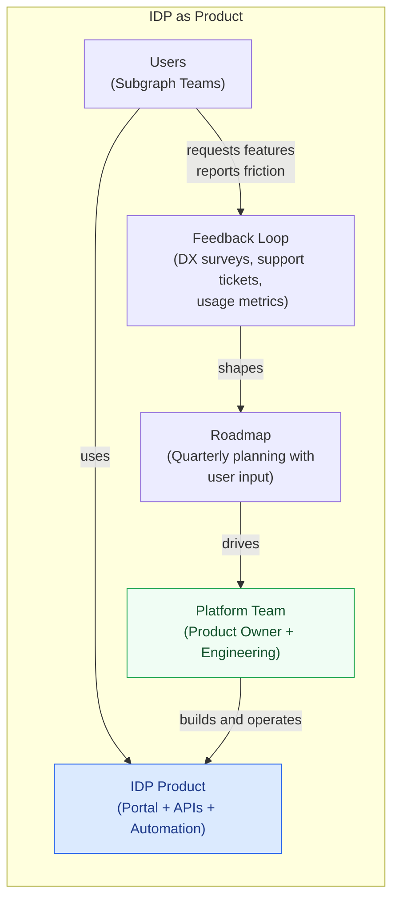

# 20 — Internal Developer Platforms for GraphQL

> **Purpose:** An Internal Developer Platform (IDP) is the product the platform team ships to
> its internal customers — a curated set of capabilities, interfaces, and automations that make
> building on the GraphQL supergraph self-service, repeatable, and auditable. This section
> explains what an IDP means specifically in a GraphQL context, describes the three-layer
> architecture that every mature IDP shares, maps how GraphQL fits as both a consumer of the
> platform and a core component within it, and provides a navigation map to the detailed
> documents that follow.

---

## What an IDP Means for a GraphQL Supergraph

"Internal Developer Platform" is used loosely in the industry — sometimes to mean a developer
portal, sometimes a deployment pipeline, sometimes just a well-organized Confluence wiki. In
this section, IDP means something precise: **the complete product surface that the platform
team exposes to subgraph teams**, encompassing UI, APIs, and automated infrastructure, such
that a new engineer can go from zero to a running, observed, compliant subgraph without
filing a single ticket or sending a single Slack message.

For a GraphQL supergraph, the IDP has a specific scope problem that general IDPs do not face:
the supergraph is a composed artifact — every subgraph's schema is merged into a single
federated schema, and a poorly governed subgraph pollutes the shared contract for every
client in the organization. This means the IDP must do more than provision infrastructure; it
must actively enforce schema contracts, surface cross-team dependencies, and make the health
of the shared API visible to everyone involved.

A mature GraphQL IDP solves five problems that purely infrastructural platforms ignore:

1. **Schema discoverability.** Engineers across the organization should be able to find
   what types, queries, and mutations already exist before designing new ones. Without an
   IDP, this requires reading raw SDL files or navigating schema registry UIs designed for
   platform engineers, not application developers.

2. **Cross-team impact visibility.** When Team A deprecates a field that Team B's service
   depends on, the IDP surfaces this in both teams' workflows — in CI, in the portal, and in
   Slack notifications — before a deployment causes a runtime failure.

3. **Compliance at the point of creation.** Schema governance policies (naming conventions,
   required documentation, deprecation rules) are cheapest to enforce when a schema is first
   written. The IDP bakes these checks into the scaffold template and the pre-commit hook,
   not just the post-merge CI gate.

4. **Operational transparency.** Which team owns which subgraph? What are the SLOs? Is the
   subgraph on the current golden path template version? This metadata lives in the IDP
   catalog, not scattered across five Notion docs, three Jira projects, and an out-of-date
   spreadsheet.

5. **Reproducible onboarding.** A new engineer joining the platform — or an existing engineer
   starting a new subgraph — should follow a documented, automated path. The IDP is the
   single entry point for that path.

---

## The Platform Team as Product Team

Section 19 established that the platform team is an enabling team in the Team Topologies
sense. The IDP operationalizes that role: it is the product the platform team ships.

This framing has important implications. A product has users, and users have needs that
may differ from the platform team's own preferences. A product has a roadmap, a backlog, and
a feedback loop. A product measures adoption and satisfaction, not just uptime. A product
is never "done."

The platform team should hold quarterly review sessions with representative subgraph teams,
track a Net Promoter Score equivalent for developer experience, and publish a public roadmap
in the portal itself so users know what is coming.

---

## The Three-Layer IDP Architecture

Every mature IDP — GraphQL-specific or general — converges on three layers. The layers are
not independent silos; they form a stack where each layer serves the one above it.

```mermaid
graph TB
    subgraph "Layer 1: Portal / UI"
        P1["Developer Portal\n(Backstage, custom React app)"]
        P2["Schema Explorer\n(GraphiQL / Apollo Sandbox)"]
        P3["Service Catalog\n(subgraph inventory)"]
        P4["Onboarding Wizard\n(new subgraph flow)"]
    end

    subgraph "Layer 2: Automation / API"
        A1["Platform API\n(GraphQL — meta-layer)"]
        A2["Schema Registry\n(GraphOS / Hive)"]
        A3["CI Templates\n(GitHub Actions reusable workflows)"]
        A4["Event Bus\n(webhook dispatch, Slack notifications)"]
        A5["Scaffolder\n(template engine + provisioner)"]
    end

    subgraph "Layer 3: Infrastructure"
        I1["Kubernetes Namespaces\n+ RBAC + NetworkPolicy"]
        I2["Secret Management\n(Vault + ExternalSecrets)"]
        I3["GitOps Engine\n(ArgoCD / Flux)"]
        I4["Observability Stack\n(OTel Collector, Prometheus, Grafana)"]
        I5["Terraform State\n(subgraph resource inventory)"]
    end

    P1 -->|"API calls"| A1
    P2 -->|"schema queries"| A2
    P3 -->|"catalog queries"| A1
    P4 -->|"provisioning requests"| A5

    A1 -->|"reads/writes"| I5
    A5 -->|"applies"| I1
    A5 -->|"applies"| I2
    A3 -->|"triggers"| A2
    A4 -->|"events from"| A2

    style P1 fill:#dbeafe,stroke:#2563eb,color:#1e3a8a
    style P2 fill:#dbeafe,stroke:#2563eb,color:#1e3a8a
    style P3 fill:#dbeafe,stroke:#2563eb,color:#1e3a8a
    style P4 fill:#dbeafe,stroke:#2563eb,color:#1e3a8a
    style A1 fill:#f0fdf4,stroke:#16a34a,color:#14532d
    style A2 fill:#f0fdf4,stroke:#16a34a,color:#14532d
    style A3 fill:#f0fdf4,stroke:#16a34a,color:#14532d
    style A4 fill:#f0fdf4,stroke:#16a34a,color:#14532d
    style A5 fill:#f0fdf4,stroke:#16a34a,color:#14532d
    style I1 fill:#fef3c7,stroke:#d97706,color:#78350f
    style I2 fill:#fef3c7,stroke:#d97706,color:#78350f
    style I3 fill:#fef3c7,stroke:#d97706,color:#78350f
    style I4 fill:#fef3c7,stroke:#d97706,color:#78350f
    style I5 fill:#fef3c7,stroke:#d97706,color:#78350f
```

### Layer 1 — Portal / UI

The portal is what developers see. It is the face of the platform team's product. For most
subgraph engineers, the portal is the IDP — they do not think about the automation layer or
the infrastructure layer unless something goes wrong.

A GraphQL IDP portal must include, at minimum:

- A **service catalog** that shows all registered subgraphs, their owners, lifecycle status,
  schema version, and SLO compliance
- A **schema explorer** — an interactive query editor (GraphiQL or Apollo Sandbox) that
  targets the composition-validated supergraph schema, not a raw subgraph endpoint
- An **onboarding flow** that replaces the "read these five docs and then file a ticket" path
  with a guided, form-driven wizard that terminates in a provisioned subgraph repository

### Layer 2 — Automation / API

The automation layer is what the portal calls, and what CI pipelines integrate with. It
includes the platform's own GraphQL API (the meta-layer — a GraphQL API about the GraphQL
platform), the schema registry integration, the scaffolder engine, and the event bus that
dispatches webhook payloads when platform-level events occur.

This layer is where the platform team's engineering leverage lives. A well-designed
automation layer means that new portal features are built by assembling platform API calls,
not by writing new infrastructure code.

### Layer 3 — Infrastructure

The infrastructure layer is Kubernetes, Vault, Terraform, ArgoCD, and the observability
stack. Section 19 covers this layer in detail. In the IDP context, infrastructure is the
layer that the automation layer drives — it is not directly exposed to subgraph teams.

The discipline that separates mature platforms from immature ones is the strictness of this
abstraction: subgraph teams do not write Terraform, do not configure ArgoCD directly, and do
not manage Vault policies. The automation layer manages those resources on their behalf,
through the platform API.

---

## How GraphQL Fits: Consumer and Component

GraphQL plays two distinct roles in the IDP:

### GraphQL as Consumer

Subgraph teams consume the IDP to build GraphQL services. From their perspective, the IDP
is the thing they use to create, deploy, and operate their subgraph. The portal, scaffolder,
CI templates, and deployment pipeline all exist to serve this use case.

### GraphQL as Component

The IDP's own automation layer is best exposed as a GraphQL API. This is not circular — it
is a deliberate architectural choice. The platform API uses GraphQL because:

1. **Schema documentation is free.** Every mutation, query, and type in the platform API is
   self-documenting. The platform API SDL becomes part of the portal's own documentation.

2. **Type safety propagates.** Backstage plugins, CI scripts, and CLI tools that call the
   platform API benefit from generated TypeScript types, reducing integration bugs.

3. **Introspection enables tooling.** The platform's Backstage plugin can introspect the
   platform API to render dynamic forms for provisioning mutations — adding a new mutation
   automatically adds a new form in the portal without a portal code change.

4. **The pattern reinforces itself.** A GraphQL platform that uses GraphQL for its own
   internal APIs is practicing what it preaches, which builds credibility with the product
   teams who consume it.

---

## IDP Capability Maturity

Not every organization builds an IDP from day one. The table below describes five stages of
IDP maturity in a GraphQL context, allowing teams to identify where they are and what to
build next.

| Stage | Characteristics | Missing |
|---|---|---|
| **0 — Ad hoc** | No standard scaffold, tickets for namespace provisioning, schema checked manually | Everything |
| **1 — Standardized** | CLI scaffold exists, CI template defined, Backstage catalog populated manually | Automation, self-service provisioning |
| **2 — Self-service** | `graphql-platform new-subgraph` runs end-to-end, catalog auto-populated, ArgoCD wired | Portal UI, platform API, drift detection |
| **3 — Observed** | Portal with schema explorer, deprecation notices, field usage heatmaps, DX metrics | Automated remediation, meta-API |
| **4 — Governed** | Platform API for provisioning, golden path drift PRs, compliance reporting, SLO dashboard | Predictive automation |
| **5 — Intelligent** | Schema change impact prediction, automated breaking change remediation, AI-assisted schema design | (Frontier — see section 21) |

Most enterprise teams operating at scale target Stage 3 as their steady state, with Stage 4
as the aspirational target for platform teams with dedicated engineering resources.

---

## Navigation Map

| Document | Covers |
|---|---|
| [01-backstage-integration.md](./01-backstage-integration.md) | Backstage entity types for subgraphs, API entities with GraphQL SDL, custom plugins, Scaffolder templates, TechDocs, entity autodiscovery |
| [02-developer-portal-design.md](./02-developer-portal-design.md) | Schema explorer integration, operation library, deprecation notices, schema diff viewer, field usage heatmaps, dependency graph, changelog feed |
| [03-platform-apis.md](./03-platform-apis.md) | Meta-GraphQL platform API, schema registry queries, provisioning mutations, webhook events, service account auth, API versioning |
| [04-golden-path-automation.md](./04-golden-path-automation.md) | Drift detection, automated update PRs, schema lint auto-fix, breaking change remediation suggestions, Slack bot notifications |
| [05-measuring-platform-success.md](./05-measuring-platform-success.md) | Platform adoption rate, DX score, schema stability index, SLO compliance, DORA for GraphQL, executive dashboard |

---

## Related Topics

- [Platform Engineering](../19-platform-engineering/README.md)
- [Schema Governance](../09-schema-governance/README.md)
- [Policy as Code](../13-policy-as-code/README.md)
- [CI/CD Automation](../11-ci-cd-automation/README.md)
- [Observability](../14-observability/README.md)
- [AI-Native GraphQL](../21-ai-native-graphql/README.md)

## References

- [Humanitec Platform Engineering Maturity Model (2023)](https://humanitec.com/platform-engineering)
- [CNCF Platforms White Paper (TAG App Delivery, 2023)](https://tag-app-delivery.cncf.io/whitepapers/platforms/)
- [Backstage Documentation](https://backstage.io/docs/)
- [Apollo GraphOS Platform](https://www.apollographql.com/docs/graphos/)
- [WunderGraph Cosmo — Open-Source Federation Platform](https://cosmo-docs.wundergraph.com/)
- [Team Topologies — Skelton & Pais (2019)](https://teamtopologies.com/)
