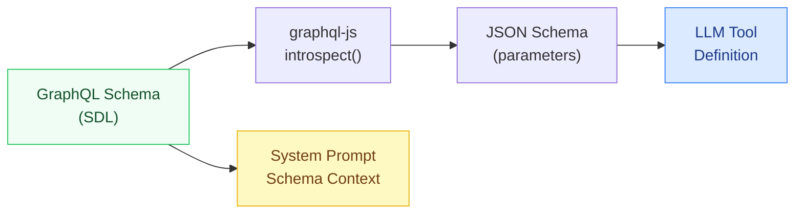
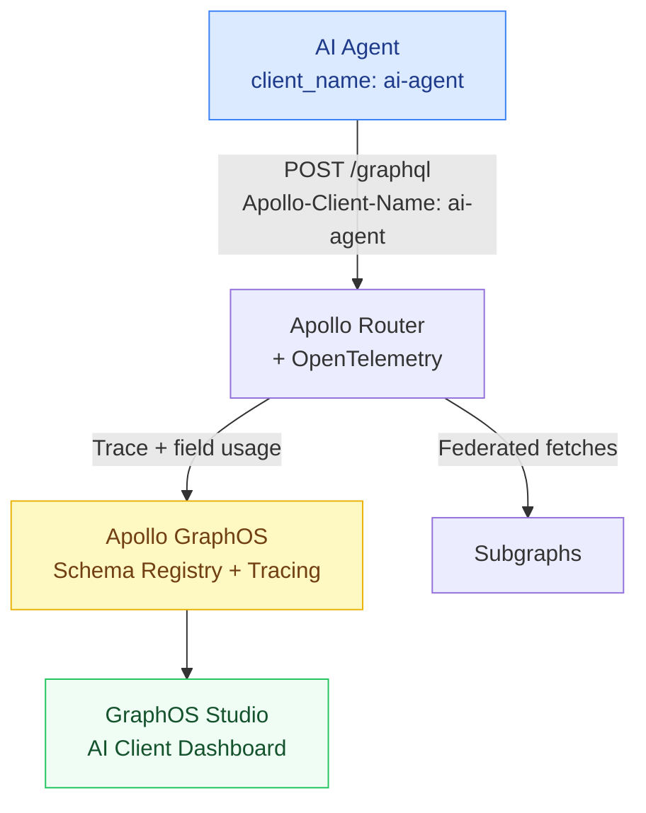

# 01 — GraphQL as an LLM Tool

> **Purpose:** This document covers the complete implementation of exposing a GraphQL API as a callable tool for LLM agents. It addresses every layer of the stack: generating tool definitions from schema introspection, enforcing persisted operations to prevent prompt injection, applying AI-specific rate and complexity limits, tracing AI-generated queries in Apollo GraphOS, and implementing an operation allow-list for trusted agents. By the end, you can safely expose your GraphQL API to Claude, GPT-4, or any function-calling LLM without creating a denial-of-service or data-exfiltration risk.

---

## The Tool-Use Model

Modern LLMs use tool calling (also called function calling) to interact with external systems. The model is given a list of tool definitions — each with a name, description, and JSON Schema for its parameters. When the model determines that a tool should be called, it emits a structured tool call that your code intercepts, executes, and returns the result from.

For a GraphQL API, the cleanest tool interface is a single tool:

```
executeGraphQLOperation(query: string, variables?: object) → GraphQL response
```

This lets the LLM use the full expressiveness of GraphQL — selecting exactly the fields it needs, passing typed variables — without requiring a separate tool per query. The LLM learns which operations to construct from your schema, which it accesses via a second tool:

```
getGraphQLSchema() → schema SDL (or relevant excerpt)
```

In production, you replace `getGraphQLSchema` with persisted operations and inject the relevant schema fragment into the system prompt at conversation start. This is the secure, operationally sound version.

---

## Auto-Generating Tool Definitions from Introspection

The first step is generating a tool definition that tells the LLM what the `executeGraphQLOperation` tool does and what schema it operates on. You can auto-generate this from introspection.

### Introspection-to-Tool-Definition Pipeline



```typescript
// tool-generator.ts
import { buildClientSchema, getIntrospectionQuery, printSchema } from 'graphql';
import type { Tool } from '@anthropic-ai/sdk/resources/messages';

interface GraphQLToolOptions {
  schemaEndpoint: string;
  headers?: Record<string, string>;
  /** Include only these root fields in the schema context. Reduces prompt size. */
  rootFieldAllowList?: string[];
}

/**
 * Fetches schema via introspection and returns an Anthropic-compatible tool definition.
 * The tool definition embeds a condensed schema description to help the LLM construct
 * valid operations without full introspection at runtime.
 */
export async function buildGraphQLTool(options: GraphQLToolOptions): Promise<Tool> {
  const { schemaEndpoint, headers = {}, rootFieldAllowList } = options;

  // Fetch introspection result
  const response = await fetch(schemaEndpoint, {
    method: 'POST',
    headers: { 'Content-Type': 'application/json', ...headers },
    body: JSON.stringify({ query: getIntrospectionQuery() }),
  });
  const { data } = await response.json();
  const schema = buildClientSchema(data);
  const sdl = printSchema(schema);

  // Build a concise schema summary for the tool description.
  // Full SDL can be 50k+ tokens; summarize root fields only.
  const queryType = schema.getQueryType();
  const mutationType = schema.getMutationType();

  const queryFields = queryType
    ? Object.entries(queryType.getFields())
        .filter(([name]) => !rootFieldAllowList || rootFieldAllowList.includes(name))
        .map(([name, field]) => `  ${name}: ${field.type} — ${field.description ?? 'no description'}`)
        .join('\n')
    : '';

  const mutationFields = mutationType
    ? Object.entries(mutationType.getFields())
        .filter(([name]) => !rootFieldAllowList || rootFieldAllowList.includes(name))
        .map(([name, field]) => `  ${name}: ${field.type} — ${field.description ?? 'no description'}`)
        .join('\n')
    : '';

  const schemaDescription = [
    queryFields ? `Query fields:\n${queryFields}` : '',
    mutationFields ? `Mutation fields:\n${mutationFields}` : '',
  ]
    .filter(Boolean)
    .join('\n\n');

  return {
    name: 'execute_graphql_operation',
    description: [
      'Execute a GraphQL operation against the API.',
      'Use introspection field descriptions to select correct fields.',
      'Always use variables for dynamic values — never string-interpolate into the query.',
      '',
      'Available operations:',
      schemaDescription,
    ].join('\n'),
    input_schema: {
      type: 'object',
      properties: {
        query: {
          type: 'string',
          description:
            'The GraphQL operation document. Must be a valid query or mutation. ' +
            'Use named operations (e.g. "query GetUser($id: ID!) { ... }"). ' +
            'Never use string interpolation — use variables instead.',
        },
        variables: {
          type: 'object',
          description: 'Variable values for the operation. Keys match the variable names declared in the query.',
          additionalProperties: true,
        },
        operationName: {
          type: 'string',
          description: 'The operation name when the document contains multiple operations.',
        },
      },
      required: ['query'],
    },
  };
}
```

### Executing Tool Calls with Claude

```typescript
// claude-graphql-agent.ts
import Anthropic from '@anthropic-ai/sdk';
import { buildGraphQLTool } from './tool-generator';

const client = new Anthropic();

interface AgentOptions {
  graphqlEndpoint: string;
  authToken: string;
  systemPrompt: string;
}

export async function runGraphQLAgent(userMessage: string, options: AgentOptions): Promise<string> {
  const { graphqlEndpoint, authToken, systemPrompt } = options;

  const tool = await buildGraphQLTool({
    schemaEndpoint: graphqlEndpoint,
    headers: { Authorization: `Bearer ${authToken}` },
  });

  const messages: Anthropic.MessageParam[] = [{ role: 'user', content: userMessage }];

  // Agentic loop — continue until model stops calling tools
  while (true) {
    const response = await client.messages.create({
      model: 'claude-sonnet-4-6',
      max_tokens: 4096,
      system: systemPrompt,
      tools: [tool],
      messages,
    });

    // Add assistant turn to message history
    messages.push({ role: 'assistant', content: response.content });

    if (response.stop_reason === 'end_turn') {
      // Extract text from final response
      const text = response.content
        .filter((block): block is Anthropic.TextBlock => block.type === 'text')
        .map((block) => block.text)
        .join('');
      return text;
    }

    if (response.stop_reason !== 'tool_use') {
      throw new Error(`Unexpected stop reason: ${response.stop_reason}`);
    }

    // Execute tool calls
    const toolResults: Anthropic.ToolResultBlockParam[] = [];

    for (const block of response.content) {
      if (block.type !== 'tool_use') continue;

      if (block.name === 'execute_graphql_operation') {
        const { query, variables, operationName } = block.input as {
          query: string;
          variables?: Record<string, unknown>;
          operationName?: string;
        };

        const result = await executeGraphQLOperation({
          endpoint: graphqlEndpoint,
          query,
          variables,
          operationName,
          clientId: 'ai-agent',       // traced in Apollo GraphOS
          authToken,
        });

        toolResults.push({
          type: 'tool_result',
          tool_use_id: block.id,
          content: JSON.stringify(result),
        });
      }
    }

    messages.push({ role: 'user', content: toolResults });
  }
}

async function executeGraphQLOperation(params: {
  endpoint: string;
  query: string;
  variables?: Record<string, unknown>;
  operationName?: string;
  clientId: string;
  authToken: string;
}): Promise<unknown> {
  const { endpoint, query, variables, operationName, clientId, authToken } = params;

  const response = await fetch(endpoint, {
    method: 'POST',
    headers: {
      'Content-Type': 'application/json',
      Authorization: `Bearer ${authToken}`,
      // Apollo GraphOS uses Apollo-Client-Name for client identity tracing
      'Apollo-Client-Name': clientId,
      'Apollo-Client-Version': '1.0',
      // Custom header for AI-specific middleware
      'X-Client-Type': 'ai-agent',
    },
    body: JSON.stringify({ query, variables, operationName }),
  });

  return response.json();
}
```

---

## Persisted Operation Enforcement for AI Clients

Allowing an AI agent to send arbitrary GraphQL queries is equivalent to allowing arbitrary SQL execution. An LLM can generate queries that:

- Traverse your entire graph in one request (cost explosion)
- Access fields the agent was not intended to see (data exfiltration)
- Trigger mutations via creative prompt injection
- Bypass field-level authorization through crafted argument combinations

**The solution is persisted operations.** Persisted operations are queries registered in advance (by humans) and identified by a hash or ID. The AI client sends only the hash — the server validates the hash against its allow-list and executes the corresponding pre-approved query.

### Registering Persisted Operations

```typescript
// persisted-operations-registry.ts
import { createHash } from 'crypto';
import { parse, print } from 'graphql';

interface PersistedOperation {
  id: string;
  operationName: string;
  query: string;
  description: string;
  allowedClientTypes: ('human' | 'ai-agent' | 'service')[];
  maxComplexity: number;
}

const AI_ALLOWED_OPERATIONS: PersistedOperation[] = [
  {
    id: 'GetUserProfile',
    operationName: 'GetUserProfile',
    query: `
      query GetUserProfile($userId: ID!) {
        user(id: $userId) {
          id
          name
          email
          createdAt
        }
      }
    `,
    description: 'Fetch basic profile for a user. Returns name, email, join date.',
    allowedClientTypes: ['human', 'ai-agent'],
    maxComplexity: 5,
  },
  {
    id: 'SearchProducts',
    operationName: 'SearchProducts',
    query: `
      query SearchProducts($query: String!, $first: Int = 10) {
        products(search: $query, first: $first) {
          edges {
            node {
              id
              name
              description
              price { amount currency }
            }
          }
        }
      }
    `,
    description: 'Full-text search for products. Returns up to 10 results by default.',
    allowedClientTypes: ['human', 'ai-agent'],
    maxComplexity: 25,
  },
];

// Generate the persisted operations manifest consumed by Apollo Router
export function generatePersistedOperationsManifest(): Record<string, string> {
  const manifest: Record<string, string> = {};
  for (const op of AI_ALLOWED_OPERATIONS) {
    // Normalize the query (Apollo Router uses normalized form for hashing)
    const normalized = print(parse(op.query));
    const hash = createHash('sha256').update(normalized).digest('hex');
    manifest[hash] = normalized;
  }
  return manifest;
}
```

### Apollo Router Configuration for Persisted Operations

```yaml
# router.yaml
persisted_queries:
  enabled: true
  # Reject any query not in the allow-list
  safelist:
    enabled: true
    require_id: true    # Clients must send the operation ID, not raw query

# Separate limits for AI agent clients
traffic_shaping:
  all:
    global_rate_limit:
      capacity: 1000
      interval: 1s
  router:
    # AI agents identified by header get stricter limits
    # Applied via Rhai script plugin (see ai-client-limits.rhai below)
```

```javascript
// ai-client-limits.rhai  — Apollo Router Rhai plugin
// Intercepts requests from AI clients and applies tighter limits

fn supergraph_service(service) {
  let request_callback = |request| {
    let client_type = request.headers["x-client-type"];

    if client_type == "ai-agent" {
      // Require persisted operation ID — reject raw queries from AI clients
      let has_extensions = request.body.contains("extensions");
      let has_persisted_id = has_extensions &&
        request.body.contains("persistedQuery");

      if !has_persisted_id {
        return #{
          status: 400,
          body: #{
            errors: [#{
              message: "AI agent clients must use persisted operations. Raw queries are not permitted.",
              extensions: #{
                code: "PERSISTED_OPERATION_REQUIRED"
              }
            }]
          }
        };
      }

      // Attach AI client tracking headers for downstream observability
      request.headers["x-ai-agent-request"] = "true";
    }
  };

  service.map_request(request_callback);
}
```

---

## Query Complexity Limits for AI Clients

LLMs generate expensive queries. A human engineer writing a UI query knows it will render on a screen with a limited viewport. An LLM has no such constraint. It will happily generate a query that fetches every field on every related entity.

Complexity limits assign a cost to each field and reject queries that exceed a budget.

```typescript
// complexity-plugin.ts — Apollo Server plugin
import { GraphQLError } from 'graphql';
import {
  fieldExtensionsEstimator,
  getComplexity,
  simpleEstimator,
} from 'graphql-query-complexity';
import type { ApolloServerPlugin } from '@apollo/server';

interface ComplexityConfig {
  /** Maximum complexity for human clients */
  defaultMaxComplexity: number;
  /** Maximum complexity for AI agent clients — lower than human */
  aiAgentMaxComplexity: number;
  /** Cost multiplier per item in list fields */
  listCostFactor: number;
}

export function complexityLimitPlugin(config: ComplexityConfig): ApolloServerPlugin {
  const {
    defaultMaxComplexity = 1000,
    aiAgentMaxComplexity = 200,
    listCostFactor = 10,
  } = config;

  return {
    async requestDidStart() {
      return {
        async didResolveOperation({ request, document, schema, contextValue }) {
          const isAiAgent = (contextValue as any).clientType === 'ai-agent';
          const maxComplexity = isAiAgent ? aiAgentMaxComplexity : defaultMaxComplexity;

          const complexity = getComplexity({
            schema,
            operationName: request.operationName,
            query: document,
            variables: request.variables,
            estimators: [
              // Use @complexity directive if present on field definition
              fieldExtensionsEstimator(),
              // Default: lists cost listCostFactor, scalars cost 1
              simpleEstimator({ defaultComplexity: 1 }),
            ],
          });

          if (complexity > maxComplexity) {
            throw new GraphQLError(
              `Query complexity ${complexity} exceeds the limit of ${maxComplexity} for ${
                isAiAgent ? 'AI agent' : 'standard'
              } clients. Reduce the number of fields or list sizes requested.`,
              {
                extensions: {
                  code: 'QUERY_TOO_COMPLEX',
                  complexity,
                  maxComplexity,
                  clientType: isAiAgent ? 'ai-agent' : 'human',
                },
              }
            );
          }

          // Attach complexity to context for logging and span attributes
          (contextValue as any).queryComplexity = complexity;
        },
      };
    },
  };
}
```

### Schema-Level Complexity Hints

Use the `@complexity` directive in your schema to encode cost at the source:

```graphql
directive @complexity(
  value: Int!
  multipliers: [String!]
) on FIELD_DEFINITION

type Query {
  """
  Returns a paginated list of orders. Cost scales with the `first` argument.
  For AI agents, limit `first` to 10 or fewer.
  """
  orders(
    first: Int = 10
    after: String
    filter: OrderFilter
  ): OrderConnection! @complexity(value: 10, multipliers: ["first"])

  """
  Full-text product search. Each result fetches associated variants.
  """
  productSearch(
    query: String!
    first: Int = 10
  ): ProductSearchConnection! @complexity(value: 15, multipliers: ["first"])
}
```

---

## Rate Limiting for AI Clients

AI agents operate differently from human users: they can issue queries in rapid succession in an agentic loop. Standard per-user rate limits may not be sufficient. Apply per-client-type limits at the Router layer.

```yaml
# router.yaml — AI-specific rate limiting via coprocessor
coprocessor:
  url: http://rate-limiter:9000
  router:
    request:
      headers: true
      body: false      # Don't send full body to rate limiter
    response:
      headers: false
      body: false
```

```typescript
// rate-limiter/index.ts — coprocessor service
import express from 'express';
import { createClient } from 'ioredis';

const redis = createClient({ url: process.env.REDIS_URL });
const app = express();
app.use(express.json());

interface RateLimitConfig {
  'human': { requests: number; window: number };
  'ai-agent': { requests: number; window: number };
  'service': { requests: number; window: number };
}

const RATE_LIMITS: RateLimitConfig = {
  'human':    { requests: 300,  window: 60 },   // 300 req/min
  'ai-agent': { requests: 60,   window: 60 },   // 60 req/min — tighter
  'service':  { requests: 3000, window: 60 },   // 3000 req/min — looser
};

app.post('/rate-limit', async (req, res) => {
  const headers = req.body.headers ?? {};
  const clientType = (headers['x-client-type'] ?? 'human') as keyof RateLimitConfig;
  const clientId = headers['authorization'] ?? headers['x-client-id'] ?? 'anonymous';

  const config = RATE_LIMITS[clientType] ?? RATE_LIMITS['human'];
  const key = `rl:${clientType}:${clientId}`;

  const current = await redis.incr(key);
  if (current === 1) {
    await redis.expire(key, config.window);
  }

  if (current > config.requests) {
    res.json({
      version: '1',
      stage: 'RouterRequest',
      control: {
        break: 429,
      },
      body: JSON.stringify({
        errors: [{
          message: `Rate limit exceeded for ${clientType} clients: ${config.requests} requests per ${config.window}s`,
          extensions: { code: 'RATE_LIMITED', retryAfter: config.window },
        }],
      }),
    });
    return;
  }

  // Pass through — add remaining quota to response headers
  res.json({
    version: '1',
    stage: 'RouterRequest',
    control: 'continue',
    headers: {
      'x-rate-limit-remaining': String(config.requests - current),
      'x-rate-limit-reset': String(config.window),
    },
  });
});
```

---

## Tracing AI-Generated Queries in Apollo GraphOS

Apollo GraphOS identifies clients via the `Apollo-Client-Name` and `Apollo-Client-Version` headers. Set these from your AI agent executor so every AI-generated query is traceable in GraphOS Studio.

```typescript
// Annotate all AI client requests
const GRAPHQL_HEADERS = {
  'Apollo-Client-Name': 'ai-agent',
  'Apollo-Client-Version': process.env.AGENT_VERSION ?? '1.0.0',
  'X-Client-Type': 'ai-agent',
  // Include the LLM session ID for correlation across multi-turn conversations
  'X-Conversation-Id': conversationId,
};
```

In Apollo GraphOS, filter by `client_name = "ai-agent"` to see:

- Operation error rates for AI-generated queries vs. human queries
- Field usage — which fields the AI agent is selecting
- Slow operations — expensive queries the LLM generated
- Schema coverage — which parts of the schema the AI consumes



### OpenTelemetry Span Attributes for AI Queries

Add AI-specific attributes to the OpenTelemetry span so they appear in your tracing backend (Jaeger, Honeycomb, Datadog):

```typescript
// otel-ai-attributes.ts — Apollo Server plugin
import { trace, SpanStatusCode } from '@opentelemetry/api';
import type { ApolloServerPlugin } from '@apollo/server';

export function aiQueryTracingPlugin(): ApolloServerPlugin {
  return {
    async requestDidStart({ contextValue }) {
      const span = trace.getActiveSpan();
      const ctx = contextValue as any;

      if (ctx.clientType === 'ai-agent') {
        span?.setAttributes({
          'ai.client.type': 'agent',
          'ai.conversation.id': ctx.conversationId ?? 'unknown',
          'ai.model': ctx.aiModel ?? 'unknown',
        });
      }

      return {
        async executionDidStart() {
          return {
            willResolveField({ info, contextValue }) {
              if ((contextValue as any).clientType !== 'ai-agent') return;
              // Track which fields AI agents are resolving
              span?.addEvent('ai.field.resolved', {
                'graphql.field': `${info.parentType.name}.${info.fieldName}`,
              });
            },
          };
        },
        async willSendResponse({ response, contextValue }) {
          const complexity = (contextValue as any).queryComplexity;
          if (complexity !== undefined) {
            span?.setAttributes({ 'graphql.query.complexity': complexity });
          }
        },
      };
    },
  };
}
```

---

## Operation Allow-Listing for AI Agents

For the highest-security deployments, AI agents should be constrained to a named list of operations per agent role. This is finer-grained than persisted operations — it allows multiple agent roles with different operation sets.

```typescript
// agent-allow-list.ts
interface AgentRole {
  name: string;
  allowedOperations: string[];
  maxComplexity: number;
}

const AGENT_ROLES: Record<string, AgentRole> = {
  'customer-service-agent': {
    name: 'Customer Service Agent',
    allowedOperations: [
      'GetUserProfile',
      'GetOrderHistory',
      'GetOrderDetail',
      'SearchProducts',
    ],
    maxComplexity: 100,
  },
  'data-analysis-agent': {
    name: 'Data Analysis Agent',
    allowedOperations: [
      'GetAggregateMetrics',
      'GetProductCatalog',
      'GetOrderSummary',
    ],
    maxComplexity: 500,
  },
};

export function validateAgentOperation(
  agentRole: string,
  operationName: string | undefined
): { allowed: boolean; reason?: string } {
  const role = AGENT_ROLES[agentRole];
  if (!role) {
    return { allowed: false, reason: `Unknown agent role: ${agentRole}` };
  }
  if (!operationName) {
    return { allowed: false, reason: 'AI agents must use named operations' };
  }
  if (!role.allowedOperations.includes(operationName)) {
    return {
      allowed: false,
      reason: `Operation "${operationName}" is not in the allow-list for role "${role.name}". Allowed: ${role.allowedOperations.join(', ')}`,
    };
  }
  return { allowed: true };
}
```

---

## Production Checklist

| Control | Implementation | Priority |
|---|---|---|
| Persisted operations | Apollo Router safelist | Critical |
| Query complexity limits | `graphql-query-complexity` plugin | Critical |
| Per-client-type rate limiting | Redis + Router coprocessor | Critical |
| AI client header tagging | `Apollo-Client-Name: ai-agent` | High |
| Operation allow-list per agent role | Custom Apollo Server plugin | High |
| Depth limiting | `graphql-depth-limit` package | High |
| OpenTelemetry span attributes | Custom Apollo Server plugin | Medium |
| Schema introspection disabled in production | Apollo Router config | High |
| Field-level authorization | Directive-based authz plugin | Critical |

```yaml
# Disable introspection in production — AI agents use pre-injected schema context
# router.yaml
supergraph:
  introspection: false

# Enable only in staging environments
# router.yaml (staging override)
supergraph:
  introspection: true
```

---

## References

- [Anthropic Tool Use Documentation](https://docs.anthropic.com/en/docs/tool-use)
- [OpenAI Function Calling](https://platform.openai.com/docs/guides/function-calling)
- [Apollo Router Persisted Queries](https://www.apollographql.com/docs/router/configuration/persisted-queries/)
- [graphql-query-complexity npm](https://github.com/slicknode/graphql-query-complexity)
- [Apollo GraphOS Client Awareness](https://www.apollographql.com/docs/studio/client-awareness/)

## Related Topics

- [Chapter 21.04: AI Gateway Patterns](./04-ai-gateway-patterns.md) — Router plugins for AI detection and NL2GraphQL
- [Chapter 21.05: Production AI GraphQL](./05-production-ai-graphql.md) — Cost, latency, security at scale
- [Chapter 05: Security](../05-security/README.md) — Authorization, query complexity fundamentals
- [Chapter 06: Performance and Scaling](../06-performance-and-scaling/README.md) — Rate limiting, caching
