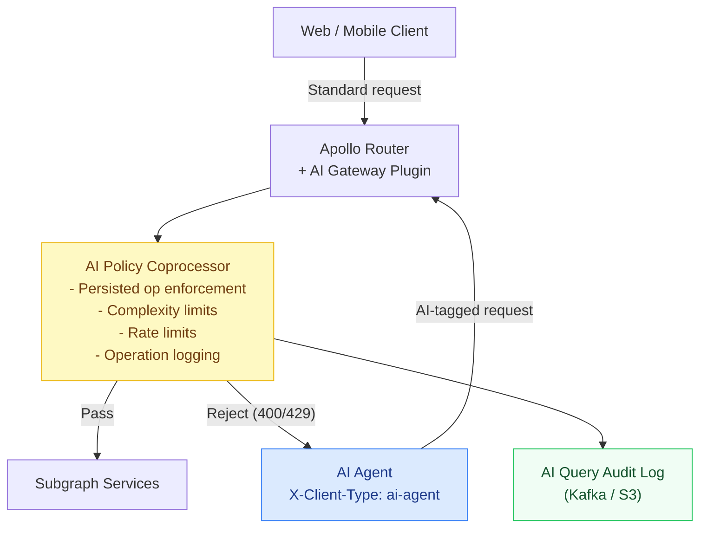
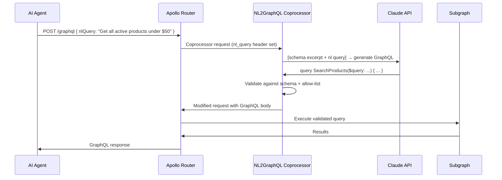

# 04 — AI Gateway Patterns

> **Purpose:** This document covers the Apollo Router as an AI-aware gateway: detecting AI-generated queries via client headers and applying AI-specific policies, implementing natural language to GraphQL translation (NL2GraphQL) as a Router coprocessor, constructing schema-aware system prompts that inject relevant schema fragments, using embeddings to validate AI-generated operations against an allow-list, and A/B testing AI-generated operations against human-written ones. This is the infrastructure layer that makes AI+GraphQL deployments manageable at scale.

---

## The AI Gateway as a Router Plugin

Without AI-aware gateway infrastructure, you have no way to apply different policies to AI-generated requests vs. human client requests. The Apollo Router's plugin system — via Rhai scripts and coprocessors — is the insertion point for AI-specific logic.



### Rhai Plugin: AI Client Detection and Policy Enforcement

```javascript
// ai-gateway-plugin.rhai
// Intercepts all requests, detects AI clients, and applies AI-specific policies.

fn supergraph_service(service) {
  service.map_request(|request| {
    let client_type = request.headers["x-client-type"] ?? "human";
    let is_ai = client_type.contains("ai");

    if is_ai {
      // Require named operation — anonymous operations make audit logging impossible
      let body = request.body;
      if !body.contains("operationName") {
        return #{
          status: 400,
          body: `{"errors":[{"message":"AI agent requests must include an operationName.","extensions":{"code":"OPERATION_NAME_REQUIRED"}}]}`
        };
      }

      // Require persisted query ID — raw queries not allowed from AI clients
      if !body.contains(`"persistedQuery"`) {
        return #{
          status: 400,
          body: `{"errors":[{"message":"AI agent requests must use persisted operations.","extensions":{"code":"PERSISTED_QUERY_REQUIRED"}}]}`
        };
      }

      // Tag request for downstream observability
      request.headers["x-ai-gateway-processed"] = "true";
      request.headers["x-ai-gateway-version"] = "2.0";
    }
  });

  service.map_response(|response| {
    // Add AI-specific response headers for client instrumentation
    let client_type = response.headers["x-client-type"] ?? "human";
    if client_type.contains("ai") {
      response.headers["x-ai-query-cost"] = response.context["query_complexity"] ?? "unknown";
    }
  });
}
```

---

## NL2GraphQL: Natural Language to GraphQL Translation

NL2GraphQL is a coprocessor that intercepts natural language queries from AI clients and translates them into valid GraphQL operations using an LLM with schema context.

### Architecture



### NL2GraphQL Coprocessor Implementation

```typescript
// nl2graphql/index.ts
import express from 'express';
import Anthropic from '@anthropic-ai/sdk';
import { parse, validate, buildSchema } from 'graphql';
import { getSchemaExcerpt } from './schema-excerpt';
import { validateAgainstAllowList } from './allow-list';

const app = express();
const anthropic = new Anthropic();

app.use(express.json());

app.post('/nl2graphql', async (req, res) => {
  const { body, headers } = req.body;

  // Only process requests with the nl-query header
  const nlQuery = headers['x-nl-query'];
  if (!nlQuery) {
    // Pass through — not a natural language request
    return res.json({ version: '1', stage: 'RouterRequest', control: 'continue' });
  }

  const agentRole = headers['x-agent-role'] ?? 'default';

  try {
    const graphqlQuery = await translateToGraphQL(nlQuery, agentRole);
    const validation = await validateAgainstAllowList(graphqlQuery, agentRole);

    if (!validation.allowed) {
      return res.json({
        version: '1',
        stage: 'RouterRequest',
        control: { break: 400 },
        body: JSON.stringify({
          errors: [{
            message: `Generated query not allowed: ${validation.reason}`,
            extensions: { code: 'NL2GRAPHQL_QUERY_REJECTED', generatedQuery: graphqlQuery },
          }],
        }),
      });
    }

    // Replace the request body with the generated GraphQL operation
    return res.json({
      version: '1',
      stage: 'RouterRequest',
      control: 'continue',
      body: JSON.stringify({
        query: graphqlQuery.query,
        variables: graphqlQuery.variables,
        operationName: graphqlQuery.operationName,
        extensions: {
          ...JSON.parse(body ?? '{}').extensions,
          nl2graphql: {
            originalNlQuery: nlQuery,
            generatedAt: new Date().toISOString(),
          },
        },
      }),
      headers: {
        'x-nl2graphql-processed': 'true',
        'x-original-nl-query': nlQuery.slice(0, 200),  // Truncate for header limits
      },
    });
  } catch (err) {
    return res.json({
      version: '1',
      stage: 'RouterRequest',
      control: { break: 500 },
      body: JSON.stringify({
        errors: [{
          message: 'Failed to translate natural language query to GraphQL.',
          extensions: { code: 'NL2GRAPHQL_TRANSLATION_FAILED' },
        }],
      }),
    });
  }
});

interface GeneratedOperation {
  query: string;
  variables: Record<string, unknown>;
  operationName: string;
}

async function translateToGraphQL(
  nlQuery: string,
  agentRole: string
): Promise<GeneratedOperation> {
  const schemaExcerpt = await getSchemaExcerpt(agentRole);

  const systemPrompt = `You are a GraphQL query generator. Convert natural language requests into valid GraphQL operations.

<graphql-schema>
${schemaExcerpt}
</graphql-schema>

Rules:
1. Generate ONLY valid GraphQL operations that match the provided schema
2. Use named operations (e.g., "query GetProducts { ... }")
3. Use variables for all dynamic values, never string interpolation
4. Limit list queries to first: 10 unless the user specifies more
5. Select only fields needed to answer the question
6. Return a JSON object: { "query": "...", "variables": {}, "operationName": "..." }
7. If the request cannot be answered with the available schema, return { "error": "reason" }`;

  const response = await anthropic.messages.create({
    model: 'claude-sonnet-4-6',
    max_tokens: 2048,
    system: systemPrompt,
    messages: [{
      role: 'user',
      content: `Convert this to GraphQL: ${nlQuery.slice(0, 500)}`,
    }],
  });

  const content = response.content[0];
  if (content.type !== 'text') throw new Error('Unexpected response type');

  // Extract JSON from the response (model may include explanation text)
  const jsonMatch = content.text.match(/\{[\s\S]*\}/);
  if (!jsonMatch) throw new Error('No JSON found in LLM response');

  const parsed = JSON.parse(jsonMatch[0]);

  if (parsed.error) {
    throw new Error(`LLM rejected query: ${parsed.error}`);
  }

  // Validate the generated query parses as valid GraphQL
  parse(parsed.query);  // Throws if invalid

  return parsed as GeneratedOperation;
}
```

---

## Schema-Aware Prompt Construction

Injecting your full schema into every LLM prompt is impractical — a large supergraph SDL can be 50,000+ tokens. Instead, inject only the schema fragment relevant to the user's likely query domain.

### Schema Excerpt Generator

```typescript
// nl2graphql/schema-excerpt.ts
import { buildClientSchema, getIntrospectionQuery, print, parse, buildASTSchema } from 'graphql';
import { createHash } from 'crypto';
import { getRedisClient } from '../infrastructure/redis';

interface AgentSchemaConfig {
  rootFields: string[];     // Query/Mutation fields this agent role can access
  types: string[];          // Types to include in the excerpt
}

const AGENT_SCHEMA_CONFIGS: Record<string, AgentSchemaConfig> = {
  'customer-service': {
    rootFields: ['user', 'order', 'orders', 'productSearch'],
    types: ['User', 'Order', 'OrderLineItem', 'Product', 'Money', 'OrderStatus'],
  },
  'product-catalog': {
    rootFields: ['product', 'productSearch', 'productsByCategory', 'categories'],
    types: ['Product', 'Category', 'ProductVariant', 'Money', 'ProductInventoryStatus'],
  },
  'default': {
    rootFields: ['product', 'productSearch', 'user'],
    types: ['Product', 'User', 'Money'],
  },
};

/**
 * Returns a focused schema excerpt for the given agent role.
 * Caches the excerpt in Redis for 1 hour (schema changes are infrequent).
 */
export async function getSchemaExcerpt(agentRole: string): Promise<string> {
  const config = AGENT_SCHEMA_CONFIGS[agentRole] ?? AGENT_SCHEMA_CONFIGS['default'];
  const cacheKey = `schema-excerpt:${agentRole}:${configHash(config)}`;

  const redis = getRedisClient();
  const cached = await redis.get(cacheKey);
  if (cached) return cached;

  const excerpt = await buildSchemaExcerpt(config);
  await redis.setex(cacheKey, 3600, excerpt);
  return excerpt;
}

async function buildSchemaExcerpt(config: AgentSchemaConfig): Promise<string> {
  const response = await fetch(process.env.GRAPHQL_ENDPOINT!, {
    method: 'POST',
    headers: { 'Content-Type': 'application/json' },
    body: JSON.stringify({ query: getIntrospectionQuery() }),
  });
  const { data } = await response.json();
  const schema = buildClientSchema(data);

  const lines: string[] = [
    '# GraphQL Schema (relevant excerpt)\n',
    '# Query operations available:\n',
  ];

  const queryType = schema.getQueryType();
  if (queryType) {
    for (const fieldName of config.rootFields) {
      const field = queryType.getFields()[fieldName];
      if (!field) continue;
      const desc = field.description ? `  """${field.description}"""\n` : '';
      const args = field.args.length > 0
        ? `(${field.args.map((a) => `${a.name}: ${a.type}`).join(', ')})`
        : '';
      lines.push(`${desc}  ${fieldName}${args}: ${field.type}\n`);
    }
  }

  lines.push('\n# Type definitions:\n');

  for (const typeName of config.types) {
    const type = schema.getType(typeName);
    if (!type || !('getFields' in type)) continue;

    const desc = type.description ? `"""${type.description}"""\n` : '';
    lines.push(`\n${desc}type ${typeName} {\n`);

    const fields = (type as any).getFields();
    for (const [fieldName, field] of Object.entries(fields)) {
      const f = field as any;
      const fieldDesc = f.description ? `  """${f.description}"""\n` : '';
      lines.push(`${fieldDesc}  ${fieldName}: ${f.type}\n`);
    }
    lines.push('}\n');
  }

  return lines.join('');
}

function configHash(config: AgentSchemaConfig): string {
  return createHash('md5')
    .update(JSON.stringify(config))
    .digest('hex')
    .slice(0, 8);
}
```

---

## Embedding-Based Allow-List Validation

For operations that fall outside the named allow-list (e.g., NL2GraphQL-generated operations), use semantic similarity against a set of approved operation templates to determine if the generated operation is within scope.

```typescript
// allow-list/embedding-validator.ts
import OpenAI from 'openai';
import { getRedisClient } from '../infrastructure/redis';
import { parse, print } from 'graphql';

const openai = new OpenAI();

interface ApprovedTemplate {
  id: string;
  description: string;
  queryNormalized: string;
  embedding?: number[];
}

// Approved operation templates — maintained by platform engineers
const APPROVED_TEMPLATES: ApprovedTemplate[] = [
  {
    id: 'search-products',
    description: 'Search products by text query with optional price filter',
    queryNormalized: 'query SearchProducts { products(search: $query, first: $first) { id name priceDisplay } }',
  },
  {
    id: 'get-user-orders',
    description: 'Get recent orders for a user with status and total',
    queryNormalized: 'query GetUserOrders { user(id: $userId) { orders(first: $first) { id status totalAmount } } }',
  },
  {
    id: 'get-product-detail',
    description: 'Get full product details including images and reviews',
    queryNormalized: 'query GetProduct { product(id: $id) { id name descriptionMarkdown priceDisplay primaryImageUrl } }',
  },
];

/**
 * Validates that a generated GraphQL operation is semantically similar to
 * an approved template. Uses cosine similarity on operation embeddings.
 *
 * Returns allowed=true if the generated operation's semantic meaning is
 * within SIMILARITY_THRESHOLD of at least one approved template.
 */
export async function validateAgainstAllowList(
  operation: { query: string; operationName: string },
  agentRole: string
): Promise<{ allowed: boolean; reason?: string; matchedTemplate?: string }> {
  const SIMILARITY_THRESHOLD = 0.85;

  // Normalize the generated query for comparison
  let normalizedQuery: string;
  try {
    normalizedQuery = print(parse(operation.query));
  } catch {
    return { allowed: false, reason: 'Generated query is not valid GraphQL' };
  }

  // Get or compute embeddings for approved templates
  const templateEmbeddings = await getTemplateEmbeddings();

  // Embed the generated operation
  const generatedEmbedding = await embedText(
    `Operation: ${operation.operationName}\n\n${normalizedQuery}`
  );

  // Find most similar approved template
  let maxSimilarity = 0;
  let bestTemplate = '';

  for (const { id, embedding } of templateEmbeddings) {
    if (!embedding) continue;
    const similarity = cosineSimilarity(generatedEmbedding, embedding);
    if (similarity > maxSimilarity) {
      maxSimilarity = similarity;
      bestTemplate = id;
    }
  }

  if (maxSimilarity >= SIMILARITY_THRESHOLD) {
    return { allowed: true, matchedTemplate: bestTemplate };
  }

  return {
    allowed: false,
    reason: `Generated operation is not similar enough to approved templates (similarity: ${maxSimilarity.toFixed(3)}, threshold: ${SIMILARITY_THRESHOLD}). Best match: "${bestTemplate}".`,
  };
}

async function getTemplateEmbeddings(): Promise<ApprovedTemplate[]> {
  const redis = getRedisClient();
  const results: ApprovedTemplate[] = [];

  for (const template of APPROVED_TEMPLATES) {
    const cacheKey = `embedding:template:${template.id}`;
    const cached = await redis.get(cacheKey);

    if (cached) {
      results.push({ ...template, embedding: JSON.parse(cached) });
    } else {
      const embedding = await embedText(
        `Operation: ${template.description}\n\n${template.queryNormalized}`
      );
      await redis.set(cacheKey, JSON.stringify(embedding));  // No TTL — templates are stable
      results.push({ ...template, embedding });
    }
  }

  return results;
}

async function embedText(text: string): Promise<number[]> {
  const response = await openai.embeddings.create({
    model: 'text-embedding-3-small',
    input: text,
  });
  return response.data[0].embedding;
}

function cosineSimilarity(a: number[], b: number[]): number {
  let dot = 0, normA = 0, normB = 0;
  for (let i = 0; i < a.length; i++) {
    dot += a[i] * b[i];
    normA += a[i] * a[i];
    normB += b[i] * b[i];
  }
  return dot / (Math.sqrt(normA) * Math.sqrt(normB));
}
```

---

## A/B Testing AI-Generated vs. Hand-Written Operations

Once AI-generated operations are in production, you need a framework for comparing their quality to human-written equivalents.

```typescript
// ab-testing/operation-experiment.ts
import { createHash } from 'crypto';

interface OperationVariant {
  id: string;
  query: string;
  variables?: Record<string, unknown>;
  source: 'human-written' | 'ai-generated';
  description: string;
}

interface ExperimentConfig {
  experimentId: string;
  control: OperationVariant;   // Human-written baseline
  treatment: OperationVariant; // AI-generated variant
  rolloutPercent: number;      // 0–100
}

const EXPERIMENTS: ExperimentConfig[] = [
  {
    experimentId: 'product-search-nl2gql-v1',
    control: {
      id: 'search-control',
      query: `query SearchProducts($query: String!, $first: Int = 10) {
        products(search: $query, first: $first) {
          edges { node { id name priceDisplay primaryImageUrl inventoryStatus } }
          pageInfo { hasNextPage endCursor totalCount }
        }
      }`,
      source: 'human-written',
      description: 'Hand-optimized product search with curated field selection',
    },
    treatment: {
      id: 'search-nl2gql',
      query: `query SearchProductsAI($query: String!, $first: Int = 10) {
        productSearch(query: $query, first: $first) {
          edges { node { id name priceDisplay inventoryStatus averageRating reviewCount } }
          pageInfo { hasNextPage endCursor totalCount }
        }
      }`,
      source: 'ai-generated',
      description: 'NL2GraphQL-generated product search with additional rating fields',
    },
    rolloutPercent: 10,  // 10% get the AI-generated version
  },
];

export function selectVariant(
  experimentId: string,
  userId: string
): OperationVariant {
  const experiment = EXPERIMENTS.find((e) => e.experimentId === experimentId);
  if (!experiment) throw new Error(`Unknown experiment: ${experimentId}`);

  // Deterministic assignment: same user always gets same variant
  const hash = createHash('md5').update(`${experimentId}:${userId}`).digest('hex');
  const bucket = parseInt(hash.slice(0, 4), 16) % 100;

  return bucket < experiment.rolloutPercent
    ? experiment.treatment
    : experiment.control;
}

export function recordExperimentResult(params: {
  experimentId: string;
  variantId: string;
  userId: string;
  queryLatencyMs: number;
  resultCount: number;
  userEngaged: boolean;    // Did the user interact with results?
}): void {
  // Emit to analytics pipeline for experiment analysis
  // In practice: emit to Kafka, Segment, or your analytics store
  console.log('experiment_event', JSON.stringify(params));
}
```

---

## Operation Suggestion from Partial Queries

When an AI agent constructs an incomplete or invalid query, return suggestions rather than a bare error.

```typescript
// suggestion-engine.ts
import Anthropic from '@anthropic-ai/sdk';
import { validate, parse, buildClientSchema, getIntrospectionQuery } from 'graphql';

export async function suggestOperationFix(
  invalidQuery: string,
  validationErrors: string[]
): Promise<string[]> {
  const anthropic = new Anthropic();

  const response = await anthropic.messages.create({
    model: 'claude-haiku-4-5',
    max_tokens: 1024,
    messages: [{
      role: 'user',
      content: `A GraphQL operation has validation errors. Suggest fixes.

Invalid operation:
\`\`\`graphql
${invalidQuery}
\`\`\`

Validation errors:
${validationErrors.map((e, i) => `${i + 1}. ${e}`).join('\n')}

Return a JSON array of up to 3 corrected operation strings. Each string must be valid GraphQL.
Return ONLY the JSON array.`,
    }],
  });

  const content = response.content[0];
  if (content.type !== 'text') return [];

  try {
    return JSON.parse(content.text);
  } catch {
    return [];
  }
}
```

---

## References

- [Apollo Router Rhai Plugin Documentation](https://www.apollographql.com/docs/router/customizations/rhai/)
- [Apollo Router Coprocessor Documentation](https://www.apollographql.com/docs/router/customizations/coprocessor/)
- [OpenAI Embeddings API](https://platform.openai.com/docs/api-reference/embeddings)
- [Anthropic Tool Use](https://docs.anthropic.com/en/docs/tool-use)

## Related Topics

- [Chapter 21.01: GraphQL as AI Tool](./01-graphql-as-ai-tool.md) — Persisted operations, complexity limits
- [Chapter 21.05: Production AI GraphQL](./05-production-ai-graphql.md) — Security, compliance, multi-model routing
- [Chapter 19: Platform Engineering](../19-platform-engineering/README.md) — Router plugin architecture
- [Chapter 22.03: Knowledge Graph RAG](../22-rag-and-vector-search/03-knowledge-graph-rag.md) — Entity linking and multi-hop retrieval
