# Chapter 21: AI-Native GraphQL

> **Purpose:** This chapter establishes GraphQL as the canonical interface layer for AI systems — LLM agents, RAG pipelines, and autonomous tool-use workflows. It explains why the graph model is structurally well-suited for AI consumers, defines the three integration patterns that cover the vast majority of AI+GraphQL architectures, and provides the implementation depth needed to build production AI systems that use GraphQL safely, efficiently, and observably.

---

## Why GraphQL and AI Are a Natural Match

Large language models interact with external systems through tool use. A tool is a typed, described function that the model can invoke to retrieve data or trigger actions. The quality of that description determines how well the model uses the tool. Poor descriptions produce wrong invocations; ambiguous schemas produce hallucinated field names; missing type information produces type errors at runtime.

GraphQL was designed around exactly the properties that make tools work well for AI:

**Self-describing type system.** Every GraphQL schema is introspectable. An LLM can query `__schema` and receive a complete, machine-readable description of every type, field, argument, and return type in the API. No documentation site required. No out-of-date Swagger spec. The schema *is* the documentation.

**Relationship-aware graph model.** LLMs reason well about graphs. A GraphQL schema encodes entity relationships explicitly — `User.orders`, `Order.lineItems`, `Product.reviews`. An agent navigating a GraphQL API is navigating the same conceptual graph that a human engineer would describe in plain English. This structural alignment reduces hallucination.

**Field selection as context budget.** LLMs have finite context windows. A REST endpoint returns a fixed response; a GraphQL query returns exactly the fields requested. An AI system can select only the fields it needs, fitting more data into the same context budget. This is not a minor optimization — in RAG architectures it determines whether retrieval results fit in the prompt.

**Type safety at the interface boundary.** LLMs generate plausible-looking but often invalid API calls. GraphQL's type system and validation layer catches these errors before they reach resolvers. An invalid query fails fast with a structured error that the agent can use to self-correct.

**Descriptions as grounding signals.** GraphQL field and type descriptions (`"""..."""` docstrings) are returned in introspection results. An LLM choosing between `user.address` and `user.mailingAddress` will read the descriptions to decide. Schema descriptions are not optional metadata — for AI consumers, they are the primary grounding signal for correct tool use.

---

## The Three Integration Patterns

```mermaid
graph TD
    subgraph "Pattern 1: GraphQL as AI Tool"
        LLM1["LLM Agent"]
        Tool1["executeGraphQL\n(query, variables)"]
        API1["GraphQL API"]
        LLM1 -->|"tool call"| Tool1
        Tool1 -->|"HTTP POST"| API1
    end

    subgraph "Pattern 2: LLM-Powered Resolvers"
        Client2["GraphQL Client"]
        Resolver2["LLM Resolver\nclassify / summarize / embed"]
        LLMProvider["LLM Provider\n(Anthropic / OpenAI)"]
        Client2 -->|"query { sentiment }"| Resolver2
        Resolver2 -->|"API call"| LLMProvider
    end

    subgraph "Pattern 3: AI-Assisted Schema Design"
        Engineer["Platform Engineer"]
        AISchemaTool["AI Schema Tool\nLLM + schema context"]
        Registry["Schema Registry"]
        Engineer -->|"describe in English"| AISchemaTool
        AISchemaTool -->|"propose SDL"| Registry
    end

    style LLM1 fill:#dbeafe,stroke:#3B82F6,color:#1e3a8a
    style Resolver2 fill:#f0fdf4,stroke:#22c55e,color:#14532d
    style AISchemaTool fill:#fef9c3,stroke:#eab308,color:#713f12
```

**Pattern 1 — GraphQL as AI Tool:** The LLM uses your GraphQL API as one of its tools. The tool definition is auto-generated from your schema. The LLM constructs queries, your infrastructure executes them, and results flow back into the LLM's context. This is the most common pattern. Chapter 21.01 covers it in depth.

**Pattern 2 — LLM-Powered Resolvers:** LLM calls live inside GraphQL resolvers. A field like `Product.aiSummary` calls an LLM API and returns the result. The GraphQL layer provides type safety, caching, and observability around the LLM call. Chapter 21.02 covers it in depth.

**Pattern 3 — AI-Assisted Schema Design:** LLMs help engineers design and evolve GraphQL schemas. Given a description of a domain in natural language, an LLM proposes SDL. Given existing SDL, an LLM suggests improvements to descriptions, naming, and structure. Chapter 21.03 covers it in depth.

---

## Prerequisites

Before working through this chapter, ensure you are comfortable with:

- **GraphQL type system fundamentals** — types, fields, directives, introspection. See [Chapter 01: GraphQL Fundamentals](../01-graphql-fundamentals/README.md).
- **Resolver patterns** — the resolver function contract, context factory, DataLoader. See [Chapter 04: Resolvers and Execution](../04-resolvers-and-execution/README.md).
- **Security fundamentals** — authorization patterns, query depth limiting, query complexity. See [Chapter 05: Security](../05-security/README.md).
- **Performance patterns** — DataLoader, Redis caching, persisted queries. See [Chapter 06: Performance and Scaling](../06-performance-and-scaling/README.md).
- **Observability** — OpenTelemetry spans, Apollo GraphOS tracing. See [Chapter 14: Observability](../14-observability/README.md).

LLM API familiarity assumed: working knowledge of the Anthropic Claude API or OpenAI API at the level of making tool-use / function-calling requests.

Tool versions assumed throughout this chapter:

| Tool | Version |
|---|---|
| Node.js | 20 LTS |
| TypeScript | 5.x |
| Apollo Server | 4.x |
| Apollo Router | 1.40+ |
| `@anthropic-ai/sdk` | 0.24+ |
| `openai` npm package | 4.x |
| DataLoader | 2.x |
| Redis (ioredis) | 5.x |

---

## Chapter Contents

| File | Topic |
|---|---|
| [01-graphql-as-ai-tool.md](./01-graphql-as-ai-tool.md) | Exposing a GraphQL API as an LLM tool: auto-generated tool definitions, persisted operation enforcement, rate limiting, tracing AI-generated queries |
| [02-llm-powered-resolvers.md](./02-llm-powered-resolvers.md) | LLM calls inside GraphQL resolvers: DataLoader batching, streaming via subscriptions, cost tracking, caching, error handling, prompt injection prevention |
| [03-schema-design-for-ai.md](./03-schema-design-for-ai.md) | Designing GraphQL schemas for AI consumers: semantic naming, descriptions as grounding signals, nullability for AI-populated fields, pagination safety |
| [04-ai-gateway-patterns.md](./04-ai-gateway-patterns.md) | AI gateway patterns: Router plugins for AI detection, NL-to-GraphQL translation, schema-aware prompt construction, embedding-based allow-listing |
| [05-production-ai-graphql.md](./05-production-ai-graphql.md) | Production considerations: latency management, cost management, security, observability, compliance, multi-model routing |

---

## Key Terms at a Glance

| Term | Definition |
|---|---|
| **Tool use / Function calling** | The LLM capability to invoke named, typed functions with structured arguments |
| **Persisted operation** | A pre-registered GraphQL operation identified by hash — prevents arbitrary query injection |
| **Complexity limit** | A per-query cost budget preventing LLM-generated queries from triggering expensive traversals |
| **NL2GraphQL** | Natural language to GraphQL translation — an LLM converts a user question into a GraphQL query |
| **LLM resolver** | A GraphQL resolver that calls an LLM API to generate its field value |
| **Prompt injection** | An attack where user-controlled input in GraphQL variables manipulates LLM prompt behavior |
| **Token budget** | Per-resolver or per-operation limit on LLM token consumption |
| **Semantic field naming** | Using descriptive names and docstrings that help LLMs select the correct field |

---

## The Central Risk: LLMs Generate Expensive Queries

The single most important operational concern when exposing GraphQL to AI systems is **query cost**. Human engineers write queries for specific UI needs and know approximately how expensive they are. LLMs generate queries to satisfy information needs and have no intuition about database cost.

An LLM asked "give me all orders for all users with their products and reviews" will generate a query that traverses every entity in your database. Without complexity limits, this query will execute. Without per-client rate limits, the LLM can issue this query in a loop.

**The non-negotiable controls for AI clients:**

1. Persisted operations — AI clients execute only pre-approved operations
2. Query complexity limits — hard cost ceiling per operation
3. Field-level rate limiting — per-client, per-field request budgets
4. Depth limiting — prevent unbounded graph traversal

These are covered in depth in [01-graphql-as-ai-tool.md](./01-graphql-as-ai-tool.md) and [05-production-ai-graphql.md](./05-production-ai-graphql.md).

---

## Related Chapters

- [Chapter 22: RAG and Vector Search](../22-rag-and-vector-search/README.md) — GraphQL as the retrieval layer for RAG architectures
- [Chapter 05: Security](../05-security/README.md) — Authorization, query complexity, depth limiting
- [Chapter 06: Performance and Scaling](../06-performance-and-scaling/README.md) — DataLoader, caching, rate limiting
- [Chapter 14: Observability](../14-observability/README.md) — Tracing, spans, Apollo GraphOS
- [Chapter 19: Platform Engineering](../19-platform-engineering/README.md) — Router plugins, platform controls
