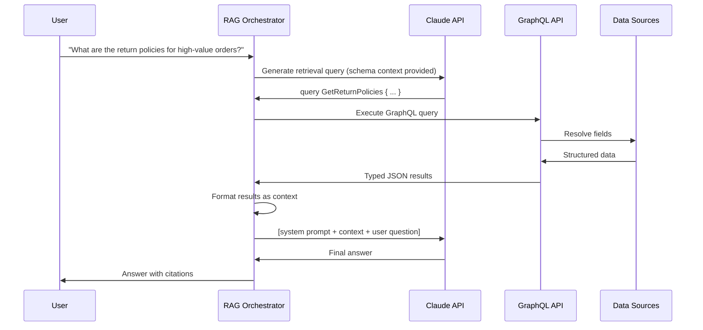

# 01 — GraphQL as a RAG Retriever

> **Purpose:** This document covers the complete implementation of GraphQL queries as RAG retrieval steps. It addresses the full retrieval flow (LLM generates a GraphQL query, executes it, injects results as context), designing retrieval-optimized GraphQL operations with field selection as a context budget control mechanism, caching retrieved GraphQL results for semantic reuse, and tracing RAG retrieval steps as OpenTelemetry spans. By the end, you have a production-grade retrieval layer where context quality, cost, and latency are measurable and controllable.

---

## The RAG Retrieval Flow



### Retrieval Orchestrator Implementation

```typescript
// rag/retrieval-orchestrator.ts
import Anthropic from '@anthropic-ai/sdk';
import { getSchemaExcerpt } from '../schema-excerpt';
import { executeRetrievalQuery } from './graphql-executor';
import { formatContextWindow } from './context-formatter';
import { traceRetrieval } from './retrieval-tracer';

const anthropic = new Anthropic();

interface RAGConfig {
  maxRetrievalRounds: number;
  contextTokenBudget: number;
  agentRole: string;
}

interface RetrievalRound {
  query: string;
  variables: Record<string, unknown>;
  result: unknown;
  tokenCount: number;
  latencyMs: number;
}

export async function runRAGPipeline(
  userQuestion: string,
  config: RAGConfig
): Promise<{ answer: string; retrievalRounds: RetrievalRound[] }> {
  const { maxRetrievalRounds = 3, contextTokenBudget = 4000, agentRole } = config;

  const schemaExcerpt = await getSchemaExcerpt(agentRole);
  const retrievalRounds: RetrievalRound[] = [];
  let remainingContextBudget = contextTokenBudget;
  const accumulatedContext: string[] = [];

  // System prompt for retrieval query generation
  const retrievalSystemPrompt = `You are a GraphQL query generator for a RAG system.
Given a user question, generate GraphQL queries to retrieve relevant context.

Available schema:
<schema>
${schemaExcerpt}
</schema>

Rules:
1. Generate the minimum query needed to answer the question
2. Use field selection to control context size — prefer fewer, more relevant fields
3. Use variables for dynamic values
4. Return JSON: { "query": "...", "variables": {}, "operationName": "...", "rationale": "why this query" }
5. Return { "done": true } when you have enough context to answer the question
6. Return { "done": true } if you cannot retrieve more relevant information`;

  // Iterative retrieval loop
  for (let round = 0; round < maxRetrievalRounds; round++) {
    const contextSoFar = accumulatedContext.join('\n\n');

    const queryResponse = await anthropic.messages.create({
      model: 'claude-haiku-4-5',
      max_tokens: 1024,
      system: retrievalSystemPrompt,
      messages: [{
        role: 'user',
        content: `Question: ${userQuestion}

Context retrieved so far:
<context>
${contextSoFar || 'None yet'}
</context>

Remaining context budget: approximately ${remainingContextBudget} tokens.
Generate the next retrieval query, or return {"done": true} if you have enough context.`,
      }],
    });

    const queryContent = queryResponse.content[0];
    if (queryContent.type !== 'text') break;

    const parsed = JSON.parse(queryContent.text.match(/\{[\s\S]*\}/)?.[0] ?? '{}');
    if (parsed.done) break;
    if (!parsed.query) break;

    // Execute the generated retrieval query
    const start = Date.now();
    const result = await traceRetrieval(
      `retrieval.round.${round}`,
      parsed.operationName ?? `Retrieval_${round}`,
      async () => executeRetrievalQuery(parsed.query, parsed.variables)
    );
    const latencyMs = Date.now() - start;

    // Format the result and track token consumption
    const formattedResult = formatContextWindow(result);
    const tokenCount = estimateTokenCount(formattedResult);

    retrievalRounds.push({
      query: parsed.query,
      variables: parsed.variables ?? {},
      result,
      tokenCount,
      latencyMs,
    });

    accumulatedContext.push(`[Retrieved via: ${parsed.operationName}]\n${formattedResult}`);
    remainingContextBudget -= tokenCount;

    if (remainingContextBudget <= 0) break;
  }

  // Generate final answer with accumulated context
  const finalAnswer = await generateAnswer(
    userQuestion,
    accumulatedContext.join('\n\n')
  );

  return { answer: finalAnswer, retrievalRounds };
}

async function generateAnswer(question: string, context: string): Promise<string> {
  const response = await anthropic.messages.create({
    model: 'claude-sonnet-4-6',
    max_tokens: 2048,
    system: `You are a helpful assistant. Answer questions based on the provided context.
If the context does not contain enough information to answer confidently, say so.
Cite specific details from the context in your answer.`,
    messages: [{
      role: 'user',
      content: `Context:
<context>
${context}
</context>

Question: ${question}`,
    }],
  });

  return response.content[0].type === 'text' ? response.content[0].text : '';
}

function estimateTokenCount(text: string): number {
  // Rough estimate: 1 token ≈ 4 characters for English text
  return Math.ceil(text.length / 4);
}
```

---

## Designing Retrieval-Optimized GraphQL Operations

Different questions require different amounts of context. Design multiple retrieval operations optimized for different information density levels.

```graphql
# TIER 1: High-density retrieval — full document content
# Use when: summarization, detailed comparison, content generation
# Token cost: ~500-1000 tokens per result
query RetrieveProductsFullContext($ids: [ID!]!) {
  products(ids: $ids) {
    id
    name
    descriptionMarkdown
    specifications { key value }
    reviewSentimentSummary
    topReviews(first: 3) {
      rating
      body
      createdAt
    }
  }
}

# TIER 2: Medium-density retrieval — structured metadata
# Use when: recommendation, filtering, comparison of many items
# Token cost: ~50-100 tokens per result
query RetrieveProductsMetadata($ids: [ID!]!) {
  products(ids: $ids) {
    id
    name
    priceDisplay
    categoryPath
    inventoryStatus
    averageRating
    reviewCount
  }
}

# TIER 3: Low-density retrieval — reference data only
# Use when: existence check, ID resolution, availability check
# Token cost: ~15-20 tokens per result
query RetrieveProductsReference($ids: [ID!]!) {
  products(ids: $ids) {
    id
    name
    inventoryStatus
  }
}
```

### `@skip` and `@include` for Conditional Context

Use conditional directives to adjust retrieval density based on runtime context:

```graphql
query RetrieveAdaptiveProduct(
  $id: ID!
  $includeDescription: Boolean!
  $includeReviews: Boolean!
  $reviewCount: Int = 3
) {
  product(id: $id) {
    id
    name
    priceDisplay
    inventoryStatus

    descriptionMarkdown @include(if: $includeDescription)

    topReviews(first: $reviewCount) @include(if: $includeReviews) {
      rating
      body
    }
  }
}
```

The orchestrator sets `includeDescription` and `includeReviews` based on the question type and remaining context budget:

```typescript
// Determine retrieval density based on context budget
function selectRetrievalVariables(
  questionType: 'detail' | 'comparison' | 'availability',
  remainingBudget: number
): Record<string, unknown> {
  if (questionType === 'availability' || remainingBudget < 500) {
    return { includeDescription: false, includeReviews: false };
  }
  if (questionType === 'comparison' || remainingBudget < 2000) {
    return { includeDescription: false, includeReviews: true, reviewCount: 2 };
  }
  // Detail question with plenty of budget
  return { includeDescription: true, includeReviews: true, reviewCount: 5 };
}
```

---

## Caching Retrieved GraphQL Results for Semantic Reuse

The same user question may produce equivalent retrieval queries across different conversations. Cache retrieved results both by exact query hash and by semantic similarity of the underlying question.

```typescript
// rag/retrieval-cache.ts
import { createHash } from 'crypto';
import OpenAI from 'openai';
import { getRedisClient } from '../infrastructure/redis';

const openai = new OpenAI();

interface CachedRetrieval {
  query: string;
  variables: Record<string, unknown>;
  result: unknown;
  questionEmbedding: number[];
  cachedAt: number;
}

/**
 * Two-level cache:
 * Level 1: Exact match on query hash (fastest, most precise)
 * Level 2: Semantic similarity on question embedding (catches paraphrases)
 */
export async function getCachedRetrieval(
  graphqlQuery: string,
  variables: Record<string, unknown>,
  userQuestion: string
): Promise<unknown | null> {
  const redis = getRedisClient();

  // Level 1: Exact cache lookup by query + variables hash
  const exactKey = buildExactCacheKey(graphqlQuery, variables);
  const exactCached = await redis.get(exactKey);
  if (exactCached) {
    return JSON.parse(exactCached);
  }

  // Level 2: Semantic similarity lookup
  const questionEmbedding = await embedText(userQuestion);
  const semanticResult = await findSemanticallySimilarCacheEntry(
    questionEmbedding,
    redis
  );
  if (semanticResult) {
    return semanticResult;
  }

  return null;
}

export async function setCachedRetrieval(
  graphqlQuery: string,
  variables: Record<string, unknown>,
  userQuestion: string,
  result: unknown,
  ttlSeconds = 3600  // 1 hour default
): Promise<void> {
  const redis = getRedisClient();
  const questionEmbedding = await embedText(userQuestion);

  // Level 1: Store by exact key
  const exactKey = buildExactCacheKey(graphqlQuery, variables);
  await redis.setex(exactKey, ttlSeconds, JSON.stringify(result));

  // Level 2: Store embedding index entry for semantic lookup
  const entry: CachedRetrieval = {
    query: graphqlQuery,
    variables,
    result,
    questionEmbedding,
    cachedAt: Date.now(),
  };
  const embeddingKey = `rag:semantic:${createHash('md5').update(userQuestion).digest('hex')}`;
  await redis.setex(embeddingKey, ttlSeconds, JSON.stringify(entry));

  // Store key in the semantic index set for scanning
  await redis.zadd('rag:semantic:index', Date.now(), embeddingKey);
  // Expire old entries from the index
  await redis.zremrangebyscore('rag:semantic:index', 0, Date.now() - ttlSeconds * 1000);
}

async function findSemanticallySimilarCacheEntry(
  questionEmbedding: number[],
  redis: any
): Promise<unknown | null> {
  const SIMILARITY_THRESHOLD = 0.92;  // High threshold — retrieval results must closely match

  const keys = await redis.zrange('rag:semantic:index', 0, -1);
  if (!keys.length) return null;

  // In production, use a proper vector store for this lookup rather than scanning Redis
  // This implementation is suitable for < 1000 cached entries
  let bestSimilarity = 0;
  let bestResult: unknown = null;

  for (const key of keys.slice(-200)) {  // Check most recent 200 entries
    const cached = await redis.get(key);
    if (!cached) continue;

    const entry: CachedRetrieval = JSON.parse(cached);
    const similarity = cosineSimilarity(questionEmbedding, entry.questionEmbedding);

    if (similarity > bestSimilarity) {
      bestSimilarity = similarity;
      bestResult = entry.result;
    }
  }

  return bestSimilarity >= SIMILARITY_THRESHOLD ? bestResult : null;
}

function buildExactCacheKey(query: string, variables: Record<string, unknown>): string {
  const content = JSON.stringify({ query, variables: sortedKeys(variables) });
  return `rag:exact:${createHash('sha256').update(content).digest('hex').slice(0, 24)}`;
}

function sortedKeys(obj: Record<string, unknown>): Record<string, unknown> {
  return Object.fromEntries(Object.entries(obj).sort(([a], [b]) => a.localeCompare(b)));
}

async function embedText(text: string): Promise<number[]> {
  const response = await openai.embeddings.create({
    model: 'text-embedding-3-small',
    input: text,
  });
  return response.data[0].embedding;
}

function cosineSimilarity(a: number[], b: number[]): number {
  let dot = 0, normA = 0, normB = 0;
  for (let i = 0; i < a.length; i++) {
    dot += a[i] * b[i];
    normA += a[i] * a[i];
    normB += b[i] * b[i];
  }
  return dot / (Math.sqrt(normA) * Math.sqrt(normB));
}
```

---

## Context Formatter: GraphQL Results → LLM Context

GraphQL results are JSON trees. LLMs process prose better than JSON. Format retrieved results into structured text that provides both information density and readability.

```typescript
// rag/context-formatter.ts

/**
 * Converts a GraphQL result tree into a formatted text block suitable for LLM context.
 * Aims for information density without verbosity.
 */
export function formatContextWindow(result: unknown, maxChars = 3000): string {
  if (result === null || result === undefined) return '(no results)';

  const text = formatValue(result, 0);
  if (text.length <= maxChars) return text;

  // Truncate with ellipsis marker if too long
  return text.slice(0, maxChars - 40) + '\n... [truncated to fit context budget]';
}

function formatValue(value: unknown, depth: number): string {
  if (value === null) return 'null';
  if (typeof value === 'string') return value;
  if (typeof value === 'number' || typeof value === 'boolean') return String(value);

  if (Array.isArray(value)) {
    if (value.length === 0) return '(empty)';
    if (depth >= 2) {
      // Deep arrays: compact format
      return `[${value.length} items: ${value.slice(0, 3).map((v) => formatValue(v, depth + 1)).join(', ')}${value.length > 3 ? '...' : ''}]`;
    }
    return value
      .slice(0, 10)  // Limit array depth in context
      .map((item, i) => `${i + 1}. ${formatValue(item, depth + 1)}`)
      .join('\n');
  }

  if (typeof value === 'object') {
    const obj = value as Record<string, unknown>;
    const lines: string[] = [];
    for (const [key, val] of Object.entries(obj)) {
      if (val === null || val === undefined) continue;
      const label = camelToLabel(key);
      const formatted = formatValue(val, depth + 1);
      if (typeof val === 'object' && !Array.isArray(val)) {
        lines.push(`${label}:\n${indent(formatted)}`);
      } else {
        lines.push(`${label}: ${formatted}`);
      }
    }
    return lines.join('\n');
  }

  return String(value);
}

function camelToLabel(key: string): string {
  // "priceDisplay" → "Price Display", "aiSummary" → "AI Summary"
  return key
    .replace(/([A-Z])/g, ' $1')
    .replace(/^./, (s) => s.toUpperCase())
    .trim();
}

function indent(text: string, spaces = 2): string {
  return text.split('\n').map((line) => ' '.repeat(spaces) + line).join('\n');
}
```

---

## Tracing RAG Retrieval Steps as OpenTelemetry Spans

RAG pipelines have multiple latency contributors: query generation, query execution, embedding, and final answer generation. Instrument each step as a span for observability.

```typescript
// rag/retrieval-tracer.ts
import { trace, SpanKind, SpanStatusCode, context, propagation } from '@opentelemetry/api';

const tracer = trace.getTracer('rag-retrieval');

export async function traceRetrieval<T>(
  spanName: string,
  operationName: string,
  fn: () => Promise<T>
): Promise<T> {
  return tracer.startActiveSpan(
    spanName,
    {
      kind: SpanKind.CLIENT,
      attributes: {
        'rag.retrieval.operation': operationName,
        'rag.retrieval.type': 'graphql',
      },
    },
    async (span) => {
      const start = Date.now();
      try {
        const result = await fn();
        span.setAttributes({
          'rag.retrieval.latency_ms': Date.now() - start,
          'rag.retrieval.success': true,
        });
        return result;
      } catch (err) {
        span.recordException(err as Error);
        span.setStatus({ code: SpanStatusCode.ERROR });
        throw err;
      } finally {
        span.end();
      }
    }
  );
}

export function traceRAGPipeline<T>(
  conversationId: string,
  fn: () => Promise<T>
): Promise<T> {
  return tracer.startActiveSpan(
    'rag.pipeline',
    {
      kind: SpanKind.INTERNAL,
      attributes: {
        'rag.conversation_id': conversationId,
        'rag.started_at': new Date().toISOString(),
      },
    },
    fn
  );
}
```

---

## References

- [Anthropic RAG Best Practices](https://docs.anthropic.com/en/docs/build-with-claude/retrieval-augmented-generation)
- [LlamaIndex GraphQL Integration](https://docs.llamaindex.ai/)
- [OpenTelemetry Semantic Conventions for LLMs](https://opentelemetry.io/docs/specs/semconv/gen-ai/)

## Related Topics

- [Chapter 22.02: Vector Search Resolvers](./02-vector-search-resolvers.md) — Implementing semantic search inside resolvers
- [Chapter 22.03: Knowledge Graph RAG](./03-knowledge-graph-rag.md) — Multi-hop traversal for retrieval
- [Chapter 21.01: GraphQL as AI Tool](../21-ai-native-graphql/01-graphql-as-ai-tool.md) — NL2GraphQL translation
- [Chapter 14: Observability](../14-observability/README.md) — OpenTelemetry tracing fundamentals
