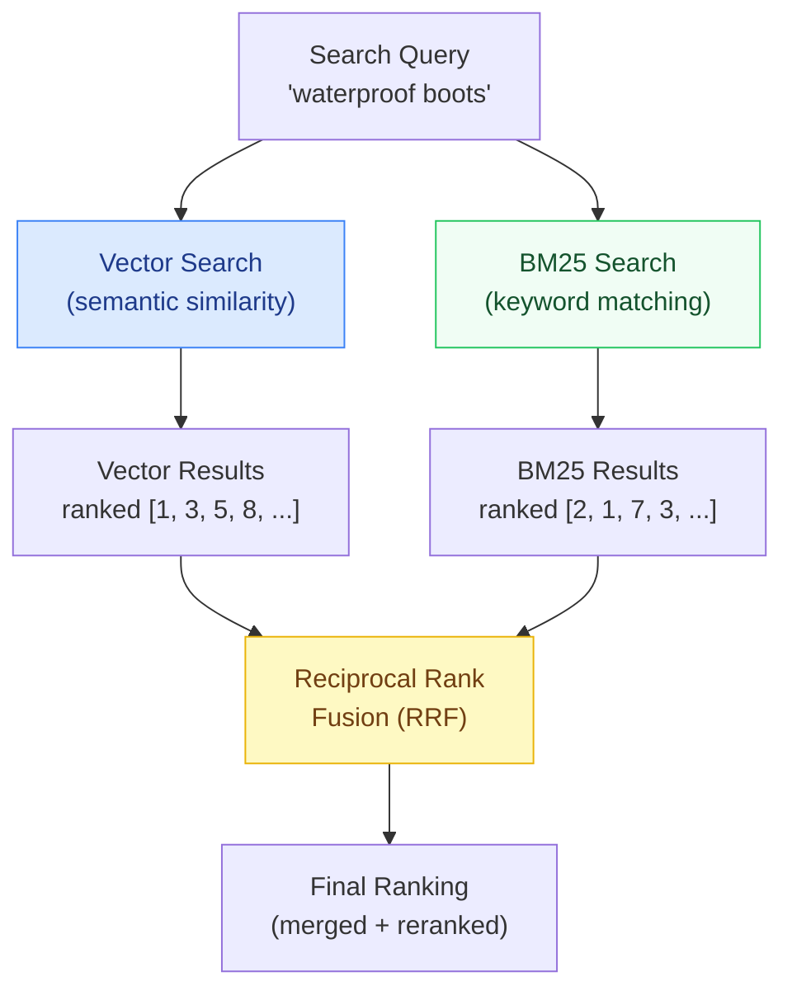

# 02 — Vector Search Resolvers

> **Purpose:** This document covers the implementation of vector similarity search inside GraphQL resolvers. It addresses the full stack: pgvector with PostgreSQL for co-located vector storage, Qdrant and Pinecone as external vector stores, embedding generation using the OpenAI embeddings API or local models, the semantic search resolver pattern, hybrid search combining BM25 keyword matching with vector similarity using RRF fusion, DataLoader batching for embedding generation, and caching embeddings in Redis. By the end, you have a typed, observable, access-controlled semantic search field that clients can query like any other GraphQL field.

---

## The Semantic Search Resolver Pattern

The goal is a GraphQL field that accepts a natural language query and returns semantically relevant results, typed by the schema:

```graphql
type Query {
  """
  Semantic search across the product catalog using natural language.
  Returns products ranked by semantic relevance to the query string.
  Supports product descriptions, specifications, and review summaries.

  Example: semanticSearch(query: "waterproof hiking boots under $200", topK: 5)
  """
  semanticSearch(
    """Natural language search query. Describe what you're looking for."""
    query: String!

    """Maximum number of results to return. Range: 1-50. Default: 10."""
    topK: Int = 10

    """Optional filter to apply after semantic search."""
    filter: SemanticSearchFilter
  ): SemanticSearchResult!

  """
  Hybrid search combining keyword matching (BM25) with semantic similarity.
  Use when exact keyword matches matter (product codes, brand names).
  """
  hybridSearch(
    query: String!
    topK: Int = 10
    semanticWeight: Float = 0.7  # 0.0 = pure keyword, 1.0 = pure semantic
  ): SemanticSearchResult!
}

type SemanticSearchResult {
  """Ranked list of matching items"""
  results: [SearchHit!]!
  """Total items searched"""
  totalSearched: Int!
  """Time taken for the search in milliseconds"""
  searchLatencyMs: Int!
}

type SearchHit {
  """The matched product"""
  product: Product!
  """Similarity score from 0.0 (no match) to 1.0 (identical)"""
  score: Float!
  """The text segment that matched most strongly"""
  matchedExcerpt: String
}

input SemanticSearchFilter {
  """Filter to products in this category"""
  categoryPath: String
  """Filter to products within this price range (in cents)"""
  maxPriceCents: Int
  """Filter to products with this inventory status"""
  inventoryStatus: ProductInventoryStatus
}
```

---

## pgvector: Vector Search in PostgreSQL

pgvector extends PostgreSQL with vector similarity search. It is the lowest-friction option for teams already running PostgreSQL — no additional infrastructure required.

### Schema Setup

```sql
-- Enable the pgvector extension
CREATE EXTENSION IF NOT EXISTS vector;

-- Product embeddings table
-- Stores one embedding per product text segment (chunk)
CREATE TABLE product_embeddings (
  id           UUID PRIMARY KEY DEFAULT gen_random_uuid(),
  product_id   TEXT NOT NULL REFERENCES products(id) ON DELETE CASCADE,
  chunk_index  INTEGER NOT NULL,  -- Position within the product's text segments
  chunk_text   TEXT NOT NULL,     -- The original text segment
  embedding    VECTOR(1536) NOT NULL,  -- OpenAI text-embedding-3-small dimension
  model        TEXT NOT NULL DEFAULT 'text-embedding-3-small',
  created_at   TIMESTAMPTZ NOT NULL DEFAULT now(),
  updated_at   TIMESTAMPTZ NOT NULL DEFAULT now(),

  UNIQUE (product_id, chunk_index)
);

-- IVFFlat index for approximate nearest-neighbor search
-- lists=100 is appropriate for < 1M vectors; increase for larger datasets
CREATE INDEX product_embeddings_vector_idx
  ON product_embeddings
  USING ivfflat (embedding vector_cosine_ops)
  WITH (lists = 100);

-- Index for efficient product_id lookups
CREATE INDEX product_embeddings_product_id_idx ON product_embeddings (product_id);

-- Function: cosine similarity search with optional filter
CREATE OR REPLACE FUNCTION semantic_product_search(
  query_embedding VECTOR(1536),
  top_k           INTEGER DEFAULT 10,
  filter_category TEXT DEFAULT NULL,
  filter_max_price INTEGER DEFAULT NULL
)
RETURNS TABLE (
  product_id    TEXT,
  chunk_text    TEXT,
  similarity    FLOAT
)
LANGUAGE SQL STABLE AS $$
  SELECT DISTINCT ON (pe.product_id)
    pe.product_id,
    pe.chunk_text,
    1 - (pe.embedding <=> query_embedding) AS similarity
  FROM product_embeddings pe
  JOIN products p ON p.id = pe.product_id
  WHERE
    (filter_category IS NULL OR p.category_path LIKE filter_category || '%')
    AND (filter_max_price IS NULL OR p.price_cents <= filter_max_price)
    AND p.inventory_status = 'ACTIVE'
  ORDER BY pe.product_id, pe.embedding <=> query_embedding
  LIMIT top_k * 3  -- Fetch more before dedup to ensure top_k unique products
$$;
```

### Resolver Implementation with pgvector

```typescript
// resolvers/semantic-search-resolver.ts
import { Pool } from 'pg';
import OpenAI from 'openai';
import type { Resolvers, SemanticSearchFilterInput } from '../__generated__/types';

const openai = new OpenAI();

export const semanticSearchResolvers: Resolvers = {
  Query: {
    async semanticSearch(_parent, args, context) {
      const { query, topK = 10, filter } = args;
      const start = Date.now();

      // Generate embedding for the search query
      const queryEmbedding = await context.loaders.embeddings.load(query);

      // Execute vector similarity search in PostgreSQL
      const results = await executePgVectorSearch({
        pool: context.db,
        queryEmbedding,
        topK,
        filter,
      });

      // Load full product objects via DataLoader (batched)
      const productIds = results.map((r) => r.productId);
      const products = await context.loaders.products.loadMany(productIds);

      return {
        results: results.map((hit, i) => ({
          product: products[i],
          score: hit.similarity,
          matchedExcerpt: hit.chunkText,
        })).filter((hit) => hit.product !== null),
        totalSearched: await getIndexSize(context.db),
        searchLatencyMs: Date.now() - start,
      };
    },
  },
};

interface VectorSearchParams {
  pool: Pool;
  queryEmbedding: number[];
  topK: number;
  filter?: SemanticSearchFilterInput | null;
}

interface VectorSearchHit {
  productId: string;
  chunkText: string;
  similarity: number;
}

async function executePgVectorSearch(params: VectorSearchParams): Promise<VectorSearchHit[]> {
  const { pool, queryEmbedding, topK, filter } = params;

  // Convert embedding array to pgvector format: '[0.1, 0.2, ...]'
  const embeddingStr = `[${queryEmbedding.join(',')}]`;

  const { rows } = await pool.query(
    `SELECT * FROM semantic_product_search($1::vector, $2, $3, $4)
     ORDER BY similarity DESC
     LIMIT $2`,
    [
      embeddingStr,
      topK,
      filter?.categoryPath ?? null,
      filter?.maxPriceCents ?? null,
    ]
  );

  return rows.map((row) => ({
    productId: row.product_id,
    chunkText: row.chunk_text,
    similarity: parseFloat(row.similarity),
  }));
}

async function getIndexSize(pool: Pool): Promise<number> {
  const { rows } = await pool.query('SELECT COUNT(DISTINCT product_id) as count FROM product_embeddings');
  return parseInt(rows[0].count);
}
```

---

## External Vector Stores: Qdrant

For large-scale deployments (> 1M vectors), a dedicated vector store outperforms pgvector. Qdrant is a high-performance, open-source option.

```typescript
// vector-stores/qdrant-client.ts
import { QdrantClient } from '@qdrant/js-client-rest';
import OpenAI from 'openai';

const qdrant = new QdrantClient({ url: process.env.QDRANT_URL });
const COLLECTION_NAME = 'product_embeddings';

export async function qdrantSemanticSearch(params: {
  query: string;
  topK: number;
  filter?: Record<string, unknown>;
}): Promise<Array<{ productId: string; score: number; excerpt: string }>> {
  const openai = new OpenAI();

  // Generate query embedding
  const embeddingResponse = await openai.embeddings.create({
    model: 'text-embedding-3-small',
    input: params.query,
  });
  const queryVector = embeddingResponse.data[0].embedding;

  // Search Qdrant
  const searchResult = await qdrant.search(COLLECTION_NAME, {
    vector: queryVector,
    limit: params.topK,
    filter: params.filter ? buildQdrantFilter(params.filter) : undefined,
    with_payload: true,
    score_threshold: 0.7,  // Minimum similarity threshold
  });

  return searchResult.map((hit) => ({
    productId: hit.payload?.product_id as string,
    score: hit.score,
    excerpt: hit.payload?.chunk_text as string,
  }));
}

function buildQdrantFilter(filter: Record<string, unknown>): object {
  const conditions: object[] = [];

  if (filter.categoryPath) {
    conditions.push({
      key: 'category_path',
      match: { text: filter.categoryPath as string },
    });
  }
  if (filter.inventoryStatus) {
    conditions.push({
      key: 'inventory_status',
      match: { value: filter.inventoryStatus as string },
    });
  }

  return conditions.length > 0 ? { must: conditions } : {};
}

// Upsert document embeddings into Qdrant
export async function upsertProductEmbedding(params: {
  productId: string;
  chunks: Array<{ index: number; text: string; embedding: number[] }>;
  metadata: Record<string, unknown>;
}): Promise<void> {
  const points = params.chunks.map((chunk) => ({
    id: `${params.productId}_${chunk.index}`,
    vector: chunk.embedding,
    payload: {
      product_id: params.productId,
      chunk_text: chunk.text,
      chunk_index: chunk.index,
      ...params.metadata,
    },
  }));

  await qdrant.upsert(COLLECTION_NAME, { points, wait: true });
}
```

---

## DataLoader for Embedding Generation

Embedding generation benefits from batching — the OpenAI embeddings API accepts multiple texts per request, and the cost per token is the same whether you send 1 text or 100. Use DataLoader to batch embedding requests within a single resolver execution cycle.

```typescript
// loaders/embedding-loader.ts
import DataLoader from 'dataloader';
import OpenAI from 'openai';
import { createHash } from 'crypto';
import { getRedisClient } from '../infrastructure/redis';

const openai = new OpenAI();

export function createEmbeddingLoader() {
  return new DataLoader<string, number[]>(
    async (texts: readonly string[]) => {
      const redis = getRedisClient();

      // Check Redis cache for each text
      const cacheKeys = texts.map((t) => `emb:v1:${sha256(t)}`);
      const cachedEmbeddings = await redis.mget(...cacheKeys);

      const results: (number[] | null)[] = cachedEmbeddings.map((v) =>
        v ? JSON.parse(v) : null
      );

      // Find uncached texts
      const uncachedIndices = results
        .map((v, i) => (v === null ? i : -1))
        .filter((i) => i !== -1);

      if (uncachedIndices.length > 0) {
        const uncachedTexts = uncachedIndices.map((i) => texts[i]);

        // Batch request to OpenAI — up to 2048 texts per request
        const response = await openai.embeddings.create({
          model: 'text-embedding-3-small',
          input: uncachedTexts,
        });

        // Store in cache — embeddings are deterministic, no TTL needed
        const pipeline = redis.pipeline();
        for (let j = 0; j < uncachedIndices.length; j++) {
          const i = uncachedIndices[j];
          const embedding = response.data[j].embedding;
          results[i] = embedding;
          pipeline.set(cacheKeys[i], JSON.stringify(embedding));  // Persistent cache
        }
        await pipeline.exec();
      }

      return results as number[][];
    },
    {
      maxBatchSize: 100,   // OpenAI recommends batches ≤ 100 for latency reasons
      cache: true,         // Per-request dedup cache
    }
  );
}

function sha256(input: string): string {
  return createHash('sha256').update(input).digest('hex');
}
```

---

## Hybrid Search: BM25 + Vector with RRF Fusion

Pure vector search misses exact matches. A user searching for "SKU-12345" or "GORE-TEX" needs keyword matching. Hybrid search combines both methods.



```typescript
// search/hybrid-search.ts
import { Pool } from 'pg';

interface HybridSearchResult {
  productId: string;
  excerpt: string;
  rrfScore: number;
  vectorScore: number;
  bm25Score: number;
}

/**
 * Reciprocal Rank Fusion (RRF) merges ranked lists from multiple sources.
 * Score formula: RRF(d) = Σ 1 / (k + rank(d))  where k=60 (standard constant)
 */
function rrfScore(rank: number, k = 60): number {
  return 1 / (k + rank);
}

export async function hybridSearch(params: {
  pool: Pool;
  queryText: string;
  queryEmbedding: number[];
  topK: number;
  semanticWeight: number;  // 0.0 = pure keyword, 1.0 = pure semantic
}): Promise<HybridSearchResult[]> {
  const { pool, queryText, queryEmbedding, topK, semanticWeight } = params;
  const keywordWeight = 1 - semanticWeight;
  const fetchK = topK * 3;  // Over-fetch to improve fusion quality

  // Run both searches in parallel
  const [vectorResults, bm25Results] = await Promise.all([
    runVectorSearch(pool, queryEmbedding, fetchK),
    runBM25Search(pool, queryText, fetchK),
  ]);

  // Build score maps for RRF
  const scores = new Map<string, {
    rrfScore: number;
    vectorScore: number;
    bm25Score: number;
    excerpt: string;
  }>();

  vectorResults.forEach((result, rank) => {
    scores.set(result.productId, {
      rrfScore: semanticWeight * rrfScore(rank),
      vectorScore: result.similarity,
      bm25Score: 0,
      excerpt: result.chunkText,
    });
  });

  bm25Results.forEach((result, rank) => {
    const existing = scores.get(result.productId);
    if (existing) {
      existing.rrfScore += keywordWeight * rrfScore(rank);
      existing.bm25Score = result.score;
    } else {
      scores.set(result.productId, {
        rrfScore: keywordWeight * rrfScore(rank),
        vectorScore: 0,
        bm25Score: result.score,
        excerpt: result.excerpt,
      });
    }
  });

  // Sort by combined RRF score and take top K
  return Array.from(scores.entries())
    .map(([productId, data]) => ({ productId, ...data }))
    .sort((a, b) => b.rrfScore - a.rrfScore)
    .slice(0, topK);
}

async function runVectorSearch(pool: Pool, embedding: number[], topK: number) {
  const embeddingStr = `[${embedding.join(',')}]`;
  const { rows } = await pool.query(
    `SELECT DISTINCT ON (product_id) product_id, chunk_text,
     1 - (embedding <=> $1::vector) AS similarity
     FROM product_embeddings
     ORDER BY product_id, embedding <=> $1::vector
     LIMIT $2`,
    [embeddingStr, topK]
  );
  return rows.map((r) => ({
    productId: r.product_id,
    chunkText: r.chunk_text,
    similarity: parseFloat(r.similarity),
  }));
}

async function runBM25Search(pool: Pool, queryText: string, topK: number) {
  // PostgreSQL full-text search (BM25-like via tsvector/tsquery)
  const { rows } = await pool.query(
    `SELECT p.id AS product_id,
     ts_headline('english', p.description, query, 'MaxFragments=1') AS excerpt,
     ts_rank_cd(p.search_vector, query) AS score
     FROM products p,
     plainto_tsquery('english', $1) AS query
     WHERE p.search_vector @@ query
     ORDER BY score DESC
     LIMIT $2`,
    [queryText, topK]
  );
  return rows.map((r) => ({
    productId: r.product_id,
    excerpt: r.excerpt,
    score: parseFloat(r.score),
  }));
}
```

---

## Embedding Generation Pipeline

Before vector search works, you need to embed your documents. This is an asynchronous background process, not part of the query path.

```typescript
// pipeline/embed-products.ts — background job
import { Pool } from 'pg';
import OpenAI from 'openai';

const CHUNK_SIZE = 512;       // Characters per chunk (adjust for your content)
const CHUNK_OVERLAP = 64;     // Overlap between chunks to preserve context
const BATCH_SIZE = 100;       // Products to process per batch

export async function embedAllProducts(pool: Pool): Promise<void> {
  const openai = new OpenAI();
  let offset = 0;

  while (true) {
    const { rows: products } = await pool.query(
      `SELECT id, name, description, specifications
       FROM products
       WHERE id NOT IN (SELECT DISTINCT product_id FROM product_embeddings)
       ORDER BY created_at DESC
       LIMIT $1 OFFSET $2`,
      [BATCH_SIZE, offset]
    );

    if (products.length === 0) break;

    // Process each product
    for (const product of products) {
      const text = buildProductText(product);
      const chunks = chunkText(text, CHUNK_SIZE, CHUNK_OVERLAP);

      // Batch embed all chunks for this product
      const embeddingResponse = await openai.embeddings.create({
        model: 'text-embedding-3-small',
        input: chunks,
      });

      // Upsert embeddings
      for (let i = 0; i < chunks.length; i++) {
        const embedding = embeddingResponse.data[i].embedding;
        await pool.query(
          `INSERT INTO product_embeddings (product_id, chunk_index, chunk_text, embedding, model)
           VALUES ($1, $2, $3, $4::vector, $5)
           ON CONFLICT (product_id, chunk_index) DO UPDATE
           SET chunk_text = $3, embedding = $4::vector, updated_at = now()`,
          [
            product.id,
            i,
            chunks[i],
            `[${embedding.join(',')}]`,
            'text-embedding-3-small',
          ]
        );
      }
    }

    offset += BATCH_SIZE;
    console.log(`Embedded ${offset} products`);
  }
}

function buildProductText(product: {
  name: string;
  description: string | null;
  specifications: Array<{ key: string; value: string }> | null;
}): string {
  const parts = [
    `Product: ${product.name}`,
    product.description ? `Description: ${product.description}` : '',
    product.specifications?.length
      ? `Specifications: ${product.specifications.map((s) => `${s.key}: ${s.value}`).join(', ')}`
      : '',
  ];
  return parts.filter(Boolean).join('\n\n');
}

function chunkText(text: string, chunkSize: number, overlap: number): string[] {
  const chunks: string[] = [];
  let start = 0;

  while (start < text.length) {
    const end = Math.min(start + chunkSize, text.length);
    chunks.push(text.slice(start, end));
    if (end >= text.length) break;
    start = end - overlap;
  }

  return chunks;
}
```

---

## References

- [pgvector GitHub](https://github.com/pgvector/pgvector)
- [Qdrant Documentation](https://qdrant.tech/documentation/)
- [OpenAI Embeddings API](https://platform.openai.com/docs/api-reference/embeddings)
- [Reciprocal Rank Fusion paper (Cormack et al.)](https://dl.acm.org/doi/10.1145/1571941.1572114)

## Related Topics

- [Chapter 22.01: GraphQL as RAG Retriever](./01-graphql-as-rag-retriever.md) — Retrieval flow and context budgets
- [Chapter 22.03: Knowledge Graph RAG](./03-knowledge-graph-rag.md) — Multi-hop retrieval with entities
- [Chapter 04: Resolvers and Execution](../04-resolvers-and-execution/README.md) — DataLoader fundamentals
- [Chapter 22.05: Production Patterns](./05-production-patterns.md) — Embedding caching, latency optimization
