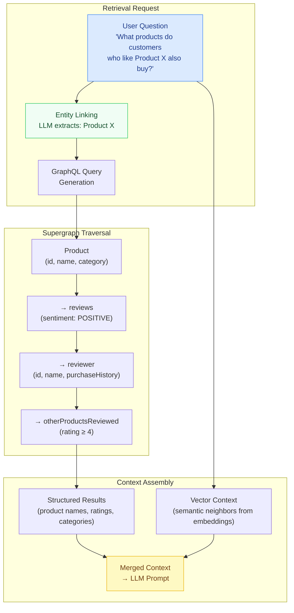

# 03 — Knowledge Graph RAG Using GraphQL Federation

> **Purpose:** This document covers the use of a federated GraphQL supergraph as a
> knowledge graph for RAG retrieval. It addresses the structural alignment between
> federation's entity model and knowledge graph theory, multi-hop retrieval by traversing
> entity relationships in a single GraphQL operation, entity linking (extracting named
> entities from a user query and resolving them through the graph), temporal knowledge
> through schema versioning, and the combination of structured GraphQL traversal with
> unstructured vector similarity results. By the end, you have a retrieval architecture
> that uses the supergraph's existing entity relationships as the retrieval backbone —
> no separate knowledge graph infrastructure required.

---

## The Supergraph as a Knowledge Graph

A knowledge graph is a network of entities and the typed relationships between them.
In classical knowledge graph systems (Neo4j, Amazon Neptune, Google Knowledge Graph),
you define entities (nodes) and relationships (edges) explicitly. In a federated
GraphQL supergraph, you have already done this work — you just called it something
different.

| Knowledge Graph Concept | GraphQL Federation Equivalent |
|---|---|
| Entity (node) | `type Product @key(fields: "id")` |
| Relationship (edge) | A field that resolves to another entity type |
| Relationship type | The field name and its directionality |
| Entity attribute | A scalar field on the type |
| Subgraph | A domain partition of the knowledge graph |
| `@key` | The entity identifier used for cross-subgraph linking |
| Reference resolver (`__resolveReference`) | The lookup function for an entity by its key |

A product catalog supergraph already encodes this graph:
`Product → Category → Department`
`Product → Review → ReviewAuthor`
`Product → OrderItem → Order → Customer`
`Review → ReviewAuthor → OtherProductsReviewed`

This graph is the retrieval substrate. A RAG pipeline that uses GraphQL traversal instead
of (or alongside) vector similarity can retrieve structured, relationship-aware context
that pure vector search cannot provide.

---

## Retrieval Flow: Multi-Hop Entity Traversal



The multi-hop traversal `product → reviews → reviewer → other_products_reviewed` is a
single GraphQL operation. In REST or raw SQL, this requires four separate round-trips
with join logic in the application layer. In GraphQL, the traversal is expressed
declaratively and the router orchestrates the subgraph fetches.

---

## Multi-Hop Retrieval: GraphQL Query

The traversal above expressed as a GraphQL operation:

```graphql
# Multi-hop retrieval: what do satisfied reviewers of Product X also like?
query MultiHopProductRetrieval($productId: ID!) {
  product(id: $productId) {
    id
    name
    category {
      name
      path
    }

    # Hop 1: positive reviews of this product
    reviews(filter: { sentiment: POSITIVE }, first: 20) {
      edges {
        node {
          rating
          body

          # Hop 2: the reviewer entity
          reviewer {
            id
            displayName

            # Hop 3: other products this reviewer has reviewed highly
            reviewedProducts(filter: { rating: { gte: 4 } }, first: 10) {
              edges {
                node {
                  id
                  name
                  category { name }
                  averageRating
                  reviewCount
                }
              }
            }
          }
        }
      }
    }
  }
}
```

This query returns context that pure vector search cannot surface: the relationship
chain that connects a product to the purchasing behavior of its satisfied customers.
An LLM answering "what should I buy if I liked Product X?" can use this structured
co-purchase signal directly.

---

## Entity Linking: From Natural Language to Graph Traversal

Entity linking is the process of extracting named entities from a user's natural language
query and resolving them to identifiers in the knowledge graph. This bridges the gap
between unstructured user input and typed GraphQL operations.

### Schema for Entity Resolution

```graphql
type Query {
  """
  Fuzzy entity resolution: given a natural language name, returns matching entities
  across the supergraph. Used by the RAG pipeline to link extracted entity mentions
  to graph nodes before multi-hop retrieval.
  """
  resolveEntities(
    mentions: [EntityMention!]!
    limit: Int = 5
  ): [ResolvedEntity!]!
}

input EntityMention {
  """The raw text extracted from the user query"""
  text: String!
  """The entity type the LLM believes this mention refers to"""
  entityType: EntityType!
  """Optional context sentence to disambiguate"""
  contextSentence: String
}

enum EntityType {
  PRODUCT
  CATEGORY
  BRAND
  CUSTOMER
  ORDER
  REVIEW_AUTHOR
}

union ResolvedEntity = Product | Category | Brand | Customer

type EntityResolutionResult {
  mention: EntityMention!
  candidates: [ResolvedEntity!]!
  confidence: Float!
}
```

### Entity Linking Implementation

```typescript
// rag/entity-linker.ts
import Anthropic from '@anthropic-ai/sdk';
import { executeRetrievalQuery } from './graphql-executor';

const anthropic = new Anthropic();

export interface ExtractedEntity {
  text: string;
  entityType: 'PRODUCT' | 'CATEGORY' | 'BRAND' | 'CUSTOMER' | 'REVIEW_AUTHOR';
  contextSentence: string;
}

export interface ResolvedEntity {
  mention: ExtractedEntity;
  id: string;
  type: string;
  displayName: string;
  confidence: number;
}

/**
 * Phase 1: Extract entity mentions from the user's question.
 * The LLM identifies named entities and their types.
 */
export async function extractEntityMentions(
  userQuestion: string
): Promise<ExtractedEntity[]> {
  const response = await anthropic.messages.create({
    model: 'claude-haiku-4-5',
    max_tokens: 512,
    system: `You are an entity extraction system for a product catalog knowledge graph.
Extract named entities from user questions. For each entity, identify:
- The exact text span
- The entity type: PRODUCT, CATEGORY, BRAND, CUSTOMER, REVIEW_AUTHOR
- The context sentence

Return JSON array: [{ "text": "...", "entityType": "...", "contextSentence": "..." }]
Return [] if no named entities are present.`,
    messages: [{
      role: 'user',
      content: `Extract entities from: "${userQuestion}"`,
    }],
  });

  const content = response.content[0];
  if (content.type !== 'text') return [];

  const match = content.text.match(/\[[\s\S]*\]/);
  if (!match) return [];

  try {
    return JSON.parse(match[0]) as ExtractedEntity[];
  } catch {
    return [];
  }
}

/**
 * Phase 2: Resolve entity mentions to graph identifiers.
 * Uses the GraphQL resolveEntities field for fuzzy matching.
 */
export async function resolveEntities(
  mentions: ExtractedEntity[]
): Promise<ResolvedEntity[]> {
  if (mentions.length === 0) return [];

  const result = await executeRetrievalQuery(
    `
    query ResolveEntityMentions($mentions: [EntityMention!]!) {
      resolveEntities(mentions: $mentions, limit: 3) {
        ... on Product {
          id
          name
          __typename
        }
        ... on Category {
          id
          name
          __typename
        }
        ... on Brand {
          id
          name
          __typename
        }
      }
    }
    `,
    { mentions }
  );

  // Flatten and return resolved entities with confidence scores
  const resolved: ResolvedEntity[] = [];
  const entities = (result as any)?.resolveEntities ?? [];

  for (let i = 0; i < mentions.length; i++) {
    const candidates = entities[i] ?? [];
    if (candidates.length > 0) {
      resolved.push({
        mention: mentions[i],
        id: candidates[0].id,
        type: candidates[0].__typename,
        displayName: candidates[0].name,
        confidence: candidates.length === 1 ? 0.95 : 0.75, // Higher confidence when only one candidate
      });
    }
  }

  return resolved;
}

/**
 * Phase 3: Generate a multi-hop GraphQL retrieval query from resolved entities.
 * The LLM generates the traversal based on resolved entity IDs and the schema.
 */
export async function generateMultiHopQuery(
  userQuestion: string,
  resolvedEntities: ResolvedEntity[],
  schemaExcerpt: string
): Promise<{ query: string; variables: Record<string, unknown> } | null> {
  if (resolvedEntities.length === 0) return null;

  const entityContext = resolvedEntities
    .map((e) => `${e.type} "${e.displayName}" → id: "${e.id}" (confidence: ${e.confidence})`)
    .join('\n');

  const response = await anthropic.messages.create({
    model: 'claude-sonnet-4-6',
    max_tokens: 1024,
    system: `You are a GraphQL query generator for a knowledge graph RAG system.
Given resolved entity IDs and a user question, generate a multi-hop GraphQL query
that traverses entity relationships to gather relevant context.

Schema excerpt:
<schema>
${schemaExcerpt}
</schema>

Rules:
1. Use the resolved entity IDs as entry points — never search by name
2. Traverse at most 3 relationship hops to contain query complexity
3. Select only fields relevant to answering the question — context budget matters
4. Use pagination arguments (first: N) to limit result set size
5. Return JSON: { "query": "...", "variables": {} }`,
    messages: [{
      role: 'user',
      content: `Question: ${userQuestion}

Resolved entities:
${entityContext}

Generate the multi-hop retrieval query.`,
    }],
  });

  const content = response.content[0];
  if (content.type !== 'text') return null;

  const match = content.text.match(/\{[\s\S]*\}/);
  if (!match) return null;

  try {
    return JSON.parse(match[0]) as { query: string; variables: Record<string, unknown> };
  } catch {
    return null;
  }
}
```

---

## Full Knowledge Graph RAG Pipeline

```typescript
// rag/knowledge-graph-rag.ts
import { extractEntityMentions, resolveEntities, generateMultiHopQuery } from './entity-linker';
import { qdrantSemanticSearch } from '../vector-stores/qdrant-client';
import { executeRetrievalQuery } from './graphql-executor';
import { formatContextWindow } from './context-formatter';
import { getSchemaExcerpt } from '../schema-excerpt';
import Anthropic from '@anthropic-ai/sdk';
import { trace, SpanKind } from '@opentelemetry/api';

const anthropic = new Anthropic();
const tracer = trace.getTracer('knowledge-graph-rag');

interface KGRAGConfig {
  includeVectorResults: boolean;
  vectorTopK: number;
  contextTokenBudget: number;
}

interface KGRAGResult {
  answer: string;
  entitiesExtracted: number;
  entitiesResolved: number;
  structuredContextTokens: number;
  vectorContextTokens: number;
  multiHopQueryGenerated: boolean;
}

export async function runKnowledgeGraphRAG(
  userQuestion: string,
  config: KGRAGConfig
): Promise<KGRAGResult> {
  return tracer.startActiveSpan('kg-rag.pipeline', { kind: SpanKind.INTERNAL }, async (span) => {
    const { includeVectorResults, vectorTopK, contextTokenBudget } = config;
    const schemaExcerpt = await getSchemaExcerpt('knowledge-graph');

    // Phase 1: Entity extraction
    const mentions = await tracer.startActiveSpan('kg-rag.entity-extraction', async (s) => {
      const result = await extractEntityMentions(userQuestion);
      s.setAttribute('kg-rag.entities-extracted', result.length);
      s.end();
      return result;
    });

    // Phase 2: Entity resolution
    const resolvedEntities = await tracer.startActiveSpan('kg-rag.entity-resolution', async (s) => {
      const result = await resolveEntities(mentions);
      s.setAttribute('kg-rag.entities-resolved', result.length);
      s.end();
      return result;
    });

    let structuredContext = '';
    let multiHopQueryGenerated = false;

    // Phase 3: Multi-hop GraphQL traversal (if entities resolved)
    if (resolvedEntities.length > 0) {
      const queryPlan = await generateMultiHopQuery(userQuestion, resolvedEntities, schemaExcerpt);

      if (queryPlan) {
        multiHopQueryGenerated = true;
        const graphResult = await tracer.startActiveSpan('kg-rag.graph-traversal', async (s) => {
          s.setAttribute('kg-rag.query-length', queryPlan.query.length);
          const result = await executeRetrievalQuery(queryPlan.query, queryPlan.variables);
          s.end();
          return result;
        });

        structuredContext = formatContextWindow(graphResult, Math.floor(contextTokenBudget * 0.6));
      }
    }

    // Phase 4: Vector similarity search (complementary to graph traversal)
    let vectorContext = '';
    if (includeVectorResults) {
      const vectorResults = await tracer.startActiveSpan('kg-rag.vector-search', async (s) => {
        const results = await qdrantSemanticSearch({
          query: userQuestion,
          topK: vectorTopK,
        });
        s.setAttribute('kg-rag.vector-results', results.length);
        s.end();
        return results;
      });

      if (vectorResults.length > 0) {
        const budgetForVector = structuredContext
          ? Math.floor(contextTokenBudget * 0.4)
          : contextTokenBudget;

        vectorContext = formatContextWindow(
          vectorResults.map((r) => ({ id: r.productId, excerpt: r.excerpt, score: r.score })),
          budgetForVector
        );
      }
    }

    // Phase 5: Generate answer with combined context
    const combinedContext = [
      structuredContext && `[Knowledge Graph Traversal]\n${structuredContext}`,
      vectorContext && `[Semantic Search Results]\n${vectorContext}`,
    ]
      .filter(Boolean)
      .join('\n\n---\n\n');

    const answer = await generateKGAnswer(userQuestion, combinedContext, resolvedEntities);

    span.setAttributes({
      'kg-rag.entities-extracted': mentions.length,
      'kg-rag.entities-resolved': resolvedEntities.length,
      'kg-rag.multi-hop-generated': multiHopQueryGenerated,
    });
    span.end();

    return {
      answer,
      entitiesExtracted: mentions.length,
      entitiesResolved: resolvedEntities.length,
      structuredContextTokens: Math.ceil(structuredContext.length / 4),
      vectorContextTokens: Math.ceil(vectorContext.length / 4),
      multiHopQueryGenerated,
    };
  });
}

async function generateKGAnswer(
  question: string,
  context: string,
  resolvedEntities: Array<{ displayName: string; type: string }>
): Promise<string> {
  const entityList = resolvedEntities
    .map((e) => `${e.type}: ${e.displayName}`)
    .join(', ');

  const response = await anthropic.messages.create({
    model: 'claude-sonnet-4-6',
    max_tokens: 2048,
    system: `You are a helpful assistant with access to a product knowledge graph.
You have retrieved structured relationship data and semantic search results to answer the user's question.
${entityList ? `Recognized entities in the question: ${entityList}.` : ''}
Cite specific data from the context. If the graph traversal and semantic search agree, state this.
If they provide complementary information, synthesize both.`,
    messages: [{
      role: 'user',
      content: `Context:
<context>
${context || '(no context retrieved)'}
</context>

Question: ${question}`,
    }],
  });

  return response.content[0].type === 'text' ? response.content[0].text : '';
}
```

---

## Temporal Knowledge: Schema Versioning as Graph Versioning

Knowledge graphs have a temporal dimension: relationships change over time. A product
moves to a new category. A review author updates their profile. A product is discontinued.

GraphQL schemas do not natively carry temporal metadata, but the resolvers can expose it.

### Temporal Fields in the Schema

```graphql
type Product @key(fields: "id") {
  id: ID!
  name: String!
  category: Category!

  """
  Historical category for this product as of a given point in time.
  Used by RAG pipelines that need to reason about past product classifications.
  """
  categoryAsOf(date: DateTime!): Category

  """
  Price history for the last N days. Useful for trend analysis retrieval.
  """
  priceHistory(days: Int = 30): [PricePoint!]!

  """
  When this product's data was last updated in the knowledge graph.
  RAG pipelines use this to assess freshness of retrieved context.
  """
  knowledgeLastUpdatedAt: DateTime!
}

type PricePoint {
  date: Date!
  amount: Float!
  currency: String!
  reason: PriceChangeReason
}

enum PriceChangeReason {
  PROMOTION
  COST_CHANGE
  COMPETITIVE_ADJUSTMENT
  SEASONAL
}

type Review @key(fields: "id") {
  id: ID!
  body: String!
  rating: Int!
  createdAt: DateTime!

  """Whether this review is still visible (reviews can be moderated post-submission)"""
  isActive: Boolean!

  """If the reviewer has updated their review, the original version for audit purposes"""
  originalBodyAsOf(date: DateTime!): String
}
```

### Retrieving Temporally-Aware Context

```typescript
// rag/temporal-retrieval.ts

/**
 * Generates a retrieval query that includes temporal constraints.
 * Used when the user's question involves time-dependent information.
 */
export function buildTemporalRetrievalQuery(
  productId: string,
  asOfDate: Date
): { query: string; variables: Record<string, unknown> } {
  return {
    query: `
      query TemporalProductContext($productId: ID!, $asOfDate: DateTime!, $historyDays: Int!) {
        product(id: $productId) {
          id
          name
          knowledgeLastUpdatedAt

          # Current state
          category { name path }

          # Historical state
          categoryAsOf(date: $asOfDate) { name path }

          # Price trajectory for trend analysis
          priceHistory(days: $historyDays) {
            date
            amount
            currency
            reason
          }

          # Reviews active at the reference date
          reviews(
            filter: { createdBefore: $asOfDate, isActive: true }
            first: 10
          ) {
            edges {
              node {
                rating
                createdAt
                originalBodyAsOf(date: $asOfDate)
              }
            }
          }
        }
      }
    `,
    variables: {
      productId,
      asOfDate: asOfDate.toISOString(),
      historyDays: 90,
    },
  };
}

/**
 * Checks whether retrieved context is stale relative to a freshness threshold.
 * Returns a warning string if the context is older than the threshold.
 */
export function assessContextFreshness(
  knowledgeLastUpdatedAt: string,
  freshnessThresholdDays = 7
): string | null {
  const lastUpdated = new Date(knowledgeLastUpdatedAt);
  const now = new Date();
  const ageMs = now.getTime() - lastUpdated.getTime();
  const ageDays = ageMs / (1000 * 60 * 60 * 24);

  if (ageDays > freshnessThresholdDays) {
    return `[Context freshness warning: this data was last updated ${Math.round(ageDays)} days ago. ` +
      `Verify time-sensitive details independently.]`;
  }

  return null;
}
```

---

## Combining Structured Graph Results with Vector Search

The two retrieval modalities are complementary:

- **Graph traversal** excels at relationship queries: who, what, connected to what, in what order.
- **Vector search** excels at semantic queries: what is conceptually similar, what matches this description.

The combination is more powerful than either alone.

```typescript
// rag/hybrid-knowledge-graph.ts
import { executeRetrievalQuery } from './graphql-executor';
import { qdrantSemanticSearch } from '../vector-stores/qdrant-client';
import { formatContextWindow } from './context-formatter';

interface HybridContext {
  graphContext: string;
  vectorContext: string;
  combined: string;
}

/**
 * Runs graph traversal and vector search in parallel, then merges results.
 * Graph results are de-duplicated against vector results by entity ID.
 */
export async function buildHybridContext(params: {
  graphQuery: string;
  graphVariables: Record<string, unknown>;
  vectorQuery: string;
  vectorTopK: number;
  contextBudgetChars: number;
}): Promise<HybridContext> {
  const { graphQuery, graphVariables, vectorQuery, vectorTopK, contextBudgetChars } = params;

  // Run both retrievals in parallel
  const [graphResult, vectorResults] = await Promise.all([
    executeRetrievalQuery(graphQuery, graphVariables),
    qdrantSemanticSearch({ query: vectorQuery, topK: vectorTopK }),
  ]);

  // Extract product IDs already in graph results to de-duplicate
  const graphProductIds = new Set(extractProductIds(graphResult));

  // Filter vector results to exclude entities already in the graph context
  const novelVectorResults = vectorResults.filter(
    (r) => !graphProductIds.has(r.productId)
  );

  const halfBudget = Math.floor(contextBudgetChars / 2);

  const graphContext = formatContextWindow(graphResult, halfBudget);
  const vectorContext = novelVectorResults.length > 0
    ? formatContextWindow(novelVectorResults, halfBudget)
    : '';

  const combined = [
    graphContext && `=== Knowledge Graph (Relationship Traversal) ===\n${graphContext}`,
    vectorContext && `=== Semantic Search (Similar Items) ===\n${vectorContext}`,
  ]
    .filter(Boolean)
    .join('\n\n');

  return { graphContext, vectorContext, combined };
}

function extractProductIds(graphResult: unknown): string[] {
  // Recursively find all `id` fields in the graph result
  const ids: string[] = [];
  function traverse(obj: unknown): void {
    if (!obj || typeof obj !== 'object') return;
    if (Array.isArray(obj)) { obj.forEach(traverse); return; }
    const o = obj as Record<string, unknown>;
    if (typeof o.id === 'string' && o.__typename) {
      ids.push(o.id);
    }
    Object.values(o).forEach(traverse);
  }
  traverse(graphResult);
  return ids;
}
```

### When to Use Which Modality

| User Question Type | Retrieval Strategy |
|---|---|
| "What products do customers who liked X also buy?" | Graph traversal — relationship query |
| "Find me something similar to these hiking boots" | Vector search — semantic similarity |
| "Why did the price of Product X change last month?" | Graph traversal — temporal query |
| "What are the best waterproof boots under $150?" | Hybrid — semantic + attribute filter |
| "How are Product X and Y categorized?" | Graph traversal — entity attribute |
| "What are customers saying about comfort?" | Vector search — unstructured text match |

---

## Resolver Implementation: `resolveEntities`

The `resolveEntities` field that powers entity linking requires a resolver that handles
fuzzy matching across the supergraph:

```typescript
// resolvers/entity-resolution-resolver.ts
import DataLoader from 'dataloader';
import { Pool } from 'pg';
import OpenAI from 'openai';

const openai = new OpenAI();

interface EntityMentionInput {
  text: string;
  entityType: 'PRODUCT' | 'CATEGORY' | 'BRAND' | 'CUSTOMER';
  contextSentence?: string;
}

export const entityResolutionResolvers = {
  Query: {
    async resolveEntities(
      _parent: unknown,
      args: { mentions: EntityMentionInput[]; limit: number },
      context: { db: Pool }
    ) {
      const { mentions, limit = 5 } = args;
      const results: unknown[][] = [];

      for (const mention of mentions) {
        const candidates = await resolveOneMention(mention, limit, context.db);
        results.push(candidates);
      }

      return results.flat();
    },
  },
};

async function resolveOneMention(
  mention: EntityMentionInput,
  limit: number,
  pool: Pool
): Promise<unknown[]> {
  switch (mention.entityType) {
    case 'PRODUCT':
      return resolveProductMention(mention.text, limit, pool);
    case 'CATEGORY':
      return resolveCategoryMention(mention.text, limit, pool);
    case 'BRAND':
      return resolveBrandMention(mention.text, limit, pool);
    default:
      return [];
  }
}

async function resolveProductMention(
  text: string,
  limit: number,
  pool: Pool
): Promise<unknown[]> {
  // Two-pass: exact match first, then fuzzy
  const { rows: exactRows } = await pool.query(
    `SELECT id, name, 'Product' AS "__typename"
     FROM products
     WHERE LOWER(name) = LOWER($1) AND is_active = true
     LIMIT $2`,
    [text, limit]
  );

  if (exactRows.length > 0) return exactRows;

  // Fuzzy match using trigram similarity
  const { rows: fuzzyRows } = await pool.query(
    `SELECT id, name, 'Product' AS "__typename",
     similarity(name, $1) AS sim
     FROM products
     WHERE name % $1 AND is_active = true
     ORDER BY sim DESC
     LIMIT $2`,
    [text, limit]
  );

  return fuzzyRows;
}

async function resolveCategoryMention(
  text: string,
  limit: number,
  pool: Pool
): Promise<unknown[]> {
  const { rows } = await pool.query(
    `SELECT id, name, path, 'Category' AS "__typename"
     FROM categories
     WHERE LOWER(name) LIKE LOWER($1 || '%')
     ORDER BY name
     LIMIT $2`,
    [text, limit]
  );
  return rows;
}

async function resolveBrandMention(
  text: string,
  limit: number,
  pool: Pool
): Promise<unknown[]> {
  const { rows } = await pool.query(
    `SELECT id, name, 'Brand' AS "__typename"
     FROM brands
     WHERE name % $1
     ORDER BY similarity(name, $1) DESC
     LIMIT $2`,
    [text, limit]
  );
  return rows;
}
```

---

## References

- [Knowledge Graph Embeddings Survey](https://arxiv.org/abs/1703.06103) — background on KG retrieval methods
- [KGQA: Knowledge Graph Question Answering](https://arxiv.org/abs/2105.11644)
- [Apollo Federation Entity Resolution](https://www.apollographql.com/docs/federation/entities)
- [PostgreSQL pg_trgm extension](https://www.postgresql.org/docs/current/pgtrgm.html) — fuzzy text matching for entity linking

## Related Topics

- [Chapter 22.01: GraphQL as RAG Retriever](./01-graphql-as-rag-retriever.md) — Retrieval orchestration and context budgets
- [Chapter 22.02: Vector Search Resolvers](./02-vector-search-resolvers.md) — Embedding generation and similarity search
- [Chapter 22.04: Real-Time RAG](./04-real-time-rag.md) — Keeping the knowledge graph current with subscriptions
- [Chapter 07: Apollo Federation v2](../07-federation/README.md) — `@key`, entity resolution, reference resolvers
- [Chapter 22.05: Production Patterns](./05-production-patterns.md) — Entity linking caching, retrieval quality metrics
