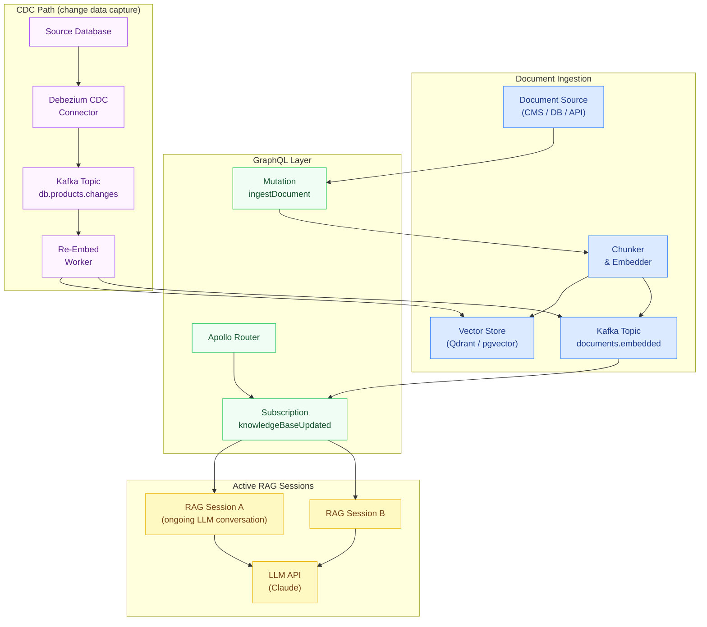

# 04 — Real-Time RAG with GraphQL Subscriptions

> **Purpose:** This document covers RAG architectures where the knowledge base updates
> continuously and those updates must propagate to active LLM conversations in real time.
> It addresses streaming document ingestion (new content is embedded and published to
> subscribers immediately), live context updates (a subscription pushes newly relevant
> documents into an ongoing conversation), event-sourced knowledge base maintenance
> (CDC events trigger re-embedding of changed records), and staleness management
> (tracking embedding age and triggering re-embedding when source documents change).
> By the end, you have a RAG system where retrieved context reflects the state of the
> world as of seconds ago, not hours or days ago.

---

## Why Real-Time Matters for RAG

Standard RAG pipelines retrieve at query time from a knowledge base that is batch-refreshed
— embeddings are computed overnight or on a schedule. This is adequate when the source
content changes slowly (documentation, product catalogs, policy documents). It breaks
down for:

- **Live operational data** — support tickets, incidents, order statuses change minute-to-minute
- **News and media** — an LLM answering questions about current events needs context that is minutes old
- **Financial data** — prices, inventory, market conditions can change faster than a batch job runs
- **Collaborative content** — when multiple editors update a knowledge base concurrently

The architecture in this document treats the knowledge base as an event-sourced system.
Documents are events. Embeddings are derived state from those events. Subscriptions
propagate embedding updates to active RAG sessions.

---

## Architecture Overview



---

## Schema Design

```graphql
# Knowledge base document management
type Mutation {
  """
  Ingest a document into the knowledge base. Chunks, embeds, and upserts
  into the vector store synchronously. Returns immediately after the embedding
  is written; the subscription event is published asynchronously.
  """
  ingestDocument(input: IngestDocumentInput!): IngestDocumentResult!

  """
  Mark a document as deleted. Removes its embeddings from the vector store
  and publishes a deletion event to active RAG sessions.
  """
  deleteDocument(documentId: ID!): DeleteDocumentResult!
}

input IngestDocumentInput {
  """Stable identifier for this document — used to upsert on re-ingestion"""
  documentId: ID!
  """Human-readable title"""
  title: String!
  """Full document content (Markdown supported)"""
  body: String!
  """Structured metadata for post-retrieval filtering"""
  metadata: DocumentMetadataInput
  """ISO-8601 timestamp of the source document — used for staleness calculation"""
  sourceUpdatedAt: DateTime!
}

input DocumentMetadataInput {
  """Domain or topic classification"""
  category: String
  """Source system identifier"""
  sourceSystem: String
  """Additional key-value tags"""
  tags: [String!]
}

type IngestDocumentResult {
  documentId: ID!
  chunksCreated: Int!
  embeddingModel: String!
  embeddingDurationMs: Int!
  """Whether this was a new document or an update to an existing one"""
  isUpdate: Boolean!
}

type DeleteDocumentResult {
  documentId: ID!
  chunksRemoved: Int!
}

# Subscription for real-time knowledge base updates
type Subscription {
  """
  Receive events when the knowledge base changes. RAG sessions subscribe
  with a relevanceFilter to receive only documents relevant to the current
  conversation context.
  """
  knowledgeBaseUpdated(
    """Only deliver events for documents matching this semantic query"""
    relevanceFilter: KnowledgeBaseRelevanceFilter
  ): KnowledgeBaseEvent!
}

input KnowledgeBaseRelevanceFilter {
  """Semantic query — only deliver events for documents similar to this"""
  semanticQuery: String
  """Minimum similarity threshold for delivering the event (0.0–1.0)"""
  minimumSimilarity: Float = 0.75
  """Only events for documents in these categories"""
  categories: [String!]
}

union KnowledgeBaseEvent = DocumentAddedEvent | DocumentUpdatedEvent | DocumentDeletedEvent

type DocumentAddedEvent {
  documentId: ID!
  title: String!
  summary: String!           # LLM-generated summary of the new content
  category: String
  addedAt: DateTime!
  """Similarity score to the subscription's relevanceFilter query"""
  relevanceScore: Float
}

type DocumentUpdatedEvent {
  documentId: ID!
  title: String!
  summary: String!
  previousVersion: DocumentVersion
  changeType: DocumentChangeType!
  updatedAt: DateTime!
  relevanceScore: Float
}

type DocumentDeletedEvent {
  documentId: ID!
  title: String!
  deletedAt: DateTime!
}

type DocumentVersion {
  summary: String!
  capturedAt: DateTime!
}

enum DocumentChangeType {
  CONTENT_UPDATED
  METADATA_UPDATED
  RE_EMBEDDED
}

# Document with staleness tracking
type Document @key(fields: "id") {
  id: ID!
  title: String!
  body: String!
  category: String
  sourceSystem: String

  """When the source document was last changed"""
  sourceUpdatedAt: DateTime!
  """When the embedding was last computed"""
  embeddingUpdatedAt: DateTime!
  """Age of the embedding in hours"""
  embeddingAgeHours: Float!
  """Whether the embedding is considered stale (source is newer than embedding)"""
  isEmbeddingStale: Boolean!
  """The embedding model version used — used to detect model version drift"""
  embeddingModel: String!
}
```

---

## Streaming Document Ingestion

When new content arrives, it must be chunked, embedded, and published to subscribers
before the calling client gets a response. The embedding step is the slow part —
synchronous embedding is acceptable for single documents; use background processing
for bulk ingestion.

```typescript
// resolvers/ingest-document-resolver.ts
import OpenAI from 'openai';
import { Pool } from 'pg';
import { Kafka, Producer } from 'kafkajs';
import Anthropic from '@anthropic-ai/sdk';

const openai = new OpenAI();
const anthropic = new Anthropic();

interface IngestDocumentInput {
  documentId: string;
  title: string;
  body: string;
  metadata?: {
    category?: string;
    sourceSystem?: string;
    tags?: string[];
  };
  sourceUpdatedAt: string;
}

export async function ingestDocumentResolver(
  _parent: unknown,
  args: { input: IngestDocumentInput },
  context: { db: Pool; kafka: Producer }
): Promise<{
  documentId: string;
  chunksCreated: number;
  embeddingModel: string;
  embeddingDurationMs: number;
  isUpdate: boolean;
}> {
  const { input } = args;
  const { db, kafka } = context;
  const start = Date.now();

  // Check if this is an update to an existing document
  const { rows: existing } = await db.query(
    'SELECT id FROM documents WHERE document_id = $1',
    [input.documentId]
  );
  const isUpdate = existing.length > 0;

  // Chunk the document
  const chunks = chunkDocument(input.body, {
    chunkSize: 512,
    overlap: 64,
    minChunkSize: 100,
  });

  // Embed all chunks in a single batched request
  const embeddingResponse = await openai.embeddings.create({
    model: 'text-embedding-3-small',
    input: chunks.map((c) => `${input.title}\n\n${c.text}`),  // Prepend title for context
  });

  // Generate a summary for subscription events
  const summary = await generateDocumentSummary(input.title, input.body);

  // Upsert document record
  await db.query(
    `INSERT INTO documents
       (document_id, title, body, category, source_system, source_updated_at, embedding_updated_at, embedding_model)
     VALUES ($1, $2, $3, $4, $5, $6, now(), $7)
     ON CONFLICT (document_id) DO UPDATE SET
       title = $2,
       body = $3,
       category = $4,
       source_system = $5,
       source_updated_at = $6,
       embedding_updated_at = now(),
       embedding_model = $7`,
    [
      input.documentId,
      input.title,
      input.body,
      input.metadata?.category ?? null,
      input.metadata?.sourceSystem ?? null,
      input.sourceUpdatedAt,
      'text-embedding-3-small',
    ]
  );

  // Upsert chunk embeddings
  for (let i = 0; i < chunks.length; i++) {
    const embedding = embeddingResponse.data[i].embedding;
    await db.query(
      `INSERT INTO document_chunks
         (document_id, chunk_index, chunk_text, embedding, model)
       VALUES ($1, $2, $3, $4::vector, $5)
       ON CONFLICT (document_id, chunk_index) DO UPDATE SET
         chunk_text = $3,
         embedding = $4::vector,
         updated_at = now()`,
      [
        input.documentId,
        i,
        chunks[i].text,
        `[${embedding.join(',')}]`,
        'text-embedding-3-small',
      ]
    );
  }

  // Remove stale chunks (document shrunk on update)
  await db.query(
    'DELETE FROM document_chunks WHERE document_id = $1 AND chunk_index >= $2',
    [input.documentId, chunks.length]
  );

  // Publish event to Kafka for subscription delivery
  const event = {
    type: isUpdate ? 'DOCUMENT_UPDATED' : 'DOCUMENT_ADDED',
    documentId: input.documentId,
    title: input.title,
    summary,
    category: input.metadata?.category,
    embeddingVector: embeddingResponse.data[0].embedding,  // First chunk as representative vector
    timestamp: new Date().toISOString(),
  };

  await kafka.send({
    topic: 'knowledge-base.document-events',
    messages: [{ key: input.documentId, value: JSON.stringify(event) }],
  });

  return {
    documentId: input.documentId,
    chunksCreated: chunks.length,
    embeddingModel: 'text-embedding-3-small',
    embeddingDurationMs: Date.now() - start,
    isUpdate,
  };
}

async function generateDocumentSummary(title: string, body: string): Promise<string> {
  const response = await anthropic.messages.create({
    model: 'claude-haiku-4-5',
    max_tokens: 150,
    messages: [{
      role: 'user',
      content: `Summarize this document in 1-2 sentences:\n\nTitle: ${title}\n\n${body.slice(0, 2000)}`,
    }],
  });
  return response.content[0].type === 'text' ? response.content[0].text : title;
}

interface Chunk {
  text: string;
  startOffset: number;
  endOffset: number;
}

function chunkDocument(
  text: string,
  options: { chunkSize: number; overlap: number; minChunkSize: number }
): Chunk[] {
  const { chunkSize, overlap, minChunkSize } = options;
  const chunks: Chunk[] = [];
  let start = 0;

  while (start < text.length) {
    let end = Math.min(start + chunkSize, text.length);

    // Try to break at a sentence boundary
    if (end < text.length) {
      const periodIndex = text.lastIndexOf('.', end);
      if (periodIndex > start + minChunkSize) {
        end = periodIndex + 1;
      }
    }

    const chunkText = text.slice(start, end).trim();
    if (chunkText.length >= minChunkSize) {
      chunks.push({ text: chunkText, startOffset: start, endOffset: end });
    }

    if (end >= text.length) break;
    start = end - overlap;
  }

  return chunks;
}
```

---

## Subscription Handler: Live Context Updates

The subscription delivers knowledge base events to active RAG sessions. It filters events
by semantic relevance to the session's current conversational context before delivering them.

```typescript
// subscriptions/knowledge-base-subscription.ts
import { PubSub } from 'graphql-subscriptions';
import { QdrantClient } from '@qdrant/js-client-rest';
import OpenAI from 'openai';
import { withFilter } from 'graphql-subscriptions';

const pubsub = new PubSub();
const qdrant = new QdrantClient({ url: process.env.QDRANT_URL });
const openai = new OpenAI();

export const knowledgeBaseSubscriptionResolver = {
  Subscription: {
    knowledgeBaseUpdated: {
      subscribe: withFilter(
        () => pubsub.asyncIterator(['KNOWLEDGE_BASE_EVENT']),
        async (
          payload: { event: KBEvent },
          args: { relevanceFilter?: RelevanceFilter }
        ) => {
          const { event } = payload;
          const { relevanceFilter } = args;

          // No filter — deliver all events
          if (!relevanceFilter?.semanticQuery) return true;

          // Compute similarity between the event's document and the filter query
          const queryEmbeddingResponse = await openai.embeddings.create({
            model: 'text-embedding-3-small',
            input: relevanceFilter.semanticQuery,
          });
          const queryEmbedding = queryEmbeddingResponse.data[0].embedding;

          // Compute cosine similarity with the event's embedding
          const similarity = cosineSimilarity(queryEmbedding, event.embeddingVector);

          const threshold = relevanceFilter.minimumSimilarity ?? 0.75;
          if (similarity < threshold) return false;

          // Attach relevance score to the event for the resolver to return
          event.relevanceScore = similarity;

          // Category filter
          if (relevanceFilter.categories?.length) {
            if (!event.category || !relevanceFilter.categories.includes(event.category)) {
              return false;
            }
          }

          return true;
        }
      ),
      resolve: (payload: { event: KBEvent }) => {
        const { event } = payload;

        if (event.type === 'DOCUMENT_ADDED') {
          return {
            __typename: 'DocumentAddedEvent',
            documentId: event.documentId,
            title: event.title,
            summary: event.summary,
            category: event.category,
            addedAt: event.timestamp,
            relevanceScore: event.relevanceScore,
          };
        }

        if (event.type === 'DOCUMENT_UPDATED') {
          return {
            __typename: 'DocumentUpdatedEvent',
            documentId: event.documentId,
            title: event.title,
            summary: event.summary,
            changeType: event.changeType ?? 'CONTENT_UPDATED',
            updatedAt: event.timestamp,
            relevanceScore: event.relevanceScore,
          };
        }

        return {
          __typename: 'DocumentDeletedEvent',
          documentId: event.documentId,
          title: event.title,
          deletedAt: event.timestamp,
        };
      },
    },
  },
};

// Kafka consumer publishes to PubSub
export async function startKafkaConsumer(kafka: any): Promise<void> {
  const consumer = kafka.consumer({ groupId: 'graphql-knowledge-base-sub' });
  await consumer.connect();
  await consumer.subscribe({ topic: 'knowledge-base.document-events', fromBeginning: false });

  await consumer.run({
    eachMessage: async ({ message }: any) => {
      const event = JSON.parse(message.value.toString());
      await pubsub.publish('KNOWLEDGE_BASE_EVENT', { event });
    },
  });
}

interface KBEvent {
  type: 'DOCUMENT_ADDED' | 'DOCUMENT_UPDATED' | 'DOCUMENT_DELETED';
  documentId: string;
  title: string;
  summary: string;
  category?: string;
  changeType?: string;
  embeddingVector: number[];
  timestamp: string;
  relevanceScore?: number;
}

interface RelevanceFilter {
  semanticQuery?: string;
  minimumSimilarity?: number;
  categories?: string[];
}

function cosineSimilarity(a: number[], b: number[]): number {
  let dot = 0, normA = 0, normB = 0;
  for (let i = 0; i < a.length; i++) {
    dot += a[i] * b[i];
    normA += a[i] * a[i];
    normB += b[i] * b[i];
  }
  return dot / (Math.sqrt(normA) * Math.sqrt(normB));
}
```

---

## Live Context Integration in a RAG Session

The RAG session subscribes to knowledge base updates and injects newly relevant documents
into the ongoing conversation context.

```typescript
// rag/live-rag-session.ts
import { createClient } from 'graphql-ws';
import Anthropic from '@anthropic-ai/sdk';

const anthropic = new Anthropic();

interface LiveContext {
  documentId: string;
  title: string;
  summary: string;
  addedAt: string;
  relevanceScore: number;
}

/**
 * A RAG session that maintains a live subscription to knowledge base updates.
 * New relevant documents are injected into subsequent LLM turns automatically.
 */
export class LiveRAGSession {
  private conversationHistory: Array<{ role: 'user' | 'assistant'; content: string }> = [];
  private liveContextQueue: LiveContext[] = [];
  private subscriptionClient: ReturnType<typeof createClient>;
  private unsubscribe?: () => void;

  constructor(
    private readonly conversationTopic: string,
    private readonly wsEndpoint: string
  ) {
    this.subscriptionClient = createClient({ url: wsEndpoint });
  }

  /**
   * Start watching the knowledge base for relevant updates.
   * Call this when the session begins, before the first user turn.
   */
  startLiveContextWatch(): void {
    const subscription = this.subscriptionClient.iterate({
      query: `
        subscription WatchKnowledgeBase($filter: KnowledgeBaseRelevanceFilter) {
          knowledgeBaseUpdated(relevanceFilter: $filter) {
            ... on DocumentAddedEvent {
              documentId
              title
              summary
              addedAt
              relevanceScore
            }
            ... on DocumentUpdatedEvent {
              documentId
              title
              summary
              updatedAt
              relevanceScore
            }
          }
        }
      `,
      variables: {
        filter: {
          semanticQuery: this.conversationTopic,
          minimumSimilarity: 0.78,
        },
      },
    });

    (async () => {
      for await (const event of subscription) {
        const data = (event as any)?.data?.knowledgeBaseUpdated;
        if (data && data.relevanceScore !== undefined) {
          this.liveContextQueue.push({
            documentId: data.documentId,
            title: data.title,
            summary: data.summary,
            addedAt: data.addedAt ?? data.updatedAt,
            relevanceScore: data.relevanceScore,
          });
          // Limit queue size — keep only the 5 most relevant recent updates
          this.liveContextQueue.sort((a, b) => b.relevanceScore - a.relevanceScore);
          this.liveContextQueue = this.liveContextQueue.slice(0, 5);
        }
      }
    })();
  }

  /**
   * Send a user message. Any live context updates received since the last turn
   * are injected as a system note before the LLM processes the message.
   */
  async sendMessage(userMessage: string): Promise<string> {
    this.conversationHistory.push({ role: 'user', content: userMessage });

    // Build system message including any live context updates
    const systemContent = this.buildSystemMessage();

    // Drain the live context queue for this turn
    this.liveContextQueue = [];

    const response = await anthropic.messages.create({
      model: 'claude-sonnet-4-6',
      max_tokens: 2048,
      system: systemContent,
      messages: this.conversationHistory,
    });

    const assistantMessage = response.content[0].type === 'text'
      ? response.content[0].text
      : '';

    this.conversationHistory.push({ role: 'assistant', content: assistantMessage });
    return assistantMessage;
  }

  private buildSystemMessage(): string {
    const base = `You are a helpful assistant. Answer questions based on the provided context and your general knowledge.`;

    if (this.liveContextQueue.length === 0) return base;

    const updates = this.liveContextQueue
      .map((ctx) =>
        `- "${ctx.title}" (relevance: ${(ctx.relevanceScore * 100).toFixed(0)}%): ${ctx.summary}`
      )
      .join('\n');

    return `${base}

[LIVE KNOWLEDGE BASE UPDATES — just received, incorporate into your response if relevant]
${updates}
[END LIVE UPDATES]`;
  }

  stop(): void {
    this.subscriptionClient.dispose();
  }
}
```

---

## Event-Sourced Knowledge Base via CDC

Change Data Capture (CDC) connects the source-of-truth database to the knowledge base.
When a record changes in PostgreSQL, the CDC connector emits a change event. A worker
consumes the event, re-embeds the changed document, and publishes an update event.

```typescript
// workers/cdc-reembedder.ts
import { Kafka } from 'kafkajs';
import { Pool } from 'pg';
import OpenAI from 'openai';

const openai = new OpenAI();

interface DebeziumEvent {
  op: 'c' | 'u' | 'd' | 'r';  // create, update, delete, read (snapshot)
  before: Record<string, unknown> | null;
  after: Record<string, unknown> | null;
  source: {
    table: string;
    db: string;
    ts_ms: number;
  };
}

/**
 * Consumes Debezium CDC events from Kafka and re-embeds changed documents.
 * Runs as a background worker — separate from the GraphQL server.
 */
export async function startCDCReembedder(
  kafka: Kafka,
  db: Pool,
  producer: any
): Promise<void> {
  const consumer = kafka.consumer({ groupId: 'cdc-reembedder' });
  await consumer.connect();
  await consumer.subscribe({ topic: 'db.products.changes', fromBeginning: false });

  console.log('CDC re-embedder started, consuming from db.products.changes');

  await consumer.run({
    eachMessage: async ({ message }: any) => {
      const event: DebeziumEvent = JSON.parse(message.value.toString());

      // Skip deletes — handle separately
      if (event.op === 'd') {
        await handleDeletedRecord(event, db, producer);
        return;
      }

      // Only re-embed if content fields changed
      if (event.op === 'u' && !hasContentChanged(event)) {
        return;
      }

      const record = event.after;
      if (!record) return;

      await reembedRecord(record, db, producer);
    },
  });
}

function hasContentChanged(event: DebeziumEvent): boolean {
  const before = event.before;
  const after = event.after;
  if (!before || !after) return true;

  // Only re-embed if the text content changed, not metadata-only updates
  const contentFields = ['name', 'description', 'specifications'];
  return contentFields.some((f) => before[f] !== after[f]);
}

async function reembedRecord(
  record: Record<string, unknown>,
  db: Pool,
  producer: any
): Promise<void> {
  const documentText = buildDocumentText(record);
  const chunks = chunkText(documentText, 512, 64);

  // Batch embed
  const embeddingResponse = await openai.embeddings.create({
    model: 'text-embedding-3-small',
    input: chunks,
  });

  // Update embeddings in the vector store
  for (let i = 0; i < chunks.length; i++) {
    await db.query(
      `INSERT INTO document_chunks (document_id, chunk_index, chunk_text, embedding, model)
       VALUES ($1, $2, $3, $4::vector, $5)
       ON CONFLICT (document_id, chunk_index) DO UPDATE SET
         chunk_text = $3,
         embedding = $4::vector,
         updated_at = now(),
         model = $5`,
      [
        record.id,
        i,
        chunks[i],
        `[${embeddingResponse.data[i].embedding.join(',')}]`,
        'text-embedding-3-small',
      ]
    );
  }

  // Update embedding_updated_at on the document record
  await db.query(
    `UPDATE documents SET embedding_updated_at = now(), embedding_model = $1 WHERE document_id = $2`,
    ['text-embedding-3-small', record.id]
  );

  // Publish update event for subscription delivery
  await producer.send({
    topic: 'knowledge-base.document-events',
    messages: [{
      key: String(record.id),
      value: JSON.stringify({
        type: 'DOCUMENT_UPDATED',
        documentId: record.id,
        title: record.name,
        summary: `Updated: ${record.name}`,
        changeType: 'RE_EMBEDDED',
        embeddingVector: embeddingResponse.data[0].embedding,
        timestamp: new Date().toISOString(),
      }),
    }],
  });
}

async function handleDeletedRecord(
  event: DebeziumEvent,
  db: Pool,
  producer: any
): Promise<void> {
  const record = event.before;
  if (!record) return;

  await db.query('DELETE FROM document_chunks WHERE document_id = $1', [record.id]);
  await db.query('DELETE FROM documents WHERE document_id = $1', [record.id]);

  await producer.send({
    topic: 'knowledge-base.document-events',
    messages: [{
      key: String(record.id),
      value: JSON.stringify({
        type: 'DOCUMENT_DELETED',
        documentId: record.id,
        title: record.name,
        embeddingVector: [],
        timestamp: new Date().toISOString(),
      }),
    }],
  });
}

function buildDocumentText(record: Record<string, unknown>): string {
  return [
    `Name: ${record.name}`,
    record.description ? `Description: ${record.description}` : '',
    record.specifications
      ? `Specs: ${JSON.stringify(record.specifications)}`
      : '',
  ]
    .filter(Boolean)
    .join('\n\n');
}

function chunkText(text: string, size: number, overlap: number): string[] {
  const chunks: string[] = [];
  let start = 0;
  while (start < text.length) {
    chunks.push(text.slice(start, start + size));
    start += size - overlap;
    if (start + size >= text.length) {
      if (start < text.length) chunks.push(text.slice(start));
      break;
    }
  }
  return chunks;
}
```

---

## Staleness Management

Track embedding age as a field and expose it through the schema. RAG pipelines can check
staleness before including a document in context, and background jobs can use the field
to prioritize re-embedding queues.

```typescript
// resolvers/document-resolver.ts — staleness fields

export const documentResolvers = {
  Document: {
    embeddingAgeHours: (parent: { embeddingUpdatedAt: string }) => {
      const updated = new Date(parent.embeddingUpdatedAt).getTime();
      const now = Date.now();
      return (now - updated) / (1000 * 60 * 60);
    },

    isEmbeddingStale: (parent: {
      sourceUpdatedAt: string;
      embeddingUpdatedAt: string;
    }) => {
      const sourceTime = new Date(parent.sourceUpdatedAt).getTime();
      const embeddingTime = new Date(parent.embeddingUpdatedAt).getTime();
      // Stale if source was updated more than 5 minutes after the last embedding
      return sourceTime > embeddingTime + 5 * 60 * 1000;
    },
  },
};

// Background job: find and re-embed stale documents
export async function reembedStaleDocuments(db: Pool, producer: any): Promise<void> {
  const { rows: stale } = await db.query(
    `SELECT document_id, title, body
     FROM documents
     WHERE
       source_updated_at > embedding_updated_at + interval '5 minutes'
       OR embedding_updated_at < now() - interval '7 days'
     ORDER BY source_updated_at DESC
     LIMIT 100`
  );

  if (stale.length === 0) return;

  console.log(`Re-embedding ${stale.length} stale documents`);

  for (const doc of stale) {
    await reembedRecord(
      { id: doc.document_id, name: doc.title, description: doc.body },
      db,
      producer
    );
  }
}
```

---

## References

- [Debezium CDC Documentation](https://debezium.io/documentation/)
- [graphql-ws: WebSocket subscriptions](https://the-guild.dev/graphql/ws)
- [Kafka Consumer Groups](https://kafka.apache.org/documentation/#intro_consumers)
- [Apollo Router Subscriptions](https://www.apollographql.com/docs/router/executing-operations/subscription-support/)

## Related Topics

- [Chapter 22.02: Vector Search Resolvers](./02-vector-search-resolvers.md) — Embedding generation and pgvector
- [Chapter 22.03: Knowledge Graph RAG](./03-knowledge-graph-rag.md) — Multi-hop retrieval
- [Chapter 22.05: Production Patterns](./05-production-patterns.md) — Cost and latency optimization for real-time systems
- [Chapter 14: Observability](../14-observability/README.md) — Tracing subscription delivery latency
- [Case Study: Media Streaming](../23-production-case-studies/04-media-streaming-subscriptions.md) — Subscription scaling patterns
