# Chapter 22: RAG and Vector Search

> **Purpose:** This chapter covers Retrieval-Augmented Generation (RAG) architectures where GraphQL serves as the primary retrieval interface. It explains why the graph model is structurally better for RAG than REST or direct vector store access, defines the three integration patterns that cover the majority of production RAG+GraphQL systems, and provides the implementation depth needed to build retrieval pipelines that are typed, observable, context-budget-aware, and access-controlled. Engineers building AI systems that need to retrieve structured domain knowledge should read this chapter before writing their retrieval logic.

---

## Why GraphQL Is the Right Interface for RAG Retrieval

Retrieval-Augmented Generation works by injecting retrieved context into an LLM prompt. The quality of the final answer depends directly on the quality of the retrieved context — whether it is relevant, fresh, concise, and correctly scoped to what the user has permission to see.

GraphQL solves four RAG problems that REST does not:

**Context window precision via field selection.** LLM context windows are a finite, expensive resource. A REST endpoint that returns a user record gives you all 40 fields whether you need them or not. A GraphQL query selects exactly the fields needed for the current prompt, preventing context window waste. A `product { id name descriptionMarkdown }` query returns 3 fields; the equivalent REST endpoint might return 25 fields including internal metadata, audit timestamps, and database IDs irrelevant to the LLM.

**Relationship traversal in a single operation.** RAG often requires multi-hop context: to answer "what products has this customer reviewed positively?", you need `customer → reviews (where sentiment = positive) → products`. A GraphQL query expresses this traversal in a single operation. REST requires 3+ sequential requests. The latency difference at retrieval time matters — RAG pipelines already have LLM latency; minimize retrieval latency.

**Typed, self-validating results.** When an LLM generates a retrieval query (NL2GraphQL), GraphQL's type system validates the query before execution. An invalid query fails at the gateway with a structured error the LLM can use to self-correct. This is not possible with raw SQL or untyped REST APIs.

**Field-level authorization preserves access control.** Retrieved context must respect the same access rules as direct queries. A RAG pipeline that bypasses authorization to retrieve "more context" creates a data exfiltration vector. GraphQL's field-level authorization applies identically whether the query comes from a human client or a RAG pipeline.

---

## The Three Integration Patterns

```mermaid
graph TD
    subgraph "Pattern 1: GraphQL as RAG Retriever"
        LLM1["LLM"]
        GQL1["GraphQL Query\n(LLM-generated)"]
        Results1["Typed Results\n→ inject into prompt"]
        LLM1 -->|"generate query"| GQL1
        GQL1 -->|"execute + select fields"| Results1
        Results1 -->|"context"| LLM1
    end

    subgraph "Pattern 2: Vector Search Resolver"
        Client2["GraphQL Client"]
        VSResolver["semanticSearch\nResolver"]
        VectorDB["pgvector / Qdrant\n/ Pinecone"]
        Client2 -->|"query { semanticSearch }"| VSResolver
        VSResolver -->|"embed + search"| VectorDB
    end

    subgraph "Pattern 3: Knowledge Graph RAG"
        Entities["Supergraph Entities\nUsers, Products, Orders"]
        MultiHop["Multi-hop GraphQL\ntraversal"]
        Context["Structured +\nVector Context"]
        Entities --> MultiHop
        MultiHop --> Context
    end

    style LLM1 fill:#dbeafe,stroke:#3B82F6,color:#1e3a8a
    style VSResolver fill:#f0fdf4,stroke:#22c55e,color:#14532d
    style MultiHop fill:#fef9c3,stroke:#eab308,color:#713f12
```



**Pattern 1 — GraphQL as RAG Retriever:** The LLM generates GraphQL queries to retrieve context for its responses. The GraphQL layer handles field selection (context budget), authorization (access control), and typing (result validation). Chapter 22.01 covers implementation.

**Pattern 2 — Vector Search Resolver:** Vector similarity search lives inside a GraphQL resolver. The `semanticSearch` field embeds the query, searches a vector store, and returns typed results. Clients get a unified GraphQL interface regardless of whether results come from SQL or vector similarity. Chapter 22.02 covers implementation.

**Pattern 3 — Knowledge Graph RAG:** The federated supergraph is a knowledge graph. Multi-hop GraphQL queries traverse entity relationships to build rich context. Entity linking extracts entities from user queries and resolves them through the graph. Chapter 22.03 covers implementation.

---

## Prerequisites

Before working through this chapter:

- **GraphQL execution model** — resolver pipeline, DataLoader. See [Chapter 04: Resolvers and Execution](../04-resolvers-and-execution/README.md).
- **Federation and the supergraph** — entity relationships, cross-subgraph traversal. See [Chapter 07: Apollo Federation v2](../07-federation/README.md).
- **LLM resolver patterns** — calling LLM APIs from resolvers, streaming, cost tracking. See [Chapter 21.02: LLM-Powered Resolvers](../21-ai-native-graphql/02-llm-powered-resolvers.md).
- **Database familiarity** — PostgreSQL with pgvector extension, or working knowledge of a managed vector store (Qdrant, Pinecone, Weaviate).

Tool versions assumed throughout this chapter:

| Tool | Version |
|---|---|
| Node.js | 20 LTS |
| TypeScript | 5.x |
| Apollo Server | 4.x |
| `pgvector` PostgreSQL extension | 0.7+ |
| `openai` npm (for embeddings) | 4.x |
| `@anthropic-ai/sdk` | 0.24+ |
| DataLoader | 2.x |
| Redis (ioredis) | 5.x |

---

## Chapter Contents

| File | Topic |
|---|---|
| [01-graphql-as-rag-retriever.md](./01-graphql-as-rag-retriever.md) | Using GraphQL queries as RAG retrieval steps: retrieval flow, field selection as context budget, caching retrieved results, tracing as spans |
| [02-vector-search-resolvers.md](./02-vector-search-resolvers.md) | Vector search inside GraphQL resolvers: pgvector, Qdrant/Pinecone, embedding generation, semantic search pattern, hybrid BM25+vector, DataLoader batching |
| [03-knowledge-graph-rag.md](./03-knowledge-graph-rag.md) | Knowledge graph RAG using the supergraph: multi-hop retrieval, entity linking, temporal knowledge, combining structured + vector results |
| [04-real-time-rag.md](./04-real-time-rag.md) | Real-time RAG with GraphQL subscriptions: streaming document ingestion, live context updates, event-sourced knowledge base, staleness management |
| [05-production-patterns.md](./05-production-patterns.md) | Production RAG + GraphQL: cost optimization, latency optimization, observability, security for retrieval |

---

## Key Terms at a Glance

| Term | Definition |
|---|---|
| **RAG** | Retrieval-Augmented Generation — enhancing LLM responses with retrieved context |
| **Embedding** | A dense vector representation of text that encodes semantic meaning |
| **Cosine similarity** | A distance metric for comparing embeddings — 1.0 = identical meaning |
| **Vector store** | A database optimized for embedding storage and nearest-neighbor search |
| **pgvector** | PostgreSQL extension adding vector similarity search |
| **Hybrid search** | Combining vector similarity (semantic) with keyword matching (lexical) |
| **RRF** | Reciprocal Rank Fusion — an algorithm for merging ranked lists from multiple search methods |
| **Chunking** | Splitting documents into segments before embedding |
| **Context window** | The finite token budget available for LLM input |
| **Entity linking** | Extracting named entities from text and resolving them to knowledge base records |
| **Multi-hop retrieval** | Traversing multiple entity relationships to build context |

---

## The Context Budget Problem

RAG retrieval quality is a context budget problem. You have N tokens of context window. Each retrieved document consumes some fraction. If retrieved documents are too verbose, you can include fewer of them, reducing coverage. If they are too sparse, the LLM lacks the context to answer.

GraphQL field selection is the control lever:

```graphql
# High-context retrieval — 3 fields per product (~150 tokens each)
query RetrieveForSummarization($ids: [ID!]!) {
  products(ids: $ids) {
    name
    descriptionMarkdown    # full text, ~500 tokens
    specifications { key value }
  }
}

# Low-context retrieval — 2 fields per product (~20 tokens each)
query RetrieveForComparison($ids: [ID!]!) {
  products(ids: $ids) {
    name
    priceDisplay
  }
}
```

The retrieval query is not fixed — it is selected at runtime based on the LLM's information need. This is the primary architectural advantage of GraphQL over REST for RAG: **the retrieval shape is a runtime decision, not a design-time constant**.

---

## Related Chapters

- [Chapter 21: AI-Native GraphQL](../21-ai-native-graphql/README.md) — LLM tool use, LLM resolvers, AI gateway patterns
- [Chapter 04: Resolvers and Execution](../04-resolvers-and-execution/README.md) — DataLoader, resolver performance
- [Chapter 05: Security](../05-security/README.md) — Field-level authorization
- [Chapter 07: Apollo Federation v2](../07-federation/README.md) — The supergraph as a knowledge graph
- [Chapter 14: Observability](../14-observability/README.md) — Tracing retrieval steps as spans
