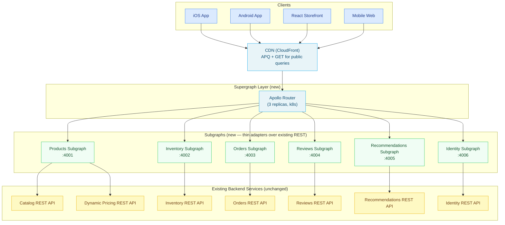

# Case Study 01 — E-Commerce Supergraph Migration

> **Industry:** Retail (mid-size, omnichannel)
> **Scale at migration start:** 20 backend services, ~4M SKUs, 3 mobile apps (iOS, Android, mobile web) + React storefront
> **Migration duration:** 14 months (parallel GraphQL layer: 4 months; subgraph migration: 7 months; client migration: 3 months)
> **Outcome summary:** 50% reduction in API round-trips from mobile, 3-week feature velocity for cross-service features (down from 6 months), measurable mobile bundle size reduction via field selection

---

## Context

A mid-size omnichannel retailer operated 20 backend services built incrementally over eight
years. The services fell into six functional domains: catalog (products, categories,
attributes), inventory (warehouse, store, supplier), orders (cart, checkout, fulfillment),
reviews (ratings, moderation, Q&A), recommendations (personalized and trending), and
identity (accounts, auth, loyalty). Each domain had its own REST API, its own
versioning strategy, its own authentication scheme (two used OAuth 2.0, three used API
keys, one used a legacy session cookie), and its own data model for shared concepts like
`Product`.

Three mobile apps and one React storefront consumed these APIs directly. The apps were
developed by separate teams on independent release schedules. No contract existed between
the backend APIs and the clients. Clients discovered breaking changes in production.

The engineering organization had 120 engineers split across 14 product teams. The platform
team was four engineers.

---

## Problem

The problems were structural, not incidental. They could not be solved by writing better
REST APIs.

**Inconsistent product models.** The catalog service, inventory service, and recommendations
service each had a different representation of `Product`. Catalog called it a "product" with
`productId`. Inventory called it a "SKU" with `skuCode`. Recommendations called it an "item"
with `itemRef`. These were the same entity viewed through three different domain models,
with no canonical representation and no client-side join mechanism.

The iOS app maintained a hand-written `ProductAdapter` class that normalized responses from
all three services into one object. The Android app had an equivalent `ProductMapper`. The
React storefront had a Redux transform. All three were out of sync. A product page in the
iOS app could show a recommendation for a product that inventory had marked unavailable,
because the iOS `ProductAdapter` was not reading inventory status from the correct field.

**N+1 API calls from mobile.** The product detail page made seven serial HTTP requests on
cold load: product details, inventory status, price (separate service with dynamic pricing),
reviews summary, review list (first page), recommendations ("also bought"), and loyalty
points eligibility. On a 4G connection this took 1.8 seconds median, 3.2 seconds p95. On
3G or poor 4G (train, basement) the page was effectively unusable.

Serial was not a coincidence — inventory required the `productId` from catalog, price
required `productId` and the user's loyalty tier from identity, reviews required
`productId`, recommendations required `productId` and purchase history from orders. There
was no way to parallelize in the client because of these data dependencies.

**No schema contracts.** REST API changes were communicated via a Slack channel and a
changelog document that three teams maintained inconsistently. Breaking changes were
discovered when the iOS app, whose deployment cycle was gated on App Store review,
stopped working in production for a field that had been renamed in a backend service.
The average time from backend change to client fix to production was 11 days. Twice in
the 18 months before the migration started, a breaking change reached production and
required an emergency hotfix release.

**Six-month feature lag for cross-service features.** Product features that touched more
than one domain required explicit coordination between domain teams to design a shared
endpoint, agree on a data model, and sequence the development so neither team blocked
the other. The average time from feature specification to production for a cross-service
feature was six months. "Add loyalty points earned to the order confirmation" took five
months because it required orders to call identity's loyalty API, agree on a response
format, and add a field that neither team had originally designed for.

---

## Constraints

**No monorepo migration.** The 20 backend services were in 20 repositories with 14 teams.
The organization had evaluated consolidating to a monorepo twice and declined both times.
Any GraphQL architecture had to work with the existing service ownership model.

**No rewrite.** The catalog service had been running since 2016, had 400,000 lines of
code, and was owned by a team of 3. A rewrite was not feasible within the migration
timeline. GraphQL had to layer on top of existing services without requiring changes to
the services themselves (at least initially).

**App Store release cycle.** iOS deployments required App Store review, averaging 2–3
business days. Any client migration strategy had to account for a version of the iOS app
being in the field for up to 6 months before it could be updated.

**No downtime.** The site generated $3.5M in revenue per day. Zero-downtime migration
was non-negotiable. "We'll do a maintenance window" was not acceptable.

**Two-person platform team during migration.** The platform team grew from four to six
during the migration. At no point were more than two engineers working exclusively on
the GraphQL platform (the others were supporting other platform concerns).

---

## Solution

The architecture is a federated supergraph composed of six subgraphs, fronted by Apollo
Router, with the router positioned between the CDN and the existing services.

### Architecture Diagram



The subgraphs are thin translation layers. They translate GraphQL operations into REST calls
to the existing backends. They do not own a database. They apply the entity model that the
federation schema requires. Crucially, the subgraphs are the place where the inconsistent
domain representations of `Product` are normalized.

### The Canonical Product Entity

The single most important architectural decision was defining a canonical `Product` entity
that all subgraphs agreed on. This entity lives in the Products subgraph and is referenced
via `@key` in every other subgraph that touches product data.

```graphql
# products subgraph
type Product @key(fields: "id") {
  id: ID!
  sku: String!
  name: String!
  slug: String!
  description: String
  images: [ProductImage!]!
  category: Category!
  price: Price!
  attributes: [ProductAttribute!]!
}

type Price {
  base: Money!
  sale: Money
  loyaltyMultiplier: Float
  # computed via @requires — see pricing section below
}

type Money {
  amount: Float!
  currency: String!
  formatted: String!
}
```

```graphql
# inventory subgraph — extends Product with inventory data
type Product @key(fields: "id") {
  id: ID! @external
  availability: AvailabilityStatus!
  quantityAvailable: Int
  warehouseLocations: [WarehouseLocation!]!
  estimatedRestock: Date
}

enum AvailabilityStatus {
  IN_STOCK
  LOW_STOCK
  OUT_OF_STOCK
  DISCONTINUED
  PRE_ORDER
}
```

```graphql
# reviews subgraph — extends Product with review summary
type Product @key(fields: "id") {
  id: ID! @external
  reviewSummary: ReviewSummary
  reviews(first: Int = 10, after: String): ReviewConnection!
}

type ReviewSummary {
  averageRating: Float!
  totalCount: Int!
  ratingDistribution: [RatingBucket!]!
}
```

Before federation, three teams maintained three separate representations of `Product`.
After federation, one canonical entity exists in the schema. The subgraphs map to it.
The iOS `ProductAdapter` class was deleted.

### @requires for Computed Pricing

Dynamic pricing requires both the product's base price (from catalog) and the user's
loyalty tier (from identity). Before GraphQL, the mobile app called catalog, then called
identity to get the loyalty tier, then called the pricing service with both. This was the
root cause of the serial call chain.

The solution used `@requires` to express the data dependency in the schema:

```graphql
# products subgraph
type Product @key(fields: "id") {
  id: ID!
  sku: String! @external
  loyaltyTier: String  # populated by identity subgraph via @requires chain
  price: Price! @requires(fields: "sku loyaltyTier")
}
```

The query planner now handles the dependency resolution. It calls catalog to get `sku`,
calls identity to get `loyaltyTier` (in parallel with other independent fields), then
calls the pricing service with both. The client sends one request. The router orchestrates
the fan-out.

### Subscriptions for Real-Time Inventory

The product detail page had previously shown inventory status fetched at page load — stale
the moment the page rendered. High-demand products (flash sales, holiday items) showed
incorrect availability because the client cached the inventory response.

The solution added a GraphQL subscription for inventory changes:

```graphql
type Subscription {
  inventoryChanged(productId: ID!): InventoryUpdate!
}

type InventoryUpdate {
  productId: ID!
  availability: AvailabilityStatus!
  quantityAvailable: Int
  timestamp: DateTime!
}
```

The inventory subgraph subscribes to the warehouse event stream (Kafka topic
`inventory.quantity-changed`) and publishes updates to Redis Pub/Sub. Apollo Router routes
the WebSocket subscription to the inventory subgraph. The subscription is used only on the
product detail page for items in `LOW_STOCK` or flash-sale state — not for every product
page view, which would create an unacceptable connection load.

---

## Migration Path

The migration ran in three phases, each independently reversible.

### Phase 1: Parallel GraphQL Layer (Months 1–4)

Deploy the router and subgraphs in production. No clients are migrated yet. The subgraphs
are built against the existing REST APIs. The team runs load tests against the GraphQL
endpoint in production with synthetic traffic to validate latency and correctness.

The schema is published to Apollo GraphOS. The CI pipeline adds schema checks to all
subgraph repositories. Breaking changes are blocked before they reach production.

No client traffic hits GraphQL in Phase 1. The old REST endpoints remain unchanged.

**Exit criteria for Phase 1:** Router and all six subgraphs deployed and healthy in
production, synthetic traffic passing, schema checks running in CI for all subgraph
repositories.

### Phase 2: Subgraph-by-Subgraph Client Migration (Months 5–11)

Migrate one subgraph's worth of client traffic per sprint, starting with the lowest-risk
domain (reviews — no authentication, read-only, simple schema).

Migration sequence: reviews → recommendations → inventory → identity → products → orders.

Orders was migrated last because it carried the highest revenue risk and had the most
complex schema.

For each subgraph, the migration procedure was:
1. Update the React storefront to use the GraphQL equivalent of the REST calls for that
   domain. Dark launch (feature flag, 1% of users).
2. Ramp to 10%, 50%, 100% over two weeks, monitoring error rates against the REST baseline.
3. Once GraphQL is at 100% of React storefront traffic for this domain, repeat for mobile
   web, then Android, then iOS (through normal App Store release cycle).
4. After all clients are on GraphQL for this domain, deprecate (but do not remove) the
   corresponding REST endpoints.

The iOS App Store lag meant the iOS app was always one to two release cycles behind the
React storefront. The old REST endpoints were kept live throughout the migration for this
reason.

### Phase 3: REST Decommission (Months 12–14)

Monitor REST endpoint usage via access logs. When a REST endpoint shows zero traffic for
14 consecutive days across all client versions, schedule it for removal. Removal requires
a removal ticket, peer review, and a two-week notice period in case a server-to-server
integration was missed.

Three REST endpoints were kept alive beyond the official migration end date because they
were called by a partner integration that had not been migrated. The partner migration
was out of scope for the original project.

---

## Trade-offs Accepted

**Subgraphs are now a mandatory dependency.** Before GraphQL, if the reviews service was
down, the product detail page still loaded — it just showed no reviews. After GraphQL,
if the reviews subgraph is unhealthy and the router's `nullability` setting is not tuned
correctly, the entire product query can fail. The team addressed this with `@defer` for
non-critical fields and explicit null handling in the schema, but it required discipline
during schema design that did not exist before.

**Thin adapter subgraphs create a translation layer to maintain.** The subgraphs are not
the source of truth for their data. They call existing REST APIs. When the catalog REST
API changes its response format, the products subgraph breaks. The team accepted this
trade-off because rewriting 20 backend services was out of scope. The long-term plan is
to migrate backend services to publish their schema directly, eliminating the adapter
layer. This has not happened for most services as of this case study.

**Query planning overhead.** Complex queries that span four or five subgraphs incur
query planning overhead at the router. On cold-start (no plan cache hit), this adds
12–18ms. With the router's plan cache warm, this drops to under 1ms. The team accepts
the cold-start overhead because it only affects the first request after router restart,
which is a low-probability event at normal traffic.

**iOS release cycle created a long tail.** For seven months after the GraphQL migration
was complete, some percentage of iOS users were still on the old REST path. Maintaining
both paths required careful coordination when the catalog team needed to change a field.

---

## Outcome

Measured 90 days post-migration, against the original problem statement:

| Metric | Before | After |
|---|---|---|
| API round-trips for product detail page (mobile) | 7 (serial) | 1 |
| Product detail page load time, p50 (4G) | 1.8s | 0.9s |
| Product detail page load time, p95 (4G) | 3.2s | 1.4s |
| Time to production for cross-service features | ~6 months | ~3 weeks |
| Breaking changes reaching production clients | 2 in 18 months | 0 in 12 months post-migration |
| iOS app bundle size (product-related network code) | Baseline | -18% (adapter classes removed) |
| Schema check CI coverage | 0% of service repos | 100% of subgraph repos |

The 3-week feature velocity number is the outcome the product organization found most
significant. "Add loyalty points earned to order confirmation" had taken five months under
the old architecture. The equivalent feature post-migration — adding a `loyaltyPointsEarned`
field to the `Order` type in the orders subgraph and wiring a resolver to call the identity
service — took four days.

---

## What We Would Do Differently

**Instrument before migrating any clients.** The team built observability incrementally
during the migration. Several bugs in the entity resolution for computed pricing were found
via customer complaints rather than via dashboards. Field-level tracing should be configured
before the first client is migrated.

**Define error handling semantics on day one.** The decision about which fields are
`nullable` and what happens when a subgraph is degraded was made piecemeal, subgraph by
subgraph. This produced inconsistent client behavior. A single error-handling contract,
agreed upfront, would have saved two weeks of debugging in the orders migration.

**Plan for the partner integration from the start.** The decision to scope out third-party
partner integrations meant the team had to maintain deprecated REST endpoints for 14 months
longer than planned. Any future migration should audit all API consumers before phase 1,
not during phase 3.

---

## References and Related Topics

- [Federation](../07-federation/README.md) — `@key`, `@requires`, entity resolution
- [Supergraph Architecture](../08-supergraph-architecture/README.md) — router configuration, plan cache
- [Performance and Scaling](../06-performance-and-scaling/README.md) — DataLoader patterns, N+1 avoidance
- [Observability](../14-observability/README.md) — field-level tracing, router metrics
- [CI/CD Automation](../11-ci-cd-automation/README.md) — schema checks in pipelines
- [Migration Playbook](./05-platform-migration-playbook.md) — cross-cutting patterns from this and other case studies
