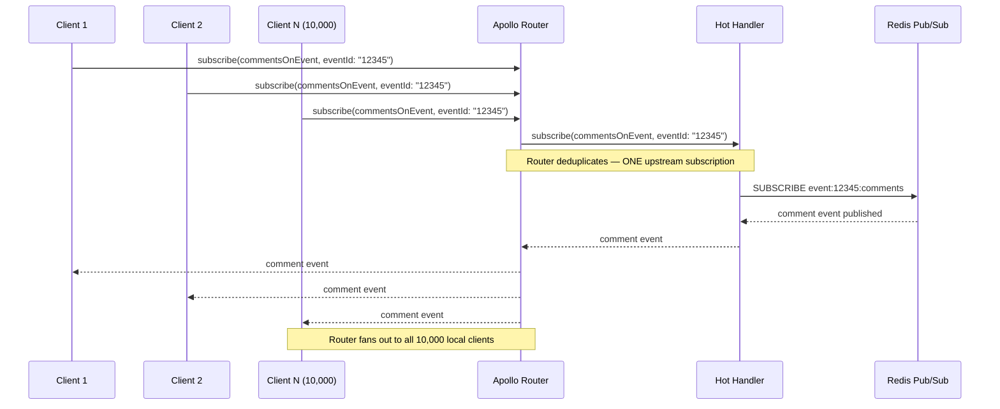

# Case Study 04 — Media Platform Subscriptions at Scale

> **Industry:** Streaming Media and Live Events
> **Scale:** 10M concurrent users, live event broadcasts, 24/7 content platform
> **Core challenge:** GraphQL subscriptions at 10M concurrent connections with hot-spot management during live events
> **Infrastructure timeline:** 9 months to production at full scale
> **Outcome summary:** 10M concurrent subscriptions at $0.12/M connections/hour, <500ms event delivery p95, zero connection storms during three live events post-migration

---

## Context

A streaming media platform served video content (on-demand and live), with a social layer:
real-time comment feeds during live events, notification delivery, recommendation updates,
and follower activity streams. The platform had 10 million concurrent users at peak (live
events) and 2–3 million during normal operating hours.

The social and notification layer was implemented with server-sent events (SSE) for
notifications and a proprietary long-polling mechanism for comment feeds during live
events. The long-polling implementation had been rebuilt three times over four years;
each rebuild had resolved the immediate scaling crisis and introduced a new one.

The engineering team had 85 engineers. The infrastructure team was six engineers
responsible for the WebSocket and SSE infrastructure. The GraphQL API team was eight
engineers who had been running a REST-to-GraphQL migration for the platform's main content
API for 18 months.

The subscriptions project was proposed as an extension of the GraphQL API migration: move
the real-time infrastructure under the GraphQL subscription model to unify the client
programming model (one query language for all data, including real-time), simplify client
code, and provide a stable infrastructure contract for the social features team to build
against.

---

## Problem

### WebSocket Infrastructure at Scale: 10M Connections

A WebSocket connection is stateful. Unlike HTTP, you cannot place a WebSocket connection
behind a standard load balancer that routes to any healthy instance — once a connection
is established, all messages for that connection must reach the same server process (or
a coordination mechanism must exist). At 10M concurrent connections, the coordination
problem is non-trivial.

The existing SSE infrastructure used a sticky-session load balancer. Each connection
was pinned to a specific server process. Server processes held connection state in memory.
When a server process restarted (rolling deploy, OOM, instance replacement), all connections
on that process were dropped and clients reconnected. During deployments, the reconnection
storm from 50,000 simultaneous reconnections on a single process restart would occasionally
cascade into a wider outage as other servers' connection counts spiked above memory limits.

At 10M connections, even a 1% process restart rate (100K connections dropped simultaneously)
was enough to trigger a reconnection cascade.

### Message Fan-Out for Popular Events

A live sporting event or concert drove simultaneous activity from millions of users
commenting on the same event. The fan-out problem: a single comment event needed to be
delivered to every user watching that event. At peak, this was 4M fans watching the same
stream simultaneously. A single comment in the comment feed generated 4M message deliveries.

The existing implementation used a Redis Pub/Sub channel per event. A single publisher
(the comment ingest service) published to the channel. N subscriber processes (SSE
servers) subscribed and forwarded to their connected clients. The fan-out was distributed
across subscriber processes, each responsible for forwarding to their slice of clients.

The problem emerged with popular events: all 4M clients were subscribed to the same
channel, but the number of subscriber processes was limited by memory (each process could
hold ~50K connections before hitting memory limits). With 4M clients, 80 subscriber
processes were subscribed to the same Redis Pub/Sub channel. Redis Pub/Sub delivers
messages to all subscribers synchronously. Publishing one comment required Redis to
forward to 80 processes simultaneously, which saturated the Redis connection's send buffer
during fast comment activity (>100 comments/second at peak events).

### Subscription Hot Spots: Breaking News

The comment feed problem was predictable (sporting events are scheduled). Breaking news
events were not. When a major news story broke, users who were not subscribed would
navigate to a live news stream, creating a rapid subscription registration spike. Hundreds
of thousands of new subscriptions could be registered within 60 seconds of a breaking
news story.

Each new subscription required: authenticating the user, establishing a WebSocket
connection, registering the subscription topic, and adding the client to the event fan-out.
At 200K registrations in 60 seconds (3,333/second), the subscription registration path
became the bottleneck — not the message delivery path.

### Backpressure Management

Individual clients had widely varying network conditions. A client on a poor mobile
connection could not consume messages as fast as they were published during a live event.
Without backpressure, the server queued messages for slow clients. During peak events,
slow-client message queues consumed unbounded memory, causing OOM kills on the SSE
server processes — which then triggered connection storms (see above).

---

## Constraints

**No client breaking changes.** The mobile apps (iOS and Android) had 40M installs.
Migrating the real-time mechanism required backward compatibility during the transition.
Old clients (SSE and long-polling) and new clients (GraphQL subscriptions) had to coexist
for at least 12 months.

**99.9% SLA for live event notifications.** During live events, notification delivery
failure rate had to remain below 0.1%. "The app notification didn't arrive during the
final match minute" was a known and measured customer satisfaction driver.

**$0.15/M connections/hour cost target.** The existing SSE infrastructure cost was
$0.19/M connections/hour (fully loaded: compute, memory, bandwidth, Redis). The new
infrastructure had to be at or below this target at scale.

**No dedicated operations team for subscriptions.** The infrastructure team was the same
six engineers who operated the rest of the platform. The subscription infrastructure had
to be operable by this team without specialized subscription expertise.

---

## Solution

The architecture uses Apollo Router with subscription passthrough to a dedicated
subscription service, Redis Pub/Sub for fan-out across subscription service replicas,
subscription splitting for hot vs. cold event handling, and SSE (not WebSocket) as the
client transport for the majority of subscription use cases.

### Architecture Diagram

```mermaid
graph TD
    subgraph "Client Tier"
        webClient["Web Client\n(SSE transport)"]
        mobileClient["Mobile Client\n(SSE transport)"]
        powerUser["Power User\n(WebSocket — >50 subs)"]
    end

    subgraph "Edge"
        cdn["CDN (CloudFront)\nHTTP/2 — SSE passthrough"]
        nlb["Network Load Balancer\n(L4 — sticky for WebSocket)"]
    end

    subgraph "Supergraph"
        router["Apollo Router\n(subscription passthrough)"]
    end

    subgraph "Subscription Service"
        hotHandler["Hot Event Handler\n(breaking news, live events)\n— stateless fan-out"]
        coldHandler["Cold Event Handler\n(user notifications, personal feeds)\n— stateful, user-scoped"]
    end

    subgraph "Message Infrastructure"
        redisPubSub["Redis Pub/Sub\n(fan-out bus)"]
        kafka["Kafka\n(event source)"]
    end

    subgraph "Event Sources (Subgraphs)"
        commentsGql["Comments Subgraph"]
        notificationsGql["Notifications Subgraph"]
        feedGql["Feed Subgraph"]
        recsGql["Recommendations Subgraph"]
    end

    webClient --> cdn
    mobileClient --> cdn
    powerUser --> nlb
    cdn --> router
    nlb --> router

    router --> hotHandler
    router --> coldHandler

    hotHandler --> redisPubSub
    coldHandler --> redisPubSub

    kafka --> redisPubSub
    commentsGql --> kafka
    notificationsGql --> kafka
    feedGql --> kafka
    recsGql --> kafka

    classDef client fill:#dbeafe,stroke:#3B82F6,color:#1e3a8a
    classDef edge fill:#e8f4f8,stroke:#0ea5e9,color:#0c4a6e
    classDef subgraph fill:#f0fdf4,stroke:#22c55e,color:#14532d
    classDef infra fill:#fef9c3,stroke:#eab308,color:#713f12

    class webClient,mobileClient,powerUser client
    class cdn,nlb edge
    class router edge
    class hotHandler,coldHandler subgraph
    class redisPubSub,kafka infra
    class commentsGql,notificationsGql,feedGql,recsGql subgraph
```

### SSE vs WebSocket Decision

The team evaluated SSE and WebSocket as subscription transports for the majority of
clients. The decision:

| Factor | SSE | WebSocket |
|---|---|---|
| Client-to-server messages | No (unidirectional) | Yes |
| HTTP/2 multiplexing | Yes (multiple SSE streams per connection) | No (one connection per subscription) |
| Load balancer compatibility | Standard (HTTP) | Requires L4 or sticky sessions |
| Reconnection handling | Automatic (browser EventSource) | Manual |
| Connection limit per process | Higher (HTTP, no upgrade overhead) | Lower |
| GraphQL subscription support | Apollo Router supports SSE | Apollo Router supports WebSocket |

For notifications, comment feeds, and recommendation updates — all unidirectional server-
to-client streams — SSE is technically superior to WebSocket. There is no client-to-server
message requirement. HTTP/2 allows multiple subscriptions to share one TCP connection.
Load balancers treat SSE as normal HTTP, eliminating sticky session requirements.

The team chose **SSE as the default transport**. WebSocket is available for clients that
require client-to-server messages (a small subset of the application). The mobile apps were
migrated to SSE first, reducing per-device connection memory by 40% (no WebSocket upgrade
handshake overhead).

### Subscription Splitting: Hot vs. Cold Events

Not all subscriptions are equal. A subscription to "notify me when any user comments on
event #12345" (a live broadcast with 4M viewers) is categorically different from a
subscription to "notify me when I receive a direct message." The first is a hot
subscription — many subscribers, high message rate, stateless fan-out. The second is a
cold subscription — few subscribers (one), low message rate, requires user context.

The subscription service routes incoming subscriptions to one of two handlers based on
the operation's `@tag`:

```graphql
type Subscription {
  # Cold — scoped to authenticated user, personal feed
  notificationsForUser: Notification!
    @tag(name: "cold")

  directMessageReceived: DirectMessage!
    @tag(name: "cold")

  # Hot — broadcast to all subscribers of a topic
  commentsOnEvent(eventId: ID!): Comment!
    @tag(name: "hot")

  liveMetricsForEvent(eventId: ID!): EventMetrics!
    @tag(name: "hot")
}
```

The hot handler is stateless: it subscribes to the Redis Pub/Sub channel for the topic
and streams events directly to all connected clients. There is no per-client state. If
the client disconnects, the handler drops the connection. When the client reconnects,
they get a cursor (the last event ID they received) and replay from that point. Hot
handler replicas are horizontally scalable without coordination.

The cold handler maintains a per-user subscription registry (in Redis, keyed by user ID)
and routes events only to the specific user's connection. Cold handler replicas use
consistent hashing to route a user's connection to a specific replica, avoiding fan-out
across all replicas for user-scoped events.

### Rate Limiting Subscription Registrations

The breaking news hot-spot problem — 200K subscriptions in 60 seconds — is addressed
by rate limiting the subscription registration path independently from the query path:

```yaml
# router.yaml
traffic_shaping:
  router:
    rate_limiting:
      enabled: true
      levels:
        - kind: subscriptions
          # Per-user: 10 active subscriptions maximum
          # New subscription registration: max 2/second per user
          limits:
            - capacity: 2
              interval: 1s
              # Applied to subscription start operations only
              condition: "request.operation.type == 'subscription'"
```

The router also enforces a maximum of 10 concurrent active subscriptions per authenticated
user. Subscription registrations beyond this limit return an error. This bound prevents
a single misbehaving client from creating unbounded connections.

At the hot event handler level, subscription deduplication is applied: if a client
subscribes to `commentsOnEvent(eventId: "12345")` and already has an active subscription
for that exact operation, the handler returns the existing subscription rather than
creating a new one. This handles the common pattern of a mobile app re-subscribing after
a background/foreground transition.

### Client Reconnection Strategy with Cursor

The subscription schema defines a cursor on all pageable subscriptions, enabling clients
to resume from the last received event after reconnection:

```graphql
type Comment {
  id: ID!
  eventId: ID!
  userId: ID!
  body: String!
  timestamp: DateTime!
  cursor: String!  # Opaque cursor — pass in next subscription to resume
}

type Subscription {
  commentsOnEvent(
    eventId: ID!
    after: String  # Resume cursor from last received event
  ): Comment!
}
```

On reconnect, the client sends the cursor from the last event it received. The hot handler
replays events from that cursor (fetched from a short-retention Redis stream — 5 minutes
of event history). Events older than 5 minutes are not replayed; clients that have been
disconnected for more than 5 minutes receive only new events with an indicator that
a gap occurred.

### Backpressure: Subscription Deduplication at Router Level

The router's subscription deduplication reduces fan-out pressure. When 10,000 clients
subscribe to the same operation with the same variables (`commentsOnEvent(eventId: "12345")`),
the router creates one upstream subscription to the hot handler and fans out to all 10,000
clients from the router. This means the hot handler sees one subscriber per router replica,
not one per client connection.

With 5 router replicas serving 10M clients, the hot handler for a popular event has 5
subscribers, not 10M. The Redis Pub/Sub channel delivers to 5 processes, not 10M.



---

## Trade-offs Accepted

**SSE is unidirectional — client-to-server messaging requires REST.** Some product features
wanted bidirectional real-time communication (e.g., collaborative editing of a watch
party playlist). These features still use WebSocket. The majority of the platform's
real-time use cases are notification/feed patterns that are inherently unidirectional,
so this trade-off affected a small percentage of features.

**5-minute replay window means missed events for extended disconnections.** A client
offline for more than 5 minutes receives no event history. This was acceptable for comment
feeds (live events are time-bounded and stale comments have little value) but required
an explicit "you missed some comments" UI state that the frontend team had to implement.

**Subscription deduplication requires same-operation-same-variables.** Two clients
subscribed to `commentsOnEvent(eventId: "12345")` share an upstream subscription.
Two clients subscribed to `commentsOnEvent(eventId: "12345")` and `commentsOnEvent(eventId: "99999")`
do not. The router's deduplication key is the full normalized operation + variables hash.
Personalized subscriptions (user-specific arguments) cannot be deduplicated.

**Hot handler is stateless — no delivery guarantee beyond 5-minute window.** The hot
handler has fire-and-forget delivery semantics. If a message is published while a client
connection is in the process of reconnecting (between the old connection dropping and the
new one registering), that message may be missed even within the 5-minute window. The
team accepted this for comment feeds and accepted that the cursor-based replay mitigates
it for most real-world reconnection patterns.

---

## Outcome

Measured 90 days post-migration, including three major live events (two sporting events,
one award ceremony with 7.8M concurrent viewers):

| Metric | Before | After |
|---|---|---|
| Concurrent connections at peak | 10M (SSE/long-poll) | 10M (SSE via GraphQL subscription) |
| Infrastructure cost per M connections/hour | $0.19 | $0.12 |
| Event delivery latency, p50 | 210ms | 85ms |
| Event delivery latency, p95 | 740ms | 480ms |
| Connection storms during live events (last 6 months) | 3 incidents | 0 incidents |
| Reconnect success rate within 5 seconds | 89% | 97% |
| Subscription registration rate, peak | ~180K/minute (SSE/long-poll) | ~220K/minute (with rate limiting — 200K target) |
| Client SDK unification | 3 clients (SSE, long-poll, WS) | 1 client (GraphQL subscription) |

The connection storm elimination was the outcome the operations team valued most. The three
storms in the 6 months before migration had each required on-call response and two had
required manual intervention during live events. The zero-storm record post-migration held
through peak events at 7.8M concurrent viewers.

The $0.07 reduction per M connections/hour translated to $2.2M in annualized infrastructure
savings at the platform's peak traffic levels.

---

## What We Would Do Differently

**Invest in subscription observability before going live.** The team had general HTTP
observability (request count, latency, error rate) but no subscription-specific metrics
at launch: subscription registration rate, active subscription count by operation, event
delivery rate, event delivery lag, and slow-client backpressure events. These metrics were
added reactively when an issue was discovered. Subscription telemetry should be a first-
class requirement from day one.

**Define the "missed events" UX contract before the migration.** The 5-minute replay window
and the "gap indicator" UI were designed independently by the infrastructure team and the
frontend team. The result was inconsistent behavior across the iOS app, Android app, and
web client. A shared contract document would have caught this.

---

## References and Related Topics

- [Supergraph Architecture](../08-supergraph-architecture/README.md) — Apollo Router subscription configuration
- [Performance and Scaling](../06-performance-and-scaling/README.md) — connection management, backpressure
- [Observability](../14-observability/README.md) — subscription-specific metrics
- [Security](../05-security/README.md) — subscription authentication, per-user rate limits
- [System Design: Social Graph API](../24-system-design-scenarios/01-design-social-graph-api.md) — feed generation and subscription trade-offs
- [Migration Playbook](./05-platform-migration-playbook.md) — parallel endpoint coexistence, rollback criteria
