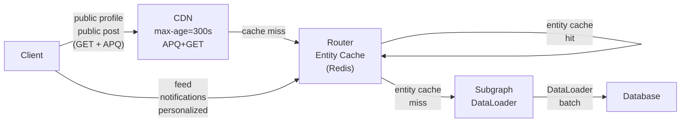

# Scenario 01 — Design a Social Graph API

> **Problem statement:** Design a GraphQL API for a social platform at Twitter/X scale.
> The system must support 500M registered users, a follow graph, feed generation,
> real-time notifications, and user search.

---

## Requirements Elicitation

Before designing anything, clarify scope. For a system design, the requirements drive
every architectural decision. Ambiguous requirements produce architectures that cannot be
evaluated.

**Functional requirements:**
- Users can follow and unfollow other users
- Each user has a feed of posts from users they follow
- Users can create posts (text, media references)
- Users receive real-time notifications (new follower, mention, reply)
- Users can search for other users and posts
- User profiles are publicly viewable without authentication
- The feed is ordered by recency, with optional algorithmic ranking

**Non-functional requirements:**
- 500M registered users
- 100M daily active users (DAU)
- Peak write load: 50K posts/second (estimated: 100M DAU × 5 posts/day / 86,400s ≈ 5.8K/s; peak 8× average = ~46K/s)
- Read-to-write ratio: approximately 100:1 (feeds are read far more than posts are written)
- Feed load latency SLO: 200ms p99
- Notification delivery SLO: 2 seconds p95
- Search latency SLO: 150ms p99
- Availability: 99.9%

**Out of scope for this design:**
- Direct messaging (separate system)
- Media upload and storage (CDN/blob store — not part of the GraphQL API design)
- Advertising (separate concern)

---

## Back-of-the-Envelope

**Follow graph size:**
- 500M users × average 500 follows each = 250B follow relationships stored
- At 16 bytes per row (follower_id: 8 bytes + following_id: 8 bytes): 4TB of raw graph data
- With indices and replication: ~20TB for the follow graph

**Fan-out math (feed generation):**
- 100M DAU × 5 posts/day = 500M posts/day
- Each post must reach all followers: 500M posts × 500 average followers = 250B feed insertions/day
- 250B / 86,400 seconds = 2.9M feed insertions/second at average
- Peak (8× average): ~23M feed insertions/second
- This is the core argument for **push-on-write (fan-out-on-write)** being impractical
  for high-follower accounts. An account with 10M followers posting once requires
  10M feed insertions. At 50K posts/second with 1% of posts from high-follower accounts,
  the fan-out write amplification is catastrophic.

**Feed storage:**
- Each user's feed: keep the last 800 posts in-feed cache (Redis sorted set)
- 100M DAU × 800 entries × 8 bytes (post ID + timestamp) = 640GB of feed cache
- This is the working set — fits in a large Redis cluster

**Notification volume:**
- At 500 avg followers per user: each post generates ~500 notification candidates
- With 5.8K posts/second: 2.9M notification candidates/second
- Not all notifications are delivered — notification preferences, muting, mute lists filter
  most of these. Assume 10% delivery rate: 290K delivered notifications/second

---

## Schema Design

```graphql
# Social Graph SDL (partial — illustrative)

type User @key(fields: "id") {
  id: ID!
  username: String!
  displayName: String!
  bio: String
  avatarUrl: String
  isVerified: Boolean!
  followersCount: Int!
  followingCount: Int!
  isFollowedByViewer: Boolean!        # Requires viewer context — not cacheable via CDN
  isFollowingViewer: Boolean!         # Same
  posts(first: Int = 20, after: String): PostConnection!
  followers(first: Int = 20, after: String): UserConnection!
  following(first: Int = 20, after: String): UserConnection!
  createdAt: DateTime!
}

type Post @key(fields: "id") {
  id: ID!
  author: User!
  body: String!
  mediaUrls: [String!]!
  likeCount: Int!
  replyCount: Int!
  repostCount: Int!
  isLikedByViewer: Boolean!           # Personalized — not CDN cacheable
  parentPost: Post                    # For reply threads
  mentions: [User!]!
  hashtags: [String!]!
  createdAt: DateTime!
  cursor: String!                     # For feed pagination
}

type PostConnection {
  edges: [PostEdge!]!
  pageInfo: PageInfo!
  totalCount: Int                     # Optional — expensive to compute at scale
}

type PostEdge {
  node: Post!
  cursor: String!
}

type UserConnection {
  edges: [UserEdge!]!
  pageInfo: PageInfo!
}

type UserEdge {
  node: User!
  cursor: String!
}

type PageInfo {
  hasNextPage: Boolean!
  hasPreviousPage: Boolean!
  startCursor: String
  endCursor: String
}

type Feed {
  posts(first: Int = 20, after: String): PostConnection!
  algorithmVersion: String!           # For A/B testing feed ranking
}

type Notification {
  id: ID!
  type: NotificationType!
  actor: User!                        # User who triggered the notification
  subject: Post                       # Optional — the post that was liked, etc.
  isRead: Boolean!
  createdAt: DateTime!
  cursor: String!
}

enum NotificationType {
  NEW_FOLLOWER
  POST_LIKED
  POST_REPOSTED
  POST_REPLIED
  MENTION
  QUOTE_POST
}

type Query {
  # Viewer context
  me: User
  feed(first: Int = 20, after: String): Feed!
  notifications(first: Int = 20, after: String, unreadOnly: Boolean): NotificationConnection!

  # Public profiles — CDN cacheable via APQ+GET
  user(username: String!): User
  post(id: ID!): Post

  # Search — not CDN cacheable (dynamic)
  searchUsers(query: String!, first: Int = 20, after: String): UserConnection!
  searchPosts(query: String!, first: Int = 20, after: String): PostConnection!
}

type Mutation {
  follow(userId: ID!): FollowResult!
  unfollow(userId: ID!): UnfollowResult!
  createPost(input: CreatePostInput!): Post!
  likePost(postId: ID!): Post!
  repost(postId: ID!, body: String): Post!
}

type Subscription {
  # Personalized — viewer-scoped
  notificationsForViewer: Notification!

  # Public — deduplicatable at router for hot accounts
  postUpdated(postId: ID!): Post!     # Live engagement counts (likes, reposts)
}

input CreatePostInput {
  body: String!
  mediaUrls: [String!]
  replyToPostId: ID
  quotedPostId: ID
}
```

---

## Federation Architecture

The system splits into four subgraphs aligned by data access pattern, not purely by
domain:

```mermaid
graph TD
    subgraph "Clients"
        web["Web SPA"]
        ios["iOS App"]
        android["Android App"]
    end

    cdn["CDN (public profile + post pages)"]
    router["Apollo Router"]

    subgraph "Subgraphs"
        socialGraph["SocialGraph Subgraph\n• User entity\n• Follow relationships\n• Follow counts\n• is-following check\n• PostgreSQL (graph DB)"]
        feed["Feed Subgraph\n• Feed generation\n• Fan-out coordination\n• Redis sorted sets\n• Kafka consumer"]
        posts["Posts Subgraph\n• Post entity\n• Post CRUD\n• Engagement counts\n• Cassandra / CockroachDB"]
        notifications["Notifications Subgraph\n• Notification delivery\n• Notification read state\n• WebSocket/SSE\n• Kafka consumer"]
        search["Search Subgraph\n• User search\n• Post search\n• Elasticsearch"]
    end

    subgraph "Data Infrastructure"
        socialDb[("Follow Graph DB\nPostgreSQL")]
        feedCache[("Feed Cache\nRedis Cluster")]
        postStore[("Post Store\nCassandra")]
        notifStore[("Notification Store\nPostgreSQL")]
        kafka[("Event Bus\nKafka")]
        searchIndex[("Search Index\nElasticsearch")]
    end

    web --> cdn
    ios --> cdn
    android --> cdn
    cdn --> router
    router --> socialGraph
    router --> feed
    router --> posts
    router --> notifications
    router --> search

    socialGraph --> socialDb
    feed --> feedCache
    feed --> kafka
    posts --> postStore
    posts --> kafka
    notifications --> notifStore
    notifications --> kafka
    search --> searchIndex

    classDef client fill:#dbeafe,stroke:#3B82F6,color:#1e3a8a
    classDef subgraph fill:#f0fdf4,stroke:#22c55e,color:#14532d
    classDef data fill:#fef9c3,stroke:#eab308,color:#713f12
    classDef router fill:#e8f4f8,stroke:#0ea5e9,color:#0c4a6e

    class web,ios,android client
    class socialGraph,feed,posts,notifications,search subgraph
    class socialDb,feedCache,postStore,notifStore,kafka,searchIndex data
    class cdn,router router
```

---

## Feed Generation: Push vs. Pull vs. Hybrid

Feed generation is the central architectural decision in a social graph API. Three
strategies exist:

### Push on Write (Fan-out on Write)

When a user posts, their post is immediately pushed (fan-out) to every follower's feed
cache. When a follower opens the app, their feed is read directly from cache — no
computation required.

- **Read:** O(1) — read from Redis sorted set
- **Write:** O(followers) — 1 post by an account with 10M followers = 10M cache writes
- **Good for:** Accounts with small to medium follower counts
- **Breaks at:** High-follower accounts (celebrities, public figures with millions of followers)

### Pull on Read (Fan-in on Read)

When a user opens the feed, the system fetches the user's following list, queries each
followed user's recent posts in parallel, merges and sorts the results.

- **Read:** O(following_count × recent_posts_per_user) — expensive, slow at scale
- **Write:** O(1) — just write the post to the post store
- **Good for:** Read-light workloads, small following counts
- **Breaks at:** Users following thousands of accounts (slow reads)

### Hybrid Approach (Industry Standard)

The industry solution — used by Twitter, Instagram, and most large social platforms — is
a hybrid:

- **For regular users** (< 10K followers): push on write. Their post is fanned out to
  followers' feed caches immediately.
- **For high-follower users** (> 10K followers): pull on read. When a user's feed is
  requested, the system checks if any high-follower accounts they follow have posted
  recently, and injects those posts into the feed at read time.

```typescript
// Feed resolver — simplified hybrid logic
async function feedResolver(_, { first, after }, context) {
  const userId = context.userId;

  // 1. Load the pre-built feed from cache (push-on-write for normal accounts)
  const cachedFeed = await redis.zrange(`feed:${userId}`, after, '+inf', 'LIMIT', first);

  // 2. Load the "high follower" accounts this user follows
  const highFollowerAccounts = await socialGraph.getHighFollowerFollowing(userId);

  // 3. Fetch recent posts from high-follower accounts (pull-on-read injection)
  const recentHFPosts = await posts.getRecentPostsByAuthors(
    highFollowerAccounts.map(a => a.id),
    { since: after, limit: first }
  );

  // 4. Merge and sort by timestamp
  const merged = mergeSorted([cachedFeed, recentHFPosts], 'createdAt');
  return merged.slice(0, first);
}
```

The threshold (10K followers) is tunable. The Feed subgraph maintains a list of "heavy
hitter" accounts and updates it asynchronously.

---

## Real-Time: Subscriptions for Notifications, Polling for Feed

Two real-time requirements exist: notification delivery and feed updates.

**Notifications** are low-volume, high-importance events targeted at a specific user.
GraphQL subscriptions are the right tool: persistent connection, server-push, viewer-
scoped. The Notifications subgraph consumes from Kafka and pushes to connected clients
via SSE (Apollo Router subscription passthrough).

**Feed updates** are a different problem. A user's feed changes continuously as followed
accounts post. Subscribing every client to their full following list's posts is impractical:
the subscription fan-out math (see above) makes it infeasible at scale. The correct
approach is **periodic polling with an optimization**:

- Client polls `feed(first: 20, after: lastCursor)` every 30 seconds
- The response includes a count of new posts since the last poll (cheaply computed from Redis)
- If the new post count is 0, the client suppresses the UI refresh indicator
- If the count is > 0, the client shows "N new posts" and fetches on user interaction

This polling pattern is cheaper than subscriptions for feed updates, more tolerant of
connection failures, and produces better UX (prevents the "content jumping" issue when
new posts are injected at the top of a feed the user is reading).

---

## Caching Strategy



| Query Type | Cache Layer | TTL | Cache Key |
|---|---|---|---|
| Public user profile | CDN | 5 minutes | APQ hash + username |
| Public post | CDN | 2 minutes | APQ hash + post ID |
| User follower/following count | Router entity cache (Redis) | 30 seconds | user:{id}:counts |
| Feed (personalized) | No CDN cache | N/A | Not cacheable by CDN |
| Engagement counts (like/repost) | Router entity cache | 10 seconds | post:{id}:counts |
| Search results | No cache | N/A | Dynamic |

---

## N+1 Patterns to Avoid

**Feed with author data:** Loading 20 posts and then resolving `post.author` for each
will make 20 separate user lookups. Use DataLoader keyed by `userId` in the SocialGraph
subgraph.

**Follower counts for a user list:** A UserConnection returning 20 users, each with
`followersCount`, will make 20 separate count queries. Batch via DataLoader keyed by
`userId`, backed by a Redis counter (not a COUNT(*) on every request).

**`isFollowedByViewer` for a user list:** A list of suggested users each with
`isFollowedByViewer` will make N separate follow-check queries. Batch: query the follows
table with `WHERE follower_id = $viewer AND following_id = ANY($userIds)` in one round-trip.

**Mutual friends calculation:** If exposed (`mutualFollowers(first: 3): UserConnection`),
this is a graph intersection: followers(A) ∩ following(B). This is expensive. Never
compute it without a cache. Pre-compute in background jobs for frequently-accessed pairs.

---

## Trade-off Analysis

| Decision | Trade-off Accepted |
|---|---|
| Hybrid feed generation | Stale feeds for high-follower accounts (injection at read time, not pre-computed) vs. write amplification at fan-out-on-write |
| SSE for notifications (not WebSocket) | No client-to-server messaging vs. simpler infrastructure, better load balancer compatibility |
| Polling for feed updates | Higher client poll overhead vs. connection cost of per-user feed subscriptions |
| CDN for public profiles | Stale follower counts (up to 5 minutes) vs. reduced database load by orders of magnitude |
| Redis sorted sets for feed cache | Memory cost (~640GB for 100M DAU) vs. O(1) feed reads |
| Cassandra for post store | Eventual consistency on post updates vs. horizontal write scalability |

---

## References and Related Topics

- [Media Platform Subscriptions](../23-production-case-studies/04-media-streaming-subscriptions.md) — subscription scaling patterns
- [Performance and Scaling](../06-performance-and-scaling/README.md) — DataLoader, caching
- [Supergraph Architecture](../08-supergraph-architecture/README.md) — router subscription passthrough
- [Caching Strategies](../17-caching-strategies/README.md) — entity cache, CDN APQ
- [Design: Real-Time Dashboard](./03-design-realtime-dashboard.md) — subscription vs polling decision
