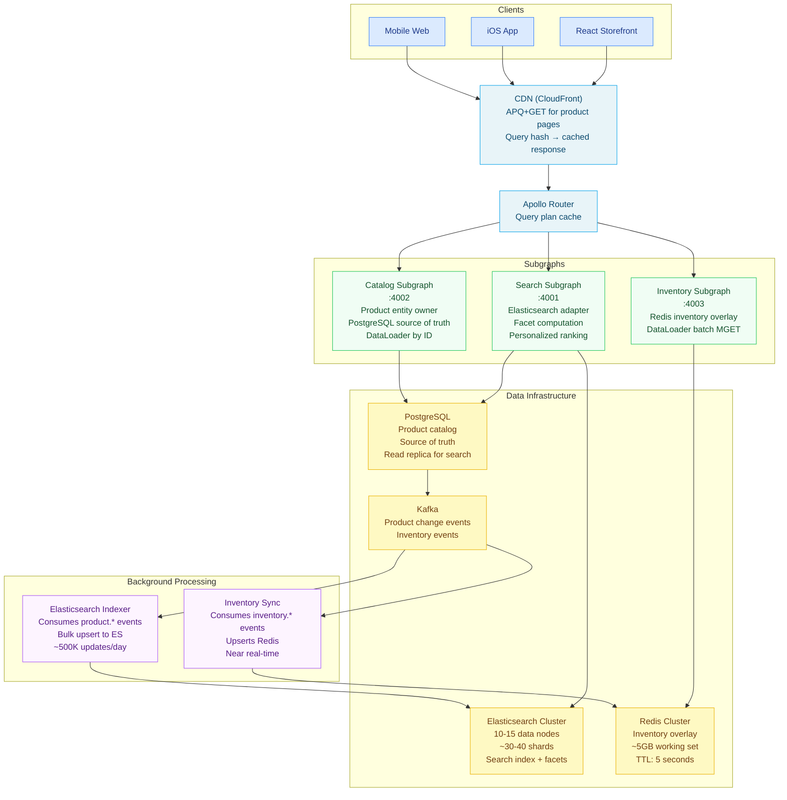

# Scenario 02 — Design a Product Search and Catalog API

> **Problem statement:** Design a GraphQL API for product search and catalog management
> at a large retailer. The system must support 100 million products, faceted search,
> real-time inventory overlay, personalized result ranking, and a p99 search latency SLO
> of 50 milliseconds.

---

## Requirements Elicitation

**Functional requirements:**
- Clients can search for products using text queries
- Search results can be filtered by facets: category, brand, price range, rating, availability
- Search results are ranked by relevance, with optional personalized ranking based on user segment
- Each search result includes current inventory status (real-time, not cached)
- Product catalog supports full CRUD (for internal tools — not part of the public search API)
- Product pages can be fetched by ID or slug
- Search results support pagination

**Non-functional requirements:**
- 100M products in the catalog
- Search latency SLO: 50ms p99 (from client to response, not just resolver)
- Inventory overlay latency: must not add more than 5ms to the search response
- Read-to-write ratio on the search path: approximately 99:1
- Availability: 99.95%
- Product data changes: approximately 500K product updates/day (price changes, availability, content)

**Out of scope:**
- Checkout and cart (separate system)
- Recommendation engine (separate subgraph — provides `recommendations` field on `User`, not search)
- Image upload and asset management (CDN/blob storage)

---

## Back-of-the-Envelope

**Index size:**
- 100M products × ~2KB of indexed content per product (title, description, brand, attributes) = 200GB raw text
- Elasticsearch index with inverted index and doc values: typically 3–5× raw text size = 600GB–1TB
- Requires a substantial Elasticsearch cluster: 10–15 data nodes at 100GB storage each

**Search QPS:**
- Peak traffic assumption: 10M concurrent sessions, each performing 2 searches/minute = 333K searches/second
- This is a large Elasticsearch cluster requirement. In practice, APQ + CDN caching of popular queries
  reduces the actual Elasticsearch QPS significantly. Assume 10% cache miss rate → 33K Elasticsearch QPS.
  This is achievable with a well-sized cluster (30–40 shards, 10–15 nodes).

**Inventory overlay:**
- 100M products have inventory records in Redis: ~100M × 50 bytes = 5GB
- Fits entirely in Redis cluster working set — no disk read for inventory lookups
- DataLoader batches inventory lookups: for a 20-product search result page, 1 Redis MGET instead of 20 GETs

**50ms p99 budget breakdown:**
- CDN → Router: ~5ms (network)
- Router overhead (query plan): ~1ms (plan cache warm)
- Elasticsearch query: ~10–20ms (simple query, warm shard, no aggregations on hot data)
- Facet aggregation: ~5–10ms (runs in parallel with main query)
- Inventory overlay (Redis MGET): ~1–2ms (batched)
- Entity resolution (catalog subgraph): ~5ms
- Total median path: ~30ms — within budget with margin for GC pauses and tail latency

**Personalization overhead:**
- User segment must not be computed inline on the search path — it must be pre-computed and available in < 1ms
- Segment is cached in Redis at login time; `X-User-Segment` header passed through from auth middleware

---

## Schema Design

```graphql
type Query {
  """
  Full-text + faceted product search. Results are ranked by a combination of
  relevance score and optional user segment personalization.
  """
  searchProducts(
    """Full-text search query"""
    query: String!
    """Facet filters to apply. All filters are ANDed together."""
    filters: ProductSearchFilters
    """Pagination — keyset cursor"""
    first: Int = 20
    after: String
    """Sort order. Default: RELEVANCE."""
    sort: ProductSearchSort = RELEVANCE
    """User segment key for personalized ranking. Opaque to clients."""
    userSegment: String
  ): ProductSearchResult!

  """Fetch a product by ID. CDN-cacheable via APQ+GET."""
  product(id: ID!): Product

  """Fetch a product by URL slug. CDN-cacheable via APQ+GET."""
  productBySlug(slug: String!): Product

  """
  Available facets for a given search context.
  Returns dynamic facet values and counts for the current result set.
  """
  searchFacets(
    query: String!
    filters: ProductSearchFilters
  ): ProductFacets!
}

type ProductSearchResult {
  """Ranked list of matching products"""
  edges: [ProductSearchEdge!]!
  """Pagination state"""
  pageInfo: PageInfo!
  """Total number of matching products (capped at 10,000 for performance)"""
  totalCount: Int!
  """The search query as interpreted (may include corrections)"""
  interpretedQuery: String
  """Was the query corrected for spelling?"""
  spellCorrected: Boolean!
  """Search execution metadata"""
  meta: SearchMeta!
}

type ProductSearchEdge {
  """The matched product"""
  node: Product!
  """Keyset cursor for this position"""
  cursor: String!
  """Relevance score (0.0–1.0) — for debugging and A/B testing"""
  score: Float!
  """Which ranking signals contributed to this position"""
  rankingSignals: [RankingSignal!]! @deprecated(reason: "Use explain mode in internal tools only")
}

type RankingSignal {
  signal: String!
  weight: Float!
}

type SearchMeta {
  """Total time to execute the search in milliseconds"""
  latencyMs: Int!
  """Elasticsearch cluster that served this request"""
  servingCluster: String! @deprecated(reason: "Internal use only")
}

input ProductSearchFilters {
  """Filter to a specific category path (inclusive of subcategories)"""
  category: String
  """Filter to one or more brands"""
  brands: [String!]
  """Price range filter in the store's base currency (cents)"""
  priceRange: PriceRangeFilter
  """Minimum average customer rating"""
  minRating: Float
  """Only return products with this inventory status"""
  inventoryStatus: InventoryStatusFilter
  """Custom attribute filters (e.g., "color": ["red", "blue"])"""
  attributes: [AttributeFilter!]
}

input PriceRangeFilter {
  minCents: Int
  maxCents: Int
}

enum InventoryStatusFilter {
  IN_STOCK
  IN_STOCK_OR_PRE_ORDER
}

input AttributeFilter {
  key: String!
  values: [String!]!
}

enum ProductSearchSort {
  RELEVANCE
  PRICE_ASC
  PRICE_DESC
  RATING
  NEWEST
  BEST_SELLING
}

type ProductFacets {
  categories: [CategoryFacet!]!
  brands: [FacetBucket!]!
  priceRanges: [PriceRangeBucket!]!
  ratings: [RatingFacet!]!
  attributes: [AttributeFacet!]!
}

type CategoryFacet {
  path: String!
  name: String!
  count: Int!
  children: [CategoryFacet!]!
}

type FacetBucket {
  value: String!
  count: Int!
}

type PriceRangeBucket {
  minCents: Int!
  maxCents: Int!
  label: String!
  count: Int!
}

type RatingFacet {
  rating: Int!
  count: Int!
}

type AttributeFacet {
  key: String!
  displayName: String!
  values: [FacetBucket!]!
}

type Product @key(fields: "id") {
  id: ID!
  sku: String!
  name: String!
  slug: String!
  brand: Brand!
  category: Category!
  price: Price!
  images: [ProductImage!]!
  attributes: [ProductAttribute!]!
  reviewSummary: ReviewSummary
  """Real-time inventory status — resolved from the Inventory subgraph"""
  inventory: InventoryStatus!
  createdAt: DateTime!
  updatedAt: DateTime!
}

type InventoryStatus {
  status: StockStatus!
  quantityAvailable: Int
  """Expected restock date if currently out of stock"""
  restockExpectedAt: Date
  """When this inventory status was last updated — for client-side staleness display"""
  updatedAt: DateTime!
}

enum StockStatus {
  IN_STOCK
  LOW_STOCK        # < 10 units
  OUT_OF_STOCK
  PRE_ORDER
  DISCONTINUED
}

type Price {
  baseCents: Int!
  saleCents: Int
  currencyCode: String!
  """Formatted for display: "$29.99""""
  displayPrice: String!
  """Display sale price if applicable"""
  displaySalePrice: String
  isOnSale: Boolean!
}

type PageInfo {
  hasNextPage: Boolean!
  hasPreviousPage: Boolean!
  startCursor: String
  endCursor: String
}
```

---

## Architecture



---

## Query Planning Considerations

A search query with inventory data spans two subgraphs:

1. **Search subgraph** executes the Elasticsearch query and returns a list of `Product` references (`{ id }` objects)
2. **Catalog subgraph** resolves full product data (name, price, images) via `__resolveReference` for each ID — batched via DataLoader
3. **Inventory subgraph** resolves `inventory` field for each product — batched via Redis MGET

The Apollo Router query plan for `searchProducts { edges { node { name price inventory { status } } } }`:

```
QueryPlan {
  Sequence {
    Fetch(service: "search") {
      searchProducts(query: $query, filters: $filters) {
        edges {
          cursor
          score
          node { __typename id }    ← only IDs from search subgraph
        }
        pageInfo { ... }
        totalCount
        interpretedQuery
        spellCorrected
        meta { latencyMs }
      }
    }
    Parallel {
      Fetch(service: "catalog") {
        # Reference batch for all product IDs returned by search
        _entities(representations: $productRefs) {
          ... on Product { id name slug brand { name } price { ... } images { ... } }
        }
      }
      Fetch(service: "inventory") {
        # Reference batch for same product IDs
        _entities(representations: $productRefs) {
          ... on Product { id inventory { status quantityAvailable updatedAt } }
        }
      }
    }
  }
}
```

The catalog and inventory fetches run in parallel after the search subgraph responds.
On a 20-product result page this means: 1 Elasticsearch request + 1 Postgres batch + 1 Redis MGET,
not 20 Postgres queries + 20 Redis GETs.

---

## Pagination

### Why Offset Pagination Fails at Scale

Offset pagination (`LIMIT 20 OFFSET 1000`) requires Elasticsearch to score and rank 1,020
documents, return results 1,001–1,020, and discard the first 1,000. As the offset grows,
the work grows linearly. At offset 50,000 in a 100M product index, this is a full index
scan. Elasticsearch's `from` + `size` parameter degrades severely past 10,000 — which is
why the schema caps `totalCount` at 10,000.

### Keyset Cursor Pagination

The search API uses keyset cursors. Each cursor encodes the sort values and document ID
of the last seen result, allowing Elasticsearch's `search_after` parameter to resume
pagination efficiently regardless of depth.

```typescript
// search/cursor.ts
interface SearchCursor {
  sortValues: unknown[];    // Elasticsearch sort_values for the last document
  documentId: string;       // Tiebreaker — ES document ID
}

export function encodeCursor(sortValues: unknown[], documentId: string): string {
  const payload: SearchCursor = { sortValues, documentId };
  return Buffer.from(JSON.stringify(payload)).toString('base64url');
}

export function decodeCursor(cursor: string): SearchCursor {
  return JSON.parse(Buffer.from(cursor, 'base64url').toString('utf8'));
}
```

In the Elasticsearch query:

```typescript
// Append search_after to the ES query if a cursor is provided
if (after) {
  const cursor = decodeCursor(after);
  esQuery.search_after = [...cursor.sortValues, cursor.documentId];
}
// Always add the document ID as a tiebreaker sort field
esQuery.sort = [...primarySort, { _id: 'asc' }];
```

---

## Caching Strategy

| Query Type | Cache Layer | TTL | Cache Key |
|---|---|---|---|
| Product page by ID/slug | CDN (APQ+GET) | 5 minutes | APQ hash + product ID |
| Search results (anonymous) | CDN (APQ+GET) | 2 minutes | APQ hash + query + filters + page |
| Search results (personalized) | No CDN | N/A | Viewer-scoped — not CDN-cacheable |
| Facet aggregations | Router entity cache | 30 seconds | query + filters hash |
| Inventory status | Inventory subgraph resolver | 5 seconds (TTL in Redis) | product:{id}:inventory |
| Product detail fields | Router entity cache | 2 minutes | product:{id} |

**Key insight on anonymous vs. personalized search:** The `userSegment` argument makes
a query un-cacheable by the CDN because it is viewer-specific. Design the default search
path (no `userSegment`) to be CDN-cacheable. Personalized ranking is a second-pass
re-ranking applied in the Search subgraph after retrieving the base ranked list — the
base list is cached, the re-ranking is not.

---

## Personalization

User segments are pre-computed and coarse-grained (e.g., "deal-seeker", "brand-loyal",
"high-value"). They are computed by a background ML pipeline and stored in Redis at session
start. The segment is not computed on the search path.

```typescript
// search/personalization.ts

type UserSegment =
  | 'deal_seeker'
  | 'brand_loyal'
  | 'high_value'
  | 'new_visitor'
  | 'control';

interface RankingWeights {
  relevanceWeight: number;
  priceWeight: number;
  ratingWeight: number;
  popularityWeight: number;
}

const SEGMENT_WEIGHTS: Record<UserSegment, RankingWeights> = {
  deal_seeker:   { relevanceWeight: 0.5, priceWeight: 0.3, ratingWeight: 0.1, popularityWeight: 0.1 },
  brand_loyal:   { relevanceWeight: 0.5, priceWeight: 0.0, ratingWeight: 0.2, popularityWeight: 0.3 },
  high_value:    { relevanceWeight: 0.4, priceWeight: 0.0, ratingWeight: 0.4, popularityWeight: 0.2 },
  new_visitor:   { relevanceWeight: 0.6, priceWeight: 0.2, ratingWeight: 0.1, popularityWeight: 0.1 },
  control:       { relevanceWeight: 0.7, priceWeight: 0.1, ratingWeight: 0.1, popularityWeight: 0.1 },
};

/**
 * Applies segment-specific re-ranking to Elasticsearch results.
 * This runs in the Search subgraph, not in the router.
 */
export function applyPersonalizedRanking(
  results: Array<{ id: string; baseScore: number; priceCents: number; rating: number; salesRank: number }>,
  segment: UserSegment
): typeof results {
  const weights = SEGMENT_WEIGHTS[segment] ?? SEGMENT_WEIGHTS['control'];

  const maxPrice = Math.max(...results.map((r) => r.priceCents), 1);
  const maxRating = 5;
  const maxSalesRank = Math.max(...results.map((r) => r.salesRank), 1);

  return results
    .map((r) => ({
      ...r,
      personalizedScore:
        weights.relevanceWeight * r.baseScore +
        weights.priceWeight * (1 - r.priceCents / maxPrice) +  // Invert: lower price = higher score
        weights.ratingWeight * (r.rating / maxRating) +
        weights.popularityWeight * (1 - r.salesRank / maxSalesRank),
    }))
    .sort((a, b) => b.personalizedScore - a.personalizedScore);
}
```

---

## Trade-off Analysis

| Decision | Trade-off Accepted |
|---|---|
| Elasticsearch as search store, PostgreSQL as source of truth | Eventual consistency between ES and Postgres — up to ~30s lag on updates. Accepted because immediate search freshness is not required; product data changes are not time-critical at the field level. |
| Redis inventory overlay (5s TTL) | Inventory can be up to 5 seconds stale. Accepted because real-time inventory requires a separate write-optimized path (Kafka → Redis), and a 5-second window does not significantly affect conversion. Out-of-stock handling is enforced at checkout, not at search. |
| Cap `totalCount` at 10,000 | Users rarely page past result 200. At 50ms p99, computing exact counts across 100M documents is not feasible. The cap is disclosed in the schema docs. |
| CDN-cacheability requires anonymous queries | Personalized search cannot be CDN-cached. Anonymous users (significant fraction of traffic) get full CDN cache benefit. Logged-in users with segments bypass CDN for personalized queries, increasing backend load by the fraction of personalized traffic. |
| Keyset pagination only | No random page access ("jump to page 47"). This is an intentional trade-off — deep page access is rare and costly. The UI should use infinite scroll with cursor-based "load more", not numbered pages. |

---

## References and Related Topics

- [Performance and Scaling](../06-performance-and-scaling/README.md) — DataLoader, N+1 patterns
- [Caching Strategies](../17-caching-strategies/README.md) — APQ+GET, entity cache, CDN integration
- [Federation](../07-federation/README.md) — entity resolution across subgraphs
- [Design: IoT Data Platform](./05-design-iot-data-platform.md) — similar hot/cold data architecture
- [Case Study: E-Commerce Supergraph](../23-production-case-studies/01-ecommerce-supergraph.md) — real-world migration to this architecture
