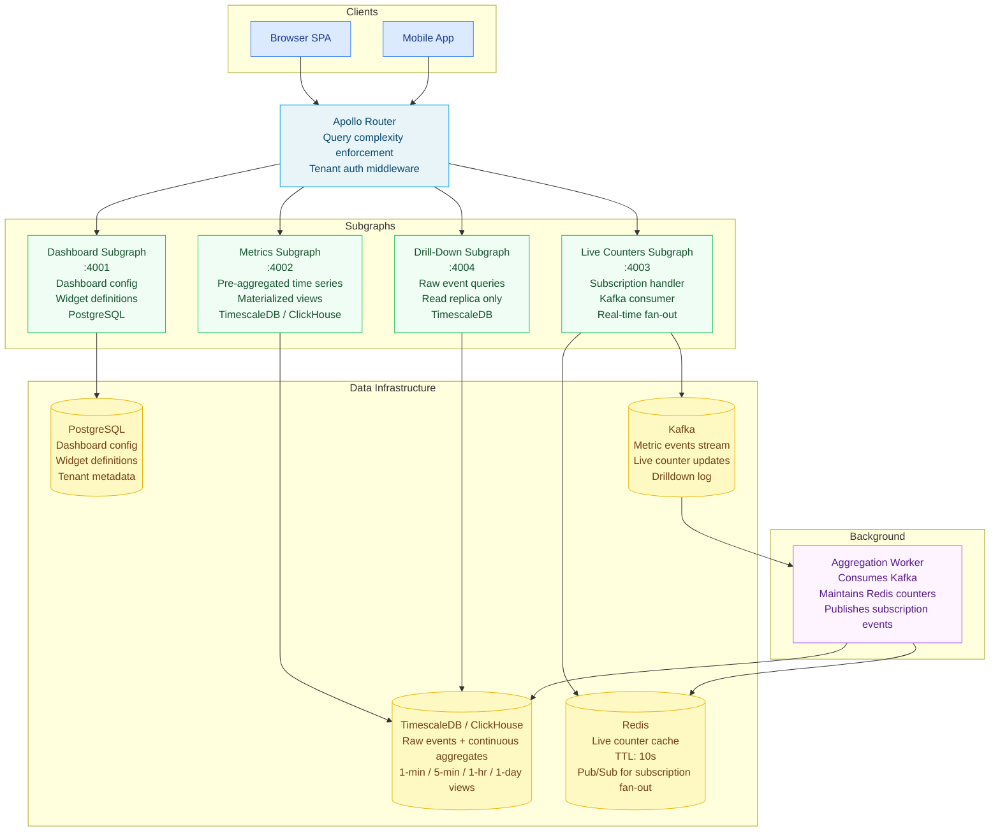

# Scenario 03 — Design a Real-Time Analytics Dashboard API

> **Problem statement:** Design a GraphQL API for an operational analytics dashboard.
> The system must support 1,000 concurrent users, refresh metrics every 10 seconds,
> support drill-down queries from summary to detail, operate within a 100ms render
> budget per dashboard, and scale to multiple tenants with strict data isolation.

---

## Requirements Elicitation

**Functional requirements:**
- Operational dashboard displays live metrics: request counts, error rates, latency percentiles, active users
- Each dashboard is composed of configurable widgets (line charts, counters, tables)
- Each widget queries a specific metric or dimension
- Users can drill down from a chart data point to the underlying events or records
- Metrics are pre-aggregated at multiple resolutions: 1-minute, 5-minute, 1-hour, 1-day
- Dashboard definition (which widgets, which metrics) is user-configurable and persisted
- Multi-tenant: each dashboard is scoped to a tenant, no cross-tenant data access

**Non-functional requirements:**
- 1,000 concurrent users across all tenants
- Metric refresh interval: 10 seconds for live counters (request rate, error rate, active users)
- Chart data refresh: 60 seconds (aggregated time series — less time-sensitive)
- Render budget: 100ms from query start to first data available for painting
- Drill-down query latency: 500ms p99 (drill-downs are user-triggered, not part of the render loop)
- Availability: 99.9%
- Data isolation: tenant A must never receive tenant B's data

**Out of scope:**
- Alerting (separate service — dashboards are read-only views)
- Historical report generation (separate batch job)
- Dashboard sharing with external users (requires separate auth flow)

---

## Back-of-the-Envelope

**Connection cost analysis (subscriptions vs. polling):**
- 1,000 concurrent users
- Each user has one dashboard open with approximately 8 widgets
- Option A: subscription per widget = 8,000 concurrent WebSocket subscriptions
  - Memory at router: 8,000 × 40KB ≈ 320MB — manageable
  - But: 8 subscriptions per user requires 8 subscription operations, 8 query plans,
    8 Kafka consumer positions. Operational complexity is high.
- Option B: subscription per dashboard = 1,000 concurrent WebSocket subscriptions
  - Memory: 1,000 × 40KB ≈ 40MB — very manageable
  - Simpler: 1 subscription operation per user, 1 query plan, 1 server-side fan-out
- Option C: polling for chart data, subscription for live counters only
  - Live counters: 1,000 subscriptions for fast-changing values
  - Chart data: clients poll every 60s; with CDN caching, ~100 QPS to the backend
  - This is the recommended approach — see trade-off analysis below

**Aggregation strategy:**
- At 1,000 concurrent users, each requesting a 1-hour chart with 1-minute resolution = 60 data points per chart
- Naive query: `SELECT time_bucket('1 minute', ts), AVG(value) FROM metrics WHERE ...` on the live table
- At 1M events/hour per tenant and 20 tenants: 20M rows scanned for a simple chart = too slow for a 100ms budget
- Solution: materialized views pre-aggregate at 1-minute resolution; query the view, not the raw table

**Query complexity budget:**
- A dashboard with 8 widgets, each fetching a 60-point time series = 480 data points
- At 200 bytes per data point (timestamp + value + label): 96KB per dashboard query
- Query complexity score: 8 widgets × 60 points × 2 fields = 960. This exceeds a typical
  default complexity limit (100). Must set per-user complexity limits based on plan tier.

---

## Schema Design

```graphql
type Query {
  """
  Fetch a dashboard definition and its current widget data.
  Used for initial page load. Chart data included inline.
  Cached by dashboard ID + time bucket — see caching strategy.
  """
  dashboard(id: ID!): Dashboard

  """
  Fetch a single metric time series. Used for individual widget refresh via polling.
  """
  metricTimeSeries(
    metricId: ID!
    resolution: TimeResolution!
    from: DateTime!
    to: DateTime!
    dimensions: [DimensionFilter!]
  ): MetricTimeSeries!

  """
  Drill-down query: fetch underlying records for a specific metric + time window.
  Higher latency budget (500ms p99) — user-triggered, not part of render loop.
  """
  metricDrillDown(
    metricId: ID!
    from: DateTime!
    to: DateTime!
    dimensions: [DimensionFilter!]
    first: Int = 50
    after: String
  ): DrillDownConnection!
}

type Subscription {
  """
  Live counter updates for a dashboard's real-time widgets.
  Delivers counter values for all real-time metrics in the dashboard every 10 seconds.
  Single subscription per dashboard — not per widget.
  """
  dashboardLiveCounters(dashboardId: ID!): DashboardCounterUpdate!
}

type Dashboard {
  id: ID!
  name: String!
  tenantId: ID!
  widgets: [DashboardWidget!]!
  refreshIntervalSeconds: Int!
  createdAt: DateTime!
  updatedAt: DateTime!
}

union DashboardWidget = LineChartWidget | CounterWidget | TableWidget | BarChartWidget

type LineChartWidget {
  id: ID!
  title: String!
  metric: Metric!
  resolution: TimeResolution!
  """Pre-loaded time series data — covers the dashboard's default time window"""
  data: MetricTimeSeries!
}

type CounterWidget {
  id: ID!
  title: String!
  metric: Metric!
  """Current value — refreshed via subscription, not polling"""
  currentValue: Float!
  """Comparison period change (e.g., +12% vs. last hour)"""
  periodChange: Float
  periodChangeLabel: String
}

type TableWidget {
  id: ID!
  title: String!
  metric: Metric!
  dimensions: [String!]!
  """Top-N rows for the widget's configured time window"""
  rows(first: Int = 10): TableWidgetConnection!
}

type BarChartWidget {
  id: ID!
  title: String!
  metric: Metric!
  dimension: String!
  """Bars are grouped by the configured dimension value"""
  bars: [BarChartBar!]!
}

type BarChartBar {
  dimensionValue: String!
  value: Float!
}

type Metric {
  id: ID!
  name: String!
  unit: String!
  description: String
  category: MetricCategory!
}

enum MetricCategory {
  PERFORMANCE
  ERRORS
  BUSINESS
  INFRASTRUCTURE
}

enum TimeResolution {
  ONE_MINUTE
  FIVE_MINUTES
  ONE_HOUR
  ONE_DAY
}

type MetricTimeSeries {
  metric: Metric!
  resolution: TimeResolution!
  from: DateTime!
  to: DateTime!
  points: [TimeSeriesPoint!]!
}

type TimeSeriesPoint {
  timestamp: DateTime!
  value: Float!
  """Optional breakdown dimensions (e.g., by region, by status code)"""
  dimensions: [Dimension!]!
}

type Dimension {
  key: String!
  value: String!
}

input DimensionFilter {
  key: String!
  value: String!
}

type DashboardCounterUpdate {
  dashboardId: ID!
  timestamp: DateTime!
  counters: [CounterValue!]!
}

type CounterValue {
  widgetId: ID!
  metricId: ID!
  value: Float!
  periodChange: Float
}

type DrillDownConnection {
  edges: [DrillDownEdge!]!
  pageInfo: PageInfo!
  totalCount: Int!
}

type DrillDownEdge {
  node: DrillDownRecord!
  cursor: String!
}

type DrillDownRecord {
  id: ID!
  timestamp: DateTime!
  attributes: [KeyValuePair!]!
  value: Float!
}

type KeyValuePair {
  key: String!
  value: String!
}

type TableWidgetConnection {
  edges: [TableWidgetEdge!]!
  pageInfo: PageInfo!
}

type TableWidgetEdge {
  node: TableWidgetRow!
  cursor: String!
}

type TableWidgetRow {
  dimensions: [Dimension!]!
  value: Float!
  periodChange: Float
}

type PageInfo {
  hasNextPage: Boolean!
  hasPreviousPage: Boolean!
  startCursor: String
  endCursor: String
}
```

---

## Architecture



---

## Subscription vs. Polling: The Decision

This design uses subscriptions for live counters and polling for chart data. The reasoning
is explicit because the wrong choice here has large operational consequences.

### Why Subscriptions for Live Counters

Live counters (requests/second, error rate, active users) update every 10 seconds and
require server-initiated push to minimize perceived latency. With polling at 10s intervals,
a counter could be up to 10 seconds stale the moment it refreshes. With subscriptions,
the server pushes the update the moment a new value is computed — the client receives it
in 10 seconds ± network jitter.

At 1,000 concurrent users, 1,000 WebSocket connections is trivially manageable (40MB
memory at the router). The fan-out is handled by a Kafka consumer that publishes to
Redis Pub/Sub; the router maintains the WebSocket connections.

**Connections are tenant-scoped.** The subscription filter at the router enforces that
user A (tenant X) cannot receive counter updates from tenant Y.

### Why Polling for Chart Data

Chart data (time series, bar charts, table widgets) changes at 60-second resolution,
not 10-second. A subscription that delivers a 60-point time series every 60 seconds
provides no meaningful advantage over polling every 60 seconds — the data is the same.

The key cost difference: a subscription maintains a persistent connection with a topic
consumer position. For chart data, the connection cost is not amortized — you pay the
connection overhead for each client × each metric, and the data only changes once a
minute. Polling with APQ caching at the router means 100 clients requesting the same
dashboard chart share a single cached response. Subscriptions cannot share the response
in the same way because each connection is a separate topic consumer.

**The rule:** Use subscriptions when the data changes faster than clients can practically
poll, and when the data is client-specific (personalized). Use polling when the data is
shared across clients and can be cached.

| Signal | Counter Subscription | Chart Polling |
|---|---|---|
| Update frequency | 10s | 60s |
| Client-specific? | Yes (tenant-scoped) | Mostly shared (same chart = same data) |
| CDN/router cacheable? | No | Yes (by dashboard ID + time bucket) |
| Connection cost | 40KB per client | Zero (stateless request) |
| Verdict | Subscription | Polling with cache |

---

## Aggregation in Resolvers: Materialized Views vs. On-the-Fly

Aggregation is the dominant cost in a metrics system. Do not aggregate on the fly in
resolvers for user-facing dashboard queries.

**On-the-fly aggregation** runs `GROUP BY + AVG/SUM` on the raw events table at query
time. For a 1-hour window with 1-minute resolution and 1M events/hour:
- 1M rows scanned per chart per refresh
- At 1,000 users × 8 charts = 8,000 chart refreshes/minute = 8 billion row-scans/minute
- This is not feasible at a 100ms render budget

**Materialized views** (or TimescaleDB continuous aggregates) pre-aggregate at each
resolution in the background:

```sql
-- TimescaleDB continuous aggregate: 1-minute resolution
CREATE MATERIALIZED VIEW metrics_1min
WITH (timescaledb.continuous) AS
  SELECT
    time_bucket('1 minute', timestamp) AS bucket,
    tenant_id,
    metric_id,
    dimension_key,
    dimension_value,
    AVG(value) AS avg_value,
    SUM(value) AS sum_value,
    MAX(value) AS max_value,
    MIN(value) AS min_value,
    COUNT(*) AS count
  FROM metric_events
  GROUP BY bucket, tenant_id, metric_id, dimension_key, dimension_value
WITH NO DATA;

-- Refresh policy: keep the 1-minute view 30 seconds behind real time
SELECT add_continuous_aggregate_policy('metrics_1min',
  start_offset => INTERVAL '1 hour',
  end_offset   => INTERVAL '30 seconds',
  schedule_interval => INTERVAL '30 seconds');
```

The resolver queries the materialized view:

```typescript
// resolvers/metric-time-series-resolver.ts
async function metricTimeSeriesResolver(
  _parent: unknown,
  args: { metricId: string; resolution: string; from: string; to: string },
  context: { db: Pool; tenantId: string }
): Promise<unknown> {
  const tableMap: Record<string, string> = {
    ONE_MINUTE:   'metrics_1min',
    FIVE_MINUTES: 'metrics_5min',
    ONE_HOUR:     'metrics_1hr',
    ONE_DAY:      'metrics_1day',
  };

  const table = tableMap[args.resolution];
  if (!table) throw new Error(`Invalid resolution: ${args.resolution}`);

  const { rows } = await context.db.query(
    `SELECT
       bucket AS timestamp,
       avg_value AS value
     FROM ${table}
     WHERE
       tenant_id = $1
       AND metric_id = $2
       AND bucket >= $3
       AND bucket < $4
     ORDER BY bucket ASC`,
    [context.tenantId, args.metricId, args.from, args.to]
  );

  return { points: rows };
}
```

---

## Query Complexity Budget

Dashboard queries are inherently more complex than typical GraphQL queries. A naive
complexity limit (e.g., 100) would block legitimate dashboard queries. Set complexity
limits by viewer plan tier and enforce them at the router.

```typescript
// complexity/dashboard-complexity.ts

interface ComplexityRule {
  maxComplexity: number;
  description: string;
}

const PLAN_COMPLEXITY_LIMITS: Record<string, ComplexityRule> = {
  free: {
    maxComplexity: 500,
    description: 'Free tier: up to 5 widgets × 100 points each',
  },
  pro: {
    maxComplexity: 2000,
    description: 'Pro tier: up to 10 widgets × 200 points each',
  },
  enterprise: {
    maxComplexity: 10000,
    description: 'Enterprise: custom dashboards with full time series',
  },
};

// Field complexity estimators
export const complexityEstimators = {
  MetricTimeSeries: {
    points: (args: { from: string; to: string; resolution: string }) => {
      const fromMs = new Date(args.from).getTime();
      const toMs = new Date(args.to).getTime();
      const windowMs = toMs - fromMs;

      const resolutionMs: Record<string, number> = {
        ONE_MINUTE:   60_000,
        FIVE_MINUTES: 300_000,
        ONE_HOUR:     3_600_000,
        ONE_DAY:      86_400_000,
      };

      const resolution = resolutionMs[args.resolution] ?? 60_000;
      return Math.ceil(windowMs / resolution);  // Number of data points to return
    },
  },
};
```

---

## Multi-Tenancy: Row-Level Security in Resolvers

Every resolver that queries the database must include the tenant ID in the WHERE clause.
The tenant ID is derived from the JWT token in the request context and injected at the
router middleware layer.

```typescript
// middleware/tenant-context.ts
import { GraphQLError } from 'graphql';
import type { Context } from '../context';

export function extractTenantFromJWT(authHeader: string | undefined): string {
  if (!authHeader) throw new GraphQLError('Authentication required', {
    extensions: { code: 'UNAUTHENTICATED' },
  });

  const token = authHeader.replace('Bearer ', '');
  // In production: verify JWT signature, extract claims
  const payload = JSON.parse(Buffer.from(token.split('.')[1], 'base64').toString());

  if (!payload.tenant_id) throw new GraphQLError('Invalid token: missing tenant_id', {
    extensions: { code: 'UNAUTHENTICATED' },
  });

  return payload.tenant_id;
}

// Resolver guard — wrap any resolver that queries tenant data
export function requireTenantOwnership(
  tenantId: string,
  resourceTenantId: string,
  resourceType: string,
  resourceId: string
): void {
  if (tenantId !== resourceTenantId) {
    // Do not leak information about which tenant owns the resource
    throw new GraphQLError(`${resourceType} not found: ${resourceId}`, {
      extensions: { code: 'NOT_FOUND' },
    });
  }
}
```

All database queries include `AND tenant_id = $1` as a mandatory filter. This is
not optional and must be enforced by code review and integration tests.

---

## Caching Strategy

| Query Type | Cache Layer | TTL | Cache Key |
|---|---|---|---|
| Dashboard config (definition only) | Router entity cache | 5 minutes | `dashboard:{id}` |
| 1-minute metric time series | Router entity cache | 30 seconds | `metrics:1m:{metricId}:{tenantId}:{from}:{to}` |
| 5-minute metric time series | Router entity cache | 2 minutes | `metrics:5m:{...}` |
| 1-hour metric time series | Router entity cache | 10 minutes | `metrics:1h:{...}` |
| Live counter (subscription) | Redis | 10 seconds (TTL on Redis key) | `counter:{metricId}:{tenantId}` |
| Drill-down results | No cache | N/A | Dynamic — user-triggered, low volume |

Time bucket alignment: cache keys for time series include the time bucket, not the raw
`from` and `to` values. Bucket alignment means two users requesting "the last hour" at
different times receive the same cached response if their requests fall in the same bucket.

```typescript
// caching/time-bucket.ts

export function alignTimeBucket(timestamp: Date, resolution: string): Date {
  const ms = timestamp.getTime();
  const bucketMs: Record<string, number> = {
    ONE_MINUTE:   60_000,
    FIVE_MINUTES: 300_000,
    ONE_HOUR:     3_600_000,
    ONE_DAY:      86_400_000,
  };
  const bucket = bucketMs[resolution] ?? 60_000;
  return new Date(Math.floor(ms / bucket) * bucket);
}
```

---

## Trade-off Analysis

| Decision | Trade-off Accepted |
|---|---|
| Subscriptions for counters, polling for charts | Slightly higher perceived latency for chart data (up to 60s stale) vs. per-client connection cost for 8 chart subscriptions per user |
| Materialized views for aggregation | 30s lag in pre-aggregated data vs. instant aggregation on raw events (which would be 100× slower) |
| Per-tenant complexity limits | Enterprise customers can run complex queries; free tier is restricted. This is a product decision as much as an engineering one — the complexity limit is a rate-limiting mechanism. |
| 4 subgraphs (dashboard / metrics / live / drilldown) | Operational overhead of 4 services vs. better isolation between the real-time path (subscriptions) and the query path (polling), and between dashboard config and data |
| Row-level security in resolvers, not database | Simpler implementation (no PostgreSQL RLS configuration per tenant) vs. defense-in-depth. Accepted because all resolvers are reviewed for the tenant filter and integration tests enforce it. In a higher-risk environment, use PostgreSQL RLS as an additional layer. |

---

## References and Related Topics

- [Design: Social Graph API](./01-design-social-graph-api.md) — subscription vs. polling decision (notifications)
- [Supergraph Architecture](../08-supergraph-architecture/README.md) — router subscription passthrough
- [Performance and Scaling](../06-performance-and-scaling/README.md) — DataLoader, query complexity
- [Security](../05-security/README.md) — multi-tenant data isolation patterns
- [Caching Strategies](../17-caching-strategies/README.md) — entity cache, time-bucket cache keys
