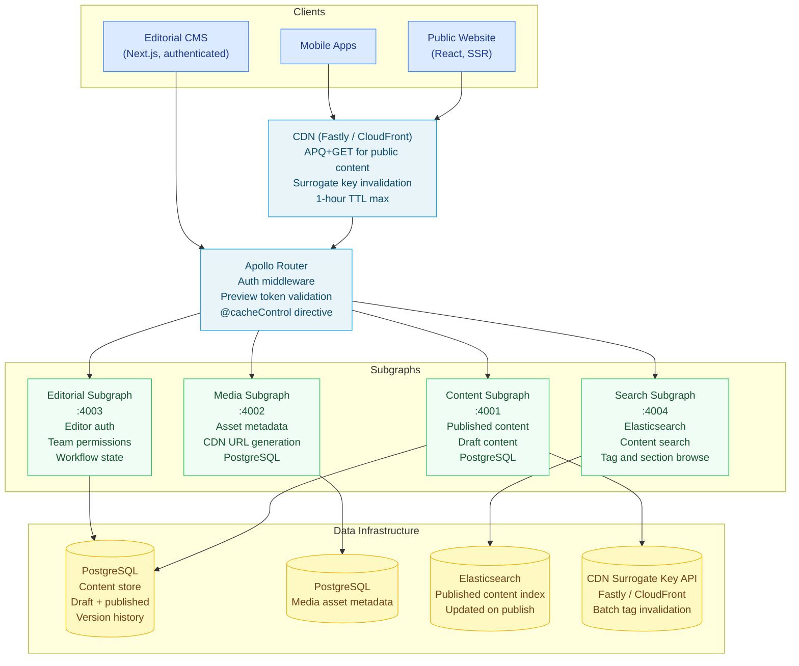

# Scenario 04 — Design a Headless CMS GraphQL API

> **Problem statement:** Design a GraphQL API for a headless content management system
> at a global media company. The system must support 50 editorial teams, 10 content
> types, multi-language content, CDN-cached public pages, and authenticated draft preview.
> Content must be publishable without clearing the full CDN cache.

---

## Requirements Elicitation

**Functional requirements:**
- Editors create and manage content in a draft state before publishing
- Published content is publicly accessible without authentication
- Draft content is accessible only to authenticated editors
- Content supports multiple locales (languages and regional variants)
- Content has relationships: articles reference authors, tags, and media assets
- Editors can preview draft content as it will appear when published
- Content updates trigger targeted CDN invalidation — not full cache purges
- Content types: Article, Video, Gallery, Author, Tag, Media, Series, Page, Newsletter, Podcast

**Non-functional requirements:**
- 50 editorial teams organized by brand and region
- 10 content types with independent schema evolution per type
- Read-to-write ratio: approximately 200:1 (high-traffic news site)
- Public page cache hit ratio target: 95% (5% cache miss rate to origin)
- CDN cache TTL: up to 1 hour for published content
- Draft preview latency: < 500ms (authenticated, bypasses CDN)
- Publishing action latency: < 2 seconds (including CDN invalidation trigger)
- Availability: 99.99% for public read path

**Out of scope:**
- Digital asset processing (image resizing, video transcoding — separate media pipeline)
- Comment systems (third-party integration)
- Analytics and A/B testing (separate layer)

---

## Back-of-the-Envelope

**CDN cache efficiency:**
- A major news article may receive 500K views in the first hour after publishing
- Without CDN caching: 500K requests × 100ms average origin latency = 14 hours of origin CPU time per article — infeasible
- With CDN at 95% hit ratio: 25K requests to origin (500K × 5%) = 42 minutes of origin CPU time — manageable
- APQ + GET is mandatory: POST requests cannot be CDN-cached. All public queries must use GET + APQ.

**Cache invalidation scope:**
- When an article is published, the affected CDN objects are:
  - The article page itself (by article ID and slug)
  - The section/topic pages that list this article
  - The author's profile page
  - The home page (top stories section)
- Full cache purge would clear all CDN objects — including the 95% of cached pages unrelated to this article
- Surrogate key invalidation tags allow targeted purge: `article:{id}`, `author:{authorId}`, `section:{sectionId}`

**Editorial team isolation:**
- 50 teams across brands and regions
- Teams share content types (Article, Tag, Author) but are isolated by `brand` + `locale` scope
- An editor at Brand A (US English) cannot publish content in Brand B (French)
- Permission model: `{ teamId, contentType, locale, operations: [READ, WRITE, PUBLISH] }`

---

## Schema Design

```graphql
type Query {
  """
  Fetch a published article by ID. Publicly accessible. CDN-cacheable via APQ+GET.
  Surrogate-Key header: article:{id} author:{authorId} section:{sectionId}
  """
  article(id: ID!, locale: Locale = EN_US): Article

  """
  Fetch a published article by URL slug. CDN-cacheable.
  """
  articleBySlug(slug: String!, locale: Locale = EN_US): Article

  """
  Fetch draft or published article. Requires authentication.
  Returns the draft version if the viewer has WRITE access to this article's team.
  """
  articlePreview(id: ID!, locale: Locale = EN_US): ContentNode!

  """
  List articles for a section. CDN-cacheable with surrogate key section:{sectionId}.
  """
  sectionArticles(
    sectionId: ID!
    locale: Locale = EN_US
    contentState: ContentStateFilter = PUBLISHED
    first: Int = 20
    after: String
  ): ArticleConnection!

  """
  Authenticated: list articles accessible to the current editor.
  Not CDN-cacheable — personalized to team membership.
  """
  myDrafts(first: Int = 20, after: String): ArticleConnection!

  author(id: ID!, locale: Locale = EN_US): Author
  tag(slug: String!, locale: Locale = EN_US): Tag
  media(id: ID!): Media
}

type Mutation {
  """Create a draft article. Team membership required."""
  createArticle(input: CreateArticleInput!): Article!

  """Save changes to a draft. Returns the updated draft."""
  updateArticle(id: ID!, input: UpdateArticleInput!): Article!

  """
  Publish a draft article. Requires PUBLISH permission in the article's team.
  Triggers CDN surrogate key invalidation on success.
  """
  publishArticle(id: ID!): PublishArticleResult!

  """
  Unpublish a published article. Returns it to DRAFT state.
  Triggers CDN invalidation.
  """
  unpublishArticle(id: ID!): Article!

  """Generate a signed preview token valid for 4 hours."""
  createPreviewToken(articleId: ID!): PreviewToken!
}

# Draft / Published union — the core content state model
union ContentNode = Article | Draft

type Article implements ContentNodeFields {
  id: ID!
  slug: String!
  contentState: ContentState!
  title: String!
  body: String!                   # Rich text, typically serialized JSON (Slate, Tiptap)
  excerpt: String!
  author: Author!
  coAuthors: [Author!]!
  tags: [Tag!]!
  primaryMedia: Media
  mediaGallery: [Media!]!
  locale: Locale!
  translations: [ArticleTranslation!]!
  publishedAt: DateTime
  updatedAt: DateTime!
  createdAt: DateTime!
  section: Section!
  series: Series
  readingTimeMinutes: Int!
  """SEO metadata"""
  seo: SEOMetadata!
  """Surrogate keys for CDN invalidation — internal use"""
  surrogateKeys: [String!]! @deprecated(reason: "Internal CDN use only")
}

type Draft implements ContentNodeFields {
  id: ID!
  slug: String!
  contentState: ContentState!
  title: String!
  body: String!
  excerpt: String!
  author: Author!
  coAuthors: [Author!]!
  tags: [Tag!]!
  primaryMedia: Media
  mediaGallery: [Media!]!
  locale: Locale!
  translations: [ArticleTranslation!]!
  updatedAt: DateTime!
  createdAt: DateTime!
  section: Section!
  series: Series
  """Which editor last saved this draft"""
  lastEditedBy: Editor!
  """Scheduled publish time, if configured"""
  scheduledPublishAt: DateTime
  """Whether this draft has unpublished changes relative to the live version"""
  hasUnpublishedChanges: Boolean!
}

interface ContentNodeFields {
  id: ID!
  slug: String!
  contentState: ContentState!
  title: String!
  body: String!
  excerpt: String!
  author: Author!
  tags: [Tag!]!
  locale: Locale!
  updatedAt: DateTime!
  createdAt: DateTime!
}

enum ContentState {
  DRAFT
  IN_REVIEW
  SCHEDULED
  PUBLISHED
  UNPUBLISHED
  ARCHIVED
}

enum ContentStateFilter {
  PUBLISHED
  DRAFT
  ALL
}

type ArticleTranslation {
  locale: Locale!
  title: String!
  excerpt: String!
  """Whether this locale has a published version"""
  isPublished: Boolean!
  """URL of the published version"""
  canonicalUrl: String
}

enum Locale {
  EN_US
  EN_GB
  EN_AU
  FR_FR
  DE_DE
  ES_ES
  ES_MX
  JA_JP
  ZH_CN
  PT_BR
}

type Author @key(fields: "id") {
  id: ID!
  displayName: String!
  slug: String!
  bio: String
  avatarUrl: String
  articles(first: Int = 10, after: String): ArticleConnection!
}

type Tag @key(fields: "id") {
  id: ID!
  name: String!
  slug: String!
  description: String
  articles(first: Int = 20, after: String): ArticleConnection!
}

type Media @key(fields: "id") {
  id: ID!
  url: String!
  altText: String!
  caption: String
  width: Int!
  height: Int!
  mimeType: String!
  credits: String
}

type Section @key(fields: "id") {
  id: ID!
  name: String!
  slug: String!
  description: String
}

type Series @key(fields: "id") {
  id: ID!
  name: String!
  slug: String!
  articles(first: Int = 20, after: String): ArticleConnection!
}

type SEOMetadata {
  metaTitle: String!
  metaDescription: String!
  canonicalUrl: String!
  openGraphImage: String
}

type ArticleConnection {
  edges: [ArticleEdge!]!
  pageInfo: PageInfo!
  totalCount: Int!
}

type ArticleEdge {
  node: Article!
  cursor: String!
}

type PublishArticleResult {
  article: Article!
  """Number of CDN cache objects invalidated"""
  cdnObjectsInvalidated: Int!
  """Time taken for the publish operation in milliseconds"""
  publishDurationMs: Int!
}

type PreviewToken {
  token: String!
  expiresAt: DateTime!
  previewUrl: String!
}

type PageInfo {
  hasNextPage: Boolean!
  hasPreviousPage: Boolean!
  startCursor: String
  endCursor: String
}

input CreateArticleInput {
  title: String!
  body: String!
  excerpt: String!
  authorId: ID!
  tagIds: [ID!]
  primaryMediaId: ID
  sectionId: ID!
  locale: Locale!
  scheduledPublishAt: DateTime
}

input UpdateArticleInput {
  title: String
  body: String
  excerpt: String
  tagIds: [ID!]
  primaryMediaId: ID
  mediaGalleryIds: [ID!]
  scheduledPublishAt: DateTime
}

type Editor {
  id: ID!
  displayName: String!
  email: String!
  teams: [EditorialTeam!]!
}

type EditorialTeam {
  id: ID!
  name: String!
  brand: String!
  locales: [Locale!]!
}
```

---

## Architecture



---

## Draft vs. Published: Schema Union

The `ContentNode` union (`Article | Draft`) separates the public and editorial data
shapes. Published articles do not expose editorial metadata (last editor, scheduled
publish time). Drafts do not expose SEO metadata (not yet finalized) but expose
workflow metadata.

```typescript
// resolvers/article-preview-resolver.ts
import { GraphQLError } from 'graphql';
import type { Context } from '../context';

export async function articlePreviewResolver(
  _parent: unknown,
  args: { id: string; locale: string },
  context: Context
): Promise<unknown> {
  // Authentication required — no preview without an editor session or preview token
  const isEditor = context.viewer?.type === 'EDITOR';
  const isPreviewToken = context.viewer?.type === 'PREVIEW_TOKEN';

  if (!isEditor && !isPreviewToken) {
    throw new GraphQLError('Authentication required for preview', {
      extensions: { code: 'UNAUTHENTICATED' },
    });
  }

  const { rows } = await context.db.query(
    `SELECT a.*, d.last_edited_by, d.scheduled_publish_at, d.has_unpublished_changes,
            CASE WHEN d.id IS NOT NULL THEN 'Draft' ELSE 'Article' END AS __typename
     FROM articles a
     LEFT JOIN drafts d ON d.article_id = a.id
     WHERE a.id = $1 AND a.locale = $2`,
    [args.id, args.locale]
  );

  if (!rows.length) return null;

  const record = rows[0];

  // Editors can see all drafts in their teams
  if (isEditor) {
    const hasAccess = await checkEditorialAccess(context.viewer!.id, record.team_id, context.db);
    if (!hasAccess) {
      throw new GraphQLError(`Article not found: ${args.id}`, {
        extensions: { code: 'NOT_FOUND' },
      });
    }
  }

  // Preview token: scoped to a single article
  if (isPreviewToken && context.viewer?.articleId !== args.id) {
    throw new GraphQLError('Preview token is not valid for this article', {
      extensions: { code: 'FORBIDDEN' },
    });
  }

  return record;
}

async function checkEditorialAccess(
  editorId: string,
  teamId: string,
  db: any
): Promise<boolean> {
  const { rows } = await db.query(
    'SELECT 1 FROM editor_teams WHERE editor_id = $1 AND team_id = $2',
    [editorId, teamId]
  );
  return rows.length > 0;
}
```

---

## Multi-Language: Locale as Argument vs. Separate Types

Two approaches exist for multi-language content in GraphQL:

**Option A: Locale as an argument**

```graphql
type Article {
  title(locale: Locale = EN_US): String!
  body(locale: Locale = EN_US): String!
}
```

- Pro: clean type model, one `Article` type per content item
- Con: resolvers must handle locale at the field level; introspection schema becomes argument-heavy
- Con: partial translations (only some fields translated) are awkward — null vs. fallback behavior

**Option B: Locale as a query argument**

```graphql
query GetArticle($id: ID!, $locale: Locale!) {
  article(id: $id, locale: $locale) {
    title
    body
  }
}
```

- Pro: locale is resolved once, at the root level; all fields are in the requested locale
- Pro: resolvers are simpler — they get the locale from context, not per-field arguments
- Con: a single query cannot request content in two locales simultaneously
- Con: fallback locale logic must be explicit in the resolver

**This design uses Option B (locale as a root argument).** The CMS serves one locale
per page render. Requesting two locales simultaneously is not a use case for public
rendering — it is an editorial comparison feature that can be handled by two separate
queries in the editorial UI.

Fallback behavior when a locale is not available:

```typescript
// resolvers/localized-content.ts
const LOCALE_FALLBACK_CHAIN: Record<string, string[]> = {
  EN_AU: ['EN_GB', 'EN_US'],
  EN_GB: ['EN_US'],
  ES_MX: ['ES_ES'],
  ZH_CN: [],  // No fallback — return null if ZH_CN is not available
};

export async function fetchLocalizedContent(
  articleId: string,
  requestedLocale: string,
  db: any
): Promise<any | null> {
  const localeChain = [requestedLocale, ...(LOCALE_FALLBACK_CHAIN[requestedLocale] ?? [])];

  for (const locale of localeChain) {
    const { rows } = await db.query(
      `SELECT * FROM article_locales WHERE article_id = $1 AND locale = $2 AND content_state = 'PUBLISHED'`,
      [articleId, locale]
    );
    if (rows.length > 0) return rows[0];
  }

  return null;  // Content not available in requested locale or any fallback
}
```

---

## CDN Strategy: APQ + GET + Surrogate Key Invalidation

### APQ + GET for Public Content

GraphQL queries sent via POST cannot be cached by a CDN. APQ (Automatic Persisted
Queries) allows clients to send queries by hash via GET, enabling CDN caching:

1. Client computes SHA-256 of the query document
2. Client sends `GET /graphql?operationName=GetArticle&variables={...}&extensions={persisted_query:{...}}`
3. Router looks up the hash in the APQ store; if found, executes the stored query
4. CDN caches the response by the full URL (which includes the hash and variables)

The CDN cache key is effectively `operation-hash + variables`. All clients requesting
the same article in the same locale receive the cached response.

### Surrogate Key Invalidation

When an article is published, surrogate keys on the cached CDN responses allow targeted
invalidation without purging the entire cache:

```typescript
// resolvers/publish-article-resolver.ts
import type { Context } from '../context';

export async function publishArticleResolver(
  _parent: unknown,
  args: { id: string },
  context: Context
): Promise<unknown> {
  const start = Date.now();

  // Load the draft
  const { rows: articles } = await context.db.query(
    `SELECT a.*, d.team_id
     FROM articles a
     JOIN drafts d ON d.article_id = a.id
     WHERE a.id = $1`,
    [args.id]
  );
  if (!articles.length) throw new Error(`Article not found: ${args.id}`);

  const article = articles[0];

  // Verify publish permission
  await assertCanPublish(context.viewer!, article.team_id, context.db);

  // Flip content_state to PUBLISHED
  await context.db.query(
    `UPDATE articles SET content_state = 'PUBLISHED', published_at = now() WHERE id = $1`,
    [args.id]
  );

  // Build surrogate keys: all CDN objects tagged with these keys will be invalidated
  const surrogateKeys = [
    `article:${article.id}`,
    `article:slug:${article.slug}`,
    `author:${article.author_id}`,
    `section:${article.section_id}`,
    ...(article.tag_ids ?? []).map((tid: string) => `tag:${tid}`),
    ...(article.series_id ? [`series:${article.series_id}`] : []),
    'home:top-stories',  // Home page always invalidated on publish
  ];

  // Trigger CDN invalidation (Fastly Surrogate-Key Purge API)
  const cdnObjectsInvalidated = await invalidateCDNSurrogateKeys(surrogateKeys);

  return {
    article: { ...article, contentState: 'PUBLISHED', publishedAt: new Date().toISOString() },
    cdnObjectsInvalidated,
    publishDurationMs: Date.now() - start,
  };
}

async function invalidateCDNSurrogateKeys(surrogateKeys: string[]): Promise<number> {
  // Fastly Surrogate-Key purge: one API call purges all objects tagged with these keys
  const response = await fetch(`https://api.fastly.com/service/${process.env.FASTLY_SERVICE_ID}/purge`, {
    method: 'POST',
    headers: {
      'Fastly-Key': process.env.FASTLY_API_TOKEN!,
      'Content-Type': 'application/json',
      'Surrogate-Key': surrogateKeys.join(' '),
    },
  });

  const result = await response.json();
  return result.status === 'ok' ? surrogateKeys.length : 0;
}

async function assertCanPublish(viewer: any, teamId: string, db: any): Promise<void> {
  const { rows } = await db.query(
    `SELECT 1 FROM editor_permissions
     WHERE editor_id = $1 AND team_id = $2 AND 'PUBLISH' = ANY(operations)`,
    [viewer.id, teamId]
  );
  if (!rows.length) {
    throw new Error('Insufficient permissions to publish content');
  }
}
```

Surrogate keys are added to the HTTP response from the router:

```typescript
// In the Article resolver — sets CDN surrogate key headers on the response
export const articleResolver = {
  Query: {
    article: async (_parent: unknown, args: { id: string; locale: string }, context: Context) => {
      const article = await fetchArticle(args.id, args.locale, context.db);
      if (!article) return null;

      // Tell the router (and CDN) which surrogate keys tag this response
      context.res.setHeader('Surrogate-Key', [
        `article:${article.id}`,
        `author:${article.author_id}`,
        `section:${article.section_id}`,
      ].join(' '));

      return article;
    },
  },
};
```

---

## Preview Mode: Bypass CDN via Signed Token

Editors previewing draft content must bypass the CDN. A signed preview token is
included in the request header; the CDN passes requests with a valid `X-Preview-Token`
header through to the origin without caching the response.

```typescript
// auth/preview-token.ts
import { createHmac, timingSafeEqual } from 'crypto';

const PREVIEW_TOKEN_SECRET = process.env.PREVIEW_TOKEN_SECRET!;
const PREVIEW_TOKEN_TTL_MS = 4 * 60 * 60 * 1000;  // 4 hours

interface PreviewTokenPayload {
  articleId: string;
  editorId: string;
  expiresAt: number;
}

export function generatePreviewToken(articleId: string, editorId: string): string {
  const payload: PreviewTokenPayload = {
    articleId,
    editorId,
    expiresAt: Date.now() + PREVIEW_TOKEN_TTL_MS,
  };

  const data = Buffer.from(JSON.stringify(payload)).toString('base64url');
  const signature = createHmac('sha256', PREVIEW_TOKEN_SECRET).update(data).digest('base64url');

  return `${data}.${signature}`;
}

export function verifyPreviewToken(token: string): PreviewTokenPayload | null {
  const [data, signature] = token.split('.');
  if (!data || !signature) return null;

  const expectedSig = createHmac('sha256', PREVIEW_TOKEN_SECRET).update(data).digest('base64url');
  const sigBuffer = Buffer.from(signature, 'base64url');
  const expectedBuffer = Buffer.from(expectedSig, 'base64url');

  if (!timingSafeEqual(sigBuffer, expectedBuffer)) return null;

  const payload: PreviewTokenPayload = JSON.parse(Buffer.from(data, 'base64url').toString('utf8'));

  if (Date.now() > payload.expiresAt) return null;

  return payload;
}
```

The preview URL includes the token as a query parameter:
`https://cms.example.com/preview?token={signed_token}&articleId={id}`

The CDN is configured to pass through requests containing a `?token=` parameter
(or `X-Preview-Token` header) without caching.

---

## Permission Model

```typescript
// auth/editorial-permissions.ts

type ContentOperation = 'READ' | 'WRITE' | 'PUBLISH' | 'ARCHIVE';

interface EditorialPermission {
  teamId: string;
  contentType: string;  // 'ARTICLE', 'VIDEO', 'GALLERY', etc.
  locales: string[];    // Locales this editor can operate in
  operations: ContentOperation[];
}

/**
 * Returns true if the editor has the given operation permission
 * for a specific content item (identified by its team, type, and locale).
 */
export async function checkContentPermission(params: {
  editorId: string;
  contentTeamId: string;
  contentType: string;
  contentLocale: string;
  operation: ContentOperation;
  db: any;
}): Promise<boolean> {
  const { editorId, contentTeamId, contentType, contentLocale, operation, db } = params;

  const { rows } = await db.query(
    `SELECT 1 FROM editorial_permissions
     WHERE
       editor_id = $1
       AND team_id = $2
       AND (content_type = $3 OR content_type = '*')
       AND ($4 = ANY(locales) OR '*' = ANY(locales))
       AND $5 = ANY(operations)`,
    [editorId, contentTeamId, contentType, contentLocale, operation]
  );

  return rows.length > 0;
}
```

---

## Trade-off Analysis

| Decision | Trade-off Accepted |
|---|---|
| `ContentNode = Draft | Article` union | Client must handle both types with fragments. Simpler than a single type with nullable draft fields, because the editorial fields (lastEditedBy, scheduledPublishAt) are not relevant to public readers and should not pollute the public type. |
| Locale as root argument, not per-field | A single query returns content in one locale. To compare translations, the editorial UI must make two queries. Accepted because the public rendering case (one locale per page render) is 99% of query volume. |
| Surrogate key invalidation on publish | Requires the CDN to support surrogate key purging (Fastly, CloudFront + cache keys, Cloudflare). Not all CDN providers support this natively. The design assumes Fastly, which has a first-class surrogate key API. |
| APQ + GET mandatory for public content | Requires clients to implement the APQ protocol (SHA-256 hashing, fallback to full query on MISS). Apollo Client handles this automatically. Custom clients must implement the protocol. |
| Preview token scoped to a single article | Editors cannot generate a "preview everything" token. This prevents leaked preview tokens from exposing all draft content. Editorial UX requires clicking "Preview" on each article individually. |

---

## References and Related Topics

- [Caching Strategies](../17-caching-strategies/README.md) — APQ+GET, CDN integration, surrogate keys
- [Security](../05-security/README.md) — Field-level authorization, signed tokens
- [Design: Social Graph API](./01-design-social-graph-api.md) — CDN caching for public content
- [Design: E-Commerce Search](./02-design-ecommerce-search.md) — APQ+GET for public catalog pages
- [Federation](../07-federation/README.md) — entity relationships (Author, Tag, Media)
