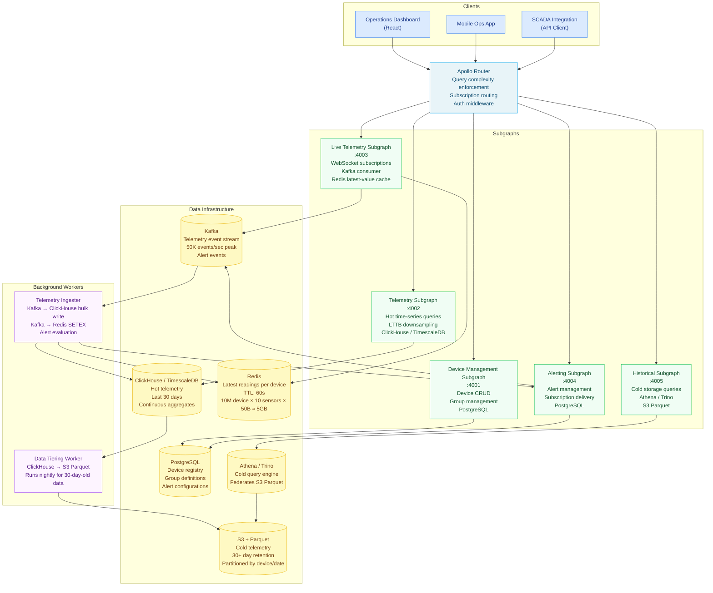

# Scenario 05 — Design a GraphQL API for IoT Telemetry

> **Problem statement:** Design a GraphQL API for an industrial IoT platform. The system
> must support 10 million registered devices, 1 billion telemetry events per day, time-series
> queries over device data, device management CRUD, real-time alert delivery, and per-device
> live telemetry streaming.

---

## Requirements Elicitation

**Functional requirements:**
- Device management: register devices, update configuration, retrieve device status
- Ingest telemetry: devices post telemetry data; the API stores it in the time-series store
- Time-series queries: retrieve sensor readings over a time window, at multiple resolutions
- Live telemetry: subscribe to real-time sensor readings for a device or device group
- Alerting: subscribe to alert events when a device exceeds a threshold
- Device groups: organize devices into logical groups; query aggregate metrics across a group
- Historical data: query events older than 30 days from cold storage (S3/Parquet)

**Non-functional requirements:**
- 10 million registered devices
- 1 billion telemetry events per day = ~11,600 events/second average; peak ~50,000 events/second
- Time-series query latency: < 200ms p99 for hot data (last 30 days)
- Historical query latency: < 30 seconds (cold storage — separate SLO)
- Live telemetry latency: < 5 seconds from device event to client delivery
- Device management CRUD latency: < 500ms
- Availability: 99.9% (operational monitoring — downtime has consequences)
- Max time-series points returned per query: 1,000 (downsampled via LTTB in resolver)

**Out of scope:**
- Device firmware updates (separate OTA system)
- Device-to-device communication (separate MQTT broker)
- Billing and licensing (separate system)

---

## Back-of-the-Envelope

**Ingestion rate:**
- 1 billion events/day = 11,574 events/second average
- Peak factor 4×: ~46,000 events/second
- At 200 bytes per event (device ID, timestamp, sensor type, value, metadata): 9.2MB/second peak
- Per-day storage: 200GB raw, approximately 60GB compressed (zstd)
- Per-year: 22TB raw compressed — requires tiered storage strategy

**Hot vs. cold data split:**
- Hot data (last 30 days): 30 × 200GB ≈ 6TB. Fits in a ClickHouse cluster or TimescaleDB cluster.
- Cold data (30+ days): moved to S3 in Parquet format, queried via Athena/Trino.

**Time-series query math:**
- A device produces 1 event/second on average → 86,400 events/day/device
- A user queries "last 7 days for Device X": 7 × 86,400 = 604,800 raw events
- At 200ms budget: raw scan is infeasible at query time for large time windows
- Solution: materialized downsampled views at 1-minute, 5-minute, 1-hour resolution
  - 1-hour resolution over 7 days: 168 data points → fast query, low memory

**Subscription scale:**
- 1,000 concurrent live telemetry subscriptions × 1 event/second/device = 1,000 messages/second to deliver
- At 40KB per WebSocket connection: 40MB memory at the router
- Kafka fan-out: each subscription is a Kafka consumer group — 1,000 consumers.
  Use a shared consumer group per device with message filtering at the subscription handler.

**DataLoader for device group queries:**
- A group with 500 devices requesting current status: 500 DataLoader keys → 1 batched DB query
  (WHERE device_id = ANY($1)) vs. 500 individual queries

---

## Schema Design

```graphql
type Query {
  # Device Management
  """Fetch a device by ID. Cacheable at router entity cache level."""
  device(id: ID!): Device

  """List devices, optionally filtered by group or status."""
  devices(
    groupId: ID
    status: DeviceStatus
    first: Int = 50
    after: String
  ): DeviceConnection!

  """Fetch a device group with aggregate metrics."""
  deviceGroup(id: ID!): DeviceGroup!

  # Time-Series Queries
  """
  Retrieve time-series data for a single device and sensor.
  Results are capped at 1,000 points — resolver applies LTTB downsampling if needed.
  """
  deviceTimeSeries(
    deviceId: ID!
    sensor: String!
    from: DateTime!
    to: DateTime!
    resolution: TimeResolution = AUTO
    """Maximum points to return. Default and maximum: 1000."""
    maxPoints: Int = 1000
  ): DeviceTimeSeries!

  """
  Aggregate time-series across a device group (e.g., average temperature across a factory floor).
  """
  groupTimeSeries(
    groupId: ID!
    sensor: String!
    from: DateTime!
    to: DateTime!
    aggregate: AggregateFunction = AVG
    resolution: TimeResolution = AUTO
    maxPoints: Int = 1000
  ): DeviceTimeSeries!

  """
  Query historical events from cold storage (S3/Parquet via Athena).
  Higher latency SLO (30s p99) — use for reports, not dashboards.
  """
  historicalEvents(
    deviceId: ID!
    sensor: String!
    from: DateTime!
    to: DateTime!
    first: Int = 1000
    after: String
  ): TelemetryEventConnection!

  # Alerting
  """Active alerts for a device or device group."""
  alerts(
    deviceId: ID
    groupId: ID
    severity: AlertSeverity
    status: AlertStatus = ACTIVE
    first: Int = 20
    after: String
  ): AlertConnection!
}

type Mutation {
  """Register a new device."""
  registerDevice(input: RegisterDeviceInput!): Device!

  """Update device configuration (name, group, tags, thresholds)."""
  updateDevice(id: ID!, input: UpdateDeviceInput!): Device!

  """Deactivate a device (soft delete — retains historical data)."""
  deactivateDevice(id: ID!): Device!

  """Move a device to a different group."""
  moveDeviceToGroup(deviceId: ID!, groupId: ID!): Device!

  """Acknowledge an alert."""
  acknowledgeAlert(alertId: ID!): Alert!
}

type Subscription {
  """
  Live telemetry stream for a single device.
  Delivers events as they arrive — no buffering.
  Kafka consumer → router → WebSocket.
  """
  deviceTelemetry(deviceId: ID!, sensors: [String!]): TelemetryEvent!

  """
  Live alert stream — delivers alert events for a device or device group
  as they are triggered by the alerting engine.
  """
  deviceAlerts(
    deviceId: ID
    groupId: ID
    severity: AlertSeverity
  ): Alert!
}

type Device @key(fields: "id") {
  id: ID!
  externalId: String!          # Customer-defined identifier (serial number, asset tag)
  name: String!
  model: String!
  firmwareVersion: String!
  status: DeviceStatus!
  group: DeviceGroup
  location: DeviceLocation
  tags: [String!]!
  thresholds: [AlertThreshold!]!
  registeredAt: DateTime!
  lastSeenAt: DateTime
  """Latest single reading per sensor — resolved from Redis cache"""
  latestReadings: [SensorReading!]!
  """Time-series data — resolved from hot store on demand"""
  timeSeries(
    sensor: String!
    from: DateTime!
    to: DateTime!
    resolution: TimeResolution = AUTO
    maxPoints: Int = 1000
  ): DeviceTimeSeries!
}

type DeviceGroup @key(fields: "id") {
  id: ID!
  name: String!
  description: String
  devices(first: Int = 50, after: String): DeviceConnection!
  deviceCount: Int!
  """Aggregate metrics across all devices in the group"""
  aggregateReadings(sensors: [String!]!): [AggregatedSensorReading!]!
}

enum DeviceStatus {
  ONLINE
  OFFLINE
  MAINTENANCE
  DECOMMISSIONED
  UNPROVISIONED
}

type DeviceLocation {
  latitude: Float
  longitude: Float
  siteName: String
  building: String
  floor: String
}

type AlertThreshold {
  sensor: String!
  condition: ThresholdCondition!
  value: Float!
  severity: AlertSeverity!
}

enum ThresholdCondition {
  GREATER_THAN
  LESS_THAN
  EQUAL_TO
  NOT_EQUAL_TO
}

enum AlertSeverity {
  INFO
  WARNING
  CRITICAL
}

enum AlertStatus {
  ACTIVE
  ACKNOWLEDGED
  RESOLVED
}

type TelemetryEvent {
  id: ID!
  deviceId: ID!
  sensor: String!
  value: Float!
  unit: String!
  quality: DataQuality!
  timestamp: DateTime!
  metadata: [KeyValuePair!]!
}

enum DataQuality {
  GOOD
  UNCERTAIN
  BAD
}

type SensorReading {
  sensor: String!
  value: Float!
  unit: String!
  timestamp: DateTime!
}

type AggregatedSensorReading {
  sensor: String!
  avgValue: Float!
  minValue: Float!
  maxValue: Float!
  deviceCount: Int!
  timestamp: DateTime!
}

type DeviceTimeSeries {
  deviceId: ID
  groupId: ID
  sensor: String!
  resolution: TimeResolution!
  from: DateTime!
  to: DateTime!
  unit: String!
  """Points returned after LTTB downsampling (max 1000)"""
  points: [TimeSeriesPoint!]!
  """Total raw event count before downsampling"""
  rawEventCount: Int!
}

type TimeSeriesPoint {
  timestamp: DateTime!
  value: Float!
  """Min and max within this bucket — available when resolution > RAW"""
  min: Float
  max: Float
}

enum TimeResolution {
  RAW          # Individual events — only for short windows (< 1 hour)
  ONE_MINUTE
  FIVE_MINUTES
  ONE_HOUR
  ONE_DAY
  AUTO         # Resolver selects based on time window length
}

enum AggregateFunction {
  AVG
  SUM
  MIN
  MAX
  COUNT
}

type Alert @key(fields: "id") {
  id: ID!
  device: Device!
  sensor: String!
  condition: ThresholdCondition!
  threshold: Float!
  triggeredValue: Float!
  severity: AlertSeverity!
  status: AlertStatus!
  triggeredAt: DateTime!
  acknowledgedAt: DateTime
  acknowledgedBy: String
  resolvedAt: DateTime
}

type TelemetryEventConnection {
  edges: [TelemetryEventEdge!]!
  pageInfo: PageInfo!
  totalCount: Int!
}

type TelemetryEventEdge {
  node: TelemetryEvent!
  cursor: String!
}

type DeviceConnection {
  edges: [DeviceEdge!]!
  pageInfo: PageInfo!
  totalCount: Int!
}

type DeviceEdge {
  node: Device!
  cursor: String!
}

type AlertConnection {
  edges: [AlertEdge!]!
  pageInfo: PageInfo!
  totalCount: Int!
}

type AlertEdge {
  node: Alert!
  cursor: String!
}

type KeyValuePair {
  key: String!
  value: String!
}

type PageInfo {
  hasNextPage: Boolean!
  hasPreviousPage: Boolean!
  startCursor: String
  endCursor: String
}

input RegisterDeviceInput {
  externalId: String!
  name: String!
  model: String!
  firmwareVersion: String!
  groupId: ID
  location: DeviceLocationInput
  tags: [String!]
  thresholds: [AlertThresholdInput!]
}

input UpdateDeviceInput {
  name: String
  firmwareVersion: String
  location: DeviceLocationInput
  tags: [String!]
  thresholds: [AlertThresholdInput!]
}

input DeviceLocationInput {
  latitude: Float
  longitude: Float
  siteName: String
  building: String
  floor: String
}

input AlertThresholdInput {
  sensor: String!
  condition: ThresholdCondition!
  value: Float!
  severity: AlertSeverity!
}
```

---

## Architecture



---

## Device Management Subgraph vs. Telemetry Subgraph

The split between device management and telemetry is a data access pattern split, not
purely a domain split.

**Device Management subgraph** owns the device registry in PostgreSQL. Operations are
low-frequency (CRUD at < 500ms), strongly consistent (a device exists or it doesn't),
and require transactional guarantees (moving a device to a group must be atomic).
PostgreSQL is the right database for this subgraph.

**Telemetry subgraph** owns hot time-series data in ClickHouse or TimescaleDB. Operations
are high-frequency reads (hundreds of concurrent time-series queries) against append-only
data. Analytical databases designed for columnar storage and time-series aggregation
outperform PostgreSQL by 10–100× for this access pattern.

Both subgraphs share the `Device` entity via federation. The Device entity's `timeSeries`
field is resolved by the Telemetry subgraph via `@requires`:

```graphql
# device-management subgraph
type Device @key(fields: "id") {
  id: ID!
  externalId: String!
  name: String!
  status: DeviceStatus!
  # ... other management fields
}

# telemetry subgraph — extends Device with time-series field
type Device @key(fields: "id") {
  id: ID! @external
  timeSeries(
    sensor: String!
    from: DateTime!
    to: DateTime!
    resolution: TimeResolution = AUTO
    maxPoints: Int = 1000
  ): DeviceTimeSeries!

  latestReadings: [SensorReading!]!  # From Redis latest-value cache
}
```

---

## LTTB Downsampling in Resolvers

Returning 604,800 raw events for a 7-day window would blow the 100ms latency budget
and the client's rendering budget. The resolver downsamples to `maxPoints` (default 1,000)
using the Largest Triangle Three Buckets (LTTB) algorithm, which preserves visual
fidelity better than simple averaging.

```typescript
// resolvers/lttb-downsampler.ts

interface DataPoint {
  timestamp: number;  // Unix milliseconds
  value: number;
}

/**
 * Largest Triangle Three Buckets (LTTB) downsampling algorithm.
 * Preserves visual shape of the time series with far fewer points.
 *
 * Reference: Sveinn Steinarsson, "Downsampling Time Series for Visual Representation" (2013)
 */
export function lttbDownsample(data: DataPoint[], targetPoints: number): DataPoint[] {
  if (data.length <= targetPoints) return data;
  if (targetPoints <= 2) return [data[0], data[data.length - 1]];

  const sampled: DataPoint[] = [data[0]];
  const bucketSize = (data.length - 2) / (targetPoints - 2);

  let a = 0;  // Index of the last selected point

  for (let i = 0; i < targetPoints - 2; i++) {
    const bucketStart = Math.floor((i + 1) * bucketSize) + 1;
    const bucketEnd = Math.floor((i + 2) * bucketSize) + 1;
    const bucketMiddle = Math.floor((bucketStart + bucketEnd) / 2);

    // Average of the next bucket (lookahead point for triangle calculation)
    let avgX = 0, avgY = 0, count = 0;
    for (let j = bucketStart; j < Math.min(bucketEnd, data.length); j++) {
      avgX += data[j].timestamp;
      avgY += data[j].value;
      count++;
    }
    avgX /= count;
    avgY /= count;

    // Find the point in the current bucket with the largest triangle area
    let maxArea = -1;
    let maxAreaIndex = bucketStart;

    for (let j = bucketStart; j < Math.min(bucketEnd, data.length); j++) {
      // Area of triangle formed by: point a, current point j, and lookahead average
      const area = Math.abs(
        (data[a].timestamp - avgX) * (data[j].value - data[a].value) -
        (data[a].timestamp - data[j].timestamp) * (avgY - data[a].value)
      ) / 2;

      if (area > maxArea) {
        maxArea = area;
        maxAreaIndex = j;
      }
    }

    sampled.push(data[maxAreaIndex]);
    a = maxAreaIndex;
  }

  sampled.push(data[data.length - 1]);
  return sampled;
}
```

The resolver selects the appropriate resolution based on the time window length:

```typescript
// resolvers/device-time-series-resolver.ts
import { lttbDownsample } from './lttb-downsampler';
import { Pool } from 'pg';

const AUTO_RESOLUTION_THRESHOLDS: Array<{ windowMs: number; resolution: string }> = [
  { windowMs:  3_600_000, resolution: 'RAW' },           // < 1 hour → raw events
  { windowMs: 86_400_000, resolution: 'ONE_MINUTE' },    // < 1 day → 1-minute
  { windowMs: 7 * 86_400_000, resolution: 'FIVE_MINUTES' }, // < 7 days → 5-minute
  { windowMs: 30 * 86_400_000, resolution: 'ONE_HOUR' }, // < 30 days → 1-hour
  { windowMs: Infinity, resolution: 'ONE_DAY' },         // >= 30 days → 1-day
];

export async function deviceTimeSeriesResolver(
  _parent: unknown,
  args: {
    deviceId: string;
    sensor: string;
    from: string;
    to: string;
    resolution: string;
    maxPoints: number;
  },
  context: { db: Pool }
): Promise<unknown> {
  const fromMs = new Date(args.from).getTime();
  const toMs = new Date(args.to).getTime();
  const windowMs = toMs - fromMs;

  // Determine resolution for AUTO mode
  let resolution = args.resolution;
  if (resolution === 'AUTO') {
    resolution = AUTO_RESOLUTION_THRESHOLDS.find((t) => windowMs < t.windowMs)!.resolution;
  }

  // Query the appropriate materialized view
  const tableMap: Record<string, string> = {
    RAW:          'telemetry_events',
    ONE_MINUTE:   'telemetry_1min',
    FIVE_MINUTES: 'telemetry_5min',
    ONE_HOUR:     'telemetry_1hr',
    ONE_DAY:      'telemetry_1day',
  };

  const table = tableMap[resolution];

  const { rows } = await context.db.query(
    `SELECT
       toUnixTimestamp64Milli(bucket) AS ts,
       avg_value AS value,
       min_value AS min,
       max_value AS max
     FROM ${table}
     WHERE device_id = $1
       AND sensor = $2
       AND bucket >= $3
       AND bucket < $4
     ORDER BY bucket ASC`,
    [args.deviceId, args.sensor, args.from, args.to]
  );

  const rawPoints = rows.map((r: any) => ({
    timestamp: Number(r.ts),
    value: parseFloat(r.value),
    min: r.min ? parseFloat(r.min) : undefined,
    max: r.max ? parseFloat(r.max) : undefined,
  }));

  // Apply LTTB downsampling if over the point limit
  const maxPoints = Math.min(args.maxPoints, 1000);
  const downsampledPoints =
    rawPoints.length > maxPoints
      ? lttbDownsample(rawPoints, maxPoints)
      : rawPoints;

  return {
    deviceId: args.deviceId,
    sensor: args.sensor,
    resolution,
    from: args.from,
    to: args.to,
    unit: 'celsius',  // In practice, look up unit from device sensor configuration
    points: downsampledPoints.map((p) => ({
      timestamp: new Date(p.timestamp).toISOString(),
      value: p.value,
      min: p.min,
      max: p.max,
    })),
    rawEventCount: rawPoints.length,
  };
}
```

---

## Device Group Queries via DataLoader

A device group with 500 devices requesting `latestReadings` would produce 500 Redis
calls without DataLoader. Batch them into a single MGET:

```typescript
// loaders/device-latest-readings-loader.ts
import DataLoader from 'dataloader';
import { getRedisClient } from '../infrastructure/redis';

interface LatestReading {
  sensor: string;
  value: number;
  unit: string;
  timestamp: string;
}

export function createLatestReadingsLoader() {
  return new DataLoader<string, LatestReading[]>(
    async (deviceIds: readonly string[]) => {
      const redis = getRedisClient();

      // Build keys: latest:{deviceId}:readings
      const keys = deviceIds.map((id) => `latest:${id}:readings`);

      // Single Redis MGET for all devices in this batch
      const values = await redis.mget(...keys);

      return values.map((v) => {
        if (!v) return [];
        try {
          return JSON.parse(v) as LatestReading[];
        } catch {
          return [];
        }
      });
    },
    {
      maxBatchSize: 500,
      cache: true,
    }
  );
}
```

The ingester writes latest readings to Redis on every telemetry event:

```typescript
// workers/ingester.ts — writes latest readings to Redis

async function updateLatestReading(
  deviceId: string,
  sensor: string,
  value: number,
  unit: string,
  timestamp: string,
  redis: any
): Promise<void> {
  const key = `latest:${deviceId}:readings`;

  // WATCH + MULTI/EXEC for atomic read-modify-write of the readings array
  await redis.watch(key);
  const existing = await redis.get(key);
  const readings: any[] = existing ? JSON.parse(existing) : [];

  const idx = readings.findIndex((r) => r.sensor === sensor);
  const updated = { sensor, value, unit, timestamp };

  if (idx >= 0) {
    readings[idx] = updated;
  } else {
    readings.push(updated);
  }

  await redis.multi()
    .set(key, JSON.stringify(readings))
    .expire(key, 120)  // TTL: 120 seconds — if device stops sending, expire the cache entry
    .exec();
}
```

---

## Subscription Model: Live Telemetry

```typescript
// subscriptions/device-telemetry-subscription.ts
import { withFilter } from 'graphql-subscriptions';
import { KafkaPubSub } from '../pubsub/kafka-pubsub';

const pubsub = new KafkaPubSub({
  topic: 'telemetry.events',
  groupId: 'graphql-live-telemetry',
  brokers: process.env.KAFKA_BROKERS!.split(','),
});

export const deviceTelemetrySubscription = {
  Subscription: {
    deviceTelemetry: {
      subscribe: withFilter(
        () => pubsub.asyncIterator('TELEMETRY_EVENT'),
        (
          payload: { event: TelemetryEventPayload },
          args: { deviceId: string; sensors?: string[] }
        ) => {
          // Filter: only deliver events for the subscribed device
          if (payload.event.deviceId !== args.deviceId) return false;

          // Optional sensor filter: only deliver specified sensors
          if (args.sensors?.length && !args.sensors.includes(payload.event.sensor)) {
            return false;
          }

          return true;
        }
      ),
      resolve: (payload: { event: TelemetryEventPayload }) => payload.event,
    },
  },
};

interface TelemetryEventPayload {
  id: string;
  deviceId: string;
  sensor: string;
  value: number;
  unit: string;
  quality: string;
  timestamp: string;
  metadata: Array<{ key: string; value: string }>;
}
```

The `KafkaPubSub` class wraps a Kafka consumer. At 50K events/second peak, the Kafka
consumer must process events fast enough to avoid lag. Each `deviceTelemetry` subscription
filters at the subscription handler — the Kafka consumer receives all events but only
publishes the matching ones to the connected WebSocket.

---

## Data Tiering

Data older than 30 days is moved from ClickHouse to S3 in Parquet format. The Historical
subgraph queries S3 via Athena or Trino.

```typescript
// workers/data-tiering.ts

export async function tierOldData(
  clickhouse: any,
  s3: any,
  date: Date
): Promise<{ rowsMoved: number; sizeBytes: number }> {
  const dateStr = date.toISOString().slice(0, 10);

  // Export from ClickHouse to S3 as Parquet
  // ClickHouse native S3 export: fast, no intermediate storage
  await clickhouse.query(`
    INSERT INTO FUNCTION s3(
      'https://s3.amazonaws.com/${process.env.S3_BUCKET}/telemetry/date=${dateStr}/data.parquet',
      '${process.env.AWS_ACCESS_KEY_ID}',
      '${process.env.AWS_SECRET_ACCESS_KEY}',
      'Parquet'
    )
    SELECT device_id, sensor, value, unit, quality, timestamp, metadata
    FROM telemetry_events
    WHERE toDate(timestamp) = '${dateStr}'
  `);

  // Count moved rows for verification
  const { data: countResult } = await clickhouse.query(`
    SELECT count() AS n FROM telemetry_events WHERE toDate(timestamp) = '${dateStr}'
  `);
  const rowsMoved = countResult[0].n;

  // Delete from ClickHouse after verifying S3 export
  await clickhouse.query(`
    ALTER TABLE telemetry_events DELETE WHERE toDate(timestamp) = '${dateStr}'
  `);

  return { rowsMoved, sizeBytes: 0 };  // sizeBytes from S3 HeadObject in practice
}
```

Athena is registered over the S3 prefix with a partition scheme:
`s3://bucket/telemetry/date={YYYY-MM-DD}/data.parquet`

Athena partition projection automatically discovers new partitions:

```sql
CREATE EXTERNAL TABLE telemetry_historical (
  device_id   STRING,
  sensor      STRING,
  value       DOUBLE,
  unit        STRING,
  quality     STRING,
  timestamp   TIMESTAMP,
  metadata    STRING
)
PARTITIONED BY (date STRING)
STORED AS PARQUET
LOCATION 's3://iot-data-prod/telemetry/'
TBLPROPERTIES (
  'projection.enabled' = 'true',
  'projection.date.type' = 'date',
  'projection.date.range' = '2020-01-01,NOW',
  'projection.date.format' = 'yyyy-MM-dd',
  'storage.location.template' = 's3://iot-data-prod/telemetry/date=${date}/'
);
```

---

## Trade-off Analysis

| Decision | Trade-off Accepted |
|---|---|
| 5 subgraphs (device / telemetry / live / alert / historical) | Operational overhead of 5 services vs. better isolation between write-heavy (device CRUD), read-heavy analytical (telemetry), real-time streaming (live), and cold-path (historical) access patterns. Each subgraph can be scaled independently. |
| ClickHouse for hot telemetry | ClickHouse requires operational expertise (ZooKeeper for replication, column-oriented data model). Accepted because PostgreSQL cannot sustain 50K inserts/second for time-series data at this scale. |
| LTTB downsampling capped at 1,000 points | Users cannot retrieve more than 1,000 raw time-series points in a single query. For a 7-day window this means ~10-minute effective resolution. Accepted because browsers cannot render more than 1,000 points meaningfully on a chart, and the resolver's AUTO resolution selects the appropriate pre-aggregated view anyway. |
| Redis latest-value with 120s TTL | Latest readings disappear 2 minutes after a device goes offline. Clients see stale "last seen" data until it expires, then null. Accepted because the alternative (checking device status on every read) requires an additional database call on every `latestReadings` field resolution. |
| Cold storage queries via Athena (30s p99) | Historical queries are slow by design. This is communicated in the schema documentation and the API SLO. Clients must not use historical queries in dashboard render loops. |

---

## References and Related Topics

- [Performance and Scaling](../06-performance-and-scaling/README.md) — DataLoader patterns, N+1 avoidance
- [Design: Real-Time Dashboard](./03-design-realtime-dashboard.md) — subscription vs. polling trade-off
- [Design: E-Commerce Search](./02-design-ecommerce-search.md) — hot/warm/cold data tier pattern
- [Federation](../07-federation/README.md) — cross-subgraph entity resolution (`Device` entity)
- [Chapter 22: RAG and Vector Search](../22-rag-and-vector-search/README.md) — LLM patterns over time-series data (anomaly detection, natural language queries over IoT data)
- [Supergraph Architecture](../08-supergraph-architecture/README.md) — router subscription routing, query complexity enforcement
