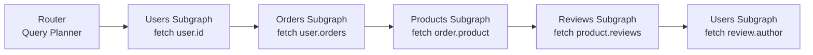

# Federation Patterns

> **Purpose:** This document covers seven federation-specific design patterns for enterprise GraphQL. Federation distributes schema ownership across teams, but distribution introduces coordination challenges: who owns which entity, how do subgraphs share data, how do you prevent name collisions, and how do you expose different schema surfaces to different consumers. Each pattern is documented with working SDL examples and trade-offs. Prerequisites: [Chapter 07: Apollo Federation v2](../07-federation/README.md).

---

## Pattern 1: Entity Extension Pattern

### Problem

The Orders subgraph needs to add `orderHistory` to the `User` type. The `User` type is owned by the Users subgraph. Without federation, one team would need to merge their code into the other team's repository, or one subgraph would need to call the other's API and then serve both domains. Neither option scales.

### Solution

Declare the entity in the owning subgraph with `@key`. Extend it in the contributing subgraph using a stub type with the same `@key`. Add new fields to the stub. The router fetches the base entity from the owning subgraph and composes the new fields from the extending subgraph.

```graphql
# users-subgraph/schema.graphql — the owner
type User @key(fields: "id") {
  id: ID!
  email: Email!
  displayName: String!
  createdAt: ISO8601DateTime!
}
```

```graphql
# orders-subgraph/schema.graphql — the extender
# The stub declares only the @key field(s) — it does not re-declare User's own fields
extend type User @key(fields: "id") {
  id: ID! @external           # @external: this field comes from the owning subgraph
  orders(first: Int, after: String): OrderConnection!
  orderCount: Int!
  totalSpent: Money!
}
```

The Orders subgraph must implement a `__resolveReference` function for the `User` stub so the router can resolve User entities that arrive via the federation `_entities` query:

```typescript
// orders-subgraph/resolvers/User.ts
export const UserResolvers = {
  User: {
    // The router sends { __typename: 'User', id: '...' }
    // We only need the id to resolve the orders fields
    __resolveReference: async (reference: { id: string }, context: OrdersContext) => {
      // Return the reference itself — we don't need to load the User object.
      // The orders fields will be resolved by their own resolvers with order.userId.
      return reference;
    },

    orders: async (user: { id: string }, args: ConnectionArgs, context: OrdersContext) => {
      return context.repositories.order.findByUserId(user.id, args);
    },

    orderCount: async (user: { id: string }, _args: unknown, context: OrdersContext) => {
      return context.repositories.order.countByUserId(user.id);
    },

    totalSpent: async (user: { id: string }, _args: unknown, context: OrdersContext) => {
      return context.repositories.order.sumByUserId(user.id);
    },
  },
};
```

### Trade-offs

| Gain | Cost |
|---|---|
| Teams add fields to shared entities without cross-team code changes | The router must make a round-trip to the extending subgraph for these fields |
| Entity ownership remains with the original team | The extending subgraph must implement `__resolveReference` for the entity |
| Schema composition validates that `@key` fields match across subgraphs | Circular extension dependencies create query plan cycles |

### When to Use

- Any case where Team A owns an entity and Team B needs to add domain-specific fields to it
- Cross-domain relationship fields (e.g., `User.orders`, `Product.inventory`, `Customer.supportTickets`)

### When Not to Use

- When the extending subgraph needs more than just the `@key` field to resolve its additions — use the Computed Field pattern instead
- When the number of extending subgraphs for one entity exceeds ~10 — each extension adds a hop to the query plan

---

## Pattern 2: Computed Field Pattern

### Problem

The Fulfillment subgraph needs to add `estimatedDeliveryDays: Int` to the `Order` type. But this calculation requires `order.shippingAddress` (owned by the Orders subgraph) and `order.warehouseId` (also from Orders). The Fulfillment subgraph cannot compute this field without data from Orders.

### Solution

Use `@requires` to declare which fields the extending subgraph needs the router to fetch first. The router fetches the required fields from the owning subgraph and includes them in the `_entities` representation sent to the extending subgraph.

```graphql
# orders-subgraph/schema.graphql
type Order @key(fields: "id") {
  id: ID!
  status: OrderStatus!
  shippingAddress: Address!
  warehouseId: ID!
  total: Money!
}
```

```graphql
# fulfillment-subgraph/schema.graphql
extend type Order @key(fields: "id") {
  id: ID! @external
  shippingAddress: Address! @external   # declared external — owned by Orders
  warehouseId: ID! @external            # declared external — owned by Orders

  # @requires lists the fields that must be fetched from Orders before this resolver runs
  estimatedDeliveryDays: Int @requires(fields: "shippingAddress { postalCode country } warehouseId")

  # Another computed field using only the key
  fulfillmentStatus: FulfillmentStatus
}
```

The `__resolveReference` and field resolver receive the required fields as part of the entity representation:

```typescript
// fulfillment-subgraph/resolvers/Order.ts
interface OrderRepresentation {
  id: string;
  // These are provided by the router because of @requires
  shippingAddress?: { postalCode: string; country: string };
  warehouseId?: string;
}

export const OrderResolvers = {
  Order: {
    __resolveReference: async (representation: OrderRepresentation) => {
      // Return the representation — the required fields are already present
      return representation;
    },

    estimatedDeliveryDays: async (
      order: OrderRepresentation,
      _args: unknown,
      context: FulfillmentContext
    ) => {
      // shippingAddress and warehouseId are guaranteed present due to @requires
      if (!order.shippingAddress || !order.warehouseId) {
        return null;
      }
      return context.services.shipping.calculateDays(
        order.warehouseId,
        order.shippingAddress.postalCode,
        order.shippingAddress.country
      );
    },
  },
};
```

### Trade-offs

| Gain | Cost |
|---|---|
| Computed fields can depend on data from the owning subgraph | `@requires` adds a sequential fetch step to the query plan — latency increases |
| The computation lives in the domain that owns the business logic | `@external` declarations must exactly match the owning subgraph's type definition |
| Schema composition validates the `@requires` field paths | If the required fields are expensive to fetch, all queries for this computed field pay that cost |

### When to Use

- Fields in one subgraph that are functions of data in another subgraph
- Domain-specific computations that are the clear responsibility of one team but depend on another team's data

### When Not to Use

- When the required data fetch is expensive and the computed field is infrequently requested — consider moving the computation to a service call at query time instead
- When the dependency creates a circular chain between subgraphs

---

## Pattern 3: Interface Object Pattern

### Problem

Multiple subgraphs implement types that all represent "shippable items" — `Product`, `DigitalDownload`, and `GiftCard`. A Shipping subgraph needs to handle all three types uniformly but doesn't want to re-implement the full entity resolution for each type. In Apollo Federation v2, the `@interfaceObject` directive addresses exactly this case.

### Solution

Define the interface in a shared subgraph (or the most appropriate owning subgraph). Implementing subgraphs contribute their types. The Shipping subgraph uses `@interfaceObject` to add fields to the interface without knowing which concrete types implement it.

```graphql
# catalog-subgraph/schema.graphql — defines the interface and base concrete types
interface ShippableItem @key(fields: "id") {
  id: ID!
  weight: Float!
  dimensions: Dimensions!
}

type Product implements ShippableItem @key(fields: "id") {
  id: ID!
  weight: Float!
  dimensions: Dimensions!
  name: String!
  sku: String!
}

type GiftCard implements ShippableItem @key(fields: "id") {
  id: ID!
  weight: Float!
  dimensions: Dimensions!
  denomination: Money!
  code: String!
}
```

```graphql
# shipping-subgraph/schema.graphql
# @interfaceObject lets this subgraph treat ShippableItem uniformly
# without enumerating Product, GiftCard, etc.
type ShippableItem @interfaceObject @key(fields: "id") {
  id: ID!
  shippingClass: ShippingClass!
  estimatedWeight: Float!
  requiresSignature: Boolean!
}
```

```typescript
// shipping-subgraph/resolvers/ShippableItem.ts
export const ShippableItemResolvers = {
  ShippableItem: {
    __resolveReference: async (ref: { id: string }) => ref,

    shippingClass: async (item: { id: string }, _args: unknown, context: ShippingContext) => {
      return context.services.shipping.getShippingClass(item.id);
    },

    requiresSignature: async (item: { id: string }, _args: unknown, context: ShippingContext) => {
      return context.services.shipping.requiresSignature(item.id);
    },
  },
};
```

### Trade-offs

| Gain | Cost |
|---|---|
| A subgraph can contribute to an interface without listing all implementing types | Requires Apollo Federation v2.3+ — not supported in v1 |
| Adding a new implementing type does not require changes to the @interfaceObject subgraph | The @interfaceObject subgraph cannot access type-specific fields |
| Clean separation of cross-cutting concerns | Schema composition is more complex to reason about |

### When to Use

- Cross-cutting concerns (shipping, pricing, auditing) that apply uniformly to multiple entity types
- Teams that own a domain service that handles multiple entity types

---

## Pattern 4: Stub Subgraph Pattern

### Problem

A monolithic GraphQL service is being decomposed into subgraphs. The Orders team wants to own the `Order` entity, but the migration is not complete. Other teams are already building features that reference `Order`. Composition fails if the entity is declared without an implementing subgraph. The migration needs months, but the rest of the organization cannot block on it.

### Solution

Create a **stub subgraph** that declares entity ownership with `@key` and implements a minimal `__resolveReference` that delegates to the monolith. The stub claims the namespace; the monolith remains the data source during migration. Teams replace the stub's delegation resolver with native data access as migration progresses.

```graphql
# orders-stub-subgraph/schema.graphql
# Minimal stub: declares the entity and its key
type Order @key(fields: "id") {
  id: ID!
  status: OrderStatus!
  total: Money!
  createdAt: ISO8601DateTime!
}

enum OrderStatus {
  PENDING
  CONFIRMED
  SHIPPED
  DELIVERED
  CANCELLED
}
```

```typescript
// orders-stub-subgraph/resolvers/Order.ts
// Phase 1: delegate to the monolith REST API
export const OrderResolvers = {
  Order: {
    __resolveReference: async (
      ref: { id: string },
      context: StubContext
    ): Promise<Order | null> => {
      // During migration, fetch from the monolith
      const response = await context.monolithClient.get(`/internal/orders/${ref.id}`);
      if (response.status === 404) return null;
      return mapMonolithOrderToGraphQLOrder(await response.json());
    },
  },
};

// Phase 2 (later): replace monolith delegation with native repository
// export const OrderResolvers = {
//   Order: {
//     __resolveReference: async (ref, context) =>
//       context.repositories.order.findById(ref.id),
//   },
// };
```

Track migration progress with comments in the resolver file and a migration ADR.

### Trade-offs

| Gain | Cost |
|---|---|
| Teams can start building features against the federated entity immediately | Two data paths during migration — potential for inconsistency |
| Composition succeeds from day one | Stub adds a hop in the query plan |
| Migration is incremental and reversible | Stub must be maintained and eventually deleted |

### When to Use

- Monolith decomposition into federation — always use stubs to claim entity ownership before migration is complete
- Team reorganizations where entity ownership is changing but the implementation hasn't moved yet

---

## Pattern 5: Fan-out Entity Resolution

### Problem

A query `{ user { orders { product { reviews { author { name } } } } } }` requires entity resolution from the Users, Orders, Products, Reviews, and Users (again) subgraphs. The router's query planner generates a sequence of fetch nodes where each depends on the previous. At 5 sequential hops × 20ms per subgraph round-trip = 100ms of pure overhead before any business logic executes.

### Solution

Understand the query plan, identify sequential fan-out, and restructure either the schema or the query to enable parallelism.



Mitigation 1: **Denormalize at write time.** Store `authorName` directly on the `Review` object. Avoid the final hop.

Mitigation 2: **Add a query shortcut field.** Instead of traversing the full graph, add a root query field that fetches the needed data with a server-side join:

```graphql
# Instead of forcing clients to traverse 5 levels deep:
type Query {
  # Direct query that the Reviews subgraph resolves with a JOIN
  productReviewsWithAuthors(productId: ID!, first: Int, after: String): ReviewConnection!
}
```

Mitigation 3: **Use `@provides`** to allow the router to skip a fetch hop when the data is already available:

```graphql
# orders-subgraph/schema.graphql
# @provides tells the router: when fetching orders.product, we can provide
# product.name and product.sku — no need to fetch from Products subgraph
extend type Order @key(fields: "id") {
  id: ID! @external
  product: Product! @provides(fields: "name sku")
}

extend type Product @key(fields: "id") {
  id: ID!
  name: String! @external
  sku: String! @external
}
```

Monitor query plan depth with router metrics:

```promql
# Alert when query plans have more than 4 sequential fetch levels
histogram_quantile(0.99, rate(apollo_router_query_planning_time_seconds_bucket[5m]))
  > 0.1

# Track entity resolution depth
apollo_router_query_plan_fetch_nodes_total{type="sequential"} > 4
```

### Trade-offs

| Gain | Cost |
|---|---|
| Deep graph traversal is a natural GraphQL capability | Each sequential hop adds latency — 3+ sequential hops is a performance concern |
| `@provides` eliminates hops without schema changes | `@provides` adds SDL complexity and requires the owning subgraph to re-provide fields |
| Root query shortcuts maintain clean separation | Shortcut fields may duplicate logic from deep traversal paths |

### When to Use / When Not to Use

Fan-out itself is not optional — it is a natural consequence of federated entity resolution. The pattern is about managing it: add `@provides` for frequent deep paths, add shortcut root query fields for performance-critical paths, and instrument query plans in CI to catch regressions.

---

## Pattern 6: Schema Contract Pattern

### Problem

An enterprise supergraph serves three consumer types: external third-party developers, internal mobile apps, and internal microservices. External developers must not see internal administrative fields. Mobile apps need a subset of the schema optimized for their bandwidth constraints. Internal microservices need the full schema. Serving all three from one supergraph SDL creates audit and access control problems.

### Solution

Use `@tag` annotations to label fields for specific audiences, and use Apollo GraphOS contract graphs to derive filtered schemas per audience.

```graphql
# products-subgraph/schema.graphql
type Product @key(fields: "id") {
  id: ID!
  name: String!
  description: String!
  price: Money!

  # Public API fields — visible to external developers
  publicCatalogUrl: URL! @tag(name: "public")

  # Mobile-specific field — lightweight representation for small screens
  thumbnailUrl: URL @tag(name: "mobile") @tag(name: "public")

  # Internal-only fields — never exposed to external developers
  costPrice: Money! @tag(name: "internal")
  supplierCode: String! @tag(name: "internal")
  warehouseStockLevel: Int! @tag(name: "internal")
  adminNotes: String @tag(name: "internal")
}

type Query {
  products(filter: ProductFilterInput, first: Int, after: String): ProductConnection!
  # Admin query — internal only
  productsWithCost(filter: ProductFilterInput): [Product!]! @tag(name: "internal")
}
```

Contract configuration in Apollo GraphOS (YAML representation):

```yaml
# contract-public-api.yaml
name: public-api
filter:
  include:
    - public
  exclude:
    - internal

# contract-mobile-bff.yaml
name: mobile-bff
filter:
  include:
    - mobile
    - public
  exclude:
    - internal
```

The router can be configured to serve different contract graphs to different consumer segments using header-based routing or separate router deployments.

### Trade-offs

| Gain | Cost |
|---|---|
| Single supergraph maintained by all teams; multiple contracts derived automatically | `@tag` annotations must be maintained alongside field definitions |
| External consumers cannot introspect internal fields | Requires Apollo GraphOS for contract graph management |
| Breaking changes to internal fields do not affect external contracts | Teams must understand which tags apply to their fields |

### When to Use

- Supergraphs serving multiple consumer types with different trust levels
- APIs with a public/private split where regulatory or contractual requirements demand separation

---

## Pattern 7: Subgraph Namespacing

### Problem

The Catalog team adds `createProduct` to the Mutation type. The Inventory team also adds `createProduct`. The Fulfillment team adds `update` (too generic). At composition, Apollo Router rejects duplicate mutation field names. Teams must now coordinate naming across service boundaries.

### Solution

Prefix all mutation fields with the subgraph's domain name. All mutations from the Orders subgraph start with `order*` or `orders*`. All mutations from the Catalog subgraph start with `catalog*`. Teams own their namespace.

```graphql
# catalog-subgraph/schema.graphql — all mutations prefixed with "catalog"
type Mutation {
  catalogCreateProduct(input: CatalogCreateProductInput!): CatalogCreateProductResult!
  catalogUpdateProduct(id: ID!, input: CatalogUpdateProductInput!): CatalogUpdateProductResult!
  catalogArchiveProduct(id: ID!): CatalogArchiveProductResult!
  catalogPublishProduct(id: ID!): CatalogPublishProductResult!
}

# orders-subgraph/schema.graphql — all mutations prefixed with "order"
type Mutation {
  orderCreate(input: CreateOrderInput!): CreateOrderResult!
  orderCancel(id: ID!, reason: CancelReason!): CancelOrderResult!
  orderFulfill(id: ID!): FulfillOrderResult!
  orderRefund(id: ID!, input: RefundInput!): RefundResult!
}

# inventory-subgraph/schema.graphql
type Mutation {
  inventoryAdjustStock(productId: ID!, delta: Int!, reason: String!): InventoryAdjustResult!
  inventoryReserve(productId: ID!, quantity: Int!, orderId: ID!): ReservationResult!
  inventoryRelease(reservationId: ID!): ReleaseResult!
}
```

Alternatively, use **nested mutation objects** (a popular alternative pattern):

```graphql
# Root mutation wraps domain objects — cleaner for clients, more complex to federate
type Mutation {
  catalog: CatalogMutations!
  order: OrderMutations!
  inventory: InventoryMutations!
}

type CatalogMutations {
  createProduct(input: CatalogCreateProductInput!): CatalogCreateProductResult!
  updateProduct(id: ID!, input: CatalogUpdateProductInput!): CatalogUpdateProductResult!
}

type OrderMutations {
  create(input: CreateOrderInput!): CreateOrderResult!
  cancel(id: ID!, reason: CancelReason!): CancelOrderResult!
}
```

Note: nested mutation objects require careful federation handling because intermediate mutation objects are not real resolvers — they must return non-null empty objects to allow field traversal.

### Trade-offs — Prefix Approach

| Gain | Cost |
|---|---|
| Simple to implement — just a naming convention | Mutation names are long — `catalogCreateProduct` instead of `createProduct` |
| Works naturally with Apollo Federation composition | Teams must enforce the convention in code review |
| Easy to search and understand by domain | |

### Trade-offs — Nested Object Approach

| Gain | Cost |
|---|---|
| Clean client API: `mutation { catalog { createProduct } }` | Requires careful handling in federation — intermediate types must be declared consistently |
| Autocompletion groups mutations by domain | Serial mutation execution still applies — nested mutations do not execute in parallel |

### When to Use

- Any federated supergraph with more than two teams contributing mutations
- When mutation names would otherwise collide at composition

### When Not to Use

- Single-team subgraphs where there is no collision risk
- External APIs where long prefixed names would be confusing to third-party developers — use the contract pattern to expose clean public names
