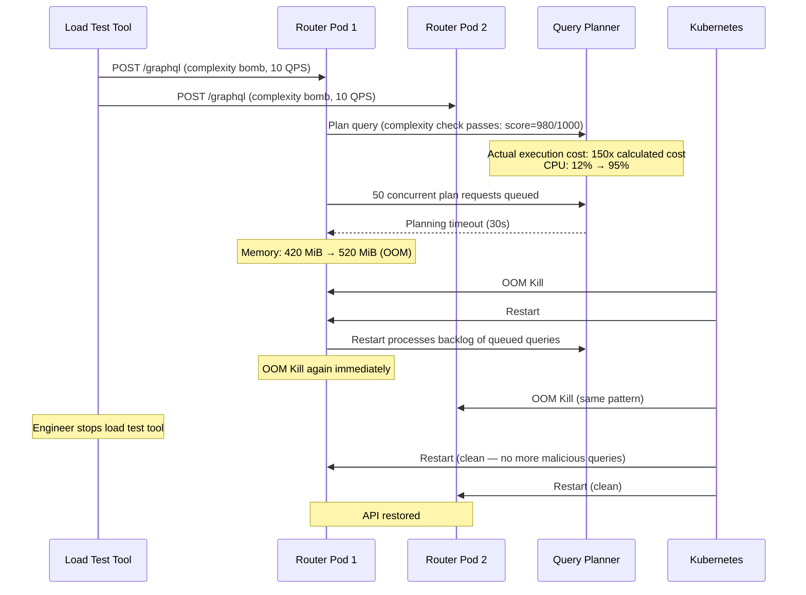

# Failure Scenario 01: The Query Complexity Bomb

> **Purpose:** This post-mortem documents an incident in which a crafted GraphQL query using aliases and fragment spreads bypassed the complexity calculation, causing query planner CPU exhaustion and cascading router pod OOM kills. It covers the timeline, root cause in the complexity algorithm, detection signals, immediate mitigation, the engineering fix, and the prevention measures added to the CI pipeline.

---

## Scenario Summary

A single malicious query — sent by a misconfigured internal load test tool that was incorrectly pointed at the production environment — exploited a gap in the router's complexity calculation. The query used **aliased field repetition with fragment spreads** to multiply its actual execution cost by a factor of 150x compared to the calculated cost. The query planner's CPU spiked to 100%, causing query planning timeouts. Router pods began OOM-killing. The production GraphQL API was unavailable for 18 minutes.

---

## System State Before the Incident

| Component | Configuration |
|---|---|
| Apollo Router | 1.38.0 |
| Complexity limit | 1000 (per field, not per alias) |
| Depth limit | 15 |
| Alias limit | Not configured |
| Fragment spread limit | Not configured |
| Query timeout | 30 seconds |
| Router pod memory | 512 MiB limit |
| Router replicas | 4 |
| Complexity calculation algorithm | `@cost` directive, summing per unique field |

The complexity calculation summed costs per unique field name — not per alias. An aliased repetition of the same field was counted once in the complexity budget.

---

## Incident Timeline

| Time (UTC) | Event |
|---|---|
| 14:22:03 | Load test tool started by engineer, incorrectly targeting `graphql.prod.internal` instead of `graphql.staging.internal` |
| 14:22:05 | First complexity bomb queries arrive at the router (10 QPS) |
| 14:22:08 | Router CPU climbs from 12% to 95% across all 4 pods |
| 14:22:15 | Query planning timeout errors begin appearing in router logs |
| 14:22:31 | First router pod OOM killed — memory exceeded 512 MiB during query plan serialization |
| 14:22:45 | Kubernetes restarts the pod — it begins processing backlogged queries and OOMs again |
| 14:23:10 | Second router pod OOM killed; k8s cluster autoscaler begins provisioning new pods |
| 14:23:40 | PagerDuty alert fires: `graphql_router_error_rate > 0.15` for 2 minutes |
| 14:24:05 | On-call engineer acknowledges alert |
| 14:24:30 | Third and fourth router pods OOM; API fully unavailable |
| 14:25:00 | On-call engineer identifies load test tool as the source via router access logs |
| 14:25:15 | Load test tool stopped |
| 14:25:20 | Router pods begin restarting successfully (no more malicious queries) |
| 14:27:00 | 2 of 4 router pods healthy — API partially available |
| 14:29:00 | All 4 pods healthy — API fully restored |
| 14:40:35 | Incident declared closed (18 minutes of full unavailability) |

---

## Incident Propagation Diagram



---

## The Complexity Bomb: Technical Root Cause

The malicious query used aliases and fragment spreads to amplify its cost beyond what the complexity calculator measured:

```graphql
# This query has a calculated complexity of ~950 (under the 1000 limit)
# but an actual planning and execution cost 150x higher

fragment DeepProduct on Product {
  id name description
  category { id name parent { id name parent { id name } } }
  reviews(first: 10) {
    edges {
      node {
        id body rating
        author { id displayName email }
      }
    }
  }
  variants { id sku price { amount currency } }
}

query ComplexityBomb {
  p1: product(id: "1") { ...DeepProduct }
  p2: product(id: "2") { ...DeepProduct }
  p3: product(id: "3") { ...DeepProduct }
  # ... repeated 50 times with different aliases
  p50: product(id: "50") { ...DeepProduct }
}
```

The complexity calculation counted `product` once (cost: 1), and the `DeepProduct` fragment once (cost: ~18 fields). Total calculated complexity: 1 + 18 = 19. Multiplied by 50 aliases: still 19 in the broken implementation, because aliases were not counted separately.

**Correct calculation:** Fragment spreads must be counted per alias. The correct complexity = (1 + 18) × 50 = 950 fields × depth multiplier = well over 1000.

Additionally, the fragment was used 50 times but the router's query planner had to serialize, validate, and plan 50 parallel `product` fetches, each with the full `DeepProduct` expansion. Memory consumption during planning was proportional to the number of aliased field expansions, not the calculated complexity score.

---

## Detection Signals

The following metrics fired during the incident. Each should have a PagerDuty alert configured.

### Signals that fired

| Metric | Threshold | Triggered |
|---|---|---|
| `apollo_router_http_requests_error_rate` > 15% | 2 minutes | 14:23:40 |
| Router pod OOM (Kubernetes event) | Any OOM | 14:22:31 |

### Signals that should have fired earlier

| Metric | Alert Condition | Why It Would Have Caught This Earlier |
|---|---|---|
| `apollo_router_query_planning_time_seconds_p99` | > 500ms for 1 minute | Planning time spiked at 14:22:10 |
| `apollo_router_processing_time_seconds_p99` | > 2s for 1 minute | Processing time spiked at 14:22:08 |
| `process_resident_memory_bytes` per router pod | > 400 MiB | Memory crossed this at 14:22:25 |

---

## PromQL Alert Rules

```promql
# 1. Alert on query planning p99 latency spike (early warning)
alert: GraphQLQueryPlanningLatencyHigh
expr: |
  histogram_quantile(0.99,
    rate(apollo_router_query_planning_time_seconds_bucket[5m])
  ) > 0.5
for: 1m
labels:
  severity: warning
annotations:
  summary: "GraphQL query planning p99 latency > 500ms"
  description: "Possible complexity bomb or planning regression. Check active queries."

# 2. Alert on router memory approaching OOM threshold
alert: GraphQLRouterMemoryHigh
expr: |
  process_resident_memory_bytes{job="apollo-router"}
    / container_spec_memory_limit_bytes{container="router"}
  > 0.75
for: 2m
labels:
  severity: critical
annotations:
  summary: "Apollo Router memory > 75% of limit"

# 3. Alert on elevated error rate (the alert that actually fired)
alert: GraphQLRouterErrorRateHigh
expr: |
  rate(apollo_router_http_requests_total{status=~"5.."}[5m])
    / rate(apollo_router_http_requests_total[5m])
  > 0.15
for: 2m
labels:
  severity: page
annotations:
  summary: "GraphQL Router error rate > 15%"

# 4. Alert on query complexity near limit (catch before bomb lands)
alert: GraphQLQueryComplexityNearLimit
expr: |
  histogram_quantile(0.99,
    rate(apollo_router_query_complexity_score_bucket[5m])
  ) > 800
for: 5m
labels:
  severity: warning
annotations:
  summary: "GraphQL query p99 complexity score > 800 (limit: 1000)"
```

---

## Immediate Mitigation (During Incident)

**Time to execute: under 5 minutes**

1. **Stop the traffic source.** Check router access logs for the client IP or `x-client-name` header sending abnormal query patterns:
   ```bash
   # Apollo Router structured logs
   kubectl logs -l app=apollo-router --since=5m | \
     jq -r 'select(.query_complexity > 500) | [.client_ip, .query_complexity, .query_hash] | @tsv' | \
     sort -k2 -rn | head -20
   ```

2. **Add a temporary IP block via router YAML** (if external traffic):
   ```yaml
   # router-override.yaml — applied via hot reload or router restart
   traffic_shaping:
     all:
       global_rate_limit:
         capacity: 100
         interval: 1s
   ```

3. **Add an operation block via persisted query deny-list** (if the query can be identified by hash):
   ```bash
   rover persisted-queries publish \
     --graph-id YOUR_GRAPH_ID \
     --list-id deny-list \
     --manifest manifest.json   # contains { "hash": "sha256:...", "blocked": true }
   ```

4. **Temporarily lower the complexity limit** to buy time:
   ```yaml
   # router.yaml
   limits:
     max_depth: 8          # reduce from 15
     max_aliases: 10       # add new limit
     max_complexity: 200   # reduce from 1000 temporarily
   ```

---

## Remediation (The Engineering Fix)

### Fix 1: Correct the complexity calculation to account for aliases

The complexity algorithm was patched to multiply fragment costs by the number of aliases that spread the fragment:

```typescript
// Before (broken): fragment counted once regardless of alias count
function calculateComplexity(selectionSet: SelectionSetNode): number {
  let cost = 0;
  for (const selection of selectionSet.selections) {
    if (selection.kind === 'Field') {
      cost += getFieldCost(selection);
    } else if (selection.kind === 'FragmentSpread') {
      cost += getFragmentCost(selection.name.value); // counted once — WRONG
    }
  }
  return cost;
}

// After (correct): each aliased field or spread is counted independently
function calculateComplexity(
  selectionSet: SelectionSetNode,
  fragments: Map<string, FragmentDefinitionNode>,
  depth: number = 0
): number {
  let cost = 0;
  for (const selection of selectionSet.selections) {
    if (selection.kind === 'Field') {
      const fieldCost = getFieldCost(selection) * Math.pow(2, depth);
      cost += fieldCost;
      if (selection.selectionSet) {
        cost += calculateComplexity(selection.selectionSet, fragments, depth + 1);
      }
    } else if (selection.kind === 'FragmentSpread') {
      // Each spread counts independently — no deduplication
      const fragment = fragments.get(selection.name.value);
      if (fragment) {
        cost += calculateComplexity(fragment.selectionSet, fragments, depth);
      }
    }
  }
  return cost;
}
```

### Fix 2: Add alias and fragment spread limits to the router

```yaml
# router.yaml
limits:
  max_depth: 10
  max_aliases: 30          # new: prevents alias explosion
  max_complexity: 500      # reduced from 1000
  max_root_fields: 10      # new: prevents many top-level fields
  max_query_length: 8192   # new: reject excessively long query strings
```

### Fix 3: Add per-query memory budget in the query planner

Configure the router to reject queries that would produce query plans exceeding a serialized size threshold.

---

## Prevention (What We Changed After the Incident)

### Prevention 1: Complexity testing in CI pipeline

A new CI step runs pathological test queries against the staging router before every production deploy:

```bash
#!/usr/bin/env bash
# ci/test-complexity-limits.sh
set -e

ROUTER_URL="${STAGING_ROUTER_URL:-http://localhost:4000}"

# Alias explosion attack
RESPONSE=$(curl -s -X POST "$ROUTER_URL/graphql" \
  -H "Content-Type: application/json" \
  -d @ci/complexity-test-queries/alias-explosion.json)

if echo "$RESPONSE" | jq -e '.errors[0].extensions.code == "MAX_ALIASES_EXCEEDED"' > /dev/null; then
  echo "PASS: alias explosion correctly rejected"
else
  echo "FAIL: alias explosion was not rejected"
  echo "$RESPONSE"
  exit 1
fi

# Fragment spread bomb
RESPONSE=$(curl -s -X POST "$ROUTER_URL/graphql" \
  -H "Content-Type: application/json" \
  -d @ci/complexity-test-queries/fragment-bomb.json)

if echo "$RESPONSE" | jq -e '.errors[0].extensions.code == "MAX_COMPLEXITY_EXCEEDED"' > /dev/null; then
  echo "PASS: fragment bomb correctly rejected"
else
  echo "FAIL: fragment bomb was not rejected"
  exit 1
fi

echo "All complexity limit tests passed"
```

### Prevention 2: Load test environment isolation

Engineering policy change: load test configuration files must specify environment explicitly. No default environment is assumed. CI validates that load test configs reference `staging` or `local` targets:

```yaml
# .github/workflows/check-load-test-config.yml
- name: Validate load test targets
  run: |
    for config in load-tests/**/*.yaml; do
      TARGET=$(yq e '.target' "$config")
      if echo "$TARGET" | grep -q "prod"; then
        echo "ERROR: Load test config $config targets production"
        exit 1
      fi
    done
```

### Prevention 3: Persisted queries for all production traffic

Enable persisted query mode: only pre-registered query hashes are accepted in production. Ad-hoc queries are rejected. This eliminates the entire class of arbitrary query complexity attacks.

```yaml
# router.yaml — production hardening
apq:
  enabled: true
persisted_queries:
  enabled: true
  safelist:
    enabled: true
    require_id: true  # reject any query that is not a pre-registered hash
```

---

## References and Related Topics

- [Chapter 05: Security — 01-attack-vectors.md](../05-security/01-attack-vectors.md) — depth limits, alias limits, and complexity calculation
- [Chapter 05: Security — 05-persisted-queries.md](../05-security/05-persisted-queries.md) — persisted query enforcement as a prevention mechanism
- [Apollo Router: Demand Control](https://www.apollographql.com/docs/router/configuration/demand-control/) — router-level complexity and alias controls
- [GraphQL Foundation: Query Complexity](https://graphql.org/learn/security/) — general guidance on query complexity
- [graphql-query-complexity](https://github.com/slicknode/graphql-query-complexity) — Node.js library for complexity calculation
