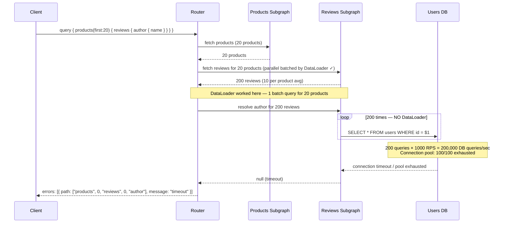

# Failure Scenario 02: N+1 Regression at Scale

> **Purpose:** This post-mortem documents an incident in which a new feature shipped resolvers without DataLoader, causing a 50,000 queries-per-second spike against the Users database at production load. The database connection pool exhausted, requests queued, and latency exceeded client timeouts. The incident caused a P1 degradation for 22 minutes. This document covers the timeline, root cause, detection signals, mitigation, the missing process controls, and the prevention measures added after the incident.

---

## Scenario Summary

The Reviews team shipped a new feature: `products { reviews { author { name avatarUrl } } }`. The `author` field on `Review` was resolved by calling `context.db.users.findById(review.authorId)` directly — without a DataLoader. In staging, with synthetic test data and 10 concurrent users, this was imperceptible. In production at 1,000 requests per second, each request fetching a product with 50 reviews generated 50 individual database queries. 1,000 RPS × 50 queries = **50,000 queries per second** against the Users table. The database connection pool (max 100 connections) exhausted. New queries queued. The queue depth grew until client timeouts fired. The product page rendered blank for all users with reviews visible on the product page.

---

## System State Before the Incident

| Component | State |
|---|---|
| DataLoader usage | Enforced by convention, not by tooling |
| Code review | DataLoader absence was not caught in review |
| Database connection pool size | 100 connections (shared by all resolvers) |
| Query timeout (client) | 5 seconds |
| Database query timeout | 10 seconds |
| `reviews.author` resolver | `db.users.findById(review.authorId)` — no DataLoader |
| Static analysis | No tool checking for direct DB calls outside DataLoader |
| Load testing | Ran with 10 concurrent users, missed N+1 at scale |

---

## Incident Timeline

| Time (UTC) | Event |
|---|---|
| 09:00:00 | Feature flag enabled for 100% of production traffic |
| 09:00:05 | Query rate against `users` table: 52 queries/second (baseline) |
| 09:00:30 | Query rate against `users` table: 4,200 queries/second |
| 09:01:00 | Query rate against `users` table: 49,800 queries/second |
| 09:01:15 | Database connection pool: 98/100 connections in use |
| 09:01:22 | Database connection pool: **100/100 exhausted** — new queries queue |
| 09:01:30 | `pg_stat_activity` shows 340 waiting queries, median wait time 1.2 seconds |
| 09:01:45 | Client 5-second timeout begins firing — `products` query returns timeout errors |
| 09:02:10 | Error rate alert fires: `graphql_field_error_rate{field="Query.products"} > 0.10` |
| 09:02:45 | On-call engineer acknowledges alert |
| 09:03:00 | Engineer identifies `reviews.author` as the spike source via distributed trace |
| 09:03:30 | Feature flag toggled off — `reviews.author` field returns null |
| 09:03:45 | Database query rate drops to baseline immediately |
| 09:04:00 | Connection pool available connections: 100/100 |
| 09:04:30 | Error rate returns to < 0.1% |
| 09:22:00 | DataLoader-wrapped fix deployed, feature flag re-enabled |
| 09:22:30 | Incident declared closed (22 minutes, including fix deployment) |

---

## Failure Propagation Diagram



---

## Root Cause Analysis

The `author` field resolver on `Review` made a direct database call:

```typescript
// reviews-subgraph/resolvers/Review.ts — the broken code
export const ReviewResolvers = {
  Review: {
    // WRONG: direct database call — N+1 pattern
    author: async (review: ReviewModel, _args: unknown, context: ReviewsContext) => {
      // This fires once per review. With 200 reviews per request and 1000 RPS:
      // 200 × 1000 = 200,000 DB queries/sec
      return context.db.users.findById(review.authorId);
    },
  },
};
```

The DataLoader for users existed in the context — it was used correctly in other resolvers. The author field was written without checking.

### Why Code Review Missed It

- The PR diff showed a new file (`Review.ts`) with 25 lines. The reviewer approved in 4 minutes.
- No linting rule or static analysis warned about `context.db.*` calls outside a DataLoader.
- The pattern "call db directly" looked identical to correct patterns in other parts of the codebase (root query resolvers do call db directly — only leaf resolvers on list types need DataLoaders).

### Why Staging Missed It

- Staging load test used 10 concurrent users with a product that had 3 reviews.
- 10 RPS × 3 reviews = 30 DB queries/sec — well within the connection pool.
- N+1 is invisible at low concurrency. It is exponential at high concurrency.

---

## Detection Signals

### Signals that fired

| Metric | Threshold | Triggered |
|---|---|---|
| `graphql_field_error_rate{field="Query.products"}` > 10% | 2 min | 09:02:10 |

### Signals that should have fired earlier

| Metric | Alert Condition | Would Have Fired At |
|---|---|---|
| `pg_stat_activity_waiting` (connections waiting) | > 10 waiting | 09:01:25 |
| `db_connection_pool_available` (available connections) | < 20 | 09:01:20 |
| `graphql_resolver_duration_p99{resolver="Review.author"}` | > 500ms | 09:01:15 |
| `db_query_rate` change rate | > 3× baseline in 1 minute | 09:00:45 |

---

## PromQL Alert Rules

```promql
# 1. Database connection pool exhaustion (early warning)
alert: DatabaseConnectionPoolNearExhaustion
expr: |
  db_connection_pool_available{pool="users-db"} < 20
for: 30s
labels:
  severity: critical
annotations:
  summary: "Users DB connection pool < 20 available connections"
  description: "Pool near exhaustion. Possible N+1 regression. Check resolver traces."

# 2. Waiting connections spike (near-real-time detection)
alert: DatabaseWaitingConnectionsHigh
expr: |
  pg_stat_activity_waiting{datname="users"} > 10
for: 30s
labels:
  severity: warning
annotations:
  summary: "PostgreSQL waiting connections > 10 on users database"

# 3. Resolver duration spike on leaf resolvers
alert: GraphQLLeafResolverLatencySpike
expr: |
  histogram_quantile(0.99,
    rate(graphql_resolver_duration_seconds_bucket[2m])
  ) > 0.5
for: 1m
labels:
  severity: warning
annotations:
  summary: "GraphQL resolver p99 latency > 500ms — possible N+1"

# 4. Database query rate change (3x baseline)
alert: DatabaseQueryRateAnomalous
expr: |
  rate(pg_stat_statements_calls_total{datname="users"}[1m])
    > 3 * rate(pg_stat_statements_calls_total{datname="users"}[1h] offset 5m)
for: 1m
labels:
  severity: page
annotations:
  summary: "Database query rate is 3x the hourly baseline — possible N+1 regression"
```

---

## Immediate Mitigation (During Incident)

**Time to execute: 2 minutes**

1. **Identify the field causing the spike** — use distributed tracing (Jaeger/Tempo):
   ```bash
   # Find traces with the most resolver spans
   # In Tempo/Jaeger, filter by:
   #   service: reviews-subgraph
   #   span.name: Review.author
   #   duration: > 100ms
   # Trace with 200 spans for Review.author confirms N+1
   ```

2. **Kill the operation via persisted query deny-list** (if the operation can be identified):
   ```bash
   # If the operation has a known name or hash, block it immediately
   # Apollo Router: add to operation block list
   rover persisted-queries publish \
     --list-id emergency-deny-list \
     --manifest deny-manifest.json
   ```

3. **Toggle the feature flag** to disable the problematic field:
   ```bash
   # If the feature is behind a flag (which it should be):
   curl -X PATCH https://launchdarkly.api.internal/flags/reviews-author \
     -H "Authorization: $LD_API_KEY" \
     -d '{"instructions": [{"kind": "turnFlagOff"}]}'
   ```

4. **Return null for the field** via router schema override as an emergency measure (last resort):
   ```yaml
   # Override the resolver to return null immediately
   # This is a last resort — prefer feature flag
   ```

---

## Remediation (The Engineering Fix)

Wrapped the `author` resolver with DataLoader:

```typescript
// reviews-subgraph/resolvers/Review.ts — FIXED
export const ReviewResolvers = {
  Review: {
    // CORRECT: DataLoader batches all N author lookups into one query
    author: async (review: ReviewModel, _args: unknown, context: ReviewsContext) => {
      return context.dataloaders.user.load(review.authorId);
    },
  },
};
```

The fix reduced the query pattern from:
- **Before:** 200 reviews × 1000 RPS = 200,000 queries/sec
- **After:** 1 batch query per request × 1000 RPS = 1,000 queries/sec (batch of up to 200 user IDs)

Verification query after fix:

```sql
-- Confirm single batch query in slow query log
SELECT query, calls, mean_exec_time
FROM pg_stat_statements
WHERE query LIKE '%users%'
  AND query LIKE '%= ANY%'  -- DataLoader uses ANY($1::uuid[]) pattern
ORDER BY calls DESC
LIMIT 5;
```

---

## Prevention (What We Changed After the Incident)

### Prevention 1: Static analysis rule — no direct DB calls in leaf resolvers on list types

Added an ESLint rule that flags `context.db.*` calls in resolvers that are not root query resolvers:

```typescript
// eslint-rules/no-direct-db-in-leaf-resolver.js
module.exports = {
  meta: {
    type: 'problem',
    docs: {
      description: 'Disallow direct database calls in non-root resolvers — use DataLoader',
    },
    messages: {
      useDataLoader: 'Direct DB call in a leaf resolver creates N+1 risk. Use context.dataloaders.X.load() instead.',
    },
  },
  create(context) {
    return {
      // Flag context.db.*.findById calls in resolver files
      MemberExpression(node) {
        if (
          node.object?.object?.name === 'context' &&
          node.object?.property?.name === 'db' &&
          isInsideLeafResolver(node, context)
        ) {
          context.report({ node, messageId: 'useDataLoader' });
        }
      },
    };
  },
};
```

### Prevention 2: DataLoader coverage check in CI

New CI step checks that every resolver file in the `resolvers/` directory that performs entity lookups uses a DataLoader:

```bash
#!/usr/bin/env bash
# ci/check-dataloader-coverage.sh
MISSING_DATALOADER=0

for resolver_file in src/resolvers/*.ts; do
  # Skip root query resolvers — they're allowed to call db directly
  if grep -q 'Query:' "$resolver_file"; then
    continue
  fi

  # Check if file makes db calls without DataLoader
  if grep -qE 'context\.db\.\w+\.(findById|findOne)' "$resolver_file"; then
    if ! grep -qE 'context\.dataloaders\.' "$resolver_file"; then
      echo "FAIL: $resolver_file has direct DB calls without DataLoader"
      MISSING_DATALOADER=1
    fi
  fi
done

if [ "$MISSING_DATALOADER" -eq 1 ]; then
  echo "DataLoader coverage check failed. Add DataLoaders for the resolvers above."
  exit 1
fi

echo "DataLoader coverage check passed"
```

### Prevention 3: N+1 detection in staging load test

Updated the staging load test to run at 100 RPS with realistic data (products with 20 reviews each) and fail if database query rate exceeds a threshold:

```yaml
# k6-load-test.yaml
scenarios:
  product-reviews-feature:
    executor: constant-arrival-rate
    rate: 100
    duration: 2m
    preAllocatedVUs: 50

thresholds:
  # DB query rate should not exceed 300 queries/sec at 100 RPS
  # (3 queries per request: products, reviews batch, users batch)
  db_queries_rate: ['rate<300']
  # No resolver should take > 500ms at p99
  graphql_resolver_duration{resolver="Review.author"}: ['p(99)<500']
```

### Prevention 4: Feature flags mandatory for all new fields on high-traffic types

Engineering policy: any new field on a type that appears in a list (e.g., `Review`, `Product`, `Order`) must be behind a feature flag for the first 48 hours in production. This ensures that if an N+1 regression ships, it can be disabled without a code deploy.

---

## References and Related Topics

- [Chapter 25: Enterprise Patterns — 02-resolver-patterns.md](../25-enterprise-patterns/02-resolver-patterns.md) — DataLoader Batch-by-Foreign-Key pattern
- [Chapter 14: Observability](../14-observability/README.md) — distributed tracing for N+1 detection
- [DataLoader GitHub](https://github.com/graphql/dataloader) — canonical DataLoader implementation
- [Apollo Studio: Field Insights](https://www.apollographql.com/docs/studio/metrics/field-usage/) — resolver-level latency tracking
- [graphql-shield](https://github.com/maticzav/graphql-shield) — middleware for resolver-level controls
