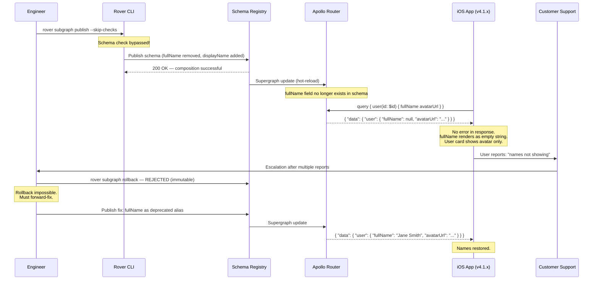

# Failure Scenario 03: The Schema Breaking Change Incident

> **Purpose:** This post-mortem documents an incident in which a field rename — `user.fullName` to `user.displayName` — was pushed directly to production as part of a hotfix, bypassing the deprecation period and schema check CI gate. Mobile clients still in the field that referenced `user.fullName` received null for every user display name. Mobile app rendering collapsed to blank user cards across the product. The incident lasted 47 minutes until a forward-fix was deployed. This document covers the timeline, root cause in schema governance, detection signals, mitigation options, client communication, and the prevention measures added after the incident.

---

## Scenario Summary

A backend engineer renamed `User.fullName` to `User.displayName` in a hotfix — the rename was part of a branding refresh that was supposed to have gone through a 30-day deprecation cycle. Under time pressure to ship the branding change before a scheduled announcement, the engineer pushed the schema change directly, bypassing the schema check CI gate by using `--skip-checks` in the Rover publish command. The new schema was accepted by the schema registry. Within 4 minutes, mobile clients still running the previous app version (iOS and Android updates were in the App Store review process) began rendering blank user names. Because the field was renamed, not removed, the response contained no `errors[]` entries — `fullName` returned null silently. No GraphQL error fired. The mobile app rendered empty name strings, which collapsed user cards to show only avatars. The incident went undetected by the error rate alert because the HTTP status was 200 and `data.user.fullName` simply returned null.

---

## System State Before the Incident

| Component | State |
|---|---|
| Schema registry | Apollo GraphOS |
| Schema check CI gate | Enabled — but skippable with `--skip-checks` flag |
| `--skip-checks` usage policy | "Do not use in production" (written in CONTRIBUTING.md, not enforced by tooling) |
| Deprecation period policy | 30 days before field removal/rename (written in docs, not enforced) |
| Mobile app version in App Store review | v4.2.0 — querying `user { fullName avatarUrl }` |
| Mobile app version live in field | v4.1.x — all querying `user { fullName avatarUrl }` |
| Field usage monitoring | Enabled in Apollo Studio — not checked before the rename |
| Client-reported null detection alert | Not configured |
| `fullName` 30-day usage count (Apollo Studio) | 2.1 million queries per day across all clients |

The field had 2.1 million daily usages. This data was available in Apollo Studio field usage metrics but was not consulted before the rename.

---

## Incident Timeline

| Time (UTC) | Event |
|---|---|
| 11:04:00 | Engineer publishes new schema via `rover subgraph publish --skip-checks` |
| 11:04:12 | Schema registry accepts the new composition — `fullName` removed, `displayName` added |
| 11:04:15 | Apollo Router picks up the new supergraph via hot-reload (no restart required) |
| 11:04:30 | All new queries for `user.fullName` return null (field no longer exists in schema — resolvers return null for unknown fields) |
| 11:08:22 | First mobile client error report in customer support Slack channel: "names not showing up" |
| 11:09:00 | Mobile app crash rate unchanged — no crashes, no errors — only silent null rendering |
| 11:11:00 | Customer support escalation: multiple reports from iOS and Android of blank user cards |
| 11:14:00 | On-call engineer begins investigation — checks error rate dashboard (0.2% baseline — normal) |
| 11:16:00 | On-call engineer checks router logs — HTTP 200 responses with `data.user.fullName: null` |
| 11:17:30 | Engineer identifies the schema change: `fullName` was renamed to `displayName` |
| 11:18:00 | Incident declared — P1 |
| 11:19:00 | Schema registry rollback attempted — **rejected: schema registry is immutable** (no rollback endpoint; only forward publishes are accepted) |
| 11:20:00 | Emergency options assessed: (A) forward-fix alias, (B) router deny-list for `fullName` queries, (C) add `fullName` back as alias in resolver |
| 11:22:00 | Decision: forward-fix — add `fullName` back as a deprecated alias resolved from `displayName` |
| 11:27:00 | Fix authored and code review initiated (P1 fast-track review: 1 reviewer, 5-minute SLA) |
| 11:31:00 | Fix merged — CI pipeline begins |
| 11:41:00 | New schema deployed with `fullName: String @deprecated(reason: "Use displayName")` aliasing `displayName` |
| 11:42:00 | Router picks up new schema — mobile clients begin rendering names again |
| 11:51:00 | Incident declared closed (47 minutes of user-visible degradation) |

---

## Incident Propagation Diagram



---

## Root Cause Analysis

### Primary Root Cause: `--skip-checks` Available in Production Publish

The schema check CI gate (`rover subgraph check`) would have caught this change:

```
$ rover subgraph check --name users --schema schema.graphql

Checked against 1,204 client operations in the last 30 days.

BREAKING CHANGES DETECTED:
  ✗ FIELD_REMOVED: User.fullName was removed.
    Impact: 2,147,832 operations/day use this field.
    Affected clients: mobile-ios-v4.1, mobile-android-v4.1, web-dashboard, internal-analytics

This schema check has FAILED.
To override, re-run with --skip-checks (not recommended for production).
```

The check was designed to catch exactly this scenario. The `--skip-checks` flag exists for emergency situations where a deployment must proceed despite check failures. There was no emergency — this was a branding change deployed under artificial time pressure.

### Contributing Root Cause: No Enforcement of Deprecation Policy

The deprecation policy exists in `CONTRIBUTING.md`. It is not enforced by any tooling. The correct process would have been:

1. Add `displayName` alongside `fullName` in week 1
2. Deprecate `fullName` with a reason and removal date
3. Monitor field usage via Apollo Studio — wait until usage drops to zero
4. Remove `fullName` after zero usage confirmed (typically 30+ days for mobile clients)

Mobile app release cycles require 1–2 weeks of App Store review plus organic rollout time (users who do not update immediately). A 30-day deprecation period is the minimum for field removal when mobile clients are consumers.

### Contributing Root Cause: No Alert on Null Rate for Historically Non-Null Fields

`user.fullName` returned non-null values for 100% of requests prior to the incident. The null rate for this field was a detectable anomaly signal but was not being monitored. A null rate spike from 0% to 100% for a field that had never been null should have fired an alert within 1 minute of the schema change.

---

## Detection Signals

### Signals that fired

| Signal | Time | Notes |
|---|---|---|
| Customer support Slack reports | 11:08 | Manual — users reporting blank names |
| Support escalation to on-call | 11:11 | 7 minutes after the schema push |

### Signals that should have fired automatically

| Metric | Alert Condition | Would Have Fired At | Notes |
|---|---|---|---|
| `apollo_router_field_null_rate{field="User.fullName"}` | > 5% for 2 minutes (was 0% baseline) | 11:06 | This metric is available in Apollo Router telemetry |
| Apollo Studio field error rate spike | Any field dropping from 100% non-null to 100% null | 11:06 | Studio can alert on field-level anomalies |
| Schema check bypass — audit log alert | Any publish with `--skip-checks` in production | 11:04 | CI system should log and alert when bypass is used |

---

## PromQL Detection Queries

```promql
# 1. Field null rate spike — catches silent null-field regressions
# Alert when a field that was historically non-null begins returning null
alert: GraphQLFieldNullRateAnomalous
expr: |
  (
    rate(apollo_router_field_null_total{field="User.fullName"}[5m])
    / rate(apollo_router_field_execution_total{field="User.fullName"}[5m])
  ) > 0.05
for: 2m
labels:
  severity: page
annotations:
  summary: "User.fullName null rate > 5% — possible breaking schema change"
  description: "Field User.fullName is returning null for >5% of executions. Check for recent schema changes."

# 2. General field null rate anomaly detector (for all fields)
# Use a baseline comparison to catch any field that degrades from its historical null rate
alert: GraphQLFieldNullRateRegression
expr: |
  (
    rate(apollo_router_field_null_total[5m])
    / rate(apollo_router_field_execution_total[5m])
  )
  > 3 * (
    rate(apollo_router_field_null_total[1h] offset 10m)
    / rate(apollo_router_field_execution_total[1h] offset 10m]
  )
for: 2m
labels:
  severity: warning
annotations:
  summary: "GraphQL field null rate is 3x historical baseline — breaking change suspected"

# 3. Schema check bypass audit alert
# Requires CI system to emit a metric when --skip-checks is used
alert: SchemaCheckBypassed
expr: |
  increase(schema_registry_publish_skip_checks_total[5m]) > 0
for: 0m
labels:
  severity: critical
annotations:
  summary: "Schema published with --skip-checks in production"
  description: "A schema was published bypassing the schema check gate. Review immediately."

# 4. Schema publish event correlated with null rate spike
# Detects schema publishes followed by field null rate changes
alert: SchemaPublishNullRateCorrelation
expr: |
  (
    increase(schema_registry_publish_total[5m]) > 0
  ) and (
    increase(apollo_router_field_null_total[5m]) > 1000
  )
for: 1m
labels:
  severity: warning
annotations:
  summary: "Schema publish followed by field null rate increase — investigate for breaking changes"
```

---

## Mitigation Options

During the incident, three mitigation paths were evaluated. Each has trade-offs that depend on the incident type, the schema registry's capabilities, and the timeline for a full fix.

### Option A: Forward-Fix with Deprecated Alias (Chosen)

Add the old field back as a deprecated alias that resolves to the new field:

```graphql
type User @key(fields: "id") {
  id: ID!
  displayName: String!

  """
  @deprecated — kept for backward compatibility with mobile clients v4.1.x and below.
  This field will be removed after all mobile clients have migrated to displayName.
  Target removal: 2025-Q2.
  """
  fullName: String @deprecated(reason: "Use displayName instead. Will be removed 2025-Q2.")
}
```

```typescript
// users-subgraph/resolvers/User.ts
export const UserResolvers = {
  User: {
    // New canonical field
    displayName: (user: UserModel) => user.displayName,

    // Backward-compatibility alias — returns displayName value
    fullName: (user: UserModel) => user.displayName,
  },
};
```

**Pros:** Restores client functionality immediately. Adds the deprecation that should have been there from the start. Gives mobile clients time to migrate.

**Cons:** Requires a code deploy (15–20 minutes minimum with CI). Does not help clients already degraded during the deploy window.

**Time to restore:** 15–20 minutes (deploy pipeline)

---

### Option B: Router-Level Deny-List for Affected Operations

If the operations querying `fullName` can be identified by name or hash, block them at the router so they receive an explicit error rather than a silent null:

```bash
# Step 1: Identify operations using fullName (Apollo Studio query)
# Filter field usage for User.fullName, last 1 hour

# Step 2: Add affected operations to a deny list with descriptive error
rover persisted-queries publish \
  --list-id emergency-deny-list \
  --manifest '{"operations": [{"id": "HASH", "body": null, "error": "fullName field removed — please update to displayName"}]}'
```

**Pros:** Converts silent null failures into explicit errors that client error monitoring will catch. Helps mobile developers identify the issue faster.

**Cons:** Does not restore functionality — clients still get an error, not the correct name. Useful as a secondary measure alongside Option A to make the problem visible.

**Time to restore:** 2–5 minutes (hot config update via router)

---

### Option C: Emergency Schema Rollback (Not Possible in This Case)

If the schema registry supports rollback (reverting to the previous published schema version), this is the fastest path:

```bash
# Apollo GraphOS does not support rollback to a previous schema version.
# GraphOS's schema registry is append-only — only forward publishes are accepted.
# This option was not available in this incident.

# Registries that do support rollback (e.g., WunderGraph Cosmo):
cosmo schema rollback --subgraph users --version PREVIOUS_VERSION_ID
```

**Pros:** Fastest possible recovery if supported — restores the previous schema in seconds.

**Cons:** Not available in all schema registry implementations. Apollo GraphOS (the most common enterprise registry) is append-only. Even registries that support rollback may not immediately hot-reload connected routers.

**Time to restore:** < 2 minutes if supported; not available in this case.

---

## Client Communication

### During the Incident

A status page update was posted at 11:20 (2 minutes after incident declaration):

> **[INVESTIGATING] User display names not rendering on mobile**
>
> We are investigating an issue causing user display names to appear blank on iOS and Android app versions 4.1.x. Web users are not affected. Our team has identified the cause and is working on a fix. Estimated resolution: 30–45 minutes.

A Slack message was sent to the `#api-consumers` and `#mobile-platform` channels:

> **Incident Notice:** We deployed a schema change that renamed `User.fullName` to `User.displayName` without the required deprecation period. Mobile clients on v4.1.x are affected. We are deploying a fix that adds `fullName` back as a deprecated alias. This will restore mobile rendering. Web clients (which query `displayName`) are not affected. ETA: 30 minutes.

### Post-Incident Client Notice

An email was sent to all registered API consumers within 24 hours of resolution:

> **Subject: GraphQL schema change notification — User.fullName deprecated (not removed)**
>
> Following today's incident, `User.fullName` has been restored as a deprecated field aliasing the new `User.displayName`. The field will remain available until all known clients have migrated. Concrete removal date: 2025-Q2 (minimum 90 days from now, after confirmed zero usage).
>
> **Migration:** Replace `fullName` with `displayName` in all queries. Both fields return the same value.
>
> **Timeline:** You will receive a 30-day removal notice before `fullName` is removed. Removal will not proceed until Apollo Studio field usage confirms zero active usage.

---

## Remediation (The Engineering Fix)

The deployed fix added `fullName` back as a resolver alias:

```graphql
# users-subgraph/schema.graphql — after fix
type User @key(fields: "id") {
  id: ID!
  email: String!
  displayName: String!

  """
  Deprecated alias for displayName, preserved for backward compatibility
  with mobile clients on v4.1.x and below. Do not use in new queries.
  Removal target: 2025-Q2, contingent on zero usage in Apollo Studio.
  """
  fullName: String @deprecated(reason: "Use displayName. Will be removed 2025-Q2 after zero usage confirmed.")

  avatarUrl: String
  createdAt: DateTime!
}
```

```typescript
// users-subgraph/resolvers/User.ts
export const UserResolvers = {
  User: {
    displayName: (user: UserModel) => user.displayName,
    // Backward-compatibility shim
    fullName: (user: UserModel) => user.displayName,
  },
};
```

This was the change that should have been deployed first — `displayName` added alongside `fullName` with a deprecation notice — before `fullName` was ever removed.

---

## Prevention (What We Changed After the Incident)

### Prevention 1: Block `--skip-checks` in Production CI

The `--skip-checks` flag was blocked at the CI level for production deployments. The schema publish step in the production CI pipeline was changed to use a wrapper that refuses the flag:

```bash
#!/usr/bin/env bash
# ci/schema-publish.sh — production schema publish wrapper
set -e

# Refuse to publish with --skip-checks in production
if [[ "$DEPLOY_ENV" == "production" ]] && echo "$@" | grep -q '\-\-skip-checks'; then
  echo "ERROR: --skip-checks is not permitted for production schema publishes."
  echo "If this is an emergency, contact the platform team for a supervised bypass."
  echo "Reference: incident post-mortem 2024-11-03 (User.fullName breaking change)"
  exit 1
fi

rover subgraph publish "$@"
```

For genuine emergencies where the check must be bypassed, two senior engineers must approve a supervised bypass with an incident ticket number attached.

### Prevention 2: Deprecation Period Enforcement in Schema Check

A custom schema check rule was added that rejects any field removal or rename that did not have a `@deprecated` directive in the previous published schema:

```typescript
// schema-checks/require-deprecation-before-removal.ts
// Custom Apollo GraphOS schema check rule

export function requireDeprecationBeforeRemoval(
  previousSchema: GraphQLSchema,
  nextSchema: GraphQLSchema
): SchemaCheckViolation[] {
  const violations: SchemaCheckViolation[] = [];

  // Find all fields in the previous schema
  for (const [typeName, type] of Object.entries(previousSchema.getTypeMap())) {
    if (!isObjectType(type)) continue;
    for (const [fieldName, field] of Object.entries(type.getFields())) {
      const nextType = nextSchema.getType(typeName);
      const nextField = isObjectType(nextType)
        ? nextType.getFields()[fieldName]
        : undefined;

      // Field was removed or renamed
      if (!nextField) {
        const isDeprecated = !!field.deprecationReason;
        if (!isDeprecated) {
          violations.push({
            rule: 'REQUIRE_DEPRECATION_BEFORE_REMOVAL',
            severity: 'ERROR',
            message: `Field ${typeName}.${fieldName} was removed without a prior @deprecated directive. Add @deprecated first, then remove after the deprecation period.`,
          });
        }
      }
    }
  }

  return violations;
}
```

This rule causes the schema check to fail with an error (not a warning) when a field is removed that was not previously deprecated. The error message explicitly states the required process.

### Prevention 3: Zero-Usage Confirmation Gate Before Removal

A new CI step was added that queries Apollo Studio's field usage API before allowing any deprecated field removal to proceed:

```bash
#!/usr/bin/env bash
# ci/check-field-usage-before-removal.sh
set -e

GRAPH_ID="${APOLLO_GRAPH_ID}"
API_KEY="${APOLLO_KEY}"
DAYS=30

# Get the list of fields being removed in this schema change
REMOVED_FIELDS=$(rover subgraph check --schema schema.graphql --format json 2>/dev/null \
  | jq -r '.changes[] | select(.category == "FIELD_REMOVAL") | .field')

for FIELD in $REMOVED_FIELDS; do
  echo "Checking usage for removed field: $FIELD"

  USAGE=$(curl -s "https://graphql.api.apollographql.com/api/graphql" \
    -H "x-api-key: $API_KEY" \
    -d "{\"query\": \"{ service(id: \\\"$GRAPH_ID\\\") { fieldInsights(field: \\\"$FIELD\\\", from: \\\"-${DAYS}d\\\") { requestCount } } }\"}" \
    | jq '.data.service.fieldInsights.requestCount')

  if [[ "$USAGE" -gt 0 ]]; then
    echo "ERROR: Field $FIELD has $USAGE usages in the last $DAYS days."
    echo "Field removal is blocked until usage reaches zero."
    echo "Check Apollo Studio field usage to identify and migrate clients."
    exit 1
  fi

  echo "PASS: Field $FIELD has zero usage in the last $DAYS days. Safe to remove."
done

echo "All removed fields have confirmed zero usage. Schema change approved."
```

### Prevention 4: Null Rate Alert for High-Traffic Fields

A PromQL alert was configured to fire when a field that historically returns non-null values begins returning null:

```promql
# Alert tuned for fields with historically low null rates
alert: GraphQLHighTrafficFieldNullRateSpike
expr: |
  (
    rate(apollo_router_field_null_total{field=~"User\\..*|Order\\..*|Product\\..*"}[5m])
    / rate(apollo_router_field_execution_total{field=~"User\\..*|Order\\..*|Product\\..*"}[5m])
  ) > 0.10
for: 2m
labels:
  severity: page
annotations:
  summary: "High-traffic field null rate spike — possible breaking schema change"
  description: "Field {{ $labels.field }} null rate exceeded 10%. Check for recent schema publishes."
```

### Prevention 5: Mandatory Deprecation Period in Schema Governance Policy

The schema governance policy was updated with tooling-enforced timelines:

| Change Type | Required Process |
|---|---|
| Add a new field | No deprecation needed — additive, safe |
| Rename a field | Add new name alongside old; deprecate old with removal date |
| Remove a field | Must have been `@deprecated` for minimum 30 days AND have zero usage in Apollo Studio |
| Change field type | Treated as remove + add; requires full deprecation cycle |
| Remove an enum value | Must have zero query usage for 30 days |

The minimum deprecation period for any field accessed by mobile clients was extended from 30 days to 60 days, accounting for App Store review cycles (1–2 weeks) plus organic rollout of new versions to existing users.

---

## References and Related Topics

- [Chapter 09: Schema Governance](../09-schema-governance/README.md) — deprecation lifecycle, field removal gates
- [Chapter 10: Schema Validation](../10-schema-validation/README.md) — schema check CI integration
- [Chapter 11: CI/CD Automation](../11-ci-cd-automation/README.md) — production publish pipeline guardrails
- [Apollo GraphOS: Schema Checks](https://www.apollographql.com/docs/graphos/schema-checks/) — schema check documentation
- [Apollo Studio: Field Insights](https://www.apollographql.com/docs/studio/metrics/field-usage/) — field usage monitoring
- [Rover CLI: subgraph publish](https://www.apollographql.com/docs/rover/subgraphs/#publishing-a-subgraph-schema) — Rover publish command reference
- [02-federation-and-architecture-questions.md](../27-interview-preparation/02-federation-and-architecture-questions.md) — interview coverage of breaking change handling
