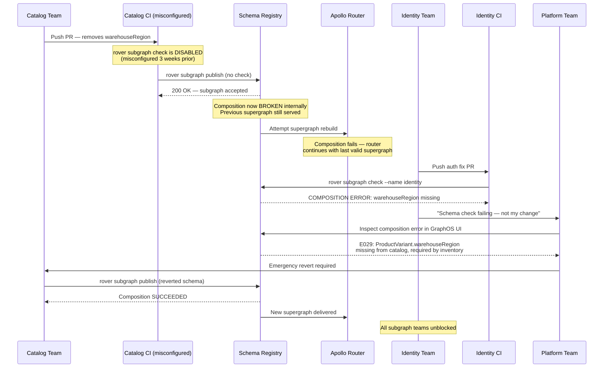

# Failure Scenario 04: Federation Composition Failure

> **Purpose:** This post-mortem documents an incident in which a subgraph team removed a `@key` field that other subgraphs depended on via `@requires`, causing supergraph composition to fail. Because the CI misconfiguration had disabled composition checks on the offending subgraph's pipeline, the broken schema was published to the schema registry. All subsequent schema publishes — from every subgraph team — failed with composition errors, blocking all deployments across the organization for 6 hours. This document covers the timeline, root cause in the CI misconfiguration, diagnosis via Rover composition errors, the immediate fix, a decision tree for diagnosing composition failures, and the prevention measures added afterward.

---

## Scenario Summary

The Catalog subgraph team removed `ProductVariant.warehouseRegion` during a schema cleanup sprint. This field was annotated as a `@key` field used by the Inventory subgraph to resolve inventory positions per warehouse region via `@requires`. The Catalog team's CI pipeline had been misconfigured 3 weeks earlier during a migration to a new CI provider: the `rover subgraph check` step had been commented out as a "temporary measure" and never re-enabled. Without the composition check, the broken schema was published to the GraphQL schema registry.

The Inventory subgraph's `@requires(fields: "warehouseRegion")` directive now referenced a field that no longer existed in the Catalog subgraph's contribution to the `ProductVariant` entity. Composition began failing for every subgraph publish. All six subgraph teams — Identity, Orders, Catalog, Inventory, Notifications, Payments — lost the ability to deploy any schema changes. A hotfix for a critical auth bug in the Identity subgraph was blocked for 4 hours while the composition failure was diagnosed and resolved. Total deployment blockage: 6 hours.

---

## System State Before the Incident

| Component | State |
|---|---|
| Apollo Router version | 1.40.2 |
| Schema registry | Apollo GraphOS |
| Catalog subgraph CI | `rover subgraph check` step commented out (3 weeks prior) |
| Composition check enforcement | Required in CI — but only for subgraphs where CI was correctly configured |
| `@requires` dependency map | Undocumented — no cross-subgraph dependency registry |
| `ProductVariant.warehouseRegion` usage | Used by Inventory subgraph `@requires` — not documented in schema comments |
| Subgraph count | 6 subgraphs |
| Entities crossing subgraph boundaries | `ProductVariant` referenced by Catalog, Inventory, Orders |

The fundamental gap: there was no documented inventory of cross-subgraph `@requires` dependencies, and the CI check that would have caught the removal was disabled.

---

## Incident Timeline

| Time (UTC) | Event |
|---|---|
| 09:15:00 | Catalog team merges schema cleanup PR — removes `ProductVariant.warehouseRegion` |
| 09:17:00 | Catalog subgraph CI runs without composition check (misconfigured) — deployment succeeds |
| 09:17:30 | Schema registry accepts the Catalog subgraph schema update |
| 09:17:35 | Apollo Router attempts to load new supergraph — composition fails internally |
| 09:17:35 | Router continues serving the **last successful supergraph** (graceful fallback) |
| 09:18:00 | Identity team opens a PR to fix a critical auth bug |
| 09:32:00 | Identity team's `rover subgraph check` fails with composition error |
| 09:33:00 | Identity engineer posts in `#graphql-platform`: "My schema check is failing with a composition error I didn't introduce. Is something wrong?" |
| 09:35:00 | Platform team investigates — finds composition error in GraphOS UI |
| 09:40:00 | Composition error identified: `@requires(fields: "warehouseRegion")` in Inventory subgraph references a field no longer in Catalog |
| 09:45:00 | Root cause confirmed: Catalog cleanup PR removed `warehouseRegion` |
| 09:50:00 | Platform team contacts Catalog team — emergency revert required |
| 10:05:00 | Catalog team revert PR merged and deployed |
| 10:07:00 | Composition succeeds — schema registry accepts new composition |
| 10:08:00 | Apollo Router loads restored supergraph |
| 10:10:00 | All subgraph teams unblocked — can resume deployments |
| 15:17:00 | Identity team's auth bug fix deployed (delayed 6 hours) |
| 15:17:00 | Incident closed — 6 hours of deployment blockage |

---

## Composition Error Messages

The following Rover error output was the key diagnostic artifact. Platform engineers need to be familiar with reading this output to diagnose composition failures quickly.

```
$ rover subgraph check --name identity --schema identity.graphql

Checking schema against 5 other subgraphs...

COMPOSITION ERROR — Supergraph cannot be composed:

[E029] Field `ProductVariant.warehouseRegion` cannot be found in subgraph `catalog`.
  This field is required by:
    - Subgraph `inventory`: type `ProductVariant` directive `@requires(fields: "warehouseRegion")`

  The field `warehouseRegion` was present in `catalog` at schema version a3f92c1
  but is not present in the current schema version b8d441e.

  To resolve this error:
    Option 1: Re-add `warehouseRegion` to the `catalog` subgraph's `ProductVariant` type
    Option 2: Remove the `@requires(fields: "warehouseRegion")` directive from the `inventory` subgraph

  Affected subgraph: catalog
  Dependent subgraph: inventory
  Entity type: ProductVariant
  Field: warehouseRegion

Composition FAILED. No supergraph was produced.
```

The error message directly identified:
- Which field was missing (`ProductVariant.warehouseRegion`)
- Which subgraph removed it (`catalog`)
- Which subgraph depended on it (`inventory`)
- The two resolution paths (re-add or remove the `@requires`)

The error appeared in the Identity subgraph check because composition is supergraph-wide — when any subgraph fails composition, all subgraph checks fail.

---

## Failure Propagation Diagram



---

## Decision Tree: Diagnosing a Composition Failure

Use this decision tree when a schema check or supergraph build fails with a composition error. Work through each node in order.

```
Composition failure detected
│
├── Step 1: Get the full error output
│     rover subgraph check --name <your-subgraph> --schema schema.graphql
│     or: Check GraphOS Studio → Schema → Composition Errors
│
├── Step 2: Identify the error code
│     │
│     ├── E007 / E010: Invalid @key field
│     │     Cause: A @key field references a field that doesn't exist on the type
│     │     Fix: Ensure all fields listed in @key(fields: "...") exist on the type
│     │
│     ├── E029: @requires references a field not in the owning subgraph
│     │     Cause: Owning subgraph removed a field that another subgraph @requires
│     │     Fix: Re-add the field to the owning subgraph, OR remove the @requires
│     │           (requires changing the dependent subgraph's resolution strategy)
│     │
│     ├── E024: @provides references a field not on the entity type
│     │     Cause: @provides(fields: "...") lists a field that doesn't exist
│     │     Fix: Update @provides to match the actual fields defined on the entity
│     │
│     ├── E030: Entity @key field type mismatch across subgraphs
│     │     Cause: Two subgraphs define the same @key field with different types
│     │     Fix: Align the @key field type across all subgraphs that reference the entity
│     │
│     ├── E011: Conflicting field types across subgraphs
│     │     Cause: Two subgraphs define the same field on the same type with different types
│     │     Fix: Align the field definition (one must be changed) — coordinate with both teams
│     │
│     └── E001: Subgraph not reachable / schema syntax error
│           Cause: Schema has a syntax error or was unparseable
│           Fix: Validate the schema locally: rover subgraph introspect | rover subgraph check
│
├── Step 3: Identify which subgraph introduced the change
│     rover graph fetch --graph-id <ID> | diff current-schema.graphql -
│     or: Check schema registry history in GraphOS Studio
│     or: Check recent subgraph deploys in CI/CD audit log
│
├── Step 4: Identify all dependent subgraphs
│     Search the schema for the broken field/directive:
│     grep -r "warehouseRegion" ./subgraphs/
│     grep -r "@requires" ./subgraphs/ | grep "warehouseRegion"
│
├── Step 5: Choose resolution path
│     │
│     ├── Path A: Revert the offending subgraph (fastest, preferred)
│     │     git revert <breaking-commit>
│     │     rover subgraph publish --name <subgraph> --schema reverted-schema.graphql
│     │     Verify composition succeeds, then unblock all other teams
│     │
│     └── Path B: Forward-fix (when revert is not possible)
│           Option B1: Re-add the removed field to the offending subgraph
│           Option B2: Remove the @requires from the dependent subgraph (may require
│                      changing the resolver strategy to not need the field)
│           Both options require coordination with both subgraph teams
│
└── Step 6: Prevent recurrence
      - Enable composition check in the offending subgraph's CI
      - Document the @requires dependency in the schema comment
      - Add the field to the cross-subgraph dependency registry
```

---

## Step-by-Step Incident Runbook

When composition failure is declared, follow this runbook in order.

### Phase 1: Confirm and Scope (target: under 10 minutes)

```bash
# Step 1: Check the current composition status in GraphOS
rover graph fetch --graph-id "$GRAPH_ID" --variant production > /tmp/current-supergraph.graphql
echo "Exit code: $? (0 = success, non-zero = composition failure)"

# Step 2: Get the full composition error details
rover subgraph check \
  --graph-id "$GRAPH_ID" \
  --name any-valid-subgraph \
  --schema ./subgraphs/identity/schema.graphql \
  2>&1 | tee /tmp/composition-error.txt

# Step 3: Extract the broken field and affected subgraphs from the error
grep -E "E0[0-9]+|@requires|@key|Field|Subgraph" /tmp/composition-error.txt

# Step 4: Check the schema registry history to find which subgraph changed last
# In GraphOS Studio: Schema → History → Filter by last 2 hours

# Step 5: Post to incident channel
echo "Composition failure confirmed. Broken field: $(grep 'Field' /tmp/composition-error.txt | head -1)"
echo "Investigating which subgraph publish caused this."
```

### Phase 2: Identify the Offending Subgraph (target: under 5 minutes)

```bash
# Method 1: Check GraphOS schema history for recent publishes
# (In Studio UI: Schema > History > Last 4 hours)

# Method 2: Check CI audit logs for recent subgraph deploys
# Search your CI provider for "rover subgraph publish" in the last 4 hours

# Method 3: Check git history for recent schema changes across all subgraphs
for subgraph_dir in ./subgraphs/*/; do
  git log --since="4 hours ago" --oneline -- "${subgraph_dir}schema.graphql" | \
    awk -v dir="$subgraph_dir" '{print dir ": " $0}'
done

# Method 4: Search for the broken field across all subgraph schemas
BROKEN_FIELD="warehouseRegion"  # Replace with the field from the error
grep -r "$BROKEN_FIELD" ./subgraphs/ --include="*.graphql" -l
```

### Phase 3: Execute the Fix (target: under 15 minutes)

```bash
# Option A: Revert the offending subgraph (fastest)

# Step 1: Find the last good schema version
git log --oneline -- ./subgraphs/catalog/schema.graphql | head -5
# Output:
# b8d441e Remove warehouseRegion from ProductVariant   <-- bad
# a3f92c1 Add variant color options                    <-- last good

# Step 2: Check out the last good schema
git show a3f92c1:./subgraphs/catalog/schema.graphql > /tmp/catalog-reverted.graphql

# Step 3: Verify the revert schema composes successfully before publishing
rover subgraph check \
  --graph-id "$GRAPH_ID" \
  --name catalog \
  --schema /tmp/catalog-reverted.graphql

# Step 4: If check passes, publish the reverted schema
rover subgraph publish \
  --graph-id "$GRAPH_ID" \
  --variant production \
  --name catalog \
  --schema /tmp/catalog-reverted.graphql

# Step 5: Verify composition is now successful
rover graph fetch --graph-id "$GRAPH_ID" --variant production > /dev/null && \
  echo "Composition SUCCEEDED — all teams unblocked" || \
  echo "Composition still FAILING — continue investigation"
```

### Phase 4: Unblock Other Teams (immediately after Phase 3)

```bash
# Post to #graphql-platform and tag all subgraph team channels:
cat << 'EOF'
@all-subgraph-teams

Composition failure resolved. The breaking change (removal of ProductVariant.warehouseRegion
in the Catalog subgraph) has been reverted.

All schema checks and deploys should succeed again.

If your team's deploy was blocked during the incident (09:17–10:10 UTC), please re-trigger
your CI pipeline. If you need expedited review for a change that was blocked, ping @platform-team.

Root cause and prevention measures: see incident ticket INC-2024-4421.
EOF
```

### Phase 5: Establish the Right Fix (post-incident)

The revert restores composition but does not solve the underlying problem: the Catalog team wants to remove `warehouseRegion`, and the Inventory subgraph has a resolver that `@requires` it. The two teams need to coordinate:

**If `warehouseRegion` is genuinely no longer needed:**

1. Inventory team updates its resolver to not use `@requires(fields: "warehouseRegion")` — resolves via its own data source instead
2. Both subgraphs publish new schemas in coordination
3. Verify composition before each publish

**If `warehouseRegion` is still needed by Inventory:**

1. Keep the field in Catalog — mark it `@inaccessible` if it should not be exposed to clients
2. Document the dependency explicitly in the schema

```graphql
# catalog-subgraph/schema.graphql
type ProductVariant @key(fields: "id") {
  id: ID!
  sku: String!
  # ...

  """
  Required by Inventory subgraph @requires directive for warehouse region resolution.
  Do NOT remove without coordinating with the Inventory team.
  See: cross-subgraph dependency registry (link to internal wiki)
  """
  warehouseRegion: String @inaccessible  # Not exposed to clients, but available for @requires
}
```

---

## Prevention (What We Changed After the Incident)

### Prevention 1: Mandatory Composition Check in Every Subgraph CI

The CI misconfiguration that disabled the check was the single root cause. A platform-level CI template was created that all subgraph pipelines must use. The template cannot be overridden to skip the composition check:

```yaml
# .github/workflows/subgraph-ci-template.yml
# This template is maintained by the Platform team.
# Subgraph teams must use this template — do not fork or override it.

name: Subgraph CI

on:
  pull_request:
  push:
    branches: [main]

jobs:
  schema-check:
    name: Schema Composition Check
    runs-on: ubuntu-latest
    steps:
      - uses: actions/checkout@v4

      - name: Install Rover CLI
        run: |
          curl -sSL https://rover.apollo.dev/nix/latest | sh
          echo "$HOME/.rover/bin" >> $GITHUB_PATH

      - name: Run schema composition check
        env:
          APOLLO_KEY: ${{ secrets.APOLLO_KEY }}
          APOLLO_GRAPH_ID: ${{ vars.APOLLO_GRAPH_ID }}
        run: |
          rover subgraph check \
            --graph-id "$APOLLO_GRAPH_ID" \
            --variant production \
            --name "${{ vars.SUBGRAPH_NAME }}" \
            --schema "${{ vars.SCHEMA_PATH }}"
        # NOTE: --skip-checks is NEVER passed here.
        # If this step fails, the PR cannot be merged.
        # Contact the Platform team if you believe this is a false positive.

  publish:
    name: Publish Schema
    needs: schema-check
    if: github.ref == 'refs/heads/main'
    runs-on: ubuntu-latest
    steps:
      - uses: actions/checkout@v4

      - name: Install Rover CLI
        run: |
          curl -sSL https://rover.apollo.dev/nix/latest | sh
          echo "$HOME/.rover/bin" >> $GITHUB_PATH

      - name: Publish subgraph schema
        env:
          APOLLO_KEY: ${{ secrets.APOLLO_KEY }}
        run: |
          rover subgraph publish \
            --graph-id "${{ vars.APOLLO_GRAPH_ID }}" \
            --variant production \
            --name "${{ vars.SUBGRAPH_NAME }}" \
            --schema "${{ vars.SCHEMA_PATH }}" \
            --routing-url "${{ vars.SUBGRAPH_ROUTING_URL }}"
          # No --skip-checks here either.
```

### Prevention 2: Cross-Subgraph Dependency Registry

A machine-readable dependency registry was created to document all `@requires` and `@key` cross-subgraph dependencies:

```yaml
# cross-subgraph-dependencies.yaml
# Maintained by the Platform team. Update this file when adding/removing @requires or @key usages.

dependencies:
  - entity: ProductVariant
    key_owner: catalog
    key_fields:
      - id
    required_by:
      - subgraph: inventory
        fields: [warehouseRegion]
        resolver: InventoryPosition.quantityByRegion
        notes: >
          Inventory subgraph uses warehouseRegion to route inventory queries to the
          correct warehouse region Redis cluster. Removing this field requires the
          Inventory team to change their resolution strategy.

  - entity: User
    key_owner: identity
    key_fields:
      - id
    required_by:
      - subgraph: orders
        fields: [accountRegion]
        resolver: Order.taxCalculation
        notes: >
          Orders subgraph uses accountRegion to select the correct tax calculation
          provider for the user's region.
```

A pre-merge hook validates that any schema change removing a field listed in this registry is accompanied by an update to the registry and sign-off from all dependent subgraph teams:

```bash
#!/usr/bin/env bash
# ci/check-cross-subgraph-dependencies.sh
set -e

SCHEMA_DIFF=$(git diff HEAD~1 -- "*.graphql")
REGISTRY="cross-subgraph-dependencies.yaml"

# Parse the @requires dependencies for the changed subgraph
REQUIRED_FIELDS=$(yq e ".dependencies[] | select(.required_by[].subgraph == \"$SUBGRAPH_NAME\") | .required_by[].fields[]" "$REGISTRY")

for FIELD in $REQUIRED_FIELDS; do
  if echo "$SCHEMA_DIFF" | grep -q "^-.*$FIELD"; then
    echo "ERROR: Field '$FIELD' is listed in the cross-subgraph dependency registry."
    echo "This field is @required by another subgraph."
    echo "Coordinate with dependent subgraph teams before removing this field."
    echo "See: cross-subgraph-dependencies.yaml"
    exit 1
  fi
done
```

### Prevention 3: Contract Testing Between Subgraphs

A suite of composition contract tests was added that runs daily and on every schema change. The tests verify that all `@requires` fields are satisfied by the owning subgraph:

```typescript
// tests/composition-contracts/requires-satisfaction.test.ts
import { buildSubgraphSchema } from '@apollo/subgraph';
import { composeServices } from '@apollo/composition';

describe('Cross-subgraph @requires satisfaction', () => {
  it('Inventory @requires fields exist in Catalog subgraph', () => {
    const catalogSchema = loadSubgraphSchema('catalog');
    const inventorySchema = loadSubgraphSchema('inventory');

    // Extract all @requires fields from Inventory
    const requiresFields = extractRequiresFields(inventorySchema, 'ProductVariant');
    // requiresFields = ['warehouseRegion']

    // Verify each @requires field exists in Catalog
    for (const field of requiresFields) {
      const productVariantType = catalogSchema.getType('ProductVariant');
      expect(
        isObjectType(productVariantType) && productVariantType.getFields()[field],
        `Inventory @requires field 'ProductVariant.${field}' must exist in Catalog subgraph`
      ).toBeTruthy();
    }
  });

  it('Full supergraph composes successfully', () => {
    const subgraphs = loadAllSubgraphSchemas();
    const { errors, supergraphSdl } = composeServices(subgraphs);

    expect(errors).toBeUndefined();
    expect(supergraphSdl).toBeDefined();
  });
});
```

### Prevention 4: Never Allow `--skip-checks` in Production

`--skip-checks` was categorically prohibited for production subgraph publishes. The prohibition was enforced at three levels:

1. **CI template** — the platform CI template never passes `--skip-checks`
2. **Script wrapper** — the `schema-publish.sh` wrapper rejects the flag in production (same as Prevention 1 in Scenario 03)
3. **GraphOS policy** — Apollo GraphOS Enterprise supports `check_on_publish` settings that reject schemas failing composition checks at the registry level, independent of CI

---

## References and Related Topics

- [Chapter 07: Apollo Federation v2](../07-federation/README.md) — @key, @requires, @provides mechanics
- [Chapter 08: Supergraph Architecture](../08-supergraph-architecture/README.md) — composition lifecycle
- [Chapter 11: CI/CD Automation](../11-ci-cd-automation/README.md) — subgraph CI pipeline patterns
- [Chapter 13: Policy as Code](../13-policy-as-code/README.md) — enforcing schema governance via CI
- [Apollo Rover: subgraph check](https://www.apollographql.com/docs/rover/commands/subgraphs/#checking-subgraph-schemas) — composition check command reference
- [Apollo Federation: @requires](https://www.apollographql.com/docs/federation/federated-types/federated-directives/#requires) — @requires directive documentation
- [Apollo Federation Composition Errors](https://www.apollographql.com/docs/federation/errors/) — full composition error code reference
- [02-federation-and-architecture-questions.md](../27-interview-preparation/02-federation-and-architecture-questions.md) — interview coverage of composition failure diagnosis
