# Failure Scenario 05: The Subscription Connection Storm

> **Purpose:** This post-mortem documents an incident in which a mobile app reconnection bug combined with a network-level event to create a WebSocket connection storm. The mobile app reconnected every 5 seconds on network error without any backoff, and a simultaneous cellular network disruption affecting a major carrier caused 2 million users to reconnect simultaneously. The router pods received 400,000 new WebSocket connections per second, exhausted memory, OOM-killed, and the GraphQL API was unavailable for 45 seconds. This document covers the timeline, the technical mechanics of the connection storm, detection signals, mitigation options, and the client-side and server-side prevention measures deployed after the incident.

---

## Scenario Summary

The mobile app's WebSocket subscription client implemented a naive reconnection loop: on any connection error, reconnect after 5 seconds. This worked acceptably in normal conditions — typical network drops affect a small fraction of users at any moment, and 5-second reconnects from 50,000 users produces only 10,000 connections per second, within router capacity.

The incident was triggered when a major cellular carrier in the United States experienced a 90-second network interruption affecting approximately 2 million active app users. At 14:22 UTC, all 2 million connections dropped simultaneously. Beginning at 14:22:05, all 2 million users' mobile apps began the 5-second reconnect countdown simultaneously. At 14:22:05, a synchronized wave of 400,000 new WebSocket connections per second arrived at the GraphQL router layer (2 million connections / 5 seconds = 400,000/second). Each connection required TLS negotiation, authentication token validation, and subscription initialization. Router pod memory spiked from 1.2 GiB to 6 GiB within 4 seconds — exceeding the 4 GiB memory limit. Pods OOM-killed. The API was unavailable for 45 seconds. The OOM recovery restarted the pods, which then faced another wave of reconnections from clients whose 5-second timers had reset during the outage.

---

## System State Before the Incident

| Component | State |
|---|---|
| Apollo Router version | 1.41.0 |
| Router pod memory limit | 4 GiB |
| Router replica count | 8 pods |
| WebSocket connection limit per pod | Not configured |
| Connection rate limit | Not configured |
| Mobile app reconnection strategy | Fixed 5-second retry, no jitter, no backoff |
| Subscription active connections (normal) | 800,000 concurrent |
| Maximum WebSocket handshakes/sec tested | 20,000/sec (load test) |
| Carrier network disruption affected users | 2,000,000 simultaneous |
| Authentication validation per connection | JWT validation + Redis lookup (15ms per connection) |

The absence of connection rate limiting and the fixed-interval reconnect were both known technical debt items that had not been prioritized.

---

## Incident Timeline

| Time (UTC) | Event |
|---|---|
| 14:22:00 | Cellular carrier network interruption begins — 2M user connections drop simultaneously |
| 14:22:00 | Router connection count: 800,000 (normal) → dropping |
| 14:22:01 | Router connection count: 400,000 (half dropped within 1 second) |
| 14:22:03 | Router connection count: 12,000 (nearly all connections dropped) |
| 14:22:05 | First wave of reconnections: +400,000 new connection requests/second |
| 14:22:06 | Router pod memory: 1.2 GiB → 2.8 GiB (each pending connection held in memory) |
| 14:22:07 | Router pod memory: 2.8 GiB → 4.4 GiB — exceeds 4 GiB limit |
| 14:22:07 | First router pod OOM killed |
| 14:22:08 | Kubernetes restarts the pod — pod immediately faces backlog of pending connections |
| 14:22:08 | Second, third, fourth router pods OOM killed (cascade) |
| 14:22:09 | All 8 router pods OOM killing — API fully unavailable |
| 14:22:10 | PagerDuty alert fires: `apollo_router_http_requests_error_rate > 0.5` |
| 14:22:12 | On-call engineer acknowledges alert |
| 14:22:30 | Network Operations Center reports: carrier network disruption is resolving |
| 14:22:50 | Carrier network restores — new reconnect wave begins (clients reset their 5s timer) |
| 14:23:00 | Router pods restart with no sustained connection wave — begin recovering |
| 14:23:10 | 4 of 8 pods healthy |
| 14:23:30 | All 8 pods healthy |
| 14:23:45 | API fully restored — 45 seconds of full unavailability |
| 14:25:00 | On-call engineer identifies root cause: mass synchronized reconnection |
| 14:35:00 | Emergency fix decision: kill WebSocket listener temporarily, then deploy client-side fix |
| 16:10:00 | Client-side exponential backoff fix deployed via hot update (React Native OTA) |
| 16:10:00 | Incident closed — 45 seconds of P1 availability impact + 2 hours of risk window |

---

## Connection Storm Timeline Diagram

```mermaid
gantt
    title WebSocket Connection Storm Timeline (UTC)
    dateFormat HH:mm:ss
    axisFormat %H:%M:%S

    section Carrier Network
    Network disruption active   :crit, net1, 14:22:00, 30s
    Network restoring           :net2, after net1, 20s

    section Mobile Clients (2M users)
    All connections drop        :crit, drop, 14:22:00, 3s
    5-second reconnect timer    :timer, 14:22:03, 5s
    Simultaneous reconnect wave :crit, wave, 14:22:05, 10s
    Reset timer — second wave   :wave2, 14:22:50, 5s

    section Router Pods
    Normal operation (800k connections) :router1, 14:21:00, 14:22:00
    Memory spike — OOM kill cascade     :crit, oom, 14:22:05, 8s
    Pod restart and recovery            :recover, 14:22:13, 30s
    Fully restored                      :restored, 14:23:30, 20s
```



---

## Technical Root Cause: Why the Storm Was So Damaging

### Connection Establishment Cost

Each WebSocket connection requires:

1. **TCP handshake** — 1 round trip
2. **TLS negotiation** — 1–2 round trips (TLS 1.3) with certificate verification
3. **HTTP Upgrade request** — client sends `Connection: Upgrade, Upgrade: websocket`
4. **Authentication** — JWT validation (CPU) + Redis token lookup (15ms I/O)
5. **Subscription initialization** — client sends `connection_init` with auth payload, server sends `connection_ack`
6. **Subscription registration** — client sends `subscribe` with the GraphQL subscription query
7. **Memory allocation** — router allocates memory for connection state, subscription plan, and event queue

At 400,000 connections per second, this is 400,000 TLS handshakes/sec, 400,000 Redis lookups/sec (6 million I/O operations/second), and 400,000 subscription memory allocations/sec. The router is designed for steady-state connection management, not massive concurrent connection establishment.

### Memory Model: Pending Connections vs. Established Connections

An established WebSocket connection in steady state uses approximately 50–100 KB of memory per connection. At 800,000 connections, this is 40–80 GiB of connection state — distributed across 8 pods at 5–10 GiB each.

A **pending connection** during TLS + auth + initialization uses significantly more memory because it holds:
- The TLS handshake buffer
- The HTTP Upgrade request buffer
- The JWT token being validated (can be large with claims)
- The connection initialization timeout state
- The subscription query being parsed

During the storm, 400,000 connections were pending simultaneously on each pod, consuming 3–5 MB per pending connection × 400,000 = 1.2–2 TiB of peak memory demand per pod — far exceeding the 4 GiB limit.

### The Synchronized Reconnection Problem

The mathematical root of the problem is synchronization. With exponential backoff and jitter:

```
Reconnect time = base_delay * (2^attempt) + random(0, base_delay)
```

At attempt 1 with base_delay=1s:
- User A reconnects at: 1.0 + 0.3 = 1.3s
- User B reconnects at: 1.0 + 0.7 = 1.7s
- User C reconnects at: 1.0 + 0.1 = 1.1s

The reconnection attempts are spread across a window. With a fixed 5-second delay:

- All 2,000,000 users reconnect at exactly t=5s
- The distribution is a spike, not a curve

The connection rate with jitter at a base delay of 5 seconds: 2M / 10 seconds = 200,000 connections/second (spread over a 10-second jitter window).

Without jitter: 2M / 0.1 seconds (TCP synchronization window) = 20,000,000 connections/second — the OS dequeues connections in bursts that appear near-simultaneous at the application level.

---

## Detection Signals

### Signals that fired

| Metric | Threshold | Triggered |
|---|---|---|
| `apollo_router_http_requests_error_rate` > 50% | 30 seconds | 14:22:10 |
| Router pod OOM (Kubernetes event) | Any OOM | 14:22:07 |

### Signals that should have fired earlier

| Metric | Alert Condition | Would Have Fired At | Notes |
|---|---|---|---|
| `apollo_router_open_connections` (rate of change) | > 50,000 new connections/sec | 14:22:05 | 2 seconds before OOM |
| `process_resident_memory_bytes` per router pod | > 3 GiB (75% of limit) | 14:22:06 | 1 second before OOM |
| `apollo_router_websocket_pending_connections` | > 10,000 pending | 14:22:05 | Requires custom metric |
| `apollo_router_auth_latency_p99` | > 500ms | 14:22:06 | Auth service overwhelmed |

---

## PromQL Alert Rules

```promql
# 1. WebSocket connection rate spike (primary early warning)
alert: WebSocketConnectionRateSpike
expr: |
  rate(apollo_router_open_connections_total{protocol="ws"}[30s]) > 50000
for: 15s
labels:
  severity: page
annotations:
  summary: "WebSocket new connection rate > 50,000/sec — possible connection storm"
  description: >
    New WebSocket connections are arriving at {{ $value }}/sec.
    Normal peak is ~5,000/sec. A connection storm may be in progress.
    Check for network events affecting large numbers of mobile clients simultaneously.

# 2. Router memory near OOM threshold
alert: RouterMemoryNearOOM
expr: |
  process_resident_memory_bytes{job="apollo-router"}
  / container_spec_memory_limit_bytes{container="apollo-router"}
  > 0.75
for: 1m
labels:
  severity: critical
annotations:
  summary: "Apollo Router memory > 75% of pod limit"
  description: >
    Router pod {{ $labels.pod }} memory at {{ $value | humanizePercentage }} of limit.
    OOM kill imminent. Check for connection storm or memory leak.

# 3. Total WebSocket connections spike (connection count anomaly)
alert: WebSocketConnectionCountSpike
expr: |
  apollo_router_open_connections{protocol="ws"}
  > 2 * avg_over_time(apollo_router_open_connections{protocol="ws"}[1h] offset 5m)
for: 1m
labels:
  severity: warning
annotations:
  summary: "WebSocket connection count is 2x the 1-hour average"

# 4. Connection count sudden drop (precursor to reconnect storm)
# A sudden drop in connection count predicts an imminent reconnect storm
alert: WebSocketMassDisconnect
expr: |
  (
    apollo_router_open_connections{protocol="ws"} offset 30s
    - apollo_router_open_connections{protocol="ws"}
  ) > 100000
for: 0m
labels:
  severity: warning
annotations:
  summary: "100,000+ WebSocket connections dropped in 30 seconds — mass disconnect event"
  description: >
    Mass disconnect detected. If clients use fixed-interval reconnect (no backoff),
    a synchronized reconnect wave is likely in ~5 seconds. Consider pre-emptive rate
    limiting on WebSocket connection acceptance.

# 5. Connection storm rate limit trigger
alert: WebSocketConnectionRateLimitActive
expr: |
  rate(apollo_router_websocket_connections_rate_limited_total[1m]) > 100
for: 30s
labels:
  severity: info
annotations:
  summary: "WebSocket connection rate limiting is active — storm mitigation in progress"
```

---

## Mitigation Options

### Option A: Kill WebSocket Listener Temporarily (Fastest — 2 minutes)

During the active storm, the fastest mitigation is to stop accepting new WebSocket connections entirely. Existing connections (those that had already established before the OOM) are preserved. New connections are rejected with a 503. This gives the pods time to process the in-flight connection backlog and recover memory.

```yaml
# router.yaml — emergency WebSocket disable
# Deploy this config via hot-reload or rolling restart
supergraph:
  listen: 0.0.0.0:4000
  # Disable WebSocket entirely during the storm
  # Subscription clients will receive 503 and should back off

# Remove or comment out the subscription configuration:
# subscription:
#   enabled: true
#   max_connections: 1000000
```

Alternatively, use a router Rhai script to reject new WebSocket connections during the storm:

```rhai
// router/scripts/reject-websocket-during-storm.rhai
fn supergraph_service(service) {
    let request_callback = |request| {
        // Check if this is a WebSocket upgrade request
        if request.headers.contains_key("upgrade") &&
           request.headers["upgrade"] == "websocket" {
            // Return 503 with Retry-After header
            return #{
                status: 503,
                headers: #{
                    "Retry-After": "30",
                    "X-Storm-Mitigation": "true"
                },
                body: '{"error": "Subscription service temporarily unavailable. Retry after 30 seconds."}'
            };
        }
    };
    service.map_request(request_callback);
}
```

**Time to restore query functionality:** Immediate (HTTP queries are unaffected)
**Time to restore subscription functionality:** ~30 minutes (until client-side fix is deployed)

---

### Option B: Deploy Connection Rate Limiting Per IP (5 minutes)

A connection rate limit per IP address prevents any single IP (or IP range corresponding to a carrier NAT gateway) from overwhelming the router with new connections:

```yaml
# router.yaml — connection rate limiting
limits:
  # Maximum new WebSocket connections accepted per IP per second
  # Normal: a single mobile device opens 1 connection at startup
  # Suspicious: a single IP opening 100+ connections/sec (proxy or CDN)
  max_new_connections_per_ip:
    capacity: 5
    interval: 1s

traffic_shaping:
  router:
    rate_limit:
      capacity: 50000    # Maximum new connections across all IPs per second
      interval: 1s
      key: "connection_type:websocket"
```

Note: Rate limiting by IP is effective for DDoS from single sources, but less effective for mass reconnects from millions of unique IPs. For the subscription storm pattern, a global connection acceptance rate limit is more relevant than per-IP limiting.

---

### Option C: Deploy Exponential Backoff Fix via OTA Update (15–30 minutes)

For React Native apps using Expo or similar OTA platforms, a JavaScript bundle update can be pushed without App Store review:

```typescript
// mobile/src/subscriptions/reconnect-client.ts — FIXED

const BACKOFF_CONFIG = {
  baseDelayMs: 1000,       // 1 second base
  maxDelayMs: 30000,       // 30 second maximum
  multiplier: 2,           // Double each retry
  jitterFactor: 0.5,       // ±50% random jitter
};

function calculateReconnectDelay(attempt: number): number {
  const exponentialDelay = Math.min(
    BACKOFF_CONFIG.baseDelayMs * Math.pow(BACKOFF_CONFIG.multiplier, attempt),
    BACKOFF_CONFIG.maxDelayMs
  );

  // Add random jitter to prevent synchronized reconnects
  const jitter = exponentialDelay * BACKOFF_CONFIG.jitterFactor * (Math.random() * 2 - 1);
  return Math.floor(exponentialDelay + jitter);
}

class SubscriptionClient {
  private attempt = 0;
  private reconnectTimer?: NodeJS.Timeout;

  onConnectionError(): void {
    const delay = calculateReconnectDelay(this.attempt);
    this.attempt++;

    console.log(`[Subscription] Connection error. Reconnecting in ${delay}ms (attempt ${this.attempt})`);

    this.reconnectTimer = setTimeout(() => {
      this.connect();
    }, delay);
  }

  onConnectionSuccess(): void {
    // Reset attempt counter on successful connection
    this.attempt = 0;
  }

  disconnect(): void {
    if (this.reconnectTimer) {
      clearTimeout(this.reconnectTimer);
    }
    // ... close WebSocket
  }
}
```

**Reconnect delay progression:**

| Attempt | Delay (no jitter) | Delay range (with ±50% jitter) |
|---|---|---|
| 1 | 1s | 0.5s – 1.5s |
| 2 | 2s | 1.0s – 3.0s |
| 3 | 4s | 2.0s – 6.0s |
| 4 | 8s | 4.0s – 12.0s |
| 5 | 16s | 8.0s – 24.0s |
| 6+ | 30s | 15.0s – 30.0s (capped) |

With 2 million users using jittered backoff at attempt 1, reconnections spread over a 1-second window: 2,000,000 / 1 second = 2,000,000 connections/second... still high. The real benefit is the jitter spreading the wave across the full ±50% window, and the backoff ensuring that if the server is overwhelmed on the first attempt, subsequent attempts give it more time to recover.

**The key insight:** It is not enough to have exponential backoff. The jitter is what prevents synchronized waves. Without jitter, every user with the same attempt count reconnects at exactly the same time. With jitter, the wave is spread over the jitter window.

---

## Prevention (What We Changed After the Incident)

### Prevention 1: Server-Side Connection Rate Limiting

A global WebSocket connection acceptance rate limit was added to the router. The router accepts at most 20,000 new WebSocket connections per second across all pods. Additional connections receive a `503 Service Unavailable` with a `Retry-After: 10` header, instructing compliant clients to wait before retrying:

```yaml
# router.yaml — connection storm circuit breaker
limits:
  max_new_websocket_connections_per_second: 20000  # 40x normal peak
  # Connections above this rate are rejected with 503 + Retry-After: 10
```

This ensures that even in a storm scenario, the router degrades gracefully (some clients cannot connect) rather than catastrophically (all clients cannot connect because the router OOM-killed).

### Prevention 2: Exponential Backoff Required in All Mobile Clients

A platform-level requirement was added: all subscription clients (mobile, web) must implement exponential backoff with jitter for reconnection. The requirement was enforced by:

1. A shared `SubscriptionClient` library distributed to all app teams — the reconnection logic is in the shared library, not implemented per-app
2. A CI lint rule that rejects any custom WebSocket client implementation that does not use the shared library
3. The shared library's reconnect behavior is tested with a simulator that validates the reconnect distribution is spread (not synchronized)

```typescript
// @platform/subscription-client — the approved shared library
// All app teams must use this library. Do not implement custom WebSocket reconnection logic.

export { SubscriptionClient } from './SubscriptionClient';
// SubscriptionClient implements:
// - Exponential backoff with jitter (base: 1s, max: 30s, jitter: ±50%)
// - Maximum reconnect attempts before giving up (default: 10)
// - Callback for "max attempts exceeded" — app shows user a "reconnect" button
// - Automatic reconnect pause when app is backgrounded
// - Reconnect on app foreground (after jittered delay)
```

### Prevention 3: Circuit Breaker for New Subscription Connections

A circuit breaker was added to the router subscription handling path. When the new connection rate exceeds a threshold, the circuit breaker opens and new connections are rejected for a configurable window. The circuit breaker closes gradually (half-open state) to test whether the storm has subsided:

```yaml
# router.yaml — subscription circuit breaker
subscription:
  enabled: true
  circuit_breaker:
    # Open the circuit when new connections exceed this rate
    open_threshold_connections_per_second: 25000
    # How long to stay open before attempting to close
    open_duration_seconds: 30
    # In half-open state, accept this percentage of new connections
    half_open_accept_percentage: 10
    # Close the circuit if half-open succeeds for this duration
    half_open_success_duration_seconds: 15
```

### Prevention 4: Mass Disconnect Alert with Pre-emptive Rate Limiting

The `WebSocketMassDisconnect` PromQL alert was configured with an automated runbook that pre-emptively enables connection rate limiting when a mass disconnect event is detected — before the reconnect wave arrives:

```yaml
# alertmanager/routes.yaml
route:
  receiver: 'graphql-oncall'
  routes:
    - match:
        alertname: WebSocketMassDisconnect
      receiver: 'auto-rate-limit'
      # Enable rate limiting automatically on mass disconnect detection
      # This gives ~5 seconds of preparation before the reconnect wave

receivers:
  - name: 'auto-rate-limit'
    webhook_configs:
      - url: 'http://router-control-plane/api/enable-connection-rate-limit'
        send_resolved: true
```

---

## References and Related Topics

- [Chapter 05: Security](../05-security/README.md) — connection rate limiting and WebSocket security
- [Chapter 06: Performance and Scaling](../06-performance-and-scaling/README.md) — subscription scaling patterns
- [Chapter 14: Observability](../14-observability/README.md) — connection count monitoring
- [Apollo Router: Subscription Configuration](https://www.apollographql.com/docs/router/configuration/subscriptions/) — router-level subscription settings
- [AWS: Exponential Backoff and Jitter](https://aws.amazon.com/blogs/architecture/exponential-backoff-and-jitter/) — the canonical reference on backoff + jitter
- [WebSocket Protocol RFC 6455](https://www.rfc-editor.org/rfc/rfc6455) — WebSocket protocol specification
- [graphql-ws Protocol](https://github.com/enisdenjo/graphql-ws) — the GraphQL over WebSocket protocol used by Apollo Router
