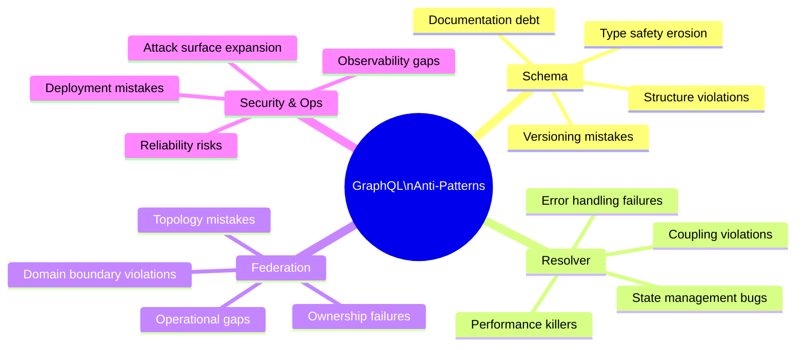

# Anti-Patterns — README

> Anti-patterns are as instructive as best practices. This section catalogs the most common GraphQL mistakes at every layer — schema design, resolver implementation, federation topology, security posture, and operational readiness — with concrete explanations of why they occur, what breaks, and what to do instead. Knowing these patterns by name makes code review conversations faster and decisions more defensible.

---

## What's in This Section

| File | Layer | Anti-Patterns Covered | Reading Time |
|---|---|---|---|
| [01-schema-anti-patterns.md](01-schema-anti-patterns.md) | Schema Design | Generic Response Wrapper, God Schema, REST-Shaped GraphQL, Non-Nullable Everything, Opaque JSON Scalars, Deeply Nested Mutations, Magic String Enums, Pagination Anti-patterns, Version Suffixes, Missing Descriptions | 50 min |
| [02-resolver-anti-patterns.md](02-resolver-anti-patterns.md) | Resolver Implementation | N+1 Without DataLoader, Database Logic in Resolvers, Throwing for Expected Errors, Fat Context Object, DataLoader Outside Context, Synchronous Blocking, Ignoring Resolver Timeout, Inconsistent Null Handling, Circular DataLoader Dependencies, Over-fetching in Resolvers | 55 min |
| [03-federation-anti-patterns.md](03-federation-anti-patterns.md) | Federation & Supergraph | Shared Database Between Subgraphs, Cross-Subgraph Direct Calls, Overloaded @key, Subgraph Per Microservice, Missing Composition Check in CI, @requires Abuse, Ignoring Query Plan Cost, Anonymous Subgraph Ownership, Hard-coded Subgraph URLs, Schema-First Without Contract Tests | 55 min |
| [04-security-and-operational-anti-patterns.md](04-security-and-operational-anti-patterns.md) | Security & Operations | Introspection in Production, No Complexity Limits, JWT Validation in Each Subgraph, Logging Full Query Documents, No operationName Requirement, Single-Replica Router, Skipping Schema Checks, Alert Fatigue from Partial Errors, Cold Cache on Deploy, Mutation Without Idempotency | 50 min |

---

## Anti-Pattern Taxonomy

---

## How to Use This Section

**In code review**: Use the anti-pattern names as shorthand. "This is a Generic Response Wrapper — see docs/29/01" is faster than re-explaining the problem every review cycle.

**In architecture review**: Walk through the federation anti-patterns checklist before a new subgraph ships. The cost of fixing topology mistakes post-launch is high.

**In onboarding**: New engineers on a GraphQL platform team should read this section before their first PR. Pattern recognition is faster than learning from production incidents.

**In incident retrospectives**: Many production incidents trace back to one of the operational anti-patterns in section 04. Use these as a root-cause taxonomy.

---

## Severity Reference

Each anti-pattern in this section is tagged with a severity level:

| Severity | Meaning |
|---|---|
| **Critical** | Data loss, security breach, or full service outage |
| **High** | Significant performance degradation or client breakage |
| **Medium** | Developer experience degradation or maintainability failure |
| **Low** | Technical debt, future risk, or tooling breakage |

---

## Prerequisites

- [Schema Design](../03-schema-design/README.md) — understand the correct patterns before studying the violations
- [Resolvers & Execution](../04-resolvers-and-execution/README.md) — understand resolver lifecycle
- [Federation](../07-federation/README.md) — understand federation topology before the federation anti-patterns

## Related Topics

- [Best Practices](../28-best-practices/README.md) — the positive counterpart to this section
- [Production Failure Scenarios](../26-production-failure-scenarios/README.md) — real incident post-mortems rooted in these anti-patterns
- [Schema Governance](../09-schema-governance/README.md) — governance processes that prevent anti-patterns from merging
- [CI/CD Automation](../11-ci-cd-automation/README.md) — automated gates that catch anti-patterns before production
