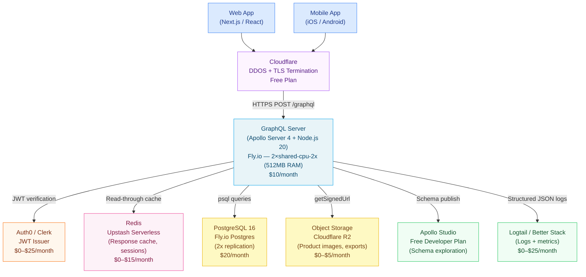

# Reference Architecture 01: Startup GraphQL

> **Purpose:** This architecture covers GraphQL for early-stage companies (0–50 engineers) that need a production-quality API without the operational complexity of federation. A single GraphQL server with a PostgreSQL database, Redis for caching, and a minimal deployment footprint on Railway or Fly.io. Fast to build, cheap to run, easy to evolve.

---

## When to Use This Architecture

Use this architecture when all of the following are true:

- Fewer than 50 backend engineers
- Fewer than 5 distinct product domains (users, products, orders, payments, content)
- A single backend team owns the GraphQL schema
- Monthly infrastructure budget is under $500
- You are not yet running on Kubernetes (or don't want to)

Do **not** use this architecture if:
- Multiple teams need to deploy schema changes independently
- You have more than 3 distinct backend databases with different teams owning each
- You need schema contracts for different client types (mobile vs. partner vs. internal)

---

## When to Graduate to Federation (Architecture 02)

These are the signals that indicate you have outgrown this architecture:

| Signal | Threshold | Action |
|---|---|---|
| Number of backend teams contributing to the schema | ≥ 3 teams | Evaluate federation |
| Number of distinct business domains in the schema | ≥ 5 domains | Evaluate federation |
| Schema PR review bottleneck | > 2 PRs blocked at any time | Evaluate federation |
| Schema file lines of SDL | > 3,000 lines | Evaluate federation |
| Deployment coordination overhead | > 4 hours/week on schema coordination | Initiate federation migration |

Federation graduation typically happens at 30–80 engineers. Waiting until 200 engineers makes the migration significantly harder.

---

## Architecture Overview



---

## Component Choices

### GraphQL Server: Apollo Server 4 on Node.js 20

Apollo Server 4 is the standard choice for a startup. It has the largest ecosystem of middleware, plugins, and learning resources. Node.js 20 LTS is the runtime.

```typescript
// src/server.ts
import { ApolloServer } from '@apollo/server';
import { startStandaloneServer } from '@apollo/server/standalone';
import { buildContext } from './context';
import { typeDefs } from './schema';
import { resolvers } from './resolvers';

const server = new ApolloServer({
  typeDefs,
  resolvers,
  plugins: [
    // Log all operations in development
    process.env.NODE_ENV !== 'production'
      ? ApolloServerPluginLandingPageLocalDefault()
      : ApolloServerPluginLandingPageDisabled(),
  ],
  introspection: process.env.NODE_ENV !== 'production',
  formatError: (formattedError) => {
    // Strip stack traces in production
    if (process.env.NODE_ENV === 'production') {
      return {
        message: formattedError.message,
        extensions: {
          code: formattedError.extensions?.code ?? 'INTERNAL_ERROR',
        },
      };
    }
    return formattedError;
  },
});

const { url } = await startStandaloneServer(server, {
  context: buildContext,
  listen: { port: parseInt(process.env.PORT ?? '4000') },
});
```

### Database: PostgreSQL 16 on Fly.io

Fly.io Managed Postgres provides a primary + 2 read replicas configuration for $20/month (2 shared CPU, 1GB RAM, 10GB disk). This handles up to ~2,000 write operations/second and ~10,000 read operations/second with appropriate indexing.

```typescript
// src/db.ts
import { Pool } from 'pg';

export const pool = new Pool({
  connectionString: process.env.DATABASE_URL,
  max: 20,          // Max connections per process
  idleTimeoutMillis: 30000,
  connectionTimeoutMillis: 2000,
  statement_timeout: 5000,  // 5 second query timeout
});
```

### Caching: Upstash Redis (Serverless)

Upstash Redis Serverless provides Redis-compatible caching without a dedicated Redis instance. The free tier handles 10,000 commands/day. The $10/month plan handles 100,000 commands/day — sufficient for a startup.

```typescript
// src/cache.ts
import { Redis } from '@upstash/redis';

export const redis = new Redis({
  url: process.env.UPSTASH_REDIS_URL!,
  token: process.env.UPSTASH_REDIS_TOKEN!,
});

export async function withCache<T>(
  key: string,
  ttlSeconds: number,
  fetcher: () => Promise<T>
): Promise<T> {
  const cached = await redis.get<T>(key);
  if (cached !== null) return cached;

  const result = await fetcher();
  await redis.setex(key, ttlSeconds, result);
  return result;
}
```

### Authentication: Auth0 or Clerk

Both Auth0 and Clerk provide JWT-based authentication with a generous free tier (7,500 monthly active users for Auth0; 10,000 MAU for Clerk). JWT validation in the GraphQL context factory:

```typescript
// src/context.ts
import { jwtVerify, createRemoteJWKSet } from 'jose';

const JWKS = createRemoteJWKSet(
  new URL(`https://${process.env.AUTH0_DOMAIN}/.well-known/jwks.json`)
);

export async function buildContext({ req }: { req: Request }) {
  const authHeader = req.headers.get('Authorization');
  let user = null;

  if (authHeader?.startsWith('Bearer ')) {
    try {
      const token = authHeader.slice(7);
      const { payload } = await jwtVerify(token, JWKS, {
        audience: process.env.AUTH0_AUDIENCE,
        issuer: `https://${process.env.AUTH0_DOMAIN}/`,
      });
      user = { id: payload.sub!, email: payload.email as string, roles: payload.roles as string[] ?? [] };
    } catch {
      // Invalid token — user remains null (unauthenticated)
    }
  }

  return {
    user,
    db: pool,
    redis,
    loaders: {
      userById: createUserByIdLoader(pool),
      productById: createProductByIdLoader(pool),
    },
  };
}
```

### Schema Management: Single File, Git-Controlled

At startup scale, the schema lives in a single `schema.graphql` file (or split by domain into a `schema/` directory and merged at startup). No schema registry is needed — git history is the version history.

```
src/
  schema/
    user.graphql
    product.graphql
    order.graphql
    common.graphql
    index.ts       # Merges all SDL files
  resolvers/
    user.ts
    product.ts
    order.ts
  services/
    userService.ts
    orderService.ts
  loaders/
    userLoader.ts
    productLoader.ts
  context.ts
  server.ts
```

### Deployment: Fly.io

Fly.io provides the simplest path to a production-grade deployment. Two app instances across two regions, automatic health checks, and zero-downtime deploys.

```toml
# fly.toml
app = "my-graphql-api"
primary_region = "iad"  # us-east (Ashburn)

[http_service]
  internal_port = 4000
  force_https = true
  auto_stop_machines = true
  auto_start_machines = true
  min_machines_running = 1  # Always at least 1 machine running

  [http_service.concurrency]
    type = "requests"
    hard_limit = 250
    soft_limit = 200

[[vm]]
  memory = "512mb"
  cpu_kind = "shared"
  cpus = 2

[deploy]
  strategy = "rolling"  # Zero-downtime deploys
```

---

## DataLoader Pattern at Startup Scale

Even at startup scale, DataLoaders are non-negotiable. A product listing page with 20 products that each resolve their category will fire 20 category queries without DataLoader.

```typescript
// src/loaders/productLoader.ts
import DataLoader from 'dataloader';
import { pool } from '../db';

export function createProductByIdLoader() {
  return new DataLoader<string, Product | null>(async (ids) => {
    const result = await pool.query<Product>(
      'SELECT * FROM products WHERE id = ANY($1::uuid[])',
      [ids]
    );
    const map = new Map(result.rows.map(p => [p.id, p]));
    return ids.map(id => map.get(id) ?? null);
  });
}
```

---

## Cost Breakdown

| Component | Provider | Plan | Monthly Cost |
|---|---|---|---|
| GraphQL Server | Fly.io | 2× shared-cpu-2x, 512MB | $10 |
| PostgreSQL | Fly.io | Flex plan (1 primary + 1 replica, 2GB disk) | $18 |
| Redis | Upstash | Pay-as-you-go (< 100k commands/day) | $0–$10 |
| CDN / DDoS | Cloudflare | Free plan | $0 |
| Authentication | Clerk | Hobby plan (< 10k MAU) | $0 |
| Object Storage | Cloudflare R2 | Pay-as-you-go (< 10GB) | $0–$5 |
| Schema Exploration | Apollo Studio | Free developer plan | $0 |
| Logging | Logtail | Free plan (1GB/month) | $0 |
| DNS | Cloudflare | Free plan | $0 |
| **Total** | | | **$28–$43/month** |

At 50,000 active users/month with typical usage patterns: **$75–$150/month** accounting for higher database and cache usage.

---

## Team Model

**Minimum viable team:** 1 full-stack or backend engineer

This engineer owns: schema design, resolver implementation, database migrations, deployment, and monitoring. At startup scale, this is appropriate — the overhead of a larger team exceeds the benefit.

**Operations:** The founder or a non-engineering team member can monitor the Fly.io dashboard and Logtail for errors without deep technical knowledge.

**On-call:** The single backend engineer. Incidents at startup scale are typically: database connection pool exhaustion (fix: increase pool size or add a read replica), or schema bugs caught in development.

---

## Security at Startup Scale

The startup architecture implements a subset of the best practices in Chapter 28. The minimum viable security posture:

1. **TLS everywhere** — Cloudflare + Fly.io both terminate TLS; force HTTPS in fly.toml
2. **JWT authentication** — Auth0/Clerk provide production-grade JWT issuance and validation
3. **Query depth limits** — `graphql-depth-limit` package; set to 8 for startup APIs
4. **No introspection in production** — `introspection: process.env.NODE_ENV !== 'production'`
5. **No raw error messages** — `formatError` strips stack traces in production

What to add as you grow toward the scale-up tier:
- Query complexity limits
- Operation name requirements
- Field-level authorization (start with simple `if (!context.user) throw` patterns)
- Rate limiting (Cloudflare Rate Limiting rules at the CDN layer)

---

## Observability at Startup Scale

Minimal observability setup that provides enough information to debug incidents:

```typescript
// Apollo Server plugin: log all operations
const operationLoggingPlugin: ApolloServerPlugin = {
  async requestDidStart({ request }) {
    const start = Date.now();
    return {
      async willSendResponse({ response }) {
        const hasErrors = (response.body as any)?.singleResult?.errors?.length > 0;
        console.log(JSON.stringify({
          operationName: request.operationName ?? 'anonymous',
          durationMs: Date.now() - start,
          hasErrors,
          clientId: request.http?.headers.get('x-client-id') ?? 'unknown',
        }));
      },
    };
  },
};
```

Logtail provides log aggregation, search, and basic alerting. Configure an alert for: error rate > 5% in any 5-minute window.

---

## References and Related Topics

- [Apollo Server 4 Documentation](https://www.apollographql.com/docs/apollo-server/) — official Apollo Server reference
- [Fly.io Documentation](https://fly.io/docs/) — deployment platform
- [Upstash Redis](https://upstash.com/) — serverless Redis
- [DataLoader](https://github.com/graphql/dataloader) — N+1 prevention
- [Chapter 04: Resolvers and Execution](../04-resolvers-and-execution/README.md) — resolver patterns
- [Chapter 05: Security](../05-security/README.md) — security depth for when you need more
- [Best Practices: Schema](../28-best-practices/01-schema-best-practices.md) — schema rules to follow from day one
- [02-scale-up-architecture.md](./02-scale-up-architecture.md) — the next architecture tier
