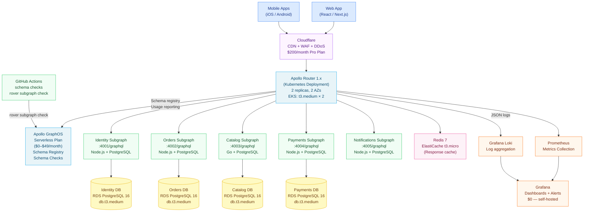

# Reference Architecture 02: Scale-Up Federation

> **Purpose:** This architecture covers the growing company stage (50–200 engineers): Apollo Federation v2 with 3–8 subgraphs deployed on Kubernetes (EKS or GKE), schema checks via GitHub Actions, Apollo GraphOS Serverless for the schema registry, and Prometheus + Grafana for observability. This is the first federated architecture — the one where teams gain deployment independence.

---

## When to Use This Architecture

Use this architecture when:

- 50–200 backend engineers across multiple teams
- 3–8 distinct business domains with independent deployment requirements
- Each domain team wants to own and deploy their GraphQL schema without coordinating with other teams
- You are already running (or ready to move to) Kubernetes
- Infrastructure budget of $500–$2,000/month

Signals that indicate you are ready to move from the startup monolith (Architecture 01):

| Signal | You Have Reached This When |
|---|---|
| Schema PR coordination overhead | > 4 hours/week spent waiting for schema PRs to merge |
| Number of backend teams | 3+ teams contributing to a single schema |
| Deployment coupling | Cannot deploy one service without coordinating with another |
| Schema file size | > 3,000 lines of SDL |
| Domain ownership ambiguity | Unclear who is responsible for a given type in the schema |

---

## When to Graduate to Enterprise (Architecture 03)

| Signal | Threshold |
|---|---|
| Number of subgraphs | > 8 subgraphs consistently |
| Number of backend teams | > 10 teams |
| Platform team need | Team spending > 20% of time on federation operations |
| Router throughput | > 50,000 requests/minute sustained |
| SLO requirements | < 100ms p99 latency requirement |

---

## Architecture Overview



---

## Component Choices

### Apollo Router 1.x on Kubernetes (EKS)

The Apollo Router is a Rust binary — it is significantly more efficient than an Apollo Gateway (Node.js) at the same traffic volume. A single `t3.medium` instance handles ~5,000 requests/second at 64MB RAM usage. Two replicas across two AZs provide high availability.

```yaml
# k8s/router-deployment.yaml
apiVersion: apps/v1
kind: Deployment
metadata:
  name: apollo-router
  namespace: graphql
spec:
  replicas: 2
  selector:
    matchLabels:
      app: apollo-router
  template:
    metadata:
      labels:
        app: apollo-router
    spec:
      containers:
        - name: router
          image: ghcr.io/apollographql/router:v1.47.0
          ports:
            - containerPort: 4000
          env:
            - name: APOLLO_KEY
              valueFrom:
                secretKeyRef:
                  name: apollo-router-secrets
                  key: APOLLO_KEY
            - name: APOLLO_GRAPH_REF
              value: "my-graph@production"
          resources:
            requests:
              cpu: 500m
              memory: 256Mi
            limits:
              cpu: 2000m
              memory: 1Gi
          readinessProbe:
            httpGet:
              path: /health?ready
              port: 8088
            initialDelaySeconds: 10
            periodSeconds: 5
```

```yaml
# router.yaml — router configuration
supergraph:
  listen: 0.0.0.0:4000

health_check:
  enabled: true
  listen: 0.0.0.0:8088

sandbox:
  enabled: false  # Disabled in production

introspection: false

telemetry:
  metrics:
    prometheus:
      enabled: true
      listen: 0.0.0.0:9090
      path: /metrics

traffic_shaping:
  all:
    timeout: 30s
  router:
    timeout: 60s

preview_operation_limits:
  max_depth: 12
  max_height: 100
  max_aliases: 20
  max_root_fields: 10
```

### Apollo GraphOS Serverless Plan

Apollo GraphOS Serverless ($0–$49/month based on usage) provides:
- Schema registry with version history
- `rover subgraph check` CI integration
- Schema change notifications
- Basic field usage analytics (which fields are actually being queried)
- Explorer (for internal developers — enable with internal auth)

```bash
# Subgraph publish to GraphOS after each production deployment
rover subgraph publish my-graph@production \
  --name orders \
  --schema ./schema/orders.graphql \
  --routing-url https://orders.internal.cluster/graphql
```

### Kubernetes (EKS) with Helm

EKS provides managed Kubernetes. Each subgraph is deployed as an independent Helm release, enabling independent deployments per team.

```yaml
# helm/subgraph-template/values.yaml
image:
  repository: 123456789.dkr.ecr.us-east-1.amazonaws.com/orders-subgraph
  tag: "latest"
  pullPolicy: IfNotPresent

replicaCount: 2

resources:
  requests:
    cpu: 250m
    memory: 256Mi
  limits:
    cpu: 1000m
    memory: 512Mi

service:
  type: ClusterIP
  port: 4000

hpa:
  enabled: true
  minReplicas: 2
  maxReplicas: 10
  targetCPUUtilizationPercentage: 70
```

### GitHub Actions Schema Checks

Every pull request that modifies a subgraph schema runs `rover subgraph check` before merge. This is a required status check — PRs cannot merge without it.

```yaml
# .github/workflows/schema-check.yml
name: Schema Check

on:
  pull_request:
    paths:
      - 'src/**/*.graphql'
      - 'schema.graphql'

jobs:
  schema-check:
    runs-on: ubuntu-latest
    timeout-minutes: 10
    steps:
      - uses: actions/checkout@v4

      - name: Install Rover
        run: |
          curl -sSL https://rover.apollo.dev/nix/latest | sh
          echo "$HOME/.rover/bin" >> $GITHUB_PATH

      - name: Run schema check
        env:
          APOLLO_KEY: ${{ secrets.APOLLO_KEY }}
        run: |
          rover subgraph check my-graph@production \
            --name ${{ github.event.repository.name }} \
            --schema ./schema.graphql \
            --routing-url https://${{ github.event.repository.name }}.internal.cluster/graphql

      - name: Comment on PR with schema diff
        if: always()
        uses: actions/github-script@v7
        with:
          script: |
            // Post schema check results as a PR comment
```

### Prometheus + Grafana Observability

Self-hosted Prometheus and Grafana on the same EKS cluster. The Apollo Router exports Prometheus metrics natively.

```yaml
# prometheus/router-scrape-config.yaml
scrape_configs:
  - job_name: 'apollo-router'
    static_configs:
      - targets: ['apollo-router.graphql.svc.cluster.local:9090']
    scrape_interval: 15s
    metrics_path: /metrics
```

Key dashboards to build in Grafana (from scratch or using Apollo's community dashboard):

1. **Request rate** — `rate(apollo_router_requests_total[5m])` by operation name
2. **Error rate** — `rate(apollo_router_requests_total{status=~"5.."}[5m]) / rate(apollo_router_requests_total[5m])`
3. **P99 latency** — `histogram_quantile(0.99, rate(apollo_router_request_duration_seconds_bucket[5m]))`
4. **Subgraph request rate** — by subgraph name (entity N+1 detection)
5. **DataLoader cache hit rate** — custom metric exported from each subgraph

### Redis Response Caching

ElastiCache t3.micro Redis 7 ($20/month) for router-level response caching. Cacheable queries (product catalog, user profiles that don't change frequently) are cached at the router level.

```yaml
# router.yaml — response caching
apq:
  enabled: true  # Automatic Persisted Queries

supergraph:
  subgraph_overrides:
    catalog:
      # Cache catalog queries for 60 seconds at the router
      experimental_response_cache:
        enabled: true
        ttl: 60s
        redis:
          urls: ["redis://elasticache.internal:6379"]
```

---

## Subgraph Structure

Each subgraph follows the same structure, enabling teams to work independently:

```
orders-subgraph/
  src/
    schema/
      order.graphql      # Type definitions
      entities.graphql   # @key definitions and __resolveReference
    resolvers/
      query.ts           # Query resolvers
      mutation.ts        # Mutation resolvers
      order.ts           # Field resolvers for Order type
    services/
      orderService.ts    # Business logic
    loaders/
      orderLoader.ts     # DataLoader definitions
    context.ts           # Context factory
    server.ts            # Server entry point
  __tests__/
    resolvers/
    services/
  Dockerfile
  helm/                  # Helm chart for this subgraph
  schema.graphql         # Compiled schema SDL (generated in CI)
```

---

## CI/CD Pipeline

```mermaid
flowchart LR
    PR["Pull Request\nOpened"] --> SchemaCheck["rover subgraph check\n(required status check)"]
    SchemaCheck --> Tests["Unit + Integration Tests\n(PostgreSQL testcontainer)"]
    Tests --> Build["Docker Build\n+ Push to ECR"]
    Build --> StagingDeploy["Deploy to Staging\nhelm upgrade orders-staging"]
    StagingDeploy --> E2E["E2E Tests\nagainst staging supergraph"]
    E2E --> Merge["PR Merged\nto main"]
    Merge --> ProdDeploy["Deploy to Production\nhelm upgrade orders-production"]
    ProdDeploy --> Publish["rover subgraph publish\n(update schema registry)"]
    Publish --> Monitor["Monitor SLOs\n5 minutes post-deploy"]

    classDef ciNode fill:#e8f4f8,stroke:#0ea5e9,color:#0c4a6e
    classDef deployNode fill:#f0fdf4,stroke:#22c55e,color:#14532d
    classDef checkNode fill:#fef9c3,stroke:#eab308,color:#713f12

    class PR,SchemaCheck,Tests,Build,E2E,Monitor checkNode
    class StagingDeploy,ProdDeploy,Publish deployNode
```



---

## Team Model

**1 platform-adjacent engineer (20–40% of time)**

This does not require a dedicated platform team. One senior engineer from any backend team can own the federated infrastructure with 20–40% of their time, assuming:
- Helm charts are standardized and teams deploy themselves
- Schema checks are automated in CI
- The router is deployed and requires minimal day-to-day attention

**Domain teams** each own their subgraph end-to-end: schema, implementation, tests, deployment.

**Escalation path:**
- Router issues → platform-adjacent engineer
- Schema composition conflicts → the two conflicting teams + platform-adjacent engineer
- Performance issues → each team's subgraph; platform-adjacent engineer for router-level issues

---

## Cost Breakdown

| Component | Provider | Configuration | Monthly Cost |
|---|---|---|---|
| EKS Cluster | AWS EKS | 1 cluster, us-east-1a + us-east-1b | $72 |
| Worker Nodes (Router) | AWS EC2 | 2× t3.medium (2 vCPU, 4GB) | $60 |
| Worker Nodes (Subgraphs) | AWS EC2 | 3× t3.large (2 vCPU, 8GB), 5 subgraphs | $220 |
| RDS PostgreSQL (5 DBs) | AWS RDS | 5× db.t3.medium, Multi-AZ | $360 |
| ElastiCache Redis | AWS ElastiCache | 1× cache.t3.micro | $20 |
| Load Balancer | AWS ALB | 1 ALB for the router | $22 |
| CloudFront / Cloudflare | Cloudflare | Pro plan | $20 |
| Apollo GraphOS | Apollo | Serverless plan | $0–$49 |
| ECR (Docker registry) | AWS ECR | ~10GB storage | $1 |
| CloudWatch Logs | AWS | ~10GB/month | $5 |
| Data Transfer | AWS | ~100GB/month | $9 |
| **Total** | | | **$789–$838/month** |

**Optimization levers:**
- Use Spot Instances for subgraph nodes: saves ~70% ($154 instead of $220 for node group)
- Use 1-year Reserved Instances for RDS: saves ~40% ($216 instead of $360)
- Optimized configuration: **$550–$620/month**

---

## References and Related Topics

- [Apollo GraphOS Serverless](https://www.apollographql.com/docs/graphos/plans/) — plan comparison
- [Apollo Router Helm Chart](https://github.com/apollographql/helm-charts) — official Helm charts
- [Chapter 07: Federation](../07-federation/README.md) — federation concepts required for this architecture
- [Chapter 11: CI/CD Automation](../11-ci-cd-automation/README.md) — schema check automation
- [Chapter 12: GitHub Actions](../12-github-actions/README.md) — workflow implementations
- [Chapter 14: Observability](../14-observability/README.md) — Prometheus + Grafana configuration depth
- [Chapter 15: Kubernetes Deployment](../15-kubernetes-deployment/README.md) — Kubernetes deployment patterns
- [01-startup-architecture.md](./01-startup-architecture.md) — the previous tier
- [03-enterprise-architecture.md](./03-enterprise-architecture.md) — the next tier
