# Reference Architecture 03: Full Enterprise Supergraph

> **Purpose:** This architecture covers full enterprise GraphQL deployments (200+ engineers, 50 subgraphs across 10 domain teams). It includes a complete technology stack: Cloudflare CDN, Apollo Router in high-availability configuration, Istio mTLS service mesh, OpenTelemetry Collector with Grafana Tempo + Prometheus + Loki, Apollo GraphOS Enterprise + Hive, HashiCorp Vault for secrets, ArgoCD for GitOps, and Backstage for the internal developer portal. A dedicated platform team of 5 engineers owns and operates this stack.

---

## When to Use This Architecture

Use this architecture when:

- 200+ engineers across 10+ backend teams
- 20–100 subgraphs in production, multiple added per quarter
- Dedicated platform team required to manage federation infrastructure
- Compliance requirements (SOC 2, GDPR, HIPAA) drive security and audit posture
- SLO requirements: 99.9% availability, p99 < 500ms
- Monthly infrastructure budget of $15,000–$50,000

---

## Architecture Overview

```mermaid
flowchart TD
    classDef clientNode fill:#dbeafe,stroke:#3B82F6,color:#1e3a8a
    classDef cdnNode fill:#fdf4ff,stroke:#a855f7,color:#581c87
    classDef routerNode fill:#e8f4f8,stroke:#0ea5e9,color:#0c4a6e
    classDef subgraphNode fill:#f0fdf4,stroke:#22c55e,color:#14532d
    classDef dbNode fill:#fef9c3,stroke:#eab308,color:#713f12
    classDef meshNode fill:#fff7ed,stroke:#f97316,color:#7c2d12
    classDef obsNode fill:#fdf2f8,stroke:#ec4899,color:#831843
    classDef infraNode fill:#f8fafc,stroke:#64748b,color:#1e293b

    WebApps["Web Apps\n(React, Next.js)"]:::clientNode
    MobileApps["Mobile Apps\n(iOS, Android, Flutter)"]:::clientNode
    Partners["Partner APIs\n(REST-to-GraphQL proxied)"]:::clientNode
    InternalTools["Internal Tools\n(Admin, Analytics, BI)"]:::clientNode

    CF["Cloudflare\nEnterprise Plan\nWAF + DDoS + Bot Management\nGeoDNS + SSL/TLS"]:::cdnNode

    Router["Apollo Router Cluster\n(HA: 6 replicas across 3 AZs)\nm5.xlarge × 6 EKS nodes\nTarget: p99 < 50ms router overhead"]:::routerNode

    OPACoprocessor["OPA Coprocessor\nField-level authorization\nRego policy engine"]:::routerNode

    Istio["Istio Service Mesh\nmTLS between all components\nEnvoy sidecars on every pod"]:::meshNode

    RegistryHive["Apollo Hive\n(Schema Registry + Analytics)\nSelf-hosted on EKS\nFallback to GraphOS Enterprise"]:::infraNode

    GraphOS["Apollo GraphOS Enterprise\nSchema contracts + @tag\nClient awareness metrics\nSLO tracking"]:::infraNode

    DomainTeams["10 Domain Teams\n50 Subgraphs Total"]:::subgraphNode

    Identity["Identity Subgraph\n5 replicas"]:::subgraphNode
    Orders["Orders Subgraph\n8 replicas"]:::subgraphNode
    Catalog["Catalog Subgraph\n10 replicas"]:::subgraphNode
    Payments["Payments Subgraph\n5 replicas\nPCI-DSS isolated namespace"]:::subgraphNode
    Search["Search Subgraph\n4 replicas\n+ Elasticsearch 8"]:::subgraphNode
    Fulfillment["Fulfillment Subgraph\n4 replicas"]:::subgraphNode
    Notifications["Notifications Subgraph\n3 replicas"]:::subgraphNode
    Analytics["Analytics Subgraph\n3 replicas\n(CQRS — read model)"]:::subgraphNode
    Recommendations["Recommendations Subgraph\n4 replicas\n+ ML model serving"]:::subgraphNode
    Content["Content Subgraph\n4 replicas\n+ Contentful CMS"]:::subgraphNode
    OtherSubgraphs["+ 40 More Subgraphs\nacross 10 domain teams"]:::subgraphNode

    RDS["Amazon Aurora PostgreSQL\nGlobal Cluster\n(Writer: us-east-1)\n(Readers: us-east-1 × 3)"]:::dbNode
    Elasticsearch["Amazon OpenSearch\n3-node cluster\nProduct search index"]:::dbNode
    Redis["Amazon ElastiCache\nRedis 7 Cluster Mode\n6 shards (HA)"]:::dbNode

    OTel["OpenTelemetry Collector\nDaemonSet on all nodes\nBatch export every 5s"]:::obsNode
    Tempo["Grafana Tempo\nDistributed trace storage\nS3 backend"]:::obsNode
    Prometheus["Prometheus\n(Thanos for long-term storage)\nRetention: 90 days"]:::obsNode
    Loki["Grafana Loki\nLog aggregation\nS3 backend"]:::obsNode
    Grafana["Grafana Enterprise\nUnified dashboards\nSLO tracking + alerts"]:::obsNode

    Vault["HashiCorp Vault\nSecret management\n90-day rotation\nKubernetes auth backend"]:::infraNode
    ArgoCD["ArgoCD\nGitOps deployment\nApp of Apps pattern"]:::infraNode
    Backstage["Backstage\nInternal Developer Portal\nSubgraph ownership catalog"]:::infraNode

    WebApps --> CF
    MobileApps --> CF
    Partners --> CF
    InternalTools --> CF

    CF -->|"HTTPS / HTTP2"| Router

    Router --> OPACoprocessor
    Router --> RegistryHive
    Router --> GraphOS
    Router --> Redis

    Router -->|"mTLS via Istio"| Identity
    Router -->|"mTLS via Istio"| Orders
    Router -->|"mTLS via Istio"| Catalog
    Router -->|"mTLS via Istio"| Payments
    Router -->|"mTLS via Istio"| Search
    Router -->|"mTLS via Istio"| Fulfillment
    Router -->|"mTLS via Istio"| Notifications
    Router -->|"mTLS via Istio"| Analytics
    Router -->|"mTLS via Istio"| Recommendations
    Router -->|"mTLS via Istio"| Content
    Router -->|"mTLS via Istio"| OtherSubgraphs

    Identity & Orders & Catalog & Payments --> RDS
    Search --> Elasticsearch
    Router & Identity & Orders --> Redis

    Router & Identity & Orders & Catalog --> OTel
    OTel --> Tempo
    OTel --> Prometheus
    OTel --> Loki
    Tempo & Prometheus & Loki --> Grafana

    Vault -.->|"Secret injection"| Router
    Vault -.->|"Secret injection"| Identity
    Vault -.->|"Secret injection"| Orders

    ArgoCD -.->|"GitOps sync"| Router
    ArgoCD -.->|"GitOps sync"| DomainTeams

    Backstage -.->|"Subgraph catalog"| RegistryHive
```



---

## Component Choices

### Apollo Router (HA Cluster)

6 router replicas across 3 availability zones on `m5.xlarge` instances (4 vCPU, 16GB RAM). The Router is the only entry point for all GraphQL traffic. It is never a single point of failure.

```yaml
# router HPA
apiVersion: autoscaling/v2
kind: HorizontalPodAutoscaler
metadata:
  name: apollo-router
spec:
  minReplicas: 6
  maxReplicas: 30
  metrics:
    - type: Resource
      resource:
        name: cpu
        target:
          type: Utilization
          averageUtilization: 60
```

```yaml
# router.yaml — enterprise configuration
supergraph:
  listen: 0.0.0.0:4000

# Schema registry: dual-write to Hive + GraphOS
uplink:
  poll_interval: 10s
  timeout: 5s

telemetry:
  tracing:
    propagation:
      trace_context: true
      baggage: true
    exporter:
      otlp:
        endpoint: http://otel-collector.observability.svc.cluster.local:4317
        protocol: grpc
  metrics:
    prometheus:
      enabled: true
      listen: 0.0.0.0:9090
      path: /metrics
  logging:
    format: json
    level: info

traffic_shaping:
  all:
    timeout: 30s
  router:
    timeout: 60s
    global_rate_limit:
      capacity: 100000
      interval: 1s

preview_operation_limits:
  max_depth: 15
  max_height: 200
  max_aliases: 30
  max_root_fields: 20

persisted_queries:
  enabled: true
  safelist:
    enabled: true
    require_id: false  # APQ mode: allow first-time queries but cache them

sandbox:
  enabled: false

introspection: false
```

### Istio Service Mesh with mTLS

Istio is installed on the EKS cluster using the Istio Operator. All pods in the `graphql-production` namespace have Envoy sidecars injected, enforcing strict mTLS for all pod-to-pod communication.

```yaml
# istio/peer-authentication.yaml
apiVersion: security.istio.io/v1beta1
kind: PeerAuthentication
metadata:
  name: graphql-strict-mtls
  namespace: graphql-production
spec:
  mtls:
    mode: STRICT

# Payments namespace: PCI-DSS isolated — no cross-namespace access
---
apiVersion: security.istio.io/v1beta1
kind: AuthorizationPolicy
metadata:
  name: payments-isolation
  namespace: payments-production
spec:
  action: ALLOW
  rules:
    - from:
        - source:
            namespaces: ["graphql-production"]  # Only router namespace can reach payments
      to:
        - operation:
            ports: ["4004"]
```

### OPA Coprocessor for Field-Level Authorization

The OPA coprocessor runs as a sidecar to the Apollo Router and evaluates field-level authorization policies before subgraph fetches.

```typescript
// coprocessor/opa-auth.ts
import { OPAClient } from '@styra/opa';

const opa = new OPAClient(process.env.OPA_URL!);

export async function evaluateFieldAuth(
  field: string,
  parentType: string,
  userId: string,
  roles: string[],
  entityId?: string
): Promise<boolean> {
  const result = await opa.evaluate<boolean>('graphql/field_auth/allow', {
    field,
    parent_type: parentType,
    user: { id: userId, roles },
    entity_id: entityId,
  });
  return result ?? false;
}
```

### Apollo Hive (Self-Hosted Schema Registry)

At enterprise scale, Apollo Hive provides a self-hosted alternative to Apollo GraphOS for schema registry, composition, and analytics. Running both provides resilience: if one is unavailable, the other serves as the source of truth.

```yaml
# argocd/hive-application.yaml
apiVersion: argoproj.io/v1alpha1
kind: Application
metadata:
  name: graphql-hive
  namespace: argocd
spec:
  source:
    repoURL: https://github.com/kamilkisiela/graphql-hive
    path: ./helm
    targetRevision: v0.36.0
    helm:
      values: |
        postgresql:
          enabled: false
          external:
            host: hive-postgres.internal
        redis:
          enabled: false
          external:
            host: hive-redis.internal
        clickhouse:
          enabled: true
```

### OpenTelemetry Collector

The OTel Collector runs as a DaemonSet — one collector per node. All router and subgraph pods export traces, metrics, and logs to the local collector via gRPC, which batches and forwards to the backends.

```yaml
# otel/collector-config.yaml
receivers:
  otlp:
    protocols:
      grpc:
        endpoint: 0.0.0.0:4317
      http:
        endpoint: 0.0.0.0:4318

processors:
  batch:
    timeout: 5s
    send_batch_size: 1024
  memory_limiter:
    check_interval: 1s
    limit_mib: 512

exporters:
  otlp/tempo:
    endpoint: tempo.observability.svc.cluster.local:4317
    tls:
      insecure: true
  prometheusremotewrite:
    endpoint: http://prometheus.observability.svc.cluster.local:9090/api/v1/write
  loki:
    endpoint: http://loki.observability.svc.cluster.local:3100/loki/api/v1/push
    labels:
      resource:
        k8s.namespace.name: "namespace"
        k8s.pod.name: "pod"

service:
  pipelines:
    traces:
      receivers: [otlp]
      processors: [memory_limiter, batch]
      exporters: [otlp/tempo]
    metrics:
      receivers: [otlp]
      processors: [memory_limiter, batch]
      exporters: [prometheusremotewrite]
    logs:
      receivers: [otlp]
      processors: [memory_limiter, batch]
      exporters: [loki]
```

### HashiCorp Vault for Secret Management

Vault runs in HA mode (3 Vault servers, etcd backend) in the infrastructure namespace. Secrets are injected into Kubernetes pods via the Vault Agent Injector.

```yaml
# vault/roles.yaml — each subgraph has its own Vault role
path "secret/data/graphql/orders/+" {
  capabilities = ["read"]
}

# Automatic 90-day rotation for all database credentials
path "database/creds/orders-db" {
  capabilities = ["read"]
}
```

### ArgoCD GitOps

ArgoCD manages all deployments using the App of Apps pattern: a root application monitors the `infrastructure` GitOps repository. Each subgraph team pushes Helm value changes to their directory in the GitOps repo; ArgoCD syncs within 3 minutes.

```yaml
# argocd/apps/root-app.yaml
apiVersion: argoproj.io/v1alpha1
kind: Application
metadata:
  name: graphql-production
  namespace: argocd
spec:
  source:
    repoURL: https://github.com/company/graphql-gitops
    path: ./production
    targetRevision: main
  destination:
    server: https://kubernetes.default.svc
    namespace: argocd
  syncPolicy:
    automated:
      prune: true
      selfHeal: true
    syncOptions:
      - CreateNamespace=true
```

### Backstage Internal Developer Portal

Backstage provides the internal developer portal. Every subgraph is registered as a Backstage Component with ownership metadata, schema links, runbook links, and SLO status.

```yaml
# backstage/catalog/orders-subgraph.yaml
apiVersion: backstage.io/v1alpha1
kind: Component
metadata:
  name: orders-subgraph
  title: Orders Subgraph
  description: GraphQL subgraph for the Order Management bounded context
  annotations:
    backstage.io/techdocs-ref: dir:.
    github.com/project-slug: company/orders-subgraph
    pagerduty.com/integration-key: XXXXXXXXXXXXXXXX
  links:
    - url: https://studio.apollographql.com/graph/my-graph/subgraph/orders
      title: Apollo Studio — Orders Schema
    - url: https://grafana.internal/d/orders-slo
      title: SLO Dashboard
    - url: https://wiki.internal/runbooks/orders-subgraph
      title: Runbook
spec:
  type: graphql-subgraph
  lifecycle: production
  owner: group:order-management-team
  system: graphql-supergraph
```

---

## Platform Team Model

**5 engineers on the platform team:**

| Role | Responsibilities |
|---|---|
| Platform Tech Lead | Architecture decisions, schema governance policy, cross-team coordination |
| Router Engineer | Router configuration, performance tuning, query planning optimization |
| Observability Engineer | OTel pipeline, Grafana dashboards, SLO definitions and burn rate alerts |
| Security Engineer | Vault management, OPA policies, mTLS configuration, secret rotation |
| Developer Experience Engineer | Backstage, CI templates, schema check automation, onboarding documentation |

**Domain teams** (10 teams, each 3–8 engineers) own their subgraphs end-to-end. The platform team provides the platform; domain teams use it.

**On-call rotation:** The platform team is on-call for router-level and federation-level incidents. Domain teams are on-call for their subgraph incidents.

---

## Cost Breakdown

| Component | Configuration | Monthly Cost |
|---|---|---|
| EKS Cluster | 1 cluster, 3 AZs | $72 |
| Router Nodes | 6× m5.xlarge (dedicated node group) | $840 |
| Subgraph Nodes | 20× m5.2xlarge (50 subgraphs, shared) | $4,480 |
| OPA Coprocessor | 3× t3.large (sidecar) | $110 |
| Aurora PostgreSQL | Global cluster, writer + 3 readers | $1,200 |
| Amazon OpenSearch | 3-node cluster, m6g.large.search | $440 |
| ElastiCache Redis | 6-shard cluster, cache.r6g.large | $880 |
| Cloudflare Enterprise | WAF + DDoS + Bot Management | $3,000 |
| Apollo GraphOS Enterprise | Usage-based (100M+ operations/month) | $2,000–$5,000 |
| HashiCorp Vault Enterprise | 3-node HA cluster | $1,500 |
| Grafana Enterprise | 5-user platform team | $200 |
| OTel + Loki + Tempo | Self-hosted, S3 backend | $300 |
| ArgoCD | Self-hosted, free OSS | $0 |
| Backstage | Self-hosted, free OSS | $0 |
| Load Balancers | 2× ALB (router + internal) | $44 |
| Data Transfer | ~1TB/month | $90 |
| S3 (Tempo + Loki traces/logs) | ~10TB/month | $230 |
| **Total** | | **$15,386–$18,386/month** |

High-traffic scenario (1B+ operations/month, Apollo GraphOS at max tier): **$35,000–$50,000/month**

---

## SLO Configuration

```yaml
# slos/enterprise-graphql.yml
slos:
  router_availability:
    target: 99.95%  # 21.9 minutes downtime budget/month
    window: 30d
    indicator:
      good_requests: 'rate(apollo_router_requests_total{status!~"5.."}[5m])'
      total_requests: 'rate(apollo_router_requests_total[5m])'

  router_latency_p99:
    target: 99%     # 99% of requests under 500ms
    window: 30d
    indicator:
      metric: 'histogram_quantile(0.99, rate(apollo_router_request_duration_seconds_bucket[5m])) < 0.5'

  entity_resolution_success_rate:
    target: 99.9%   # _entities queries succeed
    window: 7d
    indicator:
      metric: 'rate(apollo_router_subgraph_requests_total{status!~"5.."}[5m]) / rate(apollo_router_subgraph_requests_total[5m])'
```

---

## Schema Governance at Enterprise Scale

With 50 subgraphs and 10 teams, schema governance requires formal process backed by tooling:

1. **Schema change categories** — addition, modification, deprecation, removal
2. **Approval requirements** — additions need 1 reviewer; removals need platform approval + usage verification
3. **Composition checks** — required CI check on every PR; blocks merge on composition failure
4. **Contract graph validation** — every schema change is validated against all contract graphs (mobile, partner, internal)
5. **Breaking change detection** — `rover schema check` with `--validation-period 7d` surfaces all breaking changes against 7 days of field usage

---

## References and Related Topics

- [Apollo GraphOS Enterprise](https://www.apollographql.com/docs/graphos/enterprise/) — enterprise features
- [Apollo Hive](https://the-guild.dev/graphql/hive) — self-hosted schema registry
- [Istio Documentation](https://istio.io/latest/docs/) — service mesh configuration
- [HashiCorp Vault on Kubernetes](https://developer.hashicorp.com/vault/docs/platform/k8s) — Vault Kubernetes integration
- [ArgoCD App of Apps](https://argo-cd.readthedocs.io/en/stable/operator-manual/cluster-bootstrapping/) — GitOps pattern
- [Backstage](https://backstage.io/) — internal developer portal
- [Chapter 07: Federation](../07-federation/README.md) — federation fundamentals
- [Chapter 08: Supergraph Architecture](../08-supergraph-architecture/README.md) — supergraph design patterns
- [Chapter 09: Schema Governance](../09-schema-governance/README.md) — governance at enterprise scale
- [Chapter 16: Service Mesh Integration](../16-service-mesh-integration/README.md) — Istio depth
- [Chapter 20: Internal Developer Platforms](../20-internal-developer-platforms/README.md) — Backstage integration
- [04-multi-region-architecture.md](./04-multi-region-architecture.md) — extending this to multiple regions
