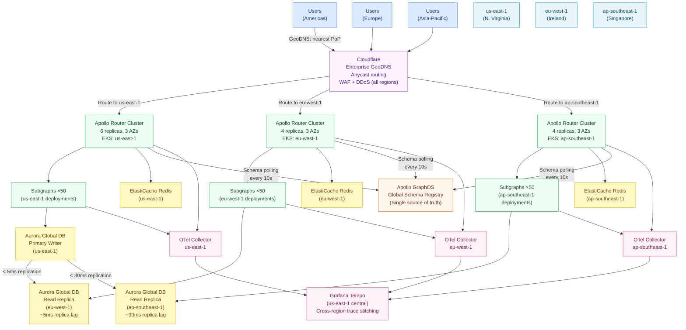

# Reference Architecture 04: Multi-Region Active-Active

> **Purpose:** This architecture covers global, multi-region GraphQL deployments with active-active traffic handling across three regions: us-east-1, eu-west-1, and ap-southeast-1. It covers Cloudflare GeoDNS routing, per-region Apollo Router clusters, independent subgraph deployments per region, global schema registry as a single source of truth, cross-region data replication strategy, and distributed tracing with cross-region trace correlation. Designed for systems with global user bases and sub-200ms latency requirements from any continent.

---

## When to Use This Architecture

Use this architecture when:

- Users are distributed globally across at least two continents
- Latency SLO requires < 200ms p99 from all user locations
- Regulatory requirements mandate data residency in specific regions (GDPR for EU data)
- Business continuity requires that a full regional failure does not cause a service outage
- Read-heavy workloads (the common case for GraphQL) can be served from regional replicas
- Infrastructure budget allows $50,000–$150,000/month

Do not adopt this architecture before you have exhausted single-region optimization. Multi-region adds significant operational complexity. Solve latency with CDN caching, edge workers, and APQ before adding regions.

---

## Active-Active vs. Active-Passive

This architecture is **active-active**: all three regions accept production traffic simultaneously. Writes go to the nearest region's write endpoint; reads are served locally.

The alternative, **active-passive** (one region handles all writes; others handle reads), is simpler but provides lower write availability. Choose active-passive if:
- Write volume is low (< 1,000 writes/second globally)
- Your data model cannot tolerate eventual consistency for writes
- Your team is not yet ready for active-active conflict resolution

---

## Global Topology



---

## Cloudflare GeoDNS Routing

Cloudflare's Load Balancing product provides GeoDNS routing with health checks. Traffic is routed to the nearest regional cluster. Failover is automatic if a region fails its health check.

```yaml
# Cloudflare Load Balancer configuration (via Terraform)
resource "cloudflare_load_balancer" "graphql_api" {
  zone_id          = var.cloudflare_zone_id
  name             = "api.company.com"
  fallback_pool_id = cloudflare_load_balancer_pool.us_east.id
  default_pool_ids = [
    cloudflare_load_balancer_pool.us_east.id,
    cloudflare_load_balancer_pool.eu_west.id,
    cloudflare_load_balancer_pool.ap_southeast.id,
  ]

  region_pools {
    region   = "WNAM"  # Western North America
    pool_ids = [cloudflare_load_balancer_pool.us_east.id]
  }
  region_pools {
    region   = "ENAM"  # Eastern North America
    pool_ids = [cloudflare_load_balancer_pool.us_east.id]
  }
  region_pools {
    region   = "WEU"   # Western Europe
    pool_ids = [cloudflare_load_balancer_pool.eu_west.id]
  }
  region_pools {
    region   = "EEU"   # Eastern Europe
    pool_ids = [cloudflare_load_balancer_pool.eu_west.id]
  }
  region_pools {
    region   = "SEAS"  # Southeast Asia
    pool_ids = [cloudflare_load_balancer_pool.ap_southeast.id]
  }
  region_pools {
    region   = "EAS"   # East Asia
    pool_ids = [cloudflare_load_balancer_pool.ap_southeast.id]
  }

  # If primary region fails health check, failover to the secondary
  rules {
    name      = "eu-failover-to-us"
    condition = "not pool.is_healthy(\"eu_west\")"
    fixed_response {
      message_body = "Regional failover in progress"
    }
    overrides {
      default_pools = [cloudflare_load_balancer_pool.us_east.id]
    }
  }
}

resource "cloudflare_load_balancer_pool" "us_east" {
  name    = "us-east-1"
  monitor = cloudflare_load_balancer_monitor.graphql_health.id

  origins {
    name    = "router-us-east-1"
    address = aws_lb.graphql_router_us.dns_name
    enabled = true
  }

  minimum_origins = 1
}
```

---

## Per-Region Deployment Strategy

Each region runs an identical Kubernetes cluster (EKS) with all 50 subgraphs and an Apollo Router cluster. The deployment pipeline deploys to all regions on every release.

```yaml
# ArgoCD ApplicationSet — deploy to all 3 regions
apiVersion: argoproj.io/v1alpha1
kind: ApplicationSet
metadata:
  name: graphql-supergraph
spec:
  generators:
    - list:
        elements:
          - region: us-east-1
            cluster: https://eks-us-east.internal
            weight: 60  # Primary region — more capacity
          - region: eu-west-1
            cluster: https://eks-eu-west.internal
            weight: 25
          - region: ap-southeast-1
            cluster: https://eks-ap-southeast.internal
            weight: 15
  template:
    metadata:
      name: '{{region}}-graphql'
    spec:
      destination:
        server: '{{cluster}}'
        namespace: graphql-production
      source:
        repoURL: https://github.com/company/graphql-gitops
        path: ./supergraph
        targetRevision: main
        helm:
          values: |
            region: '{{region}}'
            routerReplicas: '{{weight > 50 ? 6 : 4}}'
```

---

## Global Schema Registry

Apollo GraphOS serves as the single global source of truth for the supergraph schema. All regional router clusters poll the same GraphOS endpoint every 10 seconds. A schema change is deployed once to GraphOS; all regions pick it up within 10–30 seconds.

```bash
# Schema deployment: publish once, consumed by all regions
rover subgraph publish my-graph@production \
  --name orders \
  --schema ./schema/orders.graphql \
  --routing-url https://orders.graphql.svc.cluster.local/graphql
# No region specification needed — GraphOS serves all regions the same schema
```

**Schema change propagation timeline:**

1. `rover subgraph publish` updates the schema in GraphOS (< 1 second)
2. Regional routers poll GraphOS every 10 seconds
3. Within 10–30 seconds, all regions have the new schema
4. Old router processes continue serving until Kubernetes rolling update completes

---

## Cross-Region Data Strategy

### Writes: Route to the Primary Region

All mutations are routed to the us-east-1 (primary) region, regardless of the client's geographic location. The Cloudflare Load Balancer uses operation type detection to route mutations differently from queries.

```javascript
// Cloudflare Worker: route mutations to primary region
export default {
  async fetch(request, env) {
    const contentType = request.headers.get('content-type') ?? '';

    if (request.method === 'POST' && contentType.includes('application/json')) {
      const body = await request.clone().json();
      const query = body.query ?? '';
      const operationName = body.operationName ?? '';

      // Detect mutations
      const isMutation = query.trimStart().startsWith('mutation') ||
        (body.extensions?.persistedQuery && mutationOperations.has(operationName));

      if (isMutation) {
        // Route all mutations to primary region
        return fetch('https://api-primary.company.com/graphql', {
          method: request.method,
          headers: request.headers,
          body: JSON.stringify(body),
        });
      }
    }

    // Queries: route to nearest region (default behavior)
    return fetch(request);
  }
};
```

### Reads: Serve From Regional Replica

Queries are served from the nearest region's Aurora read replica. Replica lag for eu-west-1 is typically < 5ms from us-east-1. ap-southeast-1 lag is 20–40ms.

**Stale read handling:** For latency-sensitive reads where stale data is acceptable (product catalog, public content), read from the regional replica. For reads where freshness is critical (user's own order status, account balance), route to the primary region's writer endpoint.

```typescript
// Context factory: choose read vs. write database connection based on operation type
export async function buildContext({ req, operationType }: ContextParams) {
  const isWrite = operationType === 'mutation';
  const dbConfig = isWrite
    ? { host: process.env.DB_WRITER_HOST }   // Always primary writer
    : { host: process.env.DB_READER_HOST };  // Regional read replica

  return {
    db: await pool.connect(dbConfig),
    region: process.env.AWS_REGION,
  };
}
```

### Cache Strategy: Regional Caches With Read-Through

Each region has its own ElastiCache Redis cluster. Cache is populated regionally — there is no cross-region cache synchronization. Cache invalidation events are distributed via SNS → SQS fan-out to all regional caches.

```typescript
// Cache invalidation: publish to SNS, fan out to all regional SQS queues
async function invalidateProductCache(productId: string) {
  await sns.publish({
    TopicArn: process.env.CACHE_INVALIDATION_TOPIC_ARN,
    Message: JSON.stringify({ type: 'PRODUCT_UPDATED', productId }),
    MessageAttributes: {
      region: { DataType: 'String', StringValue: 'all' },
    },
  });
}

// Each region has an SQS consumer that clears its local Redis cache
sqsConsumer.on('message', async (message) => {
  const { type, productId } = JSON.parse(message.Body);
  if (type === 'PRODUCT_UPDATED') {
    await redis.del(`product:${productId}`);
  }
});
```

---

## Distributed Tracing With Cross-Region Correlation

Traces from all three regions are sent to Grafana Tempo in us-east-1. Cross-region traces (a mutation in us-east-1 that triggers an async notification in eu-west-1) are correlated via W3C Trace Context propagation headers.

```yaml
# OTel Collector in each region: forward to central Tempo
exporters:
  otlp/central-tempo:
    endpoint: tempo.us-east-1.internal:4317
    tls:
      insecure: false
      ca_file: /etc/certs/internal-ca.pem
    headers:
      x-source-region: "${REGION}"

# Tempo query hint for cross-region traces
# In Grafana: search by trace_id across all regions
```

**Cross-region trace example:**
- Client in Singapore sends a mutation → routed to us-east-1 (primary)
- trace_id: `abc123` propagated through mutation chain
- Async webhook triggered in eu-west-1 for EU regulatory reporting
- eu-west-1 OTel Collector sends span with `trace_id: abc123` to central Tempo
- Grafana Tempo stitches the spans into one complete trace view

---

## SLO Accounting Across Regions

Define SLOs at the global level and track them per-region. Alert when any region's error budget burns faster than the global target.

```yaml
# Global SLO: 99.9% availability across all regions
# Regional SLO: each region independently must maintain 99.9%

# Prometheus recording rules — federated from all 3 regional Prometheus instances
groups:
  - name: global-slo
    rules:
      - record: graphql:request_success:rate5m:global
        expr: |
          sum(rate(apollo_router_requests_total{status!~"5.."}[5m])) by (region)
          /
          sum(rate(apollo_router_requests_total[5m])) by (region)

      - alert: RegionalAvailabilityBudgetBurning
        expr: |
          graphql:request_success:rate5m:global < 0.999
        for: 5m
        labels:
          severity: critical
        annotations:
          summary: "Region {{ $labels.region }}: availability below 99.9% SLO"
          description: "Current availability: {{ $value | humanizePercentage }}. Region may be degraded."
```

---

## Regional Failover Runbook

When a region fails its health check (Cloudflare Load Balancer detects):

1. **Automatic:** Cloudflare routes traffic to the next nearest healthy region (< 30 seconds)
2. **Verify:** Check Grafana — error rate in affected region rises, but global error rate recovers
3. **Investigate:** Subgraph failures? Aurora replication failure? Kubernetes node issue?
4. **Communicate:** Post incident to status page, notify on-call for affected region
5. **Recovery:** Restore the failed region, verify health checks pass, re-enable traffic gradually (10% → 50% → 100% over 30 minutes)

```bash
# Manually disable a region in Cloudflare (during maintenance)
curl -X PATCH "https://api.cloudflare.com/client/v4/zones/$ZONE_ID/load_balancers/$LB_ID" \
  -H "Authorization: Bearer $CF_TOKEN" \
  -H "Content-Type: application/json" \
  --data '{
    "pools": {
      "WEU": ["us_east_pool_id"]  # Route EU traffic to US during eu-west-1 maintenance
    }
  }'
```

---

## Data Residency (GDPR)

For GDPR compliance, EU user data must not leave the EU. This requires:

1. **EU users' personal data** is written only to the eu-west-1 Aurora instance (not replicated to us-east-1)
2. **EU subgraph queries** for user PII are routed only to eu-west-1 subgraphs, even if the client's mutation was processed in us-east-1
3. **Schema contracts** use `@tag(name: "gdpr-regulated")` on all fields that return EU user PII — these fields are only resolved by eu-west-1 subgraphs in the EU contract graph

```graphql
# identity-subgraph — GDPR-regulated fields
type User @key(fields: "id") {
  id: ID!
  displayName: String!

  """GDPR: PII — resolved only by EU subgraph for EU users"""
  email: Email @tag(name: "gdpr-regulated")

  """GDPR: PII — EU data residency required"""
  billingAddress: Address @tag(name: "gdpr-regulated")
}
```

---

## Cost Breakdown

| Component | us-east-1 | eu-west-1 | ap-southeast-1 | Total |
|---|---|---|---|---|
| EKS + Worker Nodes (Router) | $840 | $560 | $560 | $1,960 |
| EKS + Worker Nodes (Subgraphs) | $4,480 | $2,980 | $2,980 | $10,440 |
| Aurora Global Cluster | $2,400 (writer+readers) | $800 (read replica) | $800 | $4,000 |
| ElastiCache Redis | $880 | $440 | $440 | $1,760 |
| Cloudflare Enterprise | — | — | — | $3,000 |
| Apollo GraphOS Enterprise | — | — | — | $5,000 |
| Inter-region data transfer | ~500GB/month (replication) | — | — | $45 |
| Load Balancers (ALB × 3 regions) | $44 | $44 | $44 | $132 |
| SNS + SQS (cache invalidation) | — | — | — | $50 |
| Observability (Tempo, Prometheus, Loki) | $500 | — | — | $500 |
| Vault Enterprise | — | — | — | $1,500 |
| **Total** | | | | **$28,387–$35,000/month** |

---

## References and Related Topics

- [Cloudflare Load Balancing](https://developers.cloudflare.com/load-balancing/) — GeoDNS and health check configuration
- [Amazon Aurora Global Databases](https://docs.aws.amazon.com/AmazonRDS/latest/AuroraUserGuide/aurora-global-database.html) — cross-region replication
- [W3C Trace Context](https://www.w3.org/TR/trace-context/) — cross-region trace propagation standard
- [Grafana Tempo](https://grafana.com/docs/tempo/) — distributed trace storage and querying
- [Chapter 14: Observability](../14-observability/README.md) — observability depth including cross-region tracing
- [Chapter 15: Kubernetes Deployment](../15-kubernetes-deployment/README.md) — EKS configuration
- [03-enterprise-architecture.md](./03-enterprise-architecture.md) — single-region enterprise architecture (prerequisite)
- [05-event-driven-architecture.md](./05-event-driven-architecture.md) — event streaming that complements this architecture
