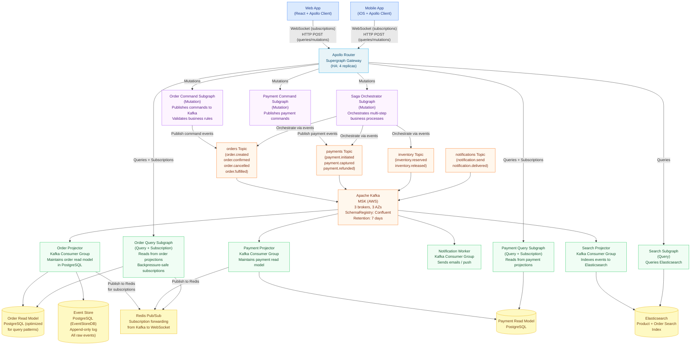
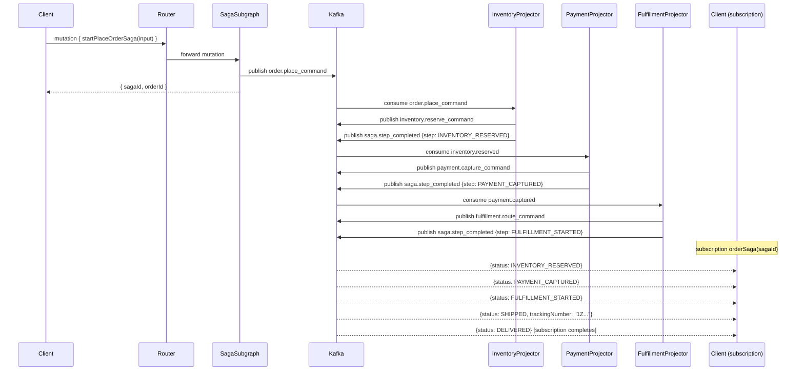

# Reference Architecture 05: Event-Driven GraphQL

> **Purpose:** This architecture covers GraphQL deployed over an event-sourced backend using Apache Kafka. It implements the CQRS pattern with GraphQL: mutation subgraphs publish commands to Kafka topics; query subgraphs read from materialized read-model projections. GraphQL subscriptions are backed by Kafka consumer groups. Saga orchestration for multi-step business processes is handled by a dedicated command subgraph. This architecture is appropriate for systems where business events are the primary data model.

---

## When to Use This Architecture

Use this architecture when:

- Your domain model is naturally event-based (e-commerce order lifecycle, financial transactions, IoT telemetry)
- You need real-time GraphQL subscriptions backed by a reliable event stream (not in-memory pub/sub)
- You are implementing CQRS to separate read and write models
- You need event replay capability (audit log, rebuilding read models)
- You already operate Kafka or have a requirement for a message broker

Do **not** adopt this architecture if:
- Your team has no experience with event sourcing or Kafka
- Your domain model is CRUD-based with no natural event semantics
- You need strong consistency for all reads (event-sourced systems are eventually consistent by design)
- Your team size is fewer than 10 engineers (operational overhead is significant)

---

## Architecture Overview



---

## CQRS Pattern With GraphQL

### Command Side: Mutation Subgraphs Publish Events

Mutation subgraphs do not write to a database directly. They validate the command, then publish an event to Kafka. The command is committed when the event is durably written to Kafka.

```graphql
# order-command-subgraph schema
type Mutation {
  """
  Place a new order. Returns a saga ID that can be used to track
  the multi-step fulfillment process via the orderSaga subscription.
  The order will appear in queries once the OrderProjector has consumed
  the order.created event (typically < 100ms).
  """
  placeOrder(input: PlaceOrderInput!): PlaceOrderResult!

  """
  Cancel an order. Only valid for orders in PENDING_PAYMENT or CONFIRMED status.
  """
  cancelOrder(input: CancelOrderInput!): CancelOrderResult!
}

union PlaceOrderResult =
  | PlaceOrderAccepted
  | ValidationError
  | BusinessRuleViolation

type PlaceOrderAccepted {
  """
  The saga correlation ID. Use this with the orderSaga subscription
  to track the multi-step fulfillment process in real time.
  """
  sagaId: ID!
  """
  The optimistic order ID. The order will be queryable by this ID
  within 100ms of this response (after the projector processes the event).
  """
  orderId: ID!
}
```

```typescript
// order-command-subgraph/src/resolvers/mutation.ts
const resolvers = {
  Mutation: {
    placeOrder: async (_parent, { input }, context): Promise<PlaceOrderResult> => {
      // Validate command (business rules, not event schema)
      const validation = await context.orderCommandService.validate(input);
      if (!validation.valid) {
        return { __typename: 'ValidationError', ...validation };
      }

      // Generate correlation IDs
      const orderId = generateUUID();
      const sagaId = generateUUID();
      const commandId = generateUUID();

      // Publish event to Kafka (the only side effect)
      await context.kafka.producer.send({
        topic: 'orders',
        messages: [{
          key: orderId,  // Partition key: all events for an order go to the same partition
          value: JSON.stringify({
            type: 'order.place_command',
            id: commandId,
            aggregateId: orderId,
            sagaId,
            payload: input,
            metadata: {
              userId: context.user.id,
              clientId: context.clientId,
              timestamp: new Date().toISOString(),
            },
          }),
          headers: {
            'x-correlation-id': sagaId,
            'x-user-id': context.user.id,
          },
        }],
      });

      // Return optimistically — the event is durable; projection will follow
      return {
        __typename: 'PlaceOrderAccepted',
        orderId,
        sagaId,
      };
    },
  },
};
```

### Query Side: Read Subgraphs Query Projections

Query subgraphs read from materialized projections — PostgreSQL tables optimized for the exact query patterns the GraphQL API needs.

```graphql
# order-query-subgraph schema
type Query {
  order(id: ID!): Order
  orders(first: Int, after: String, status: OrderStatus): OrderConnection!
  myOrders(first: Int, after: String): OrderConnection!
}

type Subscription {
  """
  Track the multi-step fulfillment saga in real time.
  Emits an event for each saga step: inventory_reserved, payment_captured,
  fulfillment_started, shipped, delivered.
  Completes when the saga reaches a terminal state.
  """
  orderSaga(sagaId: ID!): OrderSagaEvent!
}
```

```typescript
// order-query-subgraph/src/resolvers/subscription.ts
import { createClient } from 'redis';

const redis = createClient({ url: process.env.REDIS_URL });

const resolvers = {
  Subscription: {
    orderSaga: {
      subscribe: async function* (_parent, { sagaId }, context) {
        if (!context.user) throw new AuthenticationError('Authentication required');

        // Verify the user owns this saga
        const saga = await context.sagaRepo.findBySagaId(sagaId);
        if (saga.userId !== context.user.id) throw new ForbiddenError('Access denied');

        // Subscribe to Redis channel for this saga
        const subscriber = redis.duplicate();
        await subscriber.connect();

        const channel = `saga:${sagaId}`;
        const eventQueue: OrderSagaEvent[] = [];
        let resolve: (() => void) | null = null;

        await subscriber.subscribe(channel, (message) => {
          const event = JSON.parse(message) as OrderSagaEvent;
          eventQueue.push(event);
          resolve?.();
          resolve = null;
        });

        try {
          while (true) {
            if (eventQueue.length === 0) {
              // Wait for next event
              await new Promise<void>((r) => { resolve = r; });
            }
            const event = eventQueue.shift()!;
            yield event;

            // Saga complete on terminal state
            if (['FULFILLED', 'CANCELLED', 'FAILED'].includes(event.status)) {
              return;
            }
          }
        } finally {
          await subscriber.unsubscribe(channel);
          await subscriber.disconnect();
        }
      },
    },
  },
};
```

---

## Kafka Consumer Groups: Projectors

Projectors are independent Kafka consumer groups. Each projector consumes events from one or more topics and maintains a materialized view in a read store.

```typescript
// order-projector/src/projector.ts
import { Kafka, EachMessagePayload } from 'kafkajs';

const kafka = new Kafka({
  clientId: 'order-projector',
  brokers: process.env.KAFKA_BROKERS!.split(','),
  ssl: true,
  sasl: {
    mechanism: 'aws',
    authorizationIdentity: process.env.AWS_ROLE_ARN!,
  },
});

const consumer = kafka.consumer({
  groupId: 'order-projector-v1',
  sessionTimeout: 30000,
  heartbeatInterval: 3000,
});

await consumer.connect();
await consumer.subscribe({ topics: ['orders', 'payments', 'inventory'], fromBeginning: false });

await consumer.run({
  eachMessage: async ({ topic, partition, message }: EachMessagePayload) => {
    const event = JSON.parse(message.value!.toString());
    const orderId = message.key!.toString();

    await db.transaction(async (trx) => {
      switch (event.type) {
        case 'order.place_command':
          await trx.query(`
            INSERT INTO orders_read_model (id, saga_id, status, customer_id, created_at, raw_event_id)
            VALUES ($1, $2, 'PENDING_PAYMENT', $3, $4, $5)
            ON CONFLICT (id) DO NOTHING
          `, [orderId, event.sagaId, event.payload.customerId, event.metadata.timestamp, event.id]);
          break;

        case 'payment.captured':
          await trx.query(`
            UPDATE orders_read_model
            SET status = 'PAYMENT_CAPTURED', payment_captured_at = $2
            WHERE id = $1
          `, [event.aggregateId, event.metadata.timestamp]);
          break;

        case 'fulfillment.shipped':
          await trx.query(`
            UPDATE orders_read_model
            SET status = 'SHIPPED', tracking_number = $2, shipped_at = $3
            WHERE id = $1
          `, [event.aggregateId, event.payload.trackingNumber, event.metadata.timestamp]);
          break;
      }

      // Record in event store (append-only)
      await trx.query(`
        INSERT INTO event_store (id, type, aggregate_id, saga_id, payload, metadata, topic, partition, offset)
        VALUES ($1, $2, $3, $4, $5, $6, $7, $8, $9)
      `, [event.id, event.type, event.aggregateId, event.sagaId,
          JSON.stringify(event.payload), JSON.stringify(event.metadata),
          topic, partition, message.offset]);

      // Publish to Redis for real-time subscriptions
      await redis.publish(`saga:${event.sagaId}`, JSON.stringify({
        eventType: event.type,
        orderId: event.aggregateId,
        sagaId: event.sagaId,
        status: deriveOrderStatus(event.type),
        timestamp: event.metadata.timestamp,
      }));
    });
  },
});
```

---

## Saga Orchestration

Multi-step business processes (place order → reserve inventory → capture payment → fulfill) are orchestrated by a dedicated saga subgraph. The saga tracks state and publishes commands to each step.

```graphql
# saga-subgraph schema
type Mutation {
  """
  Start a saga for placing an order. The saga coordinates:
  1. Inventory reservation
  2. Payment capture
  3. Fulfillment routing
  Returns a sagaId for tracking via the orderSaga subscription.
  """
  startPlaceOrderSaga(input: PlaceOrderInput!): StartSagaResult!
}

type Query {
  """Current state of a saga. Use this for non-real-time status checks."""
  saga(id: ID!): Saga
}
```



---

## Event Schema Evolution With GraphQL Schema Evolution

Kafka events (Avro or JSON Schema via Confluent Schema Registry) and GraphQL schemas evolve in parallel. Compatibility rules must be maintained for both.

**Event schema evolution rules (Avro backward compatibility):**

```json
// orders topic — Avro schema v1
{
  "type": "record",
  "name": "OrderPlaceCommand",
  "namespace": "com.company.orders",
  "fields": [
    {"name": "id", "type": "string"},
    {"name": "customerId", "type": "string"},
    {"name": "lineItems", "type": {"type": "array", "items": "LineItem"}}
  ]
}

// orders topic — Avro schema v2 (backward compatible: adds optional field)
{
  "type": "record",
  "name": "OrderPlaceCommand",
  "namespace": "com.company.orders",
  "fields": [
    {"name": "id", "type": "string"},
    {"name": "customerId", "type": "string"},
    {"name": "lineItems", "type": {"type": "array", "items": "LineItem"}},
    {"name": "promoCode", "type": ["null", "string"], "default": null}  // Optional, backward compatible
  ]
}
```

**GraphQL + Kafka schema evolution coordination:**

| Change Type | Kafka Schema Action | GraphQL Schema Action |
|---|---|---|
| Add new event field | Add with null default (backward compatible) | Add nullable field to corresponding type |
| Remove event field | Mark deprecated (forward compatible) | Mark field `@deprecated` |
| Rename event field | Add new field + keep old (compatibility) | Deprecate old field, add new field |
| Change event field type | New topic version + consumer migration | Breaking change — deprecate + new field |
| Add new event type | Add new Avro schema to registry | Add new union member to result type |

---

## Kafka Infrastructure (Amazon MSK)

Amazon Managed Streaming for Apache Kafka (MSK) provides a production-grade Kafka cluster without operational overhead.

```terraform
# MSK cluster configuration (Terraform)
resource "aws_msk_cluster" "graphql_events" {
  cluster_name           = "graphql-event-bus"
  kafka_version          = "3.6.0"
  number_of_broker_nodes = 3

  broker_node_group_info {
    instance_type   = "kafka.m5.xlarge"  # 4 vCPU, 16GB RAM per broker
    storage_info {
      ebs_storage_info {
        volume_size = 1000  # 1TB per broker
      }
    }
    client_subnets  = var.private_subnet_ids
    security_groups = [aws_security_group.msk.id]
  }

  encryption_info {
    encryption_in_transit {
      client_broker = "TLS"
      in_cluster    = true
    }
    encryption_at_rest {
      data_volume_kms_key_id = aws_kms_key.msk.arn
    }
  }

  configuration_info {
    arn      = aws_msk_configuration.graphql.arn
    revision = aws_msk_configuration.graphql.latest_revision
  }

  # Enable MSK Connect for Kafka Connect (sink to Elasticsearch, S3)
  open_monitoring {
    prometheus {
      jmx_exporter  { enabled_in_broker = true }
      node_exporter { enabled_in_broker = true }
    }
  }
}

resource "aws_msk_configuration" "graphql" {
  kafka_versions = ["3.6.0"]
  name           = "graphql-events-config"

  server_properties = <<PROPERTIES
auto.create.topics.enable=false
default.replication.factor=3
min.insync.replicas=2
num.partitions=12
retention.ms=604800000  # 7 days
log.retention.bytes=107374182400  # 100GB per partition max
compression.type=lz4
PROPERTIES
}
```

**Topic configuration:**

```bash
# Create topics with explicit partition counts
# Partition count determines maximum consumer parallelism
kafka-topics.sh --create \
  --bootstrap-server $MSK_BROKERS \
  --topic orders \
  --partitions 24 \    # 24 partitions → 24 parallel consumer threads max
  --replication-factor 3 \
  --config min.insync.replicas=2 \
  --config retention.ms=604800000
```

---

## Replaying Events to Rebuild Read Models

A core advantage of event sourcing: read models can be rebuilt from scratch by replaying the event log. This is used when:
- A bug in the projector corrupted the read model
- A new query pattern requires a different read model structure
- A new subgraph needs to consume historical events

```bash
# Reset consumer group offset to the beginning of the topic
kafka-consumer-groups.sh \
  --bootstrap-server $MSK_BROKERS \
  --group order-projector-v2 \
  --topic orders \
  --reset-offsets \
  --to-earliest \
  --execute

# Deploy the new projector version (v2) — it will consume all events from the beginning
kubectl set image deployment/order-projector order-projector=registry/order-projector:v2

# Monitor lag to completion
kafka-consumer-groups.sh \
  --bootstrap-server $MSK_BROKERS \
  --group order-projector-v2 \
  --describe
```

---

## Observability for Event-Driven GraphQL

Tracing spans must cross Kafka topic boundaries. The OTel Kafka instrumentation propagates trace context in Kafka message headers.

```typescript
// Trace context propagation in Kafka messages
import { context, propagation } from '@opentelemetry/api';
import { KafkaPropagator } from '@opentelemetry/propagator-kafka';

// Producer: inject trace context into message headers
const headers: Record<string, string> = {};
propagation.inject(context.active(), headers);

await producer.send({
  topic: 'orders',
  messages: [{
    key: orderId,
    value: JSON.stringify(event),
    headers,  // Trace context propagated to consumers
  }],
});

// Consumer (projector): extract trace context from headers
const parentContext = propagation.extract(context.active(), message.headers);
const span = tracer.startSpan('process-order-event', {}, parentContext);
```

**Key metrics to monitor:**

```promql
# Consumer group lag (backlog of unprocessed events)
kafka_consumergroup_lag{group="order-projector-v1",topic="orders"}

# Alert: lag exceeding 10,000 events (projector falling behind)
kafka_consumergroup_lag > 10000

# Projection latency (time from event publish to read model update)
histogram_quantile(0.99, rate(projector_event_processing_duration_seconds_bucket[5m]))

# Dead letter queue depth (failed events requiring manual intervention)
kafka_topic_partition_current_offset{topic="orders-dlq"} - kafka_topic_partition_oldest_offset{topic="orders-dlq"}
```

---

## Dead Letter Queue Handling

Events that fail processing after 3 retries are routed to a dead letter topic for manual investigation and replay.

```typescript
// Projector error handling with DLQ
await consumer.run({
  eachMessage: async ({ topic, message }) => {
    let attempts = 0;
    const maxAttempts = 3;

    while (attempts < maxAttempts) {
      try {
        await processEvent(message);
        return; // Success
      } catch (error) {
        attempts++;
        if (attempts === maxAttempts) {
          // Route to DLQ after max retries
          await producer.send({
            topic: `${topic}-dlq`,
            messages: [{
              key: message.key,
              value: message.value,
              headers: {
                ...message.headers,
                'x-original-topic': topic,
                'x-failure-reason': error.message,
                'x-failure-timestamp': new Date().toISOString(),
                'x-retry-count': String(attempts),
              },
            }],
          });
          context.metrics.increment('projector.dlq.published', { topic });
          return; // Don't retry from DLQ — requires manual intervention
        }
        await sleep(Math.pow(2, attempts) * 1000); // Exponential backoff
      }
    }
  },
});
```

---

## Cost Breakdown

| Component | Configuration | Monthly Cost |
|---|---|---|
| Amazon MSK | 3× kafka.m5.xlarge, 1TB storage/broker | $1,890 |
| Confluent Schema Registry | Confluent Cloud Basic | $50 |
| EKS + Nodes (Router, 4 replicas) | m5.large × 4 | $280 |
| EKS + Nodes (Command Subgraphs, 3) | t3.large × 4 | $220 |
| EKS + Nodes (Query Subgraphs, 3) | t3.large × 4 | $220 |
| EKS + Nodes (Projectors, 4) | t3.medium × 6 | $165 |
| PostgreSQL (Read Models) | 2× RDS db.t3.large Multi-AZ | $300 |
| Elasticsearch (Search Index) | 3-node m6g.large.search | $440 |
| ElastiCache Redis | cache.t3.medium, 2 nodes | $100 |
| S3 (Event archive after 7 days) | ~1TB/month | $23 |
| MSK Connect (S3 sink) | Connector units | $50 |
| Observability | OTel + Grafana self-hosted | $200 |
| Apollo GraphOS | Serverless plan | $49 |
| **Total** | | **$3,987–$4,500/month** |

---

## References and Related Topics

- [Apache Kafka Documentation](https://kafka.apache.org/documentation/) — Kafka concepts and configuration
- [Amazon MSK Developer Guide](https://docs.aws.amazon.com/msk/latest/developerguide/) — MSK configuration
- [Confluent Schema Registry](https://docs.confluent.io/platform/current/schema-registry/) — Avro schema management
- [KafkaJS](https://kafka.js.org/) — Node.js Kafka client
- [OpenTelemetry Kafka Propagator](https://www.npmjs.com/package/@opentelemetry/propagator-kafka) — trace context across Kafka
- [Chapter 07: Federation](../07-federation/README.md) — federation patterns applied in command/query subgraphs
- [Chapter 14: Observability](../14-observability/README.md) — distributed tracing across event-driven systems
- [Chapter 17: Caching Strategies](../17-caching-strategies/README.md) — caching for eventually consistent read models
- [Anti-Patterns](../29-anti-patterns/README.md) — event-driven anti-patterns (event sourcing without CQRS, unbounded subscriptions)
- [03-enterprise-architecture.md](./03-enterprise-architecture.md) — this architecture scales into the enterprise tier
- [04-multi-region-architecture.md](./04-multi-region-architecture.md) — Kafka MirrorMaker for multi-region event replication
