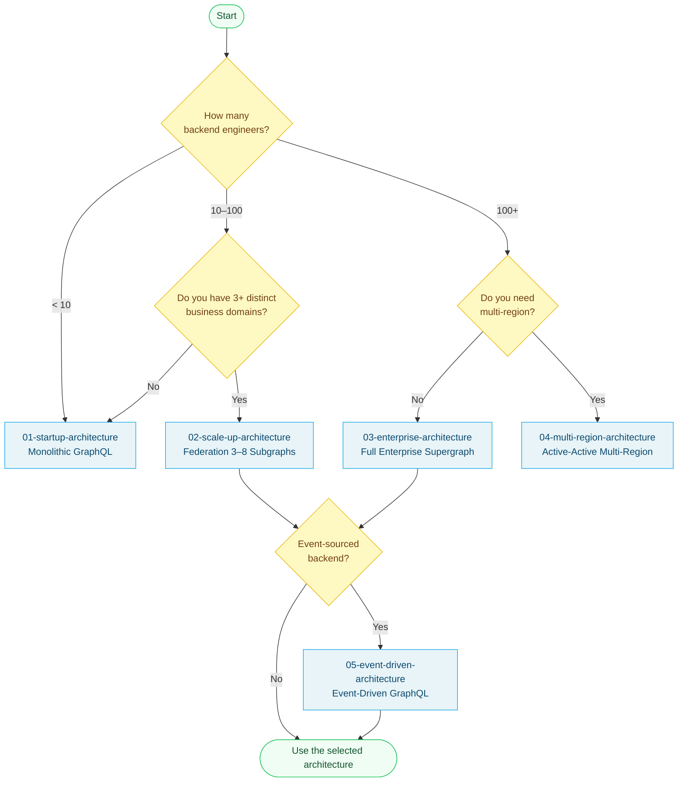

# Chapter 30: Reference Architectures

> **Purpose:** This chapter provides canonical, production-validated reference architectures for GraphQL deployments at different scales and complexity levels. Each architecture is opinionated: it names specific products, provides real cost estimates, defines team models, and includes a Mermaid topology diagram. These are starting points for your own architecture decisions, not abstract templates.

---

## How to Use This Chapter

Each reference architecture documents:

- **When to use** — the signals that indicate this architecture is appropriate
- **Components** — every named technology in the stack, with the version or tier assumed
- **Deployment topology** — Mermaid diagram showing components and data flows
- **Team model** — minimum staffing to operate the architecture reliably
- **Cost estimate** — realistic monthly infrastructure costs
- **Scaling characteristics** — where the architecture breaks down and the trigger to graduate to the next tier
- **References and Related Topics** — links to deeper implementation guidance

---

## Architecture Tiers

| File | Architecture | Scale | Monthly Cost | Team |
|---|---|---|---|---|
| [01-startup-architecture.md](./01-startup-architecture.md) | Monolithic GraphQL Server | 0–50 engineers | < $200 | 1 backend engineer |
| [02-scale-up-architecture.md](./02-scale-up-architecture.md) | Apollo Federation v2, 3–8 Subgraphs | 50–200 engineers | $500–$2,000 | 1 platform-adjacent engineer |
| [03-enterprise-architecture.md](./03-enterprise-architecture.md) | Full Enterprise Supergraph, 50 Subgraphs | 200+ engineers | $15k–$50k | 5-person platform team |
| [04-multi-region-architecture.md](./04-multi-region-architecture.md) | Multi-Region Active-Active | Global, 200+ engineers | $50k–$150k | 5+ platform + SRE |
| [05-event-driven-architecture.md](./05-event-driven-architecture.md) | Event-Driven GraphQL over Kafka | Event-sourced systems | Varies | 3+ engineers |

---

## Choosing the Right Architecture

---

## Common Architectural Principles

These principles apply across all tiers:

**1. The schema is the API contract.** The GraphQL schema, not the implementation, is what clients depend on. Schema stability is more important than implementation stability. Design schemas for longevity.

**2. DataLoader is not optional.** Every architecture in this chapter depends on DataLoader for N+1 prevention. This is not a performance optimization — it is a correctness requirement for production lists.

**3. Observability before features.** Every architecture includes logging, tracing, and metrics from day one. Adding observability after an incident is too late.

**4. Security is layered.** Transport (TLS), authentication (JWT), authorization (field-level), and query constraints (complexity, depth) form independent layers. Removing any layer creates a gap.

**5. Graduate deliberately.** Each architecture has defined graduation signals. Move to the next tier when you hit those signals — not earlier. Premature federation creates operational complexity without the scale benefits that justify it.

---

## Cost Model Assumptions

All cost estimates assume:
- AWS us-east-1 pricing (other regions approximately ±20%)
- Production-grade availability (multi-AZ, no single points of failure)
- On-demand pricing (Reserved Instances reduce costs by 30–40%)
- Excludes developer tooling licenses unless specifically noted
- Excludes egress costs (typically 5–15% of compute costs)

---

## Prerequisites

- [Chapter 07: Federation](../07-federation/README.md) — required before evaluating federated architectures
- [Chapter 15: Kubernetes Deployment](../15-kubernetes-deployment/README.md) — Kubernetes deployment patterns used in tiers 2–5
- [Chapter 14: Observability](../14-observability/README.md) — observability stack referenced throughout
- [Chapter 05: Security](../05-security/README.md) — security patterns applied in all architectures

## Related Topics

- [Best Practices](../28-best-practices/README.md) — the practices that all these architectures implement
- [Anti-Patterns](../29-anti-patterns/README.md) — failure patterns to avoid at each tier
- [Production Runbooks](../32-production-runbooks/README.md) — operational procedures for running these architectures
- [Real-World Enterprise Designs](../31-real-world-enterprise-designs/README.md) — case studies based on these architectures
