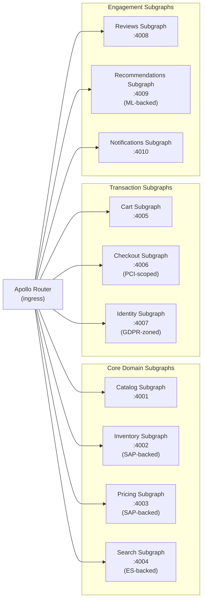
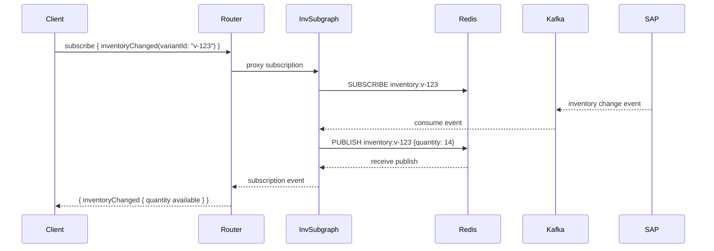

# 01 — Global Retail Supergraph

> **Purpose:** Architecture design document for a federated GraphQL supergraph serving a
> global retailer with 500 million SKUs, 50 million daily active users across 12 international
> markets, real-time inventory visibility, personalization, and a 100ms end-to-end SLO.
> This document covers requirements, constraints, bounded contexts, entity ownership, federation
> topology, and three key ADRs.

---

## 1. System Overview

### Business Context

A global retailer operates e-commerce storefronts in 12 markets across North America, Europe,
and Asia-Pacific. The existing system is a patchwork of market-specific monoliths, regional
REST APIs, and a central SAP ERP instance that is the authoritative source of truth for
inventory and pricing. Product discovery is handled by Elasticsearch. Personalization is
a separate ML platform. Checkout processes through a PCI-scoped payment processor.

The business has hit the wall of this architecture. A product manager in Germany cannot see
inventory levels from the US warehouse without filing a cross-team request. Mobile apps in
Asia make 17 REST API calls to render a product detail page. A promotion in France cannot
be coordinated with real-time inventory updates because the two systems have no shared contract.

The mandate: a unified GraphQL API layer that provides consistent, composable access to all
data domains while keeping the underlying systems in place.

### Stakeholders

| Role | Concern |
|---|---|
| VP Engineering | 100ms SLO at the router, global availability |
| Legal / Compliance | GDPR for EU markets, PCI DSS for payments |
| SAP Team | No replacement of SAP; must integrate, not migrate |
| Platform Team | Schema ownership, subgraph lifecycle, schema contracts |
| Mobile Engineering | Single endpoint, typed responses, reduced round trips |
| ML Platform Team | Recommendations and personalization data ownership |

---

## 2. Requirements

### Functional Requirements

- Unified product catalog API: search, browse, product detail, variants, images, attributes
- Real-time inventory levels per SKU per warehouse location, updated within 5 seconds of change
- Market-specific pricing: base price, promotional price, tax-included display price by locale
- Personalized product recommendations based on user behavior and session context
- Shopping cart: add, update, remove, apply coupon, view with computed totals
- Checkout: address validation, payment tokenization, order placement, order confirmation
- User identity: authentication, profile, address book, saved payment methods, order history
- Product reviews and ratings: read, submit, moderation flag
- Global search: full-text with facets, autocomplete, typo tolerance, market-scoped
- Push notifications: order status updates, back-in-stock alerts, promotional campaigns

### Non-Functional Requirements

| Requirement | Target | Measurement Point |
|---|---|---|
| End-to-end latency (p99) | < 100ms | Apollo Router ingress |
| End-to-end latency (p50) | < 30ms | Apollo Router ingress |
| Availability | 99.95% monthly | Per-market measurement |
| SAP read latency (p99) | < 150ms | Router-to-subgraph-to-SAP |
| Real-time inventory freshness | < 5 seconds lag | Warehouse event to API response |
| Concurrent users (peak) | 5M simultaneous | Black Friday peak estimate |
| Daily active users | 50M | Rolling 24-hour average |
| SKU catalog size | 500M active SKUs | Elasticsearch-backed |
| Markets served | 12 | Localized pricing and tax |

---

## 3. Constraints

### Hard Constraints (Cannot Be Changed)

**C-1: SAP ERP cannot be replaced or significantly modified.**
SAP S/4HANA is the system of record for inventory, warehouse locations, and base pricing.
It is under a support contract that prohibits custom schema modifications. The integration
must treat SAP as an opaque backend accessible via its published REST and BAPI APIs.

**C-2: PCI DSS compliance for the checkout and payments domain.**
The payment subgraph and any operation that touches card data, CVV, or full PAN must operate
within a PCI-scoped network segment. No raw card data may transit the router. Payment tokens
(Stripe tokens, Adyen PSP references) are in scope for transport but not for storage at the
GraphQL layer.

**C-3: GDPR for EU market users.**
Personal data for EU users — name, email, address, behavioral profile — may not be stored
outside EU data centers. The Identity subgraph must have EU-resident instances that serve
EU traffic. Recommendation data for EU users must be generated and stored in EU.

**C-4: Elasticsearch cluster ownership belongs to the Search platform team.**
The Search subgraph may call Elasticsearch but cannot modify index mappings or cluster
configuration. Schema design must work within the existing Elasticsearch document structure.

### Soft Constraints (Preferably Unchanged)

**C-5: SAP API rate limits.**
SAP's REST gateway enforces 1,000 requests/second globally. The Inventory subgraph must
implement aggressive caching and request coalescing to stay within this envelope.

**C-6: No cross-subgraph synchronous writes.**
Mutations that need to coordinate across domains (e.g., order placement: reserve inventory,
charge payment, create order record) must use an event-driven saga pattern. No mutation
may make a synchronous write call to more than one subgraph.

---

## 4. Bounded Contexts and Entity Ownership

```
┌─────────────────────────────────────────────────────────────────────────┐
│                         Bounded Context Map                              │
│                                                                          │
│  ┌──────────────┐  ┌──────────────┐  ┌──────────────┐  ┌─────────────┐ │
│  │   CATALOG    │  │  INVENTORY   │  │   PRICING    │  │   SEARCH    │ │
│  │              │  │              │  │              │  │             │ │
│  │ Product      │  │ StockLevel   │  │ Price        │  │ SearchResult│ │
│  │ Variant      │  │ Warehouse    │  │ Promotion    │  │ Facet       │ │
│  │ Category     │  │ Availability │  │ TaxRate      │  │ Suggestion  │ │
│  │ Brand        │  │              │  │ MarketPrice  │  │             │ │
│  └──────┬───────┘  └──────┬───────┘  └──────┬───────┘  └─────┬───────┘ │
│         │                 │                 │                │         │
│  ┌──────┴───────┐  ┌──────┴───────┐  ┌──────┴───────┐  ┌────┴────────┐ │
│  │    CART      │  │   CHECKOUT   │  │   IDENTITY   │  │  REVIEWS    │ │
│  │              │  │              │  │              │  │             │ │
│  │ Cart         │  │ Order        │  │ User         │  │ Review      │ │
│  │ CartItem     │  │ OrderLine    │  │ Address      │  │ Rating      │ │
│  │ Coupon       │  │ Shipment     │  │ Session      │  │             │ │
│  │              │  │ Payment      │  │              │  │             │ │
│  └──────────────┘  └──────────────┘  └──────────────┘  └─────────────┘ │
│                                                                          │
│  ┌──────────────────────────┐  ┌────────────────────────────────────┐   │
│  │     RECOMMENDATIONS      │  │           NOTIFICATIONS            │   │
│  │                          │  │                                    │   │
│  │ RecommendationSet        │  │ Notification                       │   │
│  │ PersonalizationContext   │  │ NotificationPreference             │   │
│  └──────────────────────────┘  └────────────────────────────────────┘   │
└─────────────────────────────────────────────────────────────────────────┘
```

### Entity Ownership Table

| Entity | Owning Subgraph | Key Fields | References |
|---|---|---|---|
| `Product` | Catalog | `id`, `sku`, `title`, `categoryId`, `brandId` | `Inventory`, `Pricing`, `Reviews` extend |
| `Variant` | Catalog | `id`, `productId`, `sku`, `attributes` | `Inventory`, `Pricing` extend |
| `StockLevel` | Inventory | `variantId`, `warehouseId`, `quantity` | extends `Variant` |
| `Price` | Pricing | `variantId`, `marketCode`, `amount`, `currency` | extends `Variant` |
| `Cart` | Cart | `id`, `userId`, `items[]` | references `Variant`, `Price` |
| `Order` | Checkout | `id`, `userId`, `status`, `lines[]` | references `Variant`, `StockLevel` |
| `User` | Identity | `id`, `email`, `region` | extended by `Cart`, `Order` |
| `Review` | Reviews | `id`, `productId`, `userId`, `rating` | extends `Product`, `User` |
| `SearchResult` | Search | `productId`, `score`, `highlights` | references `Product` |
| `RecommendationSet` | Recommendations | `userId`, `context`, `items[]` | references `Product` |
| `Notification` | Notifications | `id`, `userId`, `type`, `payload` | references `User` |

---

## 5. Federation Topology

### Subgraph Inventory



### Key Entity Reference Chains

**Product Detail Page query plan (simplified):**

```
query ProductDetail($variantId: ID!, $market: MarketCode!) {
  variant(id: $variantId) {               # Catalog
    id sku title images
    product { title category brand }      # Catalog
    stockLevel(warehouseIds: $nearbyWhs) { # Inventory (SAP)
      quantity available estimatedRestock
    }
    price(market: $market) {              # Pricing (SAP)
      display sale originalAmount currency
    }
    reviews(first: 5) {                   # Reviews
      edges { node { rating body author } }
    }
  }
  recommendations(variantId: $variantId, context: PRODUCT_DETAIL) { # Recs
    items { product { id title thumbnail } price(market: $market) { display } }
  }
}
```

This single query fans out to Catalog, Inventory, Pricing, Reviews, and Recommendations.
Without federation, this would be five separate REST calls from the client. The router
executes the Catalog fetch first (it owns `Variant`), then fans out Inventory, Pricing,
Reviews, and Recommendations in parallel using the resolved `variantId` as the entity key.

### Subscription Topology

Real-time inventory uses GraphQL subscriptions backed by a Redis Pub/Sub channel. The
Inventory subgraph publishes to Redis on every SAP inventory event (via a Kafka consumer
that tails SAP's change data feed). The router proxies subscription connections to the
Inventory subgraph over HTTP multipart (Apollo Router subscription protocol).



---

## 6. Architecture Decision Records

### ADR-001: SAP as a Subgraph via REST Wrapper

**Date:** 2024-Q1
**Status:** Accepted

**Context:**
SAP S/4HANA is the authoritative source of record for inventory quantities, warehouse
locations, and base pricing. SAP cannot be replaced (Constraint C-1). SAP exposes an OData
v4 REST API and BAPI interfaces. The team considered three integration patterns:

**Options Considered:**

| Option | Description | Risk |
|---|---|---|
| A | Direct SAP calls from Catalog subgraph | SAP becomes a dependency of an unrelated domain |
| B | Separate Inventory and Pricing subgraphs wrapping SAP REST | Clean domain separation; SAP ownership isolated |
| C | Single SAP subgraph exposing all SAP entities | Single point of failure; mixes domain ownership |

**Decision:** Option B — two separate subgraphs (Inventory, Pricing) each wrapping SAP
REST via a thin adapter layer.

**Rationale:**
- Inventory and Pricing have different update frequencies, cache TTLs, and ownership teams
- Separating them allows independent caching strategies (inventory: 5s TTL; pricing: 60s TTL)
- Each subgraph team is accountable for exactly one SAP API surface
- SAP API rate limit (1,000 req/s) is managed independently per domain

**Implementation Details:**
- Each subgraph maintains an in-process LRU cache with TTL
- DataLoader batches entity resolution calls (`_entities` queries) into single SAP batch requests
- SAP API errors surface as GraphQL errors with `extensions.code: "SAP_UNAVAILABLE"` to allow
  partial responses when SAP is degraded
- Circuit breaker (Resilience4j) wraps each SAP API client; open circuit returns last-cached value

**Trade-offs Accepted:**
- Two subgraphs to maintain instead of one
- Cache invalidation complexity: SAP change events must be propagated to both subgraph caches
- SAP OData API responses must be mapped to GraphQL types; this mapping layer requires maintenance

---

### ADR-002: Pricing Subgraph with Market-Specific Logic via @tag Contracts

**Date:** 2024-Q1
**Status:** Accepted

**Context:**
The retailer operates in 12 markets with different tax regimes, promotional rules, and
currency display requirements. Some markets require tax-inclusive pricing (VAT countries).
Some markets have market-specific promotional fields that are not relevant to other markets.
The mobile team needs a clean API that does not expose 12-market complexity. EU partners need
a separate API surface that excludes non-EU pricing fields.

**Options Considered:**

| Option | Description | Risk |
|---|---|---|
| A | Single Price type with all fields; clients ignore irrelevant fields | Schema pollution; no enforcement |
| B | Market-specific Price types (PriceEU, PriceUS, etc.) | Schema explosion; federation composition complexity |
| C | Single Price type with `@tag` annotations; schema contracts per consumer group | Clean separation; requires consumer groups to be defined |

**Decision:** Option C — `@tag`-annotated Price type with schema contracts for mobile,
partner API, and internal use cases.

**Rationale:**
- Clients operate on a contract that contains exactly the fields they need
- Sensitive internal pricing fields (cost basis, margin percentage) never appear in external contracts
- Market-specific fields are tagged `@tag(name: "eu-markets")` and excluded from non-EU contracts
- Schema contract enforcement is declarative and auditable

**Schema Design:**

```graphql
type Price @key(fields: "variantId marketCode") {
  variantId: ID!
  marketCode: MarketCode!

  # All consumers
  displayAmount: Money!
  currency: CurrencyCode!

  # @tag(name: "promotional") — mobile and internal only
  saleAmount: Money @tag(name: "promotional")
  promotionId: ID @tag(name: "promotional")
  promotionExpiry: DateTime @tag(name: "promotional")

  # @tag(name: "eu-markets") — EU partner API only
  vatIncludedAmount: Money @tag(name: "eu-markets")
  vatRate: Float @tag(name: "eu-markets")
  vatCountryCode: String @tag(name: "eu-markets")

  # @tag(name: "internal") — internal tooling only
  costBasis: Money @tag(name: "internal")
  marginPercent: Float @tag(name: "internal")
}
```

**Trade-offs Accepted:**
- Schema contract creation requires coordination between Pricing team and consumer teams
- New markets require adding new tags and potentially new contracts
- `@tag` annotations make the schema SDL harder to read for engineers unfamiliar with the pattern

---

### ADR-003: Real-Time Inventory via Subscriptions with 5-Second TTL Fallback

**Date:** 2024-Q1
**Status:** Accepted

**Context:**
Real-time inventory visibility is a core business requirement. The business cannot tolerate
showing "In Stock" when an item is out of stock — this creates cancelled orders and poor
customer experience. SAP fires inventory change events within 2 seconds of a warehouse
transaction. The system must propagate those changes to browser clients within 5 seconds.

However, WebSocket connections at 50M DAU scale are expensive. Not every user browsing the
catalog needs a live inventory subscription. The product page specifically needs real-time
inventory for the "Add to Cart" button state.

**Options Considered:**

| Option | Description | Latency | Infrastructure Cost |
|---|---|---|---|
| A | Poll: client polls every 10 seconds | 0–10s lag | High (10x query volume) |
| B | Subscription: permanent WebSocket per active browser tab | < 2s lag | Very high (50M connections) |
| C | Hybrid: subscription on product page; 5s TTL cache for browse pages | < 5s on product page | Moderate |

**Decision:** Option C — subscriptions on product detail pages with a 5-second TTL cache
for catalog browse. The Add-to-Cart button uses a real-time subscription. Browse pages use
cached inventory status (In Stock / Low Stock / Out of Stock) with 5s TTL.

**Rationale:**
- Product detail pages are where inventory status affects the purchase decision
- Browse pages show inventory status as a secondary attribute; 5s lag is acceptable
- Limits WebSocket connection count to users actively on product detail pages (estimated 2-5%
  of DAU at any given time = 1-2.5M concurrent subscriptions, manageable)

**Infrastructure:**
- Redis Pub/Sub for subscription event fanout (clustered, 3 nodes per region)
- Inventory subgraph subscribes to Kafka topic `inventory.changes` from SAP adapter
- TTL cache: Redis with 5-second expiry per `(variantId, warehouseId)` key
- Circuit breaker: if Kafka is unavailable, serve cached value with `stale: true` flag in response

**Trade-offs Accepted:**
- Dual code paths (subscription path vs. cached query path) increase implementation complexity
- Cache invalidation on SAP change events requires a second consumer in the Inventory subgraph
- EU users' subscription events must transit EU-resident infrastructure (data residency requirement)

---

## 7. Implementation Phases

### Phase 1 — Foundation (Weeks 1–8)

**Deliverables:**
- Apollo Router deployed in staging with basic auth (JWT validation)
- Schema registry configured (Apollo GraphOS)
- Catalog subgraph: `Product`, `Variant`, `Category`, `Brand` with Elasticsearch backing
- Identity subgraph: `User`, `Session` with existing auth service backing
- CI pipeline: `rover subgraph check` on every PR; `rover subgraph publish` on merge to main

**Success Criteria:**
- Product detail page query returns in < 50ms p99 from staging
- Schema check CI step catches breaking changes in at least one test case
- First mobile client migrated to GraphQL endpoint for read-only catalog browse

**Risk:** SAP REST adapter implementation unknown; schedule buffer of 2 weeks in Phase 2

---

### Phase 2 — Inventory and Pricing Integration (Weeks 9–16)

**Deliverables:**
- Inventory subgraph: `StockLevel`, `Warehouse`, SAP REST wrapper, LRU cache, circuit breaker
- Pricing subgraph: `Price`, `Promotion`, market-specific logic, SAP OData client
- Real-time inventory subscription pipeline: Kafka consumer, Redis Pub/Sub, subgraph subscription resolver
- Schema contracts: `mobile-public` contract created; `eu-partner` contract created

**Success Criteria:**
- Inventory subgraph returns stock levels within 200ms p99 (including SAP call)
- Real-time inventory changes propagate to subscribed clients within 5 seconds
- `eu-partner` contract excludes cost basis and margin fields verified by automated schema test

---

### Phase 3 — Cart and Checkout (Weeks 17–24)

**Deliverables:**
- Cart subgraph: full CRUD, coupon application, computed totals
- Checkout subgraph: PCI-scoped deployment, address validation, payment token submission
- Order saga: Kafka-based saga coordinator for reserve-inventory + charge-payment + create-order
- Search subgraph: Elasticsearch-backed full-text search with facets and autocomplete

**Success Criteria:**
- End-to-end checkout flow completes under 3 seconds p99 (including payment processor call)
- Cart mutation operations are idempotent (duplicate requests do not create duplicate cart items)
- PCI network segmentation verified by security audit

---

### Phase 4 — Personalization and Engagement (Weeks 25–32)

**Deliverables:**
- Recommendations subgraph: ML platform integration, context-aware recommendation sets
- Reviews subgraph: read/write reviews, rating aggregates, moderation hooks
- Notifications subgraph: subscription-based notification delivery, preference management
- Full 12-market rollout: all market-specific pricing contracts deployed

**Success Criteria:**
- Recommendations appear on product detail page with < 20ms additional latency (parallel fetch)
- All 12 markets running on GraphQL endpoint
- Legacy REST endpoints deprecated and decommissioned on schedule

---

## References

- [ADR Format: Michael Nygard](https://cognitect.com/blog/2011/11/15/documenting-architecture-decisions)
- [Apollo Federation v2 Specification](https://www.apollographql.com/docs/federation/v2/)
- [SAP OData v4 Developer Guide](https://help.sap.com/docs/SAP_NETWEAVER_AS_ABAP_752/68bf513362174d54b58cddec28794093/8d1ec96a26c64e4f9db5a2e05bdebaec.html)
- [PCI DSS v4.0 Requirements](https://www.pcisecuritystandards.org/document_library/)
- [GDPR Article 44 — Transfers to Third Countries](https://gdpr-info.eu/art-44-gdpr/)
- Chapter 07 — Federation
- Chapter 08 — Supergraph Architecture
- Chapter 05 — Security
- Chapter 17 — Caching Strategies
