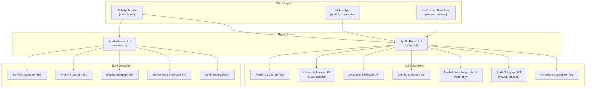
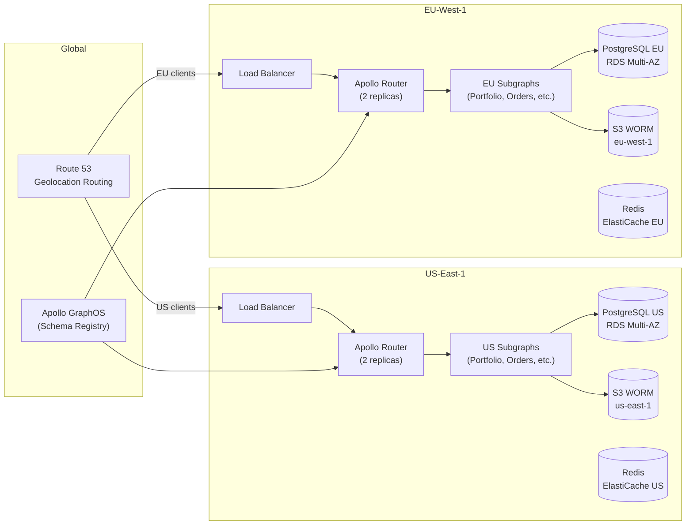

# 02 — Financial Platform Design

> **Purpose:** Architecture design document for a GraphQL API platform serving a financial
> services firm providing portfolio management, trade execution, and market data to 10,000
> professional users. Core challenges: SEC audit trail requirements, sub-100ms trade execution
> latency, and data residency enforcement across US and EU regulatory zones.

---

## 1. System Overview

### Business Context

A financial services firm provides a professional investment platform to institutional clients,
registered investment advisors (RIAs), and high-net-worth individuals. The platform includes
portfolio management, real-time market data display, trade order management, and compliance
reporting. The firm is registered with the SEC and subject to FINRA recordkeeping requirements.

The existing architecture is a set of REST APIs built over the past decade. No unified data
model exists. The portfolio API, market data API, and order management API were built by
different teams with different conventions. Client-side applications (desktop web, institutional
data feeds) spend engineering cycles reconciling inconsistent ID formats and data shapes across
APIs.

The business goal is a unified GraphQL API that allows application teams to compose portfolio,
market, and order data in a single query while preserving the compliance guarantees that the
regulatory environment requires.

### Stakeholders

| Role | Concern |
|---|---|
| CTO | Unified API, reduced integration complexity |
| Chief Compliance Officer | SEC audit trail, FINRA recordkeeping, data residency |
| Trading Desk | Sub-100ms trade execution latency; any API delay costs money |
| Portfolio Managers | Real-time portfolio views; multi-currency |
| Risk Management | Field-level access control; PII protection |
| EU Operations | GDPR, MiFID II data residency in EU |

---

## 2. Requirements

### Functional Requirements

- Portfolio management: view holdings, performance, cost basis, unrealized P&L by account
- Trade execution: submit market orders, limit orders, stop orders; receive execution confirmations
- Market data: real-time quotes, historical OHLCV, option chains, news feed
- Compliance reporting: position reports, transaction reports, audit log queries (authorized roles)
- Account management: accounts, authorized users, account settings, permission grants
- Alerts: price alerts, portfolio threshold alerts, news alerts

### Non-Functional Requirements

| Requirement | Target | Notes |
|---|---|---|
| Trade execution mutation latency (p99) | < 100ms | Router to OMS and back |
| Market data query latency (p50) | < 20ms | Cached; cache hit rate > 95% |
| Portfolio query latency (p99) | < 200ms | Multi-account aggregation |
| Availability | 99.99% during market hours (6am–8pm ET) | Degraded mode after hours |
| Audit log write latency | < 50ms | Every field access logged |
| Concurrent users (peak) | 5,000 | Simultaneous during market open |
| Data residency | US data stays in US-East; EU data stays in EU-West | MiFID II, GDPR |

---

## 3. Constraints

### Regulatory Constraints (Immutable)

**C-1: SEC Rule 17a-4 — Immutable audit records.**
Every access to client portfolio data and every trade mutation must produce an immutable
audit record containing: user identity, client account identifier, field(s) accessed, timestamp
(nanosecond precision), and a justification code (from a controlled vocabulary). Records must
be stored in WORM (Write Once Read Many) storage and retained for 7 years.

**C-2: MiFID II and GDPR data residency.**
EU client data — positions, transactions, personal information — must not be stored or
processed outside EU data centers. US client data must not be stored in EU data centers.
Cross-region data transfer for purposes of aggregation is prohibited.

**C-3: Trade execution is not GraphQL's fast path.**
The Order Management System (OMS) executes trades and must receive orders within the firm's
internal SLA. GraphQL mutations for trade submission must be routed to the OMS with < 100ms
total router-to-OMS-to-router latency. Any GraphQL framework overhead must be < 5ms.

### Technical Constraints

**C-4: Market data is read-only at the GraphQL layer.**
Market data originates from licensed data vendors (Bloomberg, Refinitiv). The GraphQL
Market Data subgraph is read-only. Mutations do not exist in the Market Data subgraph.

**C-5: PII field-level encryption.**
Fields classified as PII (name, address, tax ID, date of birth) must be encrypted at rest
using tenant-managed encryption keys. The GraphQL layer receives plaintext values only after
verifying the requesting user has the appropriate clearance; audit log records are written
before plaintext is returned.

---

## 4. Bounded Contexts and Entity Ownership

| Entity | Owning Subgraph | Key Fields | Access Control |
|---|---|---|---|
| `Portfolio` | Portfolio | `id`, `accountId`, `userId` | Account-scoped |
| `Holding` | Portfolio | `portfolioId`, `securityId`, `quantity`, `costBasis` | Account-scoped |
| `Account` | Accounts | `id`, `userId`, `type`, `status` | User-scoped + compliance |
| `User` | Identity | `id`, `email`, `region`, `roles` | Self + admin |
| `Order` | Orders | `id`, `accountId`, `securityId`, `type`, `status` | Account-scoped |
| `Execution` | Orders | `orderId`, `executedQty`, `executedPrice`, `executedAt` | Account-scoped |
| `Quote` | MarketData | `securityId`, `bid`, `ask`, `last`, `timestamp` | Role-scoped (market data entitlement) |
| `Security` | MarketData | `id`, `ticker`, `name`, `assetClass` | Public within authenticated session |
| `HistoricalPrice` | MarketData | `securityId`, `date`, `open`, `high`, `low`, `close` | Role-scoped |
| `AuditRecord` | Audit | `id`, `userId`, `operation`, `fields`, `timestamp` | Compliance officers only |
| `ComplianceReport` | Compliance | `id`, `accountId`, `type`, `period` | Compliance officers + account owner |

---

## 5. Federation Topology



### Data Residency Routing

The router determines the user's data residency region from the JWT claim `data_region`
(set at authentication time and immutable for the session). All subgraph calls for that
request are routed to the corresponding regional subgraph. Cross-region calls are blocked
at the router level via a Rhai script that rejects any plan containing a cross-region
subgraph call.

```yaml
# router.yaml — Rhai coprocessor for data residency enforcement
coprocessor:
  url: "http://residency-enforcer:8080/check"
  router:
    request:
      headers: true
      body: false
  subgraph:
    all:
      request:
        headers: true
```

---

## 6. Compliance Architecture

### Audit Log Subgraph

Every field access in a query against portfolio, account, or order data generates an audit
record. The router coprocessor intercepts every subgraph response, extracts the fields that
were returned (using the operation's field set from the query plan), and writes an audit
record to the immutable audit store before returning the response to the client.

**Audit record schema:**

```graphql
type AuditRecord {
  id: ID!
  requestId: ID!          # Correlates to the originating GraphQL request
  userId: ID!
  sessionId: ID!
  accountId: ID           # Null for non-account-scoped operations
  operationName: String!
  operationType: OperationType!  # QUERY, MUTATION, SUBSCRIPTION
  fieldsAccessed: [FieldAccess!]!
  justificationCode: JustificationCode!
  timestamp: DateTime!    # Nanosecond precision
  sourceIp: String!
  userAgent: String!
  dataRegion: DataRegion!
}

type FieldAccess {
  subgraph: String!
  typeName: String!
  fieldName: String!
  entityId: String        # The primary key of the accessed entity
}

enum JustificationCode {
  PORTFOLIO_VIEW          # Standard portfolio management activity
  TRADE_RESEARCH          # Pre-trade analysis
  RISK_MONITORING         # Risk management function
  COMPLIANCE_REVIEW       # Compliance officer activity
  AUDIT_INQUIRY           # Audit or regulatory inquiry
  SYSTEM_MAINTENANCE      # Internal platform operations
}
```

**Justification code enforcement:**
Every GraphQL request from an authenticated user must include a `justification_code` header.
The router validates that the code is a member of the controlled vocabulary and includes it
in every audit record. Requests without a valid justification code receive a `403` response
before any subgraph is called.

### Immutable Audit Store

Audit records are written to AWS S3 with Object Lock (WORM) in Compliance mode with a
7-year retention period. Writes are asynchronous (the audit coprocessor writes to a Kafka
topic; a consumer durably commits to S3) with a maximum write latency target of 50ms. If
the Kafka write fails, the GraphQL response is blocked — the response is never returned to
the client without a successful audit record commit.

---

## 7. Multi-Region Design with Data Residency Boundaries



**Key constraint:** The GraphOS schema registry is a global service. It stores schema SDL
only — no client data. This is acceptable under GDPR because SDL contains no personal data.
Each regional router independently fetches the supergraph schema from GraphOS and applies it
locally.

---

## 8. Architecture Decision Records

### ADR-001: Read-Only GraphQL for Market Data; Mutations Only for Portfolio and Trade

**Date:** 2024-Q2
**Status:** Accepted

**Context:**
Market data originates from licensed data vendors and is ingested into the platform's market
data cache (Redis-backed, vendor-synchronized). It is fundamentally read-only. Trade mutations
have strict latency requirements (< 100ms). Mixing read-heavy market data queries with
write-path trade mutations in the same operation creates query plan complexity that can
introduce latency variance on the write path.

**Decision:**
The Market Data subgraph exposes only Query fields. It has no mutations. The Orders subgraph
has mutations for trade submission but no query fields for market data. The router's query
planner never combines a market data fetch with a trade mutation in the same execution plan.
This is enforced by subgraph schema contracts — the Market Data subgraph's schema SDL simply
does not contain a `Mutation` type.

**Trade-offs Accepted:**
- Clients that want market data alongside a trade confirmation must make two sequential operations
  (submit trade → get confirmation → query market data), or use a query to prefetch market data
  before the trade mutation
- Product team initially pushed back; eventually accepted after load testing showed 15ms latency
  improvement on trade mutations when market data fetches were removed from the query plan

---

### ADR-002: Field-Level Encryption for PII at the Subgraph Layer

**Date:** 2024-Q2
**Status:** Accepted

**Context:**
PII fields (name, address, tax ID, date of birth) must be encrypted at rest and decrypted
only for users with the appropriate clearance. The firm uses AWS KMS with customer-managed
keys (CMKs) per account type. The question is where to perform encryption and decryption.

**Options Considered:**

| Option | Description | Problem |
|---|---|---|
| A | Encrypt in the database; decrypt in the subgraph | Requires KMS call per record; latency |
| B | Encrypt in the subgraph resolver; decrypt in a dedicated directive | KMS calls localized to directive execution |
| C | Transparent encryption at the database layer | Encrypted at rest but not at the API boundary; does not satisfy access control requirement |

**Decision:** Option B — a custom `@pii` directive in the Identity and Accounts subgraphs
that intercepts field resolution for PII-tagged fields, checks the requesting user's clearance
level against the KMS policy, and either returns the plaintext value (after an audit log write)
or returns a masked value `[REDACTED]`.

```graphql
# In Identity subgraph schema
type User @key(fields: "id") {
  id: ID!
  email: String! @pii(clearance: ACCOUNT_OWNER_OR_ADMIN)
  fullName: String @pii(clearance: ACCOUNT_OWNER_OR_ADMIN)
  taxId: String @pii(clearance: COMPLIANCE_OFFICER)
  dateOfBirth: Date @pii(clearance: ACCOUNT_OWNER_OR_ADMIN)
}
```

**Trade-offs Accepted:**
- KMS calls add 5-10ms per PII field access; acceptable given the use case
- Directive implementation must be replicated in both US and EU subgraph deployments
- Cache of KMS decryption results is explicitly prohibited (regulatory requirement)

---

### ADR-003: Immutable Audit Log as a First-Class Subgraph

**Date:** 2024-Q2
**Status:** Accepted

**Context:**
The audit trail requirement (C-1) affects every subgraph. The question is whether audit
logging belongs inside each subgraph, at the router layer, or in a dedicated Audit subgraph.

**Decision:**
Audit logging is split into two layers:
1. **Router coprocessor** writes audit records for every field access using the query plan
   to enumerate accessed fields. This captures the "what was accessed" dimension.
2. **Audit subgraph** is a query-only subgraph that compliance officers can query to retrieve
   audit records. It is backed by the WORM audit store. It does not write — it is purely
   a read API over the audit archive.

The writing responsibility belongs to the router (universal, cannot be bypassed by any
subgraph). The reading responsibility belongs to the Audit subgraph (controlled, role-gated).

**Trade-offs Accepted:**
- Router coprocessor becomes a critical dependency — if it fails, all requests fail (intentional
  by design; compliance requirement cannot be degraded gracefully)
- Audit subgraph requires a compliance-specific schema contract; compliance fields are never
  exposed in the mobile or public partner contracts

---

## 9. Disaster Recovery Targets

| Scenario | RTO | RPO | Recovery Procedure |
|---|---|---|---|
| Single router pod failure | 30 seconds | 0 (stateless) | Kubernetes pod restart; traffic rerouted |
| Router AZ failure | 2 minutes | 0 (stateless) | Cross-AZ routing via load balancer |
| Subgraph failure (non-critical) | 5 minutes | N/A | Kubernetes auto-restart; partial responses |
| Subgraph failure (Orders/OMS) | 1 minute | 0 | Fallback to direct OMS REST API |
| Regional failure (US-East) | 15 minutes | < 1 minute | DNS failover to US-West-2 standby |
| Regional failure (EU-West) | 15 minutes | < 1 minute | DNS failover to EU-Central-1 standby |
| Audit store unavailable | 0 (block all requests) | N/A | No bypass permitted; alert on-call |
| Database primary failure | 5 minutes | < 30 seconds | RDS Multi-AZ failover |

**Note on Audit Store RTO:** The RTO for audit store unavailability is intentionally 0 — the
system does not operate without the ability to write audit records. This is a regulatory
requirement, not a technical choice. The on-call procedure is to restore the Kafka audit
topic connectivity; requests resume automatically when the topic is writable.

---

## 10. Implementation Phases

### Phase 1 — Read-Only Platform (Weeks 1–10)

Portfolio queries, holdings, market data display. Audit logging for all reads. Identity
subgraph with role enforcement. Justification code requirement enforced at router.

### Phase 2 — Trade Execution (Weeks 11–18)

Orders subgraph with OMS integration. Sub-100ms latency validation under load (JMeter
load tests with 5,000 concurrent users). Execution confirmation subscription.

### Phase 3 — Compliance and Reporting (Weeks 19–24)

Compliance subgraph, Audit subgraph query interface, compliance officer role gates. WORM
audit archive queries with 7-year retention verified.

### Phase 4 — EU Region (Weeks 25–32)

EU router deployment, EU subgraph instances, data residency routing tested with EU clients.
GDPR DPA updated to reflect GraphQL data flows. MiFID II compliance audit passed.

---

## References

- [SEC Rule 17a-4 — Electronic Recordkeeping](https://www.sec.gov/rules/final/34-38245.txt)
- [FINRA Rule 4511 — General Requirements for Books and Records](https://www.finra.org/rules-guidance/rulebooks/finra-rules/4511)
- [MiFID II — Article 16 Organizational Requirements](https://eur-lex.europa.eu/legal-content/EN/TXT/?uri=CELEX%3A32014L0065)
- [AWS S3 Object Lock Documentation](https://docs.aws.amazon.com/AmazonS3/latest/userguide/object-lock.html)
- Chapter 05 — Security (field-level authorization, directive patterns)
- Chapter 13 — Policy as Code (OPA integration for justification code validation)
- Chapter 14 — Observability (audit coprocessor instrumentation)
