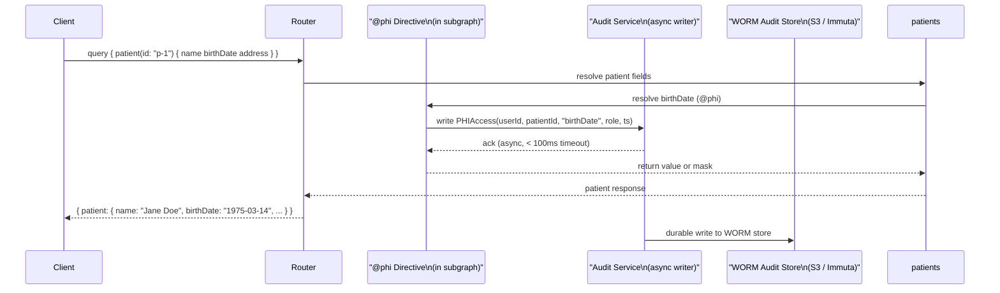

# 03 — Healthcare Data Platform

> **Purpose:** Architecture design document for a HIPAA-compliant GraphQL API serving a
> multi-hospital network. Core challenges: HIPAA PHI handling, HL7 FHIR integration, field-level
> role-based masking for different clinical roles, immutable audit logging, and an API gateway
> contract for external EHR partner integrations.

---

## 1. System Overview

### Business Context

A regional health system operates 8 acute care hospitals, 40 outpatient clinics, and a
network of affiliated independent physicians. The system has four distinct EHR deployments
(Epic, Cerner, a legacy homegrown system, and a specialized behavioral health EHR) that
have accumulated over 20 years of patient records. The health system is under regulatory
pressure to expose patient data through HL7 FHIR APIs (CMS Interoperability Rule) and
is building a unified clinical platform that allows care coordinators, attending physicians,
nurses, billing staff, and external EHR partners to access patient data through a single API.

The existing integration layer is a set of HL7 v2 message queues and point-to-point interface
engines. Engineers building new clinical tools must understand four different EHR data models.
The GraphQL layer will provide a unified, FHIR-aligned schema that abstracts the underlying
EHR heterogeneity.

### Stakeholders

| Role | Concern |
|---|---|
| CISO | HIPAA PHI controls, audit requirements, breach prevention |
| Chief Medical Officer | Clinical workflow support, data accuracy, access control |
| Nursing Leadership | Role-appropriate data access; nurses must not see billing data |
| Billing Department | Complete financial and insurance data; no clinical restrictions |
| IT / Integration Team | EHR integration maintenance, FHIR compliance |
| External EHR Partners | SMART on FHIR authentication, minimal surface exposure |

---

## 2. Requirements

### Functional Requirements

- Patient demographics: name, DOB, contact, insurance, emergency contacts
- Clinical records: diagnoses (ICD-10), medications, allergies, immunizations, problem list
- Lab results: ordered tests, result values, reference ranges, interpretation flags
- Clinical notes: encounter notes, discharge summaries, operative reports
- Imaging orders and reports: radiology orders, diagnostic imaging reports (not DICOM files)
- Medication management: active medications, prescription history, reconciliation
- Care team management: care team members, role assignments, communication preferences
- Appointment management: scheduled appointments, visit history, referral tracking
- External EHR partner API: read-only FHIR R4 resource access for affiliated providers

### Non-Functional Requirements

| Requirement | Target | Notes |
|---|---|---|
| Patient query latency (p99) | < 300ms | Aggregates across multiple EHRs |
| Lab results query latency (p99) | < 150ms | EHR read with cache layer |
| Availability (clinical hours) | 99.95% | 24/7 for acute care hospitals |
| Audit log write latency | < 100ms | Every PHI field access logged before return |
| PHI field masking | Enforced per clinical role | Directive-based, not application-level |
| FHIR compliance | FHIR R4 resource structure | Types map 1:1 to FHIR resources |
| External partner SLA | 99.9%, rate-limited at 1,000 req/min per partner | |

---

## 3. Constraints

### Regulatory Constraints

**C-1: HIPAA — Protected Health Information (PHI) access control and audit.**
Every access to PHI must be limited to the minimum necessary for the stated purpose. Every
PHI field access must be logged to an audit trail with user identity, role, patient ID,
field accessed, and access timestamp. The audit trail must be retained for 6 years.

**C-2: HIPAA — Breach notification readiness.**
The system must be able to produce a complete access log for any patient record within 24
hours of a breach notification request. The audit log must be queryable by patient ID, user
ID, time range, and field name.

**C-3: CMS Interoperability Rule — FHIR R4 compliance.**
The external partner API must expose patient data as valid FHIR R4 resources accessible via
SMART on FHIR authentication. The GraphQL schema for external partners must map to FHIR R4
resource shapes (not GraphQL-idiomatic shapes) to allow FHIR-aware client libraries to operate.

**C-4: EHR systems cannot have schema modifications.**
Epic, Cerner, and the legacy EHR expose read APIs. No write-back to EHR from the GraphQL
layer is permitted without explicit EHR team approval per operation type.

---

## 4. FHIR Resources as GraphQL Types

FHIR R4 resources map to GraphQL types with two adjustments:
1. FHIR uses snake_case; GraphQL uses camelCase — fields are camelCased
2. FHIR polymorphic types (e.g., `value[x]`) are represented as GraphQL unions

### Core Type Mappings

```graphql
# Patient (FHIR R4: Patient)
type Patient @key(fields: "id") {
  id: ID!                           # FHIR: Patient.id
  mrn: String!                      # Local MRN (not in FHIR base)
  name: [HumanName!]!               # FHIR: Patient.name
  birthDate: Date @pii @phi         # FHIR: Patient.birthDate
  gender: AdministrativeGender      # FHIR: Patient.gender
  address: [Address!] @pii @phi     # FHIR: Patient.address
  telecom: [ContactPoint!] @pii @phi # FHIR: Patient.telecom
  identifier: [Identifier!]!        # FHIR: Patient.identifier

  # Clinical relationships (extend in domain subgraphs)
  conditions: [Condition!] @requires(fields: "id")
  medications: [MedicationRequest!] @requires(fields: "id")
  observations: [Observation!] @requires(fields: "id")
  encounters: [Encounter!] @requires(fields: "id")
}

# Observation (FHIR R4: Observation — covers lab results, vitals)
type Observation @key(fields: "id") {
  id: ID!
  status: ObservationStatus!
  category: [CodeableConcept!]!
  code: CodeableConcept!           # LOINC code for the observation type
  subject: Patient!                # Reference to patient
  effectiveDateTime: DateTime
  valueQuantity: Quantity          # Numeric result with unit
  valueString: String              # Free-text result
  valueCodeableConcept: CodeableConcept # Coded result
  interpretation: [CodeableConcept!]   # High/Low/Normal flags
  referenceRange: [ReferenceRange!]    # Normal range for comparison
  note: [Annotation!] @phi @requires(fields: "id")
}

# Condition (FHIR R4: Condition — diagnoses)
type Condition @key(fields: "id") {
  id: ID!
  clinicalStatus: CodeableConcept!
  verificationStatus: CodeableConcept
  category: [CodeableConcept!]
  severity: CodeableConcept
  code: CodeableConcept!           # ICD-10 / SNOMED code
  subject: Patient!
  onsetDateTime: DateTime
  recordedDate: DateTime
  recorder: Practitioner
  note: [Annotation!] @phi
}

# MedicationRequest (FHIR R4: MedicationRequest)
type MedicationRequest @key(fields: "id") {
  id: ID!
  status: MedicationRequestStatus!
  intent: MedicationRequestIntent!
  medicationCodeableConcept: CodeableConcept
  subject: Patient!
  authoredOn: DateTime
  requester: Practitioner
  dosageInstruction: [Dosage!]
  dispenseRequest: MedicationRequestDispenseRequest
}
```

---

## 5. Field-Level Masking by Clinical Role

The `@phi` and `@pii` directives intercept field resolution and apply masking rules based
on the requesting user's clinical role. The masking decision is made per-field per-request.

### Role Hierarchy

```
BILLING_STAFF       → Financial and insurance data only; no clinical data
PATIENT_ACCESS      → Own records only; masked sensitive clinical fields
CARE_COORDINATOR    → Demographics, appointments, care team; no notes
NURSE               → Demographics, vitals, medications, orders; no diagnoses
ATTENDING_PHYSICIAN → Full clinical access; all unmasked fields
COMPLIANCE_OFFICER  → Audit logs; patient data access requires separate justification
SYSTEM_ADMIN        → Schema/config only; no patient data
```

### Masking Matrix

| Field | Billing | Care Coord | Nurse | Attending | Patient (own) |
|---|---|---|---|---|---|
| `Patient.name` | Visible | Visible | Visible | Visible | Visible |
| `Patient.birthDate` | Visible | Visible | Visible | Visible | Visible |
| `Patient.address` | Visible | Masked | Masked | Visible | Visible |
| `Patient.telecom` | Visible | Visible | Visible | Visible | Visible |
| `Condition.code` | Code only | Hidden | Masked | Visible | Masked |
| `Condition.note` | Hidden | Hidden | Hidden | Visible | Hidden |
| `Observation.valueQuantity` | Hidden | Hidden | Visible | Visible | Visible |
| `Observation.note` | Hidden | Hidden | Hidden | Visible | Hidden |
| `MedicationRequest.*` | Hidden | Hidden | Visible | Visible | Visible |

"Masked" means the field is present but its value is replaced with `[RESTRICTED]` and an
audit record is written indicating that a masked field was requested. "Hidden" means the
field resolver returns `null` without an audit record. "Visible" means the value is returned
after writing an audit record.

### Directive Implementation (Patient Subgraph)

```graphql
# Schema-level directive definition
directive @phi(
  minimumRole: ClinicalRole = NURSE
  maskValue: String = "[RESTRICTED]"
) on FIELD_DEFINITION

directive @pii(
  minimumRole: ClinicalRole = ATTENDING_PHYSICIAN
) on FIELD_DEFINITION
```

The directive resolver:
1. Extracts `user.clinicalRole` from the JWT claims
2. Compares the role against `minimumRole` using the role hierarchy
3. If the user's role meets the minimum: resolves the field normally, writes audit record
4. If the user's role is below minimum: returns `maskValue`, does not write "visible" audit record
5. If the field is `@pii` and role is insufficient: returns `null` (not a mask value — absence
   of information is less informative than a mask placeholder)

---

## 6. Federation Topology

```mermaid
graph TD
    router["Apollo Router\n(SMART on FHIR auth)"]

    subgraph Clinical Subgraphs
        patients["Patients Subgraph\n(Epic + Cerner)"]
        conditions["Conditions Subgraph\n(EHR diagnoses)"]
        observations["Observations Subgraph\n(Lab results, vitals)"]
        medications["Medications Subgraph\n(Pharmacy + EHR)"]
    end

    subgraph Operational Subgraphs
        encounters["Encounters Subgraph\n(Appointments + visits)"]
        careTeam["Care Team Subgraph"]
        imaging["Imaging Subgraph\n(RIS integration)"]
    end

    subgraph Administrative Subgraphs
        identity["Identity Subgraph\n(IAM + SMART)"]
        audit["Audit Subgraph\n(PHI access log)"]
        billing["Billing Subgraph\n(Revenue cycle)"]
    end

    subgraph External Gateway
        fhirGateway["FHIR Partner Gateway\n(minimal contract)"]
    end

    router --> patients
    router --> conditions
    router --> observations
    router --> medications
    router --> encounters
    router --> careTeam
    router --> imaging
    router --> identity
    router --> audit
    router --> billing
    router --> fhirGateway
```



---

## 7. Audit Logging Architecture

### PHI Access Logging Flow



### Audit Record Schema

```graphql
type PHIAuditRecord {
  id: ID!
  requestId: ID!          # Correlation with GraphQL operation trace
  userId: ID!
  userRole: ClinicalRole!
  patientId: ID!
  fieldPath: String!      # e.g., "Patient.birthDate"
  accessResult: PHIAccessResult!  # RETURNED, MASKED, DENIED
  timestamp: DateTime!    # Nanosecond precision
  sourceSystem: String!   # Which EHR system the data came from
  purposeOfUse: PurposeOfUse!  # Treatment, Payment, Operations
  ipAddress: String!
}

enum PurposeOfUse {
  TREATMENT
  PAYMENT
  HEALTHCARE_OPERATIONS
  PUBLIC_HEALTH
  RESEARCH
  AUDIT
}
```

**Enforcement:** The `purposeOfUse` value is required in every request header
(`X-Purpose-Of-Use`). The router validates it against the allowed values for the user's role.
A billing staff user submitting `purposeOfUse: TREATMENT` is rejected — billing staff do not
have treatment-purpose access.

---

## 8. External EHR Partner API

### Schema Contract Design

External EHR partners receive a schema contract that exposes only the FHIR R4 resources
their integration requires. The contract is created using Apollo contract graphs with
`@tag(name: "external-fhir")` annotations.

```graphql
# Fields tagged for external FHIR partner access
type Patient @key(fields: "id") {
  id: ID! @tag(name: "external-fhir")
  mrn: String! @tag(name: "external-fhir")
  name: [HumanName!]! @tag(name: "external-fhir")
  birthDate: Date @tag(name: "external-fhir")
  gender: AdministrativeGender @tag(name: "external-fhir")

  # NOT tagged — excluded from external contract:
  # address, telecom, conditions, medications, billing data
}
```

External partners authenticate via SMART on FHIR (OAuth 2.0 authorization code flow with
PKCE). The JWT issued by the SMART authorization server includes:
- `patient` claim: specific patient ID (patient-context launch) or null (system launch)
- `scope` claim: FHIR resource scopes (e.g., `patient/Patient.read`, `patient/Observation.read`)

The router validates SMART scopes against the requested fields using a Rhai script. A partner
requesting `Patient.conditions` without `patient/Condition.read` scope receives a scope
enforcement error before any resolver is called.

---

## 9. Architecture Decision Records

### ADR-001: FHIR R4 Types as GraphQL Schema Foundation

**Date:** 2024-Q3
**Status:** Accepted

**Context:**
The CMS Interoperability Rule requires FHIR R4 API compliance. The team had a choice: design
a GraphQL-idiomatic schema optimized for developer experience (camelCase, flat structures,
simplified types) and then build a FHIR translation layer, or design the GraphQL schema to
mirror FHIR R4 resources directly.

**Decision:** Mirror FHIR R4 resources as GraphQL types with camelCase field names. FHIR
resource IDs become GraphQL entity keys. FHIR CodeableConcept, Quantity, HumanName, and
other datatypes are GraphQL scalar types or object types with matching field structure.

**Rationale:**
- FHIR-aware client libraries can consume the schema without transformation
- External partner API is FHIR-compliant without a separate translation layer
- Clinical staff engineers working in the FHIR ecosystem recognize the schema immediately
- No dual-maintenance of a FHIR schema and a GraphQL-idiomatic schema

**Trade-offs Accepted:**
- FHIR type names and field structures are not always developer-friendly (CodeableConcept is
  verbose for most use cases)
- Internal clinical application developers must learn FHIR concepts to query the API
- FHIR polymorphic types (value[x]) require GraphQL unions, which add query complexity

---

### ADR-002: PHI Masking at the Subgraph Resolver Layer, Not the Router

**Date:** 2024-Q3
**Status:** Accepted

**Context:**
PHI masking can be implemented at three layers: the router (before subgraph calls), the
subgraph resolver (field-by-field), or the database query layer. The question is where
the masking logic belongs.

**Decision:** PHI masking is implemented as custom directives in the subgraph resolver layer.
The router handles authentication (SMART token validation) but does not perform field-level
masking. The database layer is not modified.

**Rationale:**
- Subgraph resolvers have field-level granularity; the router sees only operation-level data
- Masking logic depends on the data context (patient relationship, care team membership)
  which is available in the subgraph but not at the router
- Directive-based masking is declarative, auditable, and testable with unit tests

**Trade-offs Accepted:**
- Masking logic is distributed across subgraphs; a masking defect in one subgraph does not
  protect other subgraphs
- Each subgraph must correctly implement the `@phi` directive; this is a shared library
  dependency that must be version-controlled and tested

---

## 10. Implementation Phases

### Phase 1 — Patient and Identity Foundation (Weeks 1–10)

SMART on FHIR authentication, Patients subgraph (Epic integration), Identity subgraph,
audit logging pipeline to WORM store. Basic PHI masking for Attending Physician and Nurse
roles. Verify HIPAA technical safeguards with security audit.

### Phase 2 — Clinical Data Subgraphs (Weeks 11–20)

Conditions, Observations (lab results + vitals), MedicationRequest, Encounters subgraphs.
Full masking matrix implemented for all five roles. Cerner integration added alongside Epic.

### Phase 3 — External Partner Gateway (Weeks 21–28)

FHIR R4 schema contract for external partners. SMART scope enforcement at router. Rate
limiting by partner client ID. Partner onboarding documentation and sandbox environment.

### Phase 4 — Legacy EHR Migration (Weeks 29–40)

Legacy homegrown EHR and behavioral health EHR integrated via HL7 FHIR translation adapters.
Full 8-hospital network on unified GraphQL layer. Legacy HL7 v2 interface engines decommissioned
for read traffic.

---

## References

- [HIPAA Security Rule — 45 CFR Part 164](https://www.hhs.gov/hipaa/for-professionals/security/index.html)
- [CMS Interoperability and Patient Access Rule — FHIR API Requirements](https://www.cms.gov/Regulations-and-Guidance/Guidance/Interoperability/index)
- [HL7 FHIR R4 Specification](https://hl7.org/fhir/R4/)
- [SMART on FHIR Authorization Guide](https://docs.smarthealthit.org/authorization/)
- Chapter 05 — Security (directive-based field authorization)
- Chapter 09 — Schema Governance (contract graph design)
- Chapter 14 — Observability (PHI access audit instrumentation)
