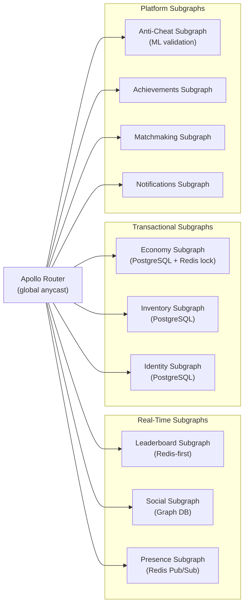
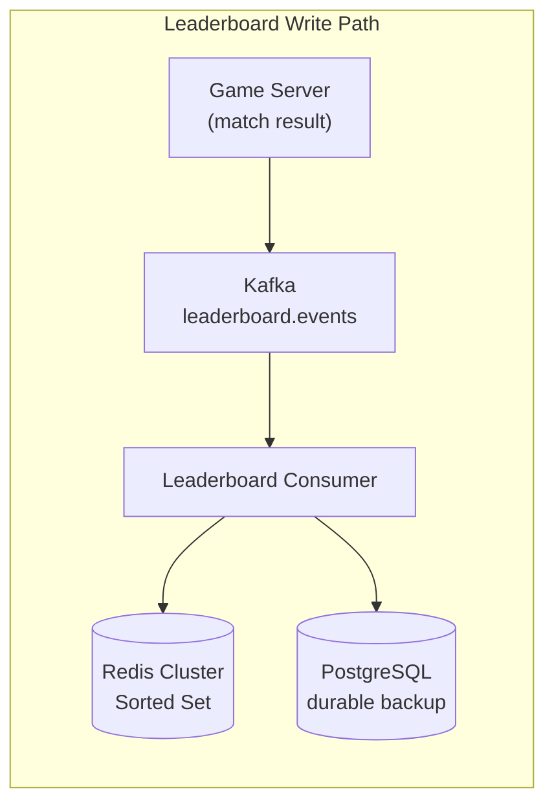
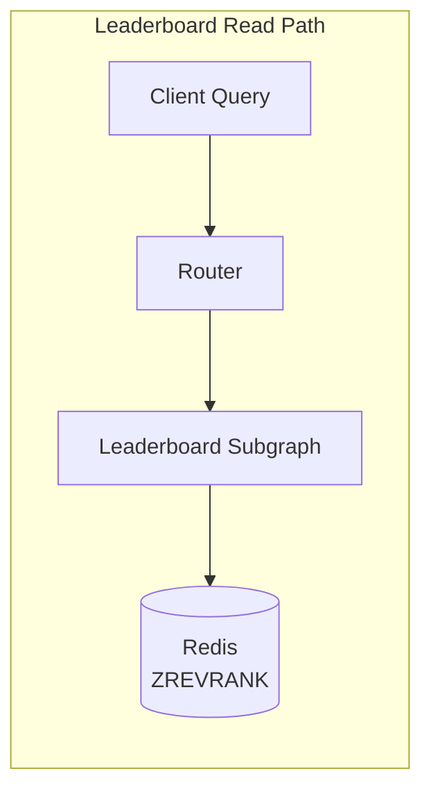
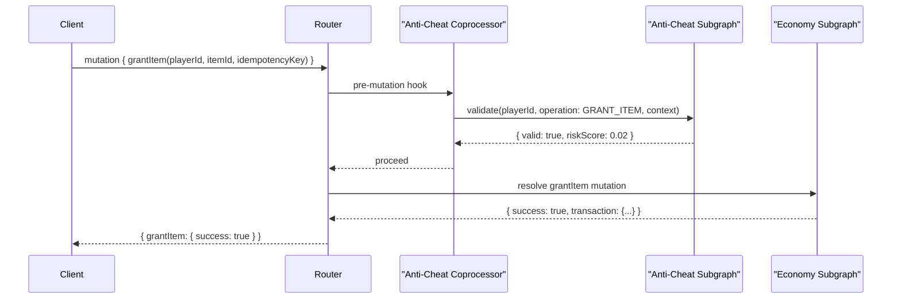
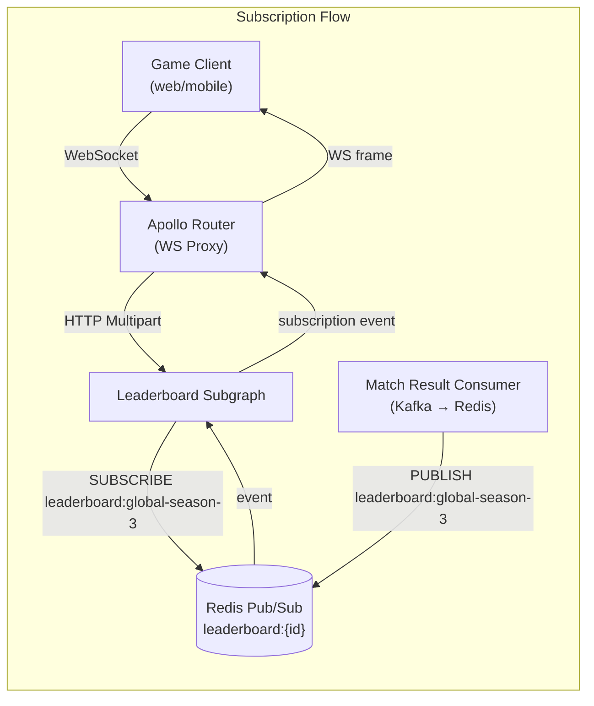

# 04 — Gaming Platform Design

> **Purpose:** Architecture design document for a GraphQL API serving a live-service gaming
> platform with 100 million registered players. Core challenges: extremely high write throughput
> from game events, real-time leaderboards and player presence, anti-cheat mutation validation,
> and an in-game economy requiring idempotent transactions with distributed locking.

---

## 1. System Overview

### Business Context

A live-service gaming platform publishes multiple concurrent titles sharing a unified player
identity, social graph, in-game economy, and achievement system. Each title handles its own
game-specific matchmaking and session management, but all titles share the platform's economy
(virtual currency, items, entitlements), social features (friends list, clan/guild management,
messaging), and competitive systems (global leaderboards, ranked seasons).

The platform serves 100 million registered players. Peak concurrent users during a title
launch or seasonal event reach 8 million. The existing architecture is a collection of REST
microservices with proprietary binary protocols for game clients. The GraphQL layer is
targeted at web dashboard, mobile companion apps, and the platform's public API for content
creators and third-party integrators. Game clients on console and PC continue to use the
binary protocol for latency-critical game state; GraphQL handles the social and meta-game
layer.

### Stakeholders

| Role | Concern |
|---|---|
| Game Studio Engineers | Leaderboard freshness, social graph, title-specific economy rules |
| Platform Security | Anti-cheat, rate limiting, mutation validation, ban enforcement |
| Economy Team | Idempotent transactions, no duplicate item grants, audit history |
| Live Operations | Real-time monitoring, event-driven economy adjustments |
| Third-Party Integrators | Public API stability, rate limits, webhooks |
| SRE | Scale during events, auto-scaling thresholds, incident response |

---

## 2. Requirements

### Functional Requirements

- Player profile: display name, avatar, biography, linked accounts (PSN, Xbox, Steam)
- Social graph: friends list (bidirectional), followers, blocked users, online presence
- Leaderboards: global, regional, title-specific, season-scoped, real-time updates
- Matchmaking status: queue status, estimated wait time, match history (completed matches)
- In-game inventory: items owned, equipped loadout, cosmetics, tradeable items
- In-game economy: virtual currency balance, purchase history, item transfer, gifting
- Achievement system: unlocked achievements, progress toward locked achievements
- Clan/guild management: membership, roles, activity feed, shared stats
- Notifications: match invites, friend requests, economy events, title announcements
- Content creator API: player stats, leaderboard data, match history (public data only)

### Non-Functional Requirements

| Requirement | Target | Notes |
|---|---|---|
| Leaderboard query latency (p99) | < 50ms | Redis-backed; cache-first |
| Social graph query latency (p99) | < 100ms | Graph DB + Redis cache |
| Economy mutation latency (p99) | < 200ms | Includes distributed lock acquisition |
| Subscription event delivery | < 500ms | Leaderboard position changes |
| Peak concurrent subscriptions | 2M | During seasonal events |
| Economy transaction throughput | 50,000 TPS | Peak event periods |
| Anti-cheat validation latency | < 20ms | Added to every mutation |
| Write throughput (game events) | 500,000 events/second | Platform-wide |

---

## 3. Constraints

### Hard Constraints

**C-1: Game client binary protocol cannot be replaced.**
Console and PC game clients use a proprietary low-latency binary protocol for game state
synchronization. GraphQL is for meta-game only. Latency-critical game state (player position,
weapon fire, hit detection) never transits GraphQL.

**C-2: Anti-cheat validation on every economy mutation.**
Every mutation that grants items, transfers currency, or modifies inventory must pass
anti-cheat validation before being applied. Validation is performed by the Anti-Cheat
subgraph. No economy mutation may bypass this step.

**C-3: Economy transactions must be idempotent.**
Game servers retry failed requests. An item grant mutation called twice must produce exactly
one item grant. Every economy mutation accepts an `idempotencyKey` argument (UUID generated
by the caller). Duplicate keys return the original response without re-executing.

**C-4: Leaderboard data is eventually consistent; ranked match results are authoritative.**
Real-time leaderboard updates (via subscription) show eventual-consistency state. The
authoritative ranking is computed by the Ranked Engine every 5 minutes from match results.
Clients must understand that the subscription value and the authoritative rank may differ
by up to 5 minutes.

---

## 4. Bounded Contexts and Entity Ownership

```
┌──────────────────┐  ┌──────────────────┐  ┌──────────────────┐
│    IDENTITY      │  │     SOCIAL       │  │   LEADERBOARDS   │
│ Player           │  │ Friendship       │  │ LeaderboardEntry │
│ LinkedAccount    │  │ Follower         │  │ Season           │
│ BanRecord        │  │ Clan             │  │ RankedScore      │
└──────────────────┘  └──────────────────┘  └──────────────────┘

┌──────────────────┐  ┌──────────────────┐  ┌──────────────────┐
│    ECONOMY       │  │   INVENTORY      │  │   ACHIEVEMENTS   │
│ CurrencyBalance  │  │ Item             │  │ Achievement      │
│ Transaction      │  │ InventorySlot    │  │ PlayerProgress   │
│ Purchase         │  │ Loadout          │  │ UnlockEvent      │
└──────────────────┘  └──────────────────┘  └──────────────────┘

┌──────────────────┐  ┌──────────────────┐  ┌──────────────────┐
│   MATCHMAKING    │  │  ANTI-CHEAT      │  │  NOTIFICATIONS   │
│ MatchRecord      │  │ ValidationResult │  │ Notification     │
│ QueueStatus      │  │ FlagRecord       │  │ NotifPreference  │
└──────────────────┘  └──────────────────┘  └──────────────────┘
```

---

## 5. Federation Topology



### Redis-First Architecture for Real-Time Subgraphs

Leaderboard and Presence subgraphs use Redis as their primary data store (not a cache).
PostgreSQL is a write-through backup for durability. Redis Sorted Sets are the native data
structure for leaderboard ranking (`ZADD`, `ZREVRANK`, `ZREVRANGEBYSCORE`). This means
leaderboard queries never touch PostgreSQL at query time — only at write time and on cache
cold-start.





---

## 6. Anti-Cheat Design

### Mutation Validation Pipeline

Every economy mutation (item grant, currency debit, item transfer, purchase) is intercepted
by a router-level coprocessor that calls the Anti-Cheat subgraph for validation before the
economy or inventory subgraph executes.



**If Anti-Cheat returns `valid: false`:**
The mutation is rejected with error `ANTICHEAT_VIOLATION`. The violation is logged to the
Ban Records system. The player is not notified of the specific validation failure (to prevent
cheat tool calibration). Three violations within 24 hours trigger an automatic account
suspension.

### Mutation Complexity Limits

Economy mutations have hard limits enforced at the router:

```yaml
# router.yaml
limits:
  max_depth: 5
  max_height: 20
  max_aliases: 5
  max_root_fields: 3

# Custom operation limits for economy mutations (Rhai script)
# economy mutations: max 1 per request; no batching
```

Batching economy mutations in a single request is prohibited. This prevents bulk item grants
that could result from compromised game servers or replay attacks.

### Rate Limiting by Player ID and Operation

```yaml
# router.yaml — traffic_shaping
traffic_shaping:
  router:
    rate_limit:
      capacity: 100          # tokens
      interval: 1s           # refill interval
  subgraph:
    economy:
      rate_limit:
        capacity: 10         # 10 economy mutations per player per second
        interval: 1s
        storage: redis       # Player-scoped rate limit stored in Redis
```

The economy rate limit key is `{player_id}:{operation_name}`. A player cannot execute more
than 10 economy mutations per second regardless of which game title generated the request.

---

## 7. Economy Subgraph: Idempotent Transactions

### Idempotency Implementation

Every economy mutation accepts `idempotencyKey: ID!`. The economy subgraph:

1. Checks Redis for `idempotency:{key}` with a 24-hour TTL
2. If the key exists: returns the cached response immediately (no-op execution)
3. If the key does not exist: acquires a distributed lock (Redis `SET NX PX 5000`), executes
   the transaction, stores the response in Redis under `idempotency:{key}`, releases the lock

```graphql
type Mutation {
  grantItem(
    playerId: ID!
    itemId: ID!
    quantity: Int! = 1
    idempotencyKey: ID!
    reason: ItemGrantReason!
  ): ItemGrantResult!

  transferCurrency(
    fromPlayerId: ID!
    toPlayerId: ID!
    amount: Int!
    currencyType: CurrencyType!
    idempotencyKey: ID!
  ): CurrencyTransferResult!
}
```

### Event Sourcing for Item History

Every economy mutation is stored as an immutable event in an event store (Kafka compacted
topic + PostgreSQL event log). The current inventory state is derived by replaying events.
This provides:

- Complete item provenance (where did this item come from, who owned it before)
- Rollback capability (dispute resolution, ban wave reversals)
- Audit trail for compliance and fraud investigation

```graphql
type ItemEvent {
  id: ID!
  eventType: ItemEventType!  # GRANTED, PURCHASED, TRANSFERRED, CONSUMED, REFUNDED
  itemId: ID!
  playerId: ID!
  quantity: Int!
  timestamp: DateTime!
  reason: String!
  sourceSystem: String!     # Which game server or platform service originated this
  idempotencyKey: ID!       # Original request key
  transactionId: ID!        # Groups related events in a saga
}
```

---

## 8. GraphQL Subscriptions for Live Leaderboards

### Subscription Architecture via Redis Pub/Sub



### Subscription Schema

```graphql
type Subscription {
  leaderboardUpdated(
    leaderboardId: ID!
    playerIds: [ID!]         # Optional: only deliver updates for specific players
  ): LeaderboardUpdateEvent!

  playerPresenceChanged(
    playerIds: [ID!]!        # Watch presence for these friends
  ): PresenceEvent!

  economyEvent(
    playerId: ID!            # Must match authenticated player
  ): EconomyNotification!
}

type LeaderboardUpdateEvent {
  leaderboardId: ID!
  entries: [LeaderboardEntry!]!  # Top N entries after the update
  changedEntries: [LeaderboardEntry!]!  # Only the entries that changed
  timestamp: DateTime!
}
```

### Backpressure Management

At 2 million concurrent subscriptions, Redis Pub/Sub fan-out can become a bottleneck.
The design uses channel partitioning:

- Global leaderboard: 100 Redis channels (`leaderboard:global:shard-{0..99}`)
- Subgraph subscribes to the shard that covers the affected player's rank range
- Clients receive updates from their relevant rank shard only
- Top 100 players receive updates via a dedicated `leaderboard:global:top100` channel
  (highest fan-out, but only 100 entries changing)

---

## 9. Architecture Decision Records

### ADR-001: Redis as Primary Store for Leaderboards, Not a Cache

**Date:** 2024-Q3
**Status:** Accepted

**Context:**
Leaderboard queries at 50ms p99 cannot tolerate a cache miss that falls through to PostgreSQL
(PostgreSQL ZRANK-equivalent query at 100M records is 80–200ms without specialized indexing).
Options: (A) PostgreSQL with specialized ranking index, (B) Redis as cache with TTL,
(C) Redis as primary store with PostgreSQL as durable backup.

**Decision:** Option C — Redis is the primary store for leaderboard data. PostgreSQL is
written to asynchronously for durability and as the recovery source after a Redis failure.

**Trade-offs Accepted:**
- Redis failure means leaderboard queries fail until Redis is restored from PostgreSQL
  (estimated recovery time: 10 minutes for a 100M-entry leaderboard)
- Write-through to PostgreSQL adds ~5ms to every leaderboard write
- Redis cluster cost is higher than a PostgreSQL-only solution

---

### ADR-002: Anti-Cheat Validation as a Synchronous Coprocessor, Not Async

**Date:** 2024-Q3
**Status:** Accepted

**Context:**
Anti-cheat validation could be synchronous (blocking the mutation until validation completes)
or asynchronous (execute the mutation, validate in the background, rollback if invalid).

**Decision:** Synchronous validation. Every economy mutation waits for anti-cheat validation
before executing.

**Rationale:**
Asynchronous validation requires rollback logic, which is complex and error-prone for
economy mutations (an item already consumed cannot be trivially un-consumed). Synchronous
validation prevents invalid state from ever entering the system. The anti-cheat ML model
returns in < 20ms for 95% of requests; 99th percentile is 35ms. This is acceptable overhead.

**Trade-offs Accepted:**
- Anti-cheat service becomes a dependency in the p99 latency path of all economy mutations
- Anti-cheat service unavailability blocks all economy mutations (circuit breaker configured
  to fail-open after 10 consecutive failures, with alerting — a conscious security trade-off)

---

### ADR-003: Event Sourcing for Economy, Not Mutable State

**Date:** 2024-Q3
**Status:** Accepted

**Context:**
The economy could be modeled as mutable state (UPDATE balance SET amount = amount - cost)
or as an event log (INSERT INTO events (type: PURCHASE, amount: cost)).

**Decision:** Event sourcing. The current balance is derived from event replay. The event
log is immutable. Balance queries read a pre-computed materialized view, which is updated
by the event consumer.

**Trade-offs Accepted:**
- Materialized view can lag behind the event log by up to 100ms
- Event replay for account recovery takes O(n) time for accounts with large transaction histories
- Schema evolution for events is harder (old events must remain parseable by new code)

---

## 10. Implementation Phases

### Phase 1 — Identity and Social (Weeks 1–8)

Player identity subgraph, friends list, presence. Basic leaderboard queries (non-realtime).
Anti-cheat subgraph with rule-based validation (ML model in Phase 2).

### Phase 2 — Economy and Inventory (Weeks 9–18)

Economy subgraph with idempotency. Inventory subgraph. Event sourcing pipeline (Kafka + PostgreSQL).
Anti-cheat ML model integration. Load test to 50,000 economy TPS.

### Phase 3 — Real-Time Features (Weeks 19–26)

Redis Pub/Sub subscription pipeline. Live leaderboard subscriptions. Presence subscriptions.
2M concurrent subscription load test.

### Phase 4 — Public API and Content Creator Access (Weeks 27–32)

Schema contract for public API (`@tag(name: "public")`). Rate limiting by API key. Partner
webhook delivery. Content creator documentation and SDK.

---

## References

- [Redis Sorted Sets Documentation](https://redis.io/docs/data-types/sorted-sets/)
- [Redis Distributed Locks (Redlock Algorithm)](https://redis.io/docs/manual/patterns/distributed-locks/)
- [Event Sourcing Pattern — Martin Fowler](https://martinfowler.com/eaaDev/EventSourcing.html)
- [Apollo Router Coprocessors](https://www.apollographql.com/docs/router/customizations/coprocessor/)
- Chapter 06 — Performance and Scaling (DataLoader, caching strategy)
- Chapter 08 — Supergraph Architecture (router configuration)
- Chapter 17 — Caching Strategies (Redis patterns)
