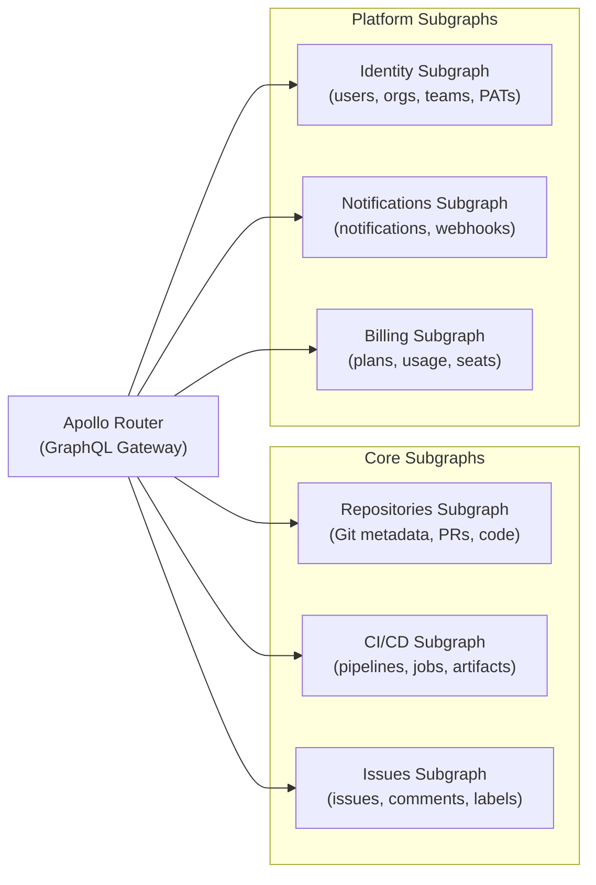

# 05 — Developer Tools Platform Design

> **Purpose:** Architecture design document for a GraphQL API serving a developer tools platform
> at GitHub/GitLab scale: code repositories, CI/CD pipelines, issue tracking, pull request
> reviews, team management, webhooks, and 50 million developers. Core schema design challenges
> include recursive types (comment threads, file trees), event sourcing for audit history,
> federated subgraph ownership across six bounded contexts, webhook delivery as subscriptions
> vs. polling, API rate limiting by personal access token and operation type, and pagination
> strategies for large result sets such as commit histories, file trees, and event logs.

---

## 1. System Overview

### Business Context

A developer tools platform is a collaborative software development environment. Unlike
consumer platforms, its users are engineers who will scrutinize the API design, discover
edge cases at scale, and build tooling on top of the public API. The API is itself a product
with a developer experience quality bar. GraphQL on a developer tools platform serves three
distinct client populations:

1. **Web UI** — the first-party web application built by the platform's frontend teams.
   Needs rich, nested queries for complex views (PR review page: PR metadata + diff + comments
   + CI status + reviewers + labels all in one operation).

2. **CLI tooling** — the platform's official CLI (`git push`, `gh pr create`). Needs
   efficient, narrow queries. Often runs in CI environments where latency matters.

3. **Third-party integrations** — editors (VS Code extensions), CI/CD tools, chatbots,
   deployment platforms, project management tools. 50 million developers means hundreds of
   thousands of integrators. The public API must be stable, well-documented, and rate-limited
   fairly.

The API also serves internal services: the search indexer, the notification system, the
recommendation engine. Internal access is not rate-limited and uses service-to-service auth
rather than personal access tokens.

### Stakeholders

| Role | Concern |
|---|---|
| Web Frontend Teams | Efficient queries for complex views, low latency, strong types |
| CLI Team | Minimal query surface, predictable rate limits, pagination |
| Platform API Team | Schema stability, deprecation management, rate limiting |
| Security Team | PAT scoping, audit logging, secret scanning, IP allowlisting |
| SRE | Query latency SLA, rate limit enforcement, connection scaling |
| Developer Community | Stable public API, clear docs, sensible limits, webhooks |

---

## 2. Requirements

### Functional Requirements

- Repository management: create, clone URL, branches, tags, visibility settings
- Code browsing: file tree navigation, file content, blame, history
- Commit history: per-branch, per-file, filtered by author and date range
- Pull requests: create, review (review thread comments, line-level comments), approvals,
  merge status, CI status checks
- Issue tracking: create, comment, label, assign, milestone, close
- CI/CD pipelines: pipeline runs, job status, step logs, artifacts
- Team management: organization, team, membership, permissions
- Notifications: mention, PR review request, CI failure, deployment event
- Webhooks: delivery of events to external URLs (push, PR, issue, CI events)
- Public API: stable versioned surface for third-party integrations (subsets via schema contracts)
- Search: code search, issue search, user search

### Non-Functional Requirements

| Requirement | Target |
|---|---|
| Query latency p99 (web UI, simple queries) | < 100ms |
| Query latency p99 (complex PR review page) | < 500ms |
| Commit history pagination latency (1,000 commits) | < 200ms |
| File tree rendering (repository with 10,000 files) | < 300ms |
| Rate limit granularity | Per PAT, per operation type |
| Public API rate limit | 5,000 points/hour (GitHub-style point budget) |
| Maximum concurrent WebSocket subscriptions | 500,000 |
| Webhook delivery latency (p99) | < 5 seconds after event |
| Developer account scale | 50 million registered users |
| Repository scale | 500 million repositories |

---

## 3. Constraints

### Hard Constraints

**C-1: Public API backward compatibility.**
The public GraphQL API is a product with SLA guarantees. Breaking changes require a minimum
90-day deprecation period with documented migration guides. Fields cannot be removed until
usage reaches zero across all registered third-party applications. This constraint is harder
than internal APIs — third-party developers may have abandoned applications still making
queries, so "zero usage" must be defined with a time window (no queries in 90 days).

**C-2: PAT-scoped authorization.**
Personal access tokens (PATs) carry a scope (read:repo, write:pull_request, admin:org).
Every resolver must check that the executing PAT has the required scope for that operation.
Scope enforcement is not optional and cannot be delegated to the application layer —
it is enforced at the resolver level via middleware.

**C-3: Audit logging is mandatory for all write operations.**
Every mutation that modifies repository content, permissions, or team membership must be
logged to an immutable audit log. The audit log is queryable via GraphQL for organization
administrators. This is a compliance requirement (SOC 2, enterprise customer contracts).

**C-4: Git operations are not implemented in GraphQL.**
Git-level operations (clone, fetch, push) use the Git protocol or Git over HTTPS, not
GraphQL. GraphQL represents the metadata layer: what exists, who owns it, what its status is.
Binary content (raw file blobs over 1 MB) is served via REST endpoints with presigned URLs,
not via GraphQL field resolution.

---

## 4. Schema Design Challenges

### Challenge 1: Recursive Types — Comment Threads

Pull request review comments form a tree: a comment can have replies, each reply can itself
have replies. Representing this naively creates an infinitely deep type that the schema cannot
express without cycle-breaking.

**Approach: Maximum depth flattening with a `replies` field limited to one level**

The most pragmatic resolution for developer tools: comments support one level of nesting
(top-level comment → direct replies). Replies cannot be replied to — the UI shows a flat
reply list under each top-level comment. This matches how GitHub, GitLab, and Linear model
review comments in practice.

```graphql
type ReviewThread {
  id: ID!
  pullRequest: PullRequest!
  file: String
  line: Int
  startLine: Int
  side: DiffSide!
  isResolved: Boolean!
  resolvedBy: User

  """
  The root comment that started this thread.
  """
  rootComment: ReviewComment!

  """
  Direct replies to the root comment.
  Replies are flat — there is no nesting beyond one level.
  If your use case requires deep nesting, model it as linked issues/threads.
  """
  replies(first: Int = 20, after: String): ReviewCommentConnection!
}

type ReviewComment {
  id: ID!
  thread: ReviewThread!
  author: User!
  body: String!
  bodyHtml: String!         # Pre-rendered HTML — clients should prefer this
  createdAt: DateTime!
  updatedAt: DateTime!
  isEdited: Boolean!
  reactions: [Reaction!]!
}
```

**Approach: Arbitrary depth for issue comment threads (via parent field)**

For issue comments where deeper threading may be required (e.g., discussion forums),
use a `parent` field with a depth limit enforced in the resolver:

```graphql
type IssueComment {
  id: ID!
  issue: Issue!
  author: User!
  body: String!
  createdAt: DateTime!
  updatedAt: DateTime!

  """
  Parent comment if this is a reply. Null for top-level comments.
  Resolvers enforce a maximum depth of 5 levels. Querying parent.parent.parent.parent.parent
  will return the ancestor at depth 5 and null beyond that.
  """
  parent: IssueComment

  """
  Direct children of this comment. Use cursor-based pagination for large reply threads.
  """
  replies(first: Int = 20, after: String): IssueCommentConnection!

  replyCount: Int!
}
```

The depth limit is enforced in the router via `max_depth: 10` and in the resolver:

```typescript
const IssueCommentResolvers = {
  IssueComment: {
    parent: async (comment, _args, context, info) => {
      // Count the depth of the current path
      const depth = info.path.prev?.prev?.prev?.prev ? 5 : countPathDepth(info.path);
      if (depth >= 5) return null;  // Stop recursion at depth 5
      return context.loaders.issueComment.load(comment.parentId);
    }
  }
};
```

---

### Challenge 2: Recursive Types — File Tree

A repository's file tree is a tree of directories and files. Directories contain directories
and files. Representing this as a recursive GraphQL type creates the same infinite depth
problem as comment threads, with an additional complication: large monorepos have
tens of thousands of entries at multiple levels.

**Approach: Union type with explicit depth, lazy-loaded sub-trees**

```graphql
"""
A node in a repository's file tree. Either a file (blob) or a directory (tree).
Use __typename to distinguish between the two.
"""
union TreeEntry = BlobEntry | TreeEntry_Directory

"""
A file in the repository.
"""
type BlobEntry {
  name: String!
  path: String!
  mode: FileMode!
  size: Int!

  """
  Content is only available for files under 1 MB.
  For larger files, use the rawUrl to download via HTTPS.
  """
  content: String
  rawUrl: String!
  isBinary: Boolean!
  language: String
}

"""
A directory in the repository. Named TreeEntry_Directory to avoid
conflict with the GraphQL built-in concept of tree entries.
"""
type TreeEntry_Directory {
  name: String!
  path: String!
  mode: FileMode!

  """
  Entries immediately within this directory.
  Sub-directories are NOT recursively expanded — request sub-trees
  via the repository.tree(path: "src/components") query separately.
  This prevents unbounded depth traversal.
  """
  entries(first: Int = 100, after: String): TreeEntryConnection!
  entryCount: Int!
}

type Query {
  """
  Fetch the file tree at a specific path within a repository.
  Use path: "" or path: "/" for the root. Request sub-directories
  with their specific paths rather than expanding from the root.
  """
  repository(owner: String!, name: String!): Repository
}

type Repository @key(fields: "id") {
  id: ID!
  # ...

  """
  The file tree at the given path and ref (branch, tag, or commit SHA).
  Returns only immediate children — not recursive.
  """
  tree(
    ref: String! = "HEAD"
    path: String! = ""
  ): TreeEntry_Directory

  """
  Fetch a specific file by path.
  """
  file(
    ref: String! = "HEAD"
    path: String!
  ): BlobEntry
}
```

**Client pattern for file tree navigation:**

Clients fetch one directory at a time, expanding sub-directories lazily as the user navigates:

```graphql
# Initial fetch: root directory
query GetFileTree($owner: String!, $name: String!) {
  repository(owner: $owner, name: $name) {
    tree(ref: "main", path: "") {
      entries(first: 100) {
        edges {
          node {
            __typename
            ... on BlobEntry { name path size language }
            ... on TreeEntry_Directory { name path entryCount }
          }
        }
      }
    }
  }
}

# On user click of a directory: fetch that directory
query GetSubTree($owner: String!, $name: String!, $path: String!) {
  repository(owner: $owner, name: $name) {
    tree(ref: "main", path: $path) {
      entries(first: 100) {
        edges {
          node {
            __typename
            ... on BlobEntry { name path size language }
            ... on TreeEntry_Directory { name path entryCount }
          }
        }
      }
    }
  }
}
```

---

### Challenge 3: Event Sourcing for Audit History

Every action on the platform is an event: issue opened, PR merged, pipeline triggered,
team member added. These events form the queryable audit trail required for compliance and
the activity feed visible to users.

```graphql
"""
Base interface for all platform events.
"""
interface AuditEvent {
  id: ID!
  actor: Actor!           # User or bot that performed the action
  timestamp: DateTime!
  ipAddress: String       # Null for internal/system actors
  userAgent: String
  organization: Organization
}

"""
Actor can be a user or a machine actor (GitHub App, service account)
"""
union Actor = User | BotActor

type BotActor {
  id: ID!
  name: String!
  slug: String!
}

"""
Concrete event types
"""
type RepositoryCreatedEvent implements AuditEvent {
  id: ID!
  actor: Actor!
  timestamp: DateTime!
  ipAddress: String
  userAgent: String
  organization: Organization
  # Event-specific fields
  repository: Repository!
  visibility: RepositoryVisibility!
}

type PullRequestMergedEvent implements AuditEvent {
  id: ID!
  actor: Actor!
  timestamp: DateTime!
  ipAddress: String
  userAgent: String
  organization: Organization
  # Event-specific fields
  pullRequest: PullRequest!
  mergeMethod: MergeMethod!
  mergeCommitSha: String!
}

type TeamMemberAddedEvent implements AuditEvent {
  id: ID!
  actor: Actor!
  timestamp: DateTime!
  ipAddress: String
  userAgent: String
  organization: Organization
  # Event-specific fields
  team: Team!
  addedUser: User!
  role: TeamRole!
}

"""
Audit log query — paginated, filtered, organization-scoped
"""
type Organization @key(fields: "id") {
  id: ID!
  # ...

  auditLog(
    first: Int = 50
    after: String
    filter: AuditLogFilter
  ): AuditEventConnection!
}

input AuditLogFilter {
  actorLogin: String
  eventTypes: [AuditEventType!]
  repositoryName: String
  from: DateTime
  to: DateTime
  ipAddress: String
}
```

**Implementation note:** The audit log is backed by an append-only event store (Kafka topic
compacted to S3, queryable via Athena or ClickHouse for historical queries). The GraphQL
resolver queries ClickHouse for historical audit events and the recent events Kafka topic
for events in the last 24 hours. Pagination cursors encode the event timestamp and ID —
cursor-based pagination on a time-series dataset is correct here; offset-based pagination
would be O(n) at large offsets.

---

## 5. Bounded Contexts and Entity Ownership

```
┌─────────────────────┐  ┌─────────────────────┐  ┌─────────────────────┐
│    REPOSITORIES     │  │      CI/CD          │  │      ISSUES         │
│ Repository          │  │ Pipeline            │  │ Issue               │
│ Branch              │  │ PipelineRun         │  │ IssueComment        │
│ Commit              │  │ Job                 │  │ Label               │
│ PullRequest         │  │ JobStep             │  │ Milestone           │
│ ReviewThread        │  │ Artifact            │  │ IssueTemplate       │
│ ReviewComment       │  │ EnvironmentVar      │  │                     │
└─────────────────────┘  └─────────────────────┘  └─────────────────────┘

┌─────────────────────┐  ┌─────────────────────┐  ┌─────────────────────┐
│      IDENTITY       │  │   NOTIFICATIONS     │  │      BILLING        │
│ User                │  │ Notification        │  │ Organization.plan   │
│ Organization        │  │ NotifPreference     │  │ Usage               │
│ Team                │  │ EmailSubscription   │  │ Invoice             │
│ Membership          │  │ WebhookDelivery     │  │ Seat                │
│ PAT                 │  │ WebhookEndpoint     │  │                     │
└─────────────────────┘  └─────────────────────┘  └─────────────────────┘
```

---

## 6. Federation Topology



### Entity Ownership and Cross-Subgraph References

The `User` entity is owned by Identity. Every other subgraph references it by `@key(fields: "id")`.

```graphql
# identity-subgraph
type User @key(fields: "id") {
  id: ID!
  login: String!
  name: String
  email: String        # @inaccessible for public API — only available in internal/authed contexts
  avatarUrl: String!
  bio: String
  location: String
  websiteUrl: String
  createdAt: DateTime!
}

# repos-subgraph — references User without re-implementing its fields
type PullRequest @key(fields: "id") {
  id: ID!
  number: Int!
  title: String!
  body: String
  author: User!        # Entity reference — router fetches from identity-subgraph
  reviewers: [User!]!  # Same entity reference
  assignees: [User!]!
  # ...
}
```

The `Repository` entity is owned by Repositories. CI/CD and Issues reference it:

```graphql
# repos-subgraph owns Repository
type Repository @key(fields: "id") {
  id: ID!
  owner: RepositoryOwner!   # Union: User | Organization
  name: String!
  nameWithOwner: String!    # "acme/my-repo" — pre-computed for display
  # ...
}

# cicd-subgraph extends Repository with pipeline fields
type Repository @key(fields: "id") @extends {
  id: ID! @external

  """
  CI/CD pipelines defined for this repository.
  Owned by CI/CD subgraph — not available if CI/CD subgraph is down.
  """
  pipelines(first: Int = 10, after: String): PipelineConnection
  latestPipelineRun: PipelineRun
}
```

---

## 7. Webhook Delivery: Subscriptions vs. Polling

Developer tools platforms must deliver events to third-party systems. There are two patterns:
webhook push (the platform HTTP POSTs events to the consumer's URL) and GraphQL subscription
(the consumer maintains a WebSocket connection and receives events as they occur).

### Webhook Push (Recommended for Third-Party Integrations)

For third-party integrations, webhook push is the correct pattern. The consumer does not
need to maintain a persistent connection — they register an HTTPS endpoint and receive HTTP
POST requests when events occur.

```graphql
type Mutation {
  createWebhookEndpoint(
    input: CreateWebhookEndpointInput!
  ): CreateWebhookEndpointResult!

  updateWebhookEndpoint(
    id: ID!
    input: UpdateWebhookEndpointInput!
  ): UpdateWebhookEndpointResult!

  deleteWebhookEndpoint(id: ID!): DeleteWebhookEndpointResult!
}

input CreateWebhookEndpointInput {
  url: String!
  secret: String!     # HMAC-SHA256 signing secret for payload verification
  events: [WebhookEventType!]!  # Which events to receive
  repositoryId: ID    # Null for organization-level webhooks
  active: Boolean! = true
}

type WebhookEndpoint {
  id: ID!
  url: String!
  events: [WebhookEventType!]!
  active: Boolean!
  createdAt: DateTime!
  lastDelivery: WebhookDelivery
  deliveries(first: Int = 20, after: String): WebhookDeliveryConnection!
}

type WebhookDelivery {
  id: ID!
  endpoint: WebhookEndpoint!
  eventType: WebhookEventType!
  deliveredAt: DateTime!
  redelivered: Boolean!
  statusCode: Int!
  duration: Int!         # milliseconds
  requestHeaders: [Header!]!
  requestPayload: String!
  responseHeaders: [Header!]!
  responseBody: String
}
```

### GraphQL Subscriptions (For First-Party Real-Time UI)

For the web UI, subscriptions provide real-time updates without polling:

```graphql
type Subscription {
  """
  Real-time CI/CD status updates for a pull request.
  Delivers an event when any job status changes.
  """
  pipelineStatusUpdated(
    pullRequestId: ID!
  ): PipelineStatusEvent!

  """
  Real-time review thread updates.
  Delivers events for new comments, resolutions, and edits.
  """
  reviewThreadUpdated(
    pullRequestId: ID!
  ): ReviewThreadEvent!

  """
  Issue activity feed.
  """
  issueActivityUpdated(
    issueId: ID!
  ): IssueActivityEvent!
}

type PipelineStatusEvent {
  pullRequest: PullRequest!
  pipeline: Pipeline!
  run: PipelineRun!
  changedJobs: [Job!]!
  overallStatus: PipelineStatus!
  timestamp: DateTime!
}
```

**Design rule:** Subscriptions are for the first-party web UI and mobile app. Third-party
integrations use webhooks. The reasons: (1) WebSocket connections are stateful and
connection-limited at scale; (2) webhooks survive app restarts and network interruptions
without requiring reconnect logic; (3) webhooks are easier to debug and retry.

---

## 8. API Rate Limiting by PAT Token and Operation Type

GitHub-style rate limiting uses a point budget rather than a request-per-minute limit.
Different operations have different point costs, preventing simple "one query per second"
limits from being gamed with expensive queries.

### Point Budget System

```graphql
"""
Rate limit information attached to every response.
"""
type RateLimit {
  """
  Total point budget for the current PAT in the current hour.
  """
  limit: Int!

  """
  Points remaining in the current budget window.
  """
  remaining: Int!

  """
  Points consumed by this request.
  """
  cost: Int!

  """
  UTC timestamp when the budget resets.
  """
  resetAt: DateTime!

  """
  True if the rate limit has been exceeded. Data may be partial.
  """
  isLimitExceeded: Boolean!
}

type Query {
  rateLimit: RateLimit
  # All queries implicitly return rate limit info in X-RateLimit headers
}
```

### Point Cost Calculation

Point costs are calculated from the query complexity, weighted by operation type:

```yaml
# router.yaml — demand control (Apollo Router native feature)
demand_control:
  enabled: true
  mode: measure_and_enforce

  # Point costs per field type
  strategy:
    type: static_estimated
    list_size: 20        # Assume lists return 20 items unless first is specified
    default_weight: 1

  # Override costs for expensive operations
  field_weights:
    Query.search: 10              # Search is expensive
    Query.commitHistory: 5        # Requires git log traversal
    Repository.collaborators: 3   # Fetches multiple users
    PullRequest.files: 8          # Diff computation is expensive
```

The rate limit key is the PAT token ID. For unauthenticated requests, the rate limit key
is the IP address with a much lower limit.

### PAT Scope Enforcement

Every resolver checks the scope of the executing PAT before returning data:

```typescript
// Auth middleware — applied to all resolvers
function requireScope(scope: PATScope) {
  return (resolver: Resolver) => async (parent, args, context, info) => {
    const { pat } = context;

    if (!pat) {
      throw new GraphQLError('Authentication required', {
        extensions: { code: 'UNAUTHENTICATED' }
      });
    }

    if (!pat.scopes.includes(scope)) {
      throw new GraphQLError(`This operation requires the '${scope}' scope`, {
        extensions: {
          code: 'INSUFFICIENT_SCOPE',
          requiredScope: scope,
          grantedScopes: pat.scopes
        }
      });
    }

    return resolver(parent, args, context, info);
  };
}

// Usage in resolvers
export const RepositoryMutations = {
  Mutation: {
    createRepository: requireScope('write:repo')(
      async (_parent, { input }, context) => {
        return context.repos.create(input);
      }
    ),

    deleteRepository: requireScope('delete:repo')(
      async (_parent, { id }, context) => {
        return context.repos.delete(id);
      }
    ),
  }
};
```

---

## 9. Public API vs. Internal API via Schema Contracts

The platform exposes two API surfaces:
1. **Public API** — for third-party developers. Stable, rate-limited, versioned.
2. **Internal API** — for first-party clients (web UI, CLI, internal services). Full schema access, higher rate limits, internal fields visible.

Apollo Federation schema contracts (`@tag`) implement this division:

```graphql
# Fields tagged "public" are included in the public API contract
# Fields tagged "internal" are excluded from the public API contract

type Repository @key(fields: "id") {
  id: ID!
  name: String! @tag(name: "public")
  nameWithOwner: String! @tag(name: "public")
  description: String @tag(name: "public")
  isPrivate: Boolean! @tag(name: "public")
  defaultBranch: Branch @tag(name: "public")
  stargazerCount: Int! @tag(name: "public")

  # Internal-only fields
  internalId: String!          # Not tagged — excluded from public contract
  storageQuotaBytes: Int!      # Billing-sensitive, internal only
  replicationStatus: String!   # Infrastructure metadata, internal only
  searchIndexedAt: DateTime    # Search infrastructure metadata
}

type User @key(fields: "id") {
  id: ID! @tag(name: "public")
  login: String! @tag(name: "public")
  name: String @tag(name: "public")
  avatarUrl: String! @tag(name: "public")

  # Sensitive fields — internal only
  email: String               # Not tagged — auth users only, internal API
  twoFactorEnabled: Boolean   # Security-sensitive — not in public API
  suspendedAt: DateTime       # Admin-only field
}
```

The router serves two virtual graphs from the same subgraph fleet:
- `api.platform.dev/graphql` — public contract (only `@tag(name: "public")` fields)
- `internal.platform.dev/graphql` — full schema (all fields, no tag filtering)

---

## 10. Pagination for Large Result Sets

### Commit History (Cursor-based, Time-ordered)

Commit history is a time-series dataset. Offset-based pagination is O(n) — fetching page
100 of commits requires scanning the first 100 pages. Cursor-based pagination using the
commit SHA as the cursor is O(1) per page:

```graphql
type Branch @key(fields: "id") {
  id: ID!
  name: String!
  repository: Repository!

  """
  Commit history for this branch, newest first.
  Use `after` cursor to paginate through older commits.
  Use `since` and `until` to filter by date range rather than paginating.
  """
  commits(
    first: Int = 20
    after: String          # Cursor: opaque encoding of commit SHA
    author: String         # Filter by author login
    since: DateTime        # Only commits after this time
    until: DateTime        # Only commits before this time
    path: String           # Only commits that touched this file path
  ): CommitConnection!
}

type CommitConnection {
  edges: [CommitEdge!]!
  pageInfo: PageInfo!
  totalCount: Int          # Nullable — exact count is expensive; return null for large histories
}
```

**Implementation note:** `totalCount` is nullable because counting commits in a large
repository requires `git rev-list --count`, which is O(n). For repositories with millions
of commits, this takes seconds. Return `null` and let clients not depend on the total count.
Display "1,000+ commits" rather than an exact number.

### File Tree (Keyset pagination on name)

Directory entries are paginated alphabetically:

```graphql
type TreeEntry_Directory {
  name: String!
  path: String!

  """
  Paginated directory entries. Default page size: 100.
  Large repositories (monorepos with 50,000 files in a directory) require
  multiple pages. The cursor encodes the entry name for efficient keyset pagination.
  """
  entries(
    first: Int = 100
    after: String        # Cursor encodes last-seen entry name
    filter: String       # Optional: filter entries by name prefix
  ): TreeEntryConnection!

  entryCount: Int!       # Total count: this IS cheap (stored in git tree object metadata)
}
```

### Event Log (Time-based cursor with stable ordering)

Audit events and activity feeds are paginated newest-first by timestamp. When two events
have the same timestamp (millisecond-level batch operations), the cursor additionally
encodes the event ID to ensure stable ordering:

```graphql
"""
Cursor-based pagination for time-series event data.
The cursor encodes: { timestamp: ISO8601, id: UUID }
This ensures stable, reproducible pagination even when multiple events
have the same timestamp (common in batch operations).
"""
type AuditEventConnection {
  edges: [AuditEventEdge!]!
  pageInfo: PageInfo!
}

type AuditEventEdge {
  node: AuditEvent!
  cursor: String!
}
```

---

## 11. Architecture Decision Records

### ADR-001: Flat Reply Model for Review Threads, Not Recursive

**Date:** 2024-Q1
**Status:** Accepted

**Context:**
PR review comments could be modeled as a recursive tree (a comment can be replied to, those
replies can be replied to, indefinitely). This is technically accurate to some use cases.
The alternative is enforcing a flat structure: one level of nesting only.

**Decision:**
Flat structure with a `ReviewThread` container. Top-level comment + flat replies.
Replies cannot be nested.

**Rationale:**
(1) Deep recursive types create infinite-depth schema definitions that require depth limits
at the resolver level — complexity that leaks into every consumer.
(2) Review thread discussions that become deeply nested are a UX anti-pattern — they are
harder to read and follow than flat linear discussions.
(3) GitHub, GitLab, and Linear all use flat reply models for review comments.

**Trade-offs Accepted:**
- If a team genuinely needs threaded sub-conversations within a review, they must create a
  new issue or discussion thread for the sub-conversation.

---

### ADR-002: Webhook Push for Third-Party Integrations, Not GraphQL Subscriptions

**Date:** 2024-Q1
**Status:** Accepted

**Context:**
Third-party integrators need real-time events (push to a repository, PR merged, CI passed).
Options: (A) expose GraphQL subscriptions and require integrators to maintain a WebSocket
connection, (B) deliver events via HTTP POST (webhook) to a URL the integrator registers.

**Decision:** Option B — webhook push for third-party integrations. Subscriptions are
reserved for first-party web UI use cases.

**Rationale:**
(1) Third-party integrators are often serverless functions or CI systems that cannot maintain
a persistent WebSocket connection.
(2) Webhooks are more resilient: they survive network interruptions and server restarts
without requiring reconnect logic.
(3) Webhook delivery can be retried independently if the consumer is temporarily unavailable.
WebSocket subscription events that occur while a client is disconnected are lost.
(4) At 50M developers with active integrations, the WebSocket connection count from
third-party integrators would dwarf the first-party web UI subscription count — managing
this at scale is a separate engineering problem.

**Trade-offs Accepted:**
- Webhook delivery latency is higher than subscription delivery (target p99: 5 seconds vs.
  <500ms for subscriptions). This is acceptable for third-party use cases where sub-second
  latency is not a product requirement.

---

### ADR-003: Point Budget Rate Limiting, Not Request-Per-Minute

**Date:** 2024-Q1
**Status:** Accepted

**Context:**
REST APIs typically rate-limit by request count per time window. For GraphQL, a single
request can range in cost from trivial (`{ viewer { login } }`) to enormous (`{ repository.commits(first: 100) { author { pullRequests(first: 100) { labels(first: 100) } } } }`).
Limiting by request count is gameable with nested queries.

**Decision:** Point budget rate limiting, where the cost of a query is calculated from its
complexity (fields requested × list multipliers × operation type weights) and deducted from
a per-token hourly budget. This is the GitHub GraphQL API v4 model.

**Rationale:**
(1) Aligns rate limit cost with actual server resource consumption.
(2) Prevents the "1 request that costs 10,000 DB operations" attack class while allowing
clients to make many cheap requests within the same budget.
(3) Clients can inspect the `rateLimit { cost remaining }` fields on every response to
understand and optimize their usage.

**Trade-offs Accepted:**
- Clients must calculate or measure query costs to plan their budget usage — more complex
  for developers than "1,000 requests per hour."
- The cost calculation must be accurate. Underestimating costs allows clients to exceed
  intended resource limits. Overestimating costs penalizes efficient clients.

---

### ADR-004: Lazy File Tree Loading, Not Recursive Tree Expansion

**Date:** 2024-Q1
**Status:** Accepted

**Context:**
The file tree for a repository could be returned as a recursively expanded tree (one query
returns all directories and files at all depths) or lazily loaded (one query per directory
level, fetched on demand as the user navigates).

**Decision:** Lazy loading. The `tree` query returns immediate children only. Sub-trees
are fetched by issuing a new `tree(path: "src/components")` query.

**Rationale:**
(1) A recursively expanded tree for a monorepo with 50,000 files in a single query would
be megabytes of response data and seconds of server processing.
(2) Users rarely need the entire tree — they navigate to a specific file. Lazy loading is
aligned with actual access patterns.
(3) Recursive tree expansion creates unbounded depth queries — a malicious or careless
client could request the entire filesystem in one query, overwhelming the server.

**Trade-offs Accepted:**
- Clients that need to search the file tree (e.g., a file picker that searches by name)
  must use the search API (`Query.search`) rather than tree traversal.

---

## 12. Implementation Phases

### Phase 1 — Core Repository and Identity (Weeks 1–10)

Repository CRUD, file tree browsing (lazy-loaded), commit history with cursor pagination,
branch and tag management. User profile, organization, team membership. PAT authentication
and scope enforcement. Schema check CI gate and public/internal contract split.

### Phase 2 — Collaboration (Weeks 11–20)

Pull requests with review threads (flat reply model). Issue tracking with comments, labels,
milestones. Webhook endpoint management and delivery. Audit logging (AuditEvent union
with ClickHouse backend). Rate limiting with point budget system.

### Phase 3 — CI/CD and Real-Time (Weeks 21–30)

Pipeline and job management. Artifact storage with presigned URL delivery. GraphQL
subscriptions for pipeline status and review thread updates. Notification system with
email, in-app, and webhook delivery channels.

### Phase 4 — Public API and Platform Maturity (Weeks 31–40)

Public API documentation and schema contract publication. Third-party application
registration and OAuth. Webhook retry and failure management. Rate limit monitoring
dashboard. Performance SLA enforcement with query cost monitoring.

---

## References and Related Topics

- [Chapter 03: Schema Design](../03-schema-design/README.md) — recursive types, union types, interface patterns
- [Chapter 06: Performance and Scaling](../06-performance-and-scaling/README.md) — pagination strategies, DataLoader
- [Chapter 07: Apollo Federation v2](../07-federation/README.md) — subgraph decomposition and entity references
- [Chapter 09: Schema Governance](../09-schema-governance/README.md) — deprecation policy for public APIs
- [Chapter 13: Policy as Code](../13-policy-as-code/README.md) — schema contracts for public vs. internal API
- [GitHub GraphQL API v4](https://docs.github.com/en/graphql) — production reference for developer tools GraphQL design
- [Apollo Federation: Schema Contracts](https://www.apollographql.com/docs/graphos/schema-contracts/) — @tag-based contract configuration
- [Apollo Router: Demand Control](https://www.apollographql.com/docs/router/configuration/demand-control/) — point budget rate limiting
- [01-global-retail-supergraph.md](./01-global-retail-supergraph.md) — federation patterns for cross-domain entity references
- [04-gaming-platform-design.md](./04-gaming-platform-design.md) — subscription scaling and event-sourcing patterns
