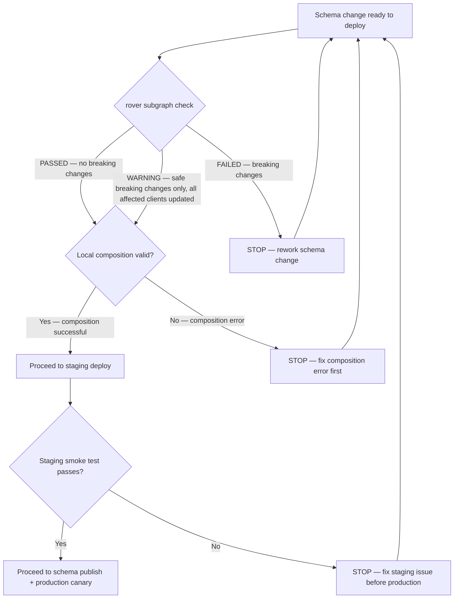

# 02 — Subgraph Deployment Runbook (with Schema Change)

> **Purpose**
> Step-by-step procedure for deploying a subgraph update that includes a schema change. Covers pre-deployment schema check, local composition validation, staging smoke test, schema publish to the registry, production canary rollout, 15-minute monitoring window, and rollback. This runbook is distinct from a code-only subgraph deploy because schema changes must be validated against the full supergraph before deployment. Written for subgraph team engineers and platform SREs.

---

## Trigger Conditions

Execute this runbook when:

- A subgraph deployment includes changes to `schema.graphql` (field additions, type changes, directive changes)
- A subgraph deployment includes changes to `@key`, `@external`, `@provides`, or `@requires` directives
- A subgraph deployment deprecates or removes a field

**Not required for:** code-only changes (resolver logic, DataLoader changes, database queries) where `schema.graphql` is unchanged. For those, follow your standard deployment pipeline without this runbook.

---

## Pre-Requisites

```
[ ] Common environment variables set (see 32-production-runbooks/README.md)
[ ] Rover CLI authenticated: rover config auth --profile prod
[ ] Schema registry access confirmed (GraphOS or Hive)
[ ] Target subgraph name and service URL known:
    export SUBGRAPH_NAME="products"
    export SUBGRAPH_SCHEMA="./schema.graphql"
    export SUBGRAPH_URL="https://products-subgraph.internal.example.com/graphql"
[ ] Current schema saved locally as baseline for rollback:
    rover subgraph fetch $GRAPH_REF --name $SUBGRAPH_NAME > /tmp/schema-baseline.graphql
```

---

## Phase 0: Pre-Deployment Schema Validation

### Step 1: Run Schema Check Against the Registry

The schema check validates that the proposed schema change does not break any known client operations. This must be run against the production variant of the registry.

```bash
# GraphOS (Apollo Studio)
rover subgraph check $GRAPH_REF \
  --schema $SUBGRAPH_SCHEMA \
  --name $SUBGRAPH_NAME \
  --format json | jq '{
    result: .data.service.checkSchemaJobCreatedByURL.result,
    changes: .data.service.checkSchemaJobCreatedByURL.schemaComposition.compositionSuccess
  }'

# Example GRAPH_REF format: my-graph@prod
# Set via: export GRAPH_REF="my-enterprise-graph@prod"

# Expected output for a safe schema change:
# {
#   "result": "PASSED",
#   "changes": true
# }

# If using Hive:
hive schema:check \
  --service $SUBGRAPH_NAME \
  --file $SUBGRAPH_SCHEMA

# Exit code 0 = safe. Exit code 1 = breaking changes detected.
```

If `rover subgraph check` returns **breaking changes**:

```
STOP. Do not proceed.
File a ticket describing why the breaking change is necessary.
Options:
  A. Refactor to a non-breaking change (add new field, keep old field as @deprecated)
  B. Follow the deprecation process in docs/09-schema-governance/
  C. Coordinate a simultaneous client + server release (requires schema incident runbook)
```

### Step 2: Validate Supergraph Composition Locally

Even if the schema check passes, validate that the full supergraph still composes with the new schema:

```bash
# Update supergraph.yaml to point to the new local schema file
# (temporarily, for validation only)
cp supergraph.yaml /tmp/supergraph-validate.yaml

# In /tmp/supergraph-validate.yaml, change the products schema to local:
# subgraphs:
#   products:
#     routing_url: ...
#     schema:
#       file: ./schema.graphql  ← point to local file instead of registry

rover supergraph compose \
  --config /tmp/supergraph-validate.yaml \
  --output /tmp/supergraph-test-composed.graphql

echo "Composition exit code: $?"
# Expected: 0

# Confirm the composed schema is valid and non-empty
wc -c /tmp/supergraph-test-composed.graphql
# Expected: > 1000 characters

echo "Local composition: PASSED"
```

---

## Go / No-Go Decision Tree (Pre-Deployment)



---

## Phase 1: Staging Deployment and Smoke Test

### Step 3: Deploy the Updated Subgraph to Staging

```bash
# Apply the new subgraph image to staging
# This updates the Kubernetes deployment in the staging namespace.
# Method depends on your GitOps tool. Example with Helm:

helm upgrade $SUBGRAPH_NAME helm/subgraphs/$SUBGRAPH_NAME \
  --namespace $STAGING_NAMESPACE \
  --set image.tag="${NEW_IMAGE_TAG}" \
  --wait \
  --timeout 5m

# Verify the new pods are running
kubectl rollout status deployment/$SUBGRAPH_NAME -n $STAGING_NAMESPACE --timeout=5m
kubectl get pods -n $STAGING_NAMESPACE -l app=$SUBGRAPH_NAME
```

### Step 4: Publish Schema to Staging Variant in Registry

```bash
# Publish the new schema to the staging variant of the registry
# This allows the staging router to pick up the schema change

rover subgraph publish "${GRAPH_REF%-*}@staging" \
  --schema $SUBGRAPH_SCHEMA \
  --name $SUBGRAPH_NAME \
  --routing-url $SUBGRAPH_STAGING_URL

# Wait for the router to pick up the new schema (up to 60 seconds)
sleep 30

# Confirm the staging router has reloaded the schema
curl -sf "https://graphql-staging.internal.example.com/graphql" \
  -X POST -H "Content-Type: application/json" \
  -d '{"query": "{ __typename }"}' | jq .
```

### Step 5: Run Representative Operations in Staging

Test operations that exercise the changed fields or types:

```bash
STAGING_URL="https://graphql-staging.internal.example.com/graphql"

# If a field was ADDED — verify it returns data (not null):
curl -sf -X POST "$STAGING_URL" \
  -H "Content-Type: application/json" \
  -d '{
    "operationName": "GetProductWithNewField",
    "query": "query GetProductWithNewField($id: ID!) { product(id: $id) { id name newField } }",
    "variables": {"id": "prod-123"}
  }' | jq '.data.product.newField'
# Expected: non-null value

# If a field was DEPRECATED — verify the old field still works (backward compatibility):
curl -sf -X POST "$STAGING_URL" \
  -H "Content-Type: application/json" \
  -d '{
    "operationName": "GetProductLegacyField",
    "query": "query GetProductLegacyField($id: ID!) { product(id: $id) { id oldField } }",
    "variables": {"id": "prod-123"}
  }' | jq '.data.product.oldField'
# Expected: non-null value (deprecated fields must continue to return data)

# Run a full representative smoke test (use your actual operations):
for operation in GetProductPage SearchProducts GetProductsByCategory; do
  result=$(curl -sf -X POST "$STAGING_URL" \
    -H "Content-Type: application/json" \
    -d "{\"operationName\": \"$operation\", \"query\": \"query $operation { __typename }\"}" 2>&1)
  errors=$(echo "$result" | jq '.errors // empty')
  if [ -n "$errors" ]; then
    echo "FAIL: $operation returned errors: $errors"
  else
    echo "PASS: $operation"
  fi
done
```

---

## Phase 2: Schema Publish to Production Registry

**Important:** Publish the schema to the production registry BEFORE deploying the new subgraph image to production. The router fetches schema updates from the registry independently of the Kubernetes deployment. Publishing first ensures the router receives the schema before any traffic hits resolvers that depend on it.

### Step 6: Publish Schema to Production Registry

```bash
# Publish to the production variant
rover subgraph publish $GRAPH_REF \
  --schema $SUBGRAPH_SCHEMA \
  --name $SUBGRAPH_NAME \
  --routing-url $SUBGRAPH_URL

# Expected output:
# The 'products' subgraph for the 'my-enterprise-graph@prod' graph was updated
# A new supergraph was composed and published

# Verify the schema was published and composition succeeded
rover subgraph list $GRAPH_REF | grep $SUBGRAPH_NAME
# Should show the updated timestamp

echo "Schema published to production registry: $(date -u)"
```

### Step 7: Verify the Router Picked Up the New Schema

```bash
# Wait for the router to poll the registry (typically every 30 seconds)
sleep 60

PROD_URL="https://graphql.internal.example.com/graphql"

# Verify the new field appears in introspection (if added)
curl -sf -X POST "$PROD_URL" \
  -H "Content-Type: application/json" \
  -d '{"query": "{ __schema { types { name fields { name } } } }"}' \
  | jq '.data.__schema.types[] | select(.name == "Product") | .fields[].name' \
  | grep "newField"
# Expected: "newField" appears in the output

echo "Router has loaded the new schema: confirmed"
```

---

## Phase 3: Production Canary Deployment (10%)

### Step 8: Deploy Canary to Production

```bash
# Deploy the new subgraph image with a canary rollout
# Configure HPA traffic weight via Helm values:

helm upgrade $SUBGRAPH_NAME helm/subgraphs/$SUBGRAPH_NAME \
  --namespace $NAMESPACE \
  --set image.tag="${NEW_IMAGE_TAG}" \
  --set deployment.strategy.rollingUpdate.maxSurge=1 \
  --set deployment.strategy.rollingUpdate.maxUnavailable=0 \
  --wait=false

# Pause after the first pod is updated
# Watch until 1 new pod is Running
kubectl get pods -n $NAMESPACE -l app=$SUBGRAPH_NAME -w &
WATCH_PID=$!

# When you see 1 new pod in Running state (N+1 total pods):
kubectl rollout pause deployment/$SUBGRAPH_NAME -n $NAMESPACE
kill $WATCH_PID

# Confirm: should see N old pods + 1 new pod
kubectl get pods -n $NAMESPACE -l app=$SUBGRAPH_NAME \
  -o jsonpath='{range .items[*]}{.metadata.name}{"\t"}{.spec.containers[0].image}{"\n"}{end}'
```

### Step 9: Monitor the Canary — 15-Minute Window

Monitor these metrics in Grafana for 15 minutes:

**Entity resolution rate (critical for federated subgraphs):**
```promql
# Entity resolution success rate for this subgraph
sum(rate(apollo_router_subgraph_request_total{subgraph_name="products", status_code="200"}[5m]))
/
sum(rate(apollo_router_subgraph_request_total{subgraph_name="products"}[5m]))
```

**Subgraph error rate — must stay below 0.1%:**
```promql
sum(rate(apollo_router_subgraph_request_error_total{subgraph_name="products"}[5m]))
/
sum(rate(apollo_router_subgraph_requests_total{subgraph_name="products"}[5m]))
```

**p99 latency for operations that use this subgraph:**
```promql
histogram_quantile(0.99,
  sum by (le, operation_name) (
    rate(apollo_router_graphql_request_duration_seconds_bucket{
      operation_name=~"GetProductPage|SearchProducts|GetProductsByCategory"
    }[5m])
  )
)
```

**Error count for specifically affected operations:**
```promql
sum by (operation_name) (
  rate(apollo_router_graphql_error_total{
    error_type="complete",
    operation_name=~"GetProductPage|SearchProducts|GetProductsByCategory"
  }[5m])
)
```

### Step 10: Go / No-Go Decision After 15 Minutes

**Rollback threshold (ANY triggers rollback):**
- Error rate delta > 0.1% (error rate after canary - baseline > 0.001)
- Subgraph error rate > 0.5%
- p99 latency for affected operations > 1.2x baseline
- Any new `errors[]` entries in responses for previously-working operations
- Entity resolution errors appearing (check subgraph error logs)

**Go criteria (ALL must be true):**
```
[ ] Error rate within 0.1% of baseline
[ ] Subgraph error rate < 0.5%
[ ] p99 latency for affected operations within 20% of baseline
[ ] No new error types in Loki subgraph logs
[ ] Entity resolution rate stable
[ ] No PagerDuty alerts triggered
```

---

## Phase 4: Full Promotion or Rollback

### Step 11a: Full Promotion (Go decision)

```bash
# Resume the rollout to 100% of pods
kubectl rollout resume deployment/$SUBGRAPH_NAME -n $NAMESPACE

# Watch to completion
kubectl rollout status deployment/$SUBGRAPH_NAME -n $NAMESPACE --timeout=10m

# Verify all pods are at the new version
kubectl get pods -n $NAMESPACE -l app=$SUBGRAPH_NAME \
  -o jsonpath='{range .items[*]}{.metadata.name}{"\t"}{.spec.containers[0].image}{"\n"}{end}'
# All pods should show the new image tag

echo "Full rollout complete: $(date -u)"
```

### Step 11b: Rollback (No-Go decision)

If the canary fails, two actions are required: roll back the Kubernetes deployment AND republish the previous schema to the registry.

```bash
# Step 1: Roll back the Kubernetes deployment
helm rollback $SUBGRAPH_NAME -n $NAMESPACE --wait --timeout 5m

# Or if using kubectl:
kubectl rollout undo deployment/$SUBGRAPH_NAME -n $NAMESPACE
kubectl rollout status deployment/$SUBGRAPH_NAME -n $NAMESPACE --timeout=5m

# Step 2: Republish the previous schema to the production registry
# The baseline schema was saved in Step 0 pre-requisites
rover subgraph publish $GRAPH_REF \
  --schema /tmp/schema-baseline.graphql \
  --name $SUBGRAPH_NAME \
  --routing-url $SUBGRAPH_URL

# Verify error rate has returned to baseline
curl -s "https://prometheus.internal.example.com/api/v1/query" \
  --data-urlencode "query=sum(rate(apollo_router_subgraph_request_error_total{subgraph_name=\"$SUBGRAPH_NAME\"}[5m])) / sum(rate(apollo_router_subgraph_requests_total{subgraph_name=\"$SUBGRAPH_NAME\"}[5m]))" \
  | jq '.data.result[0].value[1]'
# Expected: back to baseline (< 0.001)

# Post rollback summary to #graphql-incidents
echo "Subgraph $SUBGRAPH_NAME rolled back. Schema republished. Reason: [reason]"
```

---

## Post-Deployment Confirmation

### Step 12: Schema Publish Confirmation

After a successful full promotion, verify the registry reflects the new schema:

```bash
# Confirm schema is published and router is using it
rover subgraph introspect $SUBGRAPH_URL | \
  diff - $SUBGRAPH_SCHEMA && echo "Schema matches deployed subgraph"

# Verify in registry
rover subgraph list $GRAPH_REF | grep $SUBGRAPH_NAME
# Should show today's timestamp
```

### Step 13: Record the Deployment

```
Deployment: $SUBGRAPH_NAME subgraph — schema change
Deployed by: @{your-name}
Time: {timestamp} UTC
Changes: {brief description of schema changes}
Schema check: PASSED (N changes, 0 breaking)
Canary window: 15 minutes — no anomalies

Pre/Post metrics for affected operations:
  Subgraph error rate: 0.02% → 0.02%
  p99 (GetProductPage): 280ms → 285ms

Schema published to: my-enterprise-graph@prod
```

---

## References and Related Topics

- [Rover CLI Documentation](https://www.apollographql.com/docs/rover/) — `subgraph check` and `subgraph publish`
- [09-schema-governance/README.md](../09-schema-governance/README.md) — Deprecation policy and schema change governance
- [10-schema-validation/README.md](../10-schema-validation/README.md) — Schema validation tooling
- [03-schema-incident-runbook.md](./03-schema-incident-runbook.md) — If a breaking change escapes to production
- [11-ci-cd-automation/README.md](../11-ci-cd-automation/README.md) — CI pipeline that runs schema checks automatically
- [14-observability/05-slos-and-alerting.md](../14-observability/05-slos-and-alerting.md) — SLO thresholds used in go/no-go decision
