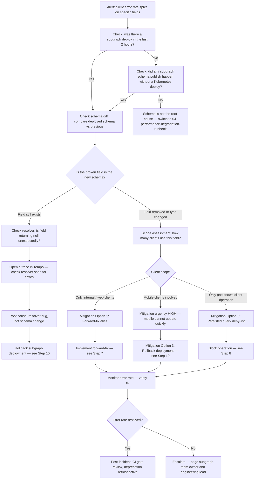

# 03 — Schema Incident Runbook: Breaking Change in Production

> **Purpose**
> Step-by-step response procedure for a breaking GraphQL schema change that has reached production and is causing client errors. Covers detection, triage, scope assessment, immediate mitigation options ranked by execution speed, client communication, and post-incident actions. Written for platform engineers and SREs responding to SEV1 or SEV2 schema incidents.

---

## Trigger Conditions

Execute this runbook when:

- Client error rate spikes on specific fields or operations (not all operations)
- `null` field reports appear in client error logs after a recent subgraph deployment
- Clients report `Cannot query field 'X' on type 'Y'` or `Field 'X' of type 'Y' must not be null` errors
- A schema check CI gate was bypassed or failed silently, and a breaking change reached production
- An automated alert fires: `GraphQLSubgraphHighErrorRate` or `GraphQLErrorRateCritical` correlated with a recent subgraph deploy

---

## Incident Declaration

When this runbook is triggered:

1. Open an incident in PagerDuty (if not already open from an alert)
2. Create a Slack channel: `#inc-YYYY-MM-DD-schema-{subgraph-name}`
3. Set severity: SEV1 if all operations are affected, SEV2 if one subgraph is affected
4. Post in the channel:
   ```
   @here Incident open: breaking schema change suspected in [subgraph].
   This runbook: https://runbooks.internal.example.com/graphql/schema-incident
   Incident commander: @{your-name}
   Status page: [update if user-visible]
   ```

---

## Decision Flowchart



---

## Phase 1: Detection and Triage

### Step 1: Confirm This Is a Schema-Related Error

Client error logs typically contain one of these GraphQL error messages for schema-breaking changes:

```
Cannot query field 'oldFieldName' on type 'Product'
Field 'price' of type 'Float!' must not be null
Unknown argument 'filter' on field 'Query.products'
Variable '$input' of type 'ProductInput!' used in position expecting type 'CreateProductInput!'
```

Check the router error logs:

```bash
# Loki query — schema validation errors (not resolver errors)
{app="apollo-router", namespace="graphql-platform"}
  |= "Cannot query field"
  | json
  | line_format "{{.timestamp}} | {{.operationName}} | {{.message}}"

# Also check for null field errors in partial responses
{app="apollo-router", namespace="graphql-platform"}
  |= "errors"
  |~ "null"
  | json
  | line_format "{{.timestamp}} | {{.operationName}} | {{.body}}"
```

### Step 2: Identify the Breaking Field Using Field Usage Data

```bash
# GraphOS field usage — check which fields are generating errors
# In Apollo Studio: Schema > Fields > sort by Error Rate

# Prometheus metric for field-level errors (if field tracking is enabled)
curl -s "https://prometheus.internal.example.com/api/v1/query" \
  --data-urlencode 'query=topk(10, sum by (field_name, type_name) (rate(apollo_router_field_error_total[5m])))' \
  | jq '.data.result[] | {field: .metric.field_name, type: .metric.type_name, rate: .value[1]}'

# Hive alternative — field-level analytics
hive operations:stats \
  --period 30m \
  --filter-error-rate "> 0"
```

### Step 3: Correlate With the Last Deployment

```bash
# Check Helm deployment history for the affected subgraph
helm history $SUBGRAPH_NAME -n $NAMESPACE | head -5

# Check Kubernetes deployment events
kubectl describe deployment $SUBGRAPH_NAME -n $NAMESPACE | grep -A 20 "Events:"

# Check Grafana deployment annotations — do errors start exactly at the deploy time?
# In Grafana: look for the vertical deployment annotation line on the error rate panel.
# If errors begin at the same timestamp as the deploy: this IS a deployment regression.

# Get the schema diff between the last two published versions
rover subgraph fetch $GRAPH_REF --name $SUBGRAPH_NAME > /tmp/current-schema.graphql
rover subgraph fetch "${GRAPH_REF}@previous" --name $SUBGRAPH_NAME > /tmp/previous-schema.graphql 2>/dev/null || \
  git show HEAD~1:schema.graphql > /tmp/previous-schema.graphql

diff /tmp/previous-schema.graphql /tmp/current-schema.graphql
```

---

## Phase 2: Scope Assessment

### Step 4: Determine Blast Radius

```bash
# How many operations are affected?
curl -s "https://prometheus.internal.example.com/api/v1/query" \
  --data-urlencode 'query=count by (operation_name) (rate(apollo_router_graphql_error_total{error_type="complete"}[5m]) > 0)' \
  | jq '.data.result | length'
# If this is 1-3 operations: targeted incident. If >10: wide-blast incident (SEV1).

# Which clients are sending the broken operations?
curl -s "https://prometheus.internal.example.com/api/v1/query" \
  --data-urlencode 'query=sum by (client_name, client_version, operation_name) (rate(apollo_router_graphql_error_total{error_type="complete"}[5m]) > 0)' \
  | jq '.data.result[] | {client: .metric.client_name, version: .metric.client_version, operation: .metric.operation_name}'
```

### Step 5: Assess Client Update Speed

This determines which mitigation path to take:

| Client Type | Update Speed | Recommended Mitigation |
|-------------|-------------|------------------------|
| Web SPA (React, Next.js) | Minutes to hours (redeploy) | Forward-fix or rollback |
| Native mobile (iOS, Android) | Days to weeks (App Store review) | Forward-fix REQUIRED — rollback if not possible |
| Desktop app | Similar to mobile | Forward-fix REQUIRED |
| Internal service | Minutes (you control it) | Rollback or coordinate immediate client update |
| Partner API client | Unknown — contact required | Rollback + client communication |

```bash
# Count affected mobile client versions (high urgency indicator)
curl -s "https://prometheus.internal.example.com/api/v1/query" \
  --data-urlencode 'query=sum by (client_name) (rate(apollo_router_graphql_error_total{error_type="complete"}[5m]) > 0)' \
  | jq '.data.result[] | select(.metric.client_name | test("ios|android|mobile")) | .metric.client_name'
# If any mobile clients appear: mitigation urgency is HIGH
```

---

## Phase 3: Immediate Mitigation

### Mitigation Option 1 (Fastest — Schema Fix): Forward-Fix Alias

A forward-fix adds the old field name back to the schema as an alias pointing to the new field. This is the fastest path when the field was renamed but not removed entirely.

**When to use:** Field was renamed (`oldName` → `newName`). Old resolvers still work. Clients querying `oldName` get null because the field no longer exists in the schema.

**Estimated time to implement:** 15–30 minutes

```graphql
# Before (breaking): oldPrice removed, newPrice added
type Product {
  id: ID!
  newPrice: Float!   # Renamed from oldPrice
}

# Forward-fix: add oldPrice back as a deprecated alias
type Product {
  id: ID!
  newPrice: Float!
  oldPrice: Float! @deprecated(reason: "Use newPrice instead")
    # Resolver for oldPrice returns the same value as newPrice
}
```

```typescript
// Resolver implementation for the deprecated alias
const resolvers = {
  Product: {
    // New canonical field
    newPrice: (product) => product.price,
    // Forward-fix alias — returns same data, signals to clients to migrate
    oldPrice: (product) => product.price,
  },
};
```

Deploy the forward-fix to production using the standard subgraph deployment runbook (abbreviated — no canary needed for an additive-only schema change). Verify the error rate drops within 5 minutes.

### Mitigation Option 2 (Fast — Traffic Control): Persisted Query Deny-List

If the breaking operation is a known, named operation sent by a specific client, block it at the router level before it reaches the subgraph. This stops the error from propagating while you work on a proper fix.

**When to use:** The failing operation is known by name, sent by one client, and you can identify it from logs.

**Estimated time to implement:** 5–10 minutes

```yaml
# router.yaml — add the operation to the deny list
persisted_queries:
  safelist:
    enabled: true
    require_id: false
  # OR — if using operation deny-list:

# Apollo Router operation limits (coprocessor-based deny)
# Add to coprocessor configuration or use Router's traffic shaping:
traffic_shaping:
  router:
    # Reject the specific operation by name
    # (requires Router v1.45+ or a custom coprocessor)
```

For an immediate block without a router config change, use the emergency operation deny via the management API if your router version supports it, or route the client to a maintenance page via your load balancer.

```bash
# Alternative: scale down the affected client's traffic at the load balancer level
# (if the client is an internal service you control)
kubectl scale deployment $CLIENT_DEPLOYMENT --replicas=0 -n $CLIENT_NAMESPACE
# This stops the client from sending the failing operation
# Use only for internal clients — never for external/user-facing clients
```

### Mitigation Option 3 (Reliable — Full Rollback): Revert the Subgraph Deployment

The safest and most complete mitigation when options 1 and 2 are not feasible or not sufficient.

**When to use:** Multiple operations are broken, field cannot be forward-fixed, or mobile clients are affected and a forward-fix would take > 30 minutes.

**Estimated time to implement:** 5–10 minutes

```bash
# Step 1: Roll back the Kubernetes deployment
helm rollback $SUBGRAPH_NAME -n $NAMESPACE --wait --timeout 5m
# OR
kubectl rollout undo deployment/$SUBGRAPH_NAME -n $NAMESPACE
kubectl rollout status deployment/$SUBGRAPH_NAME -n $NAMESPACE

# Step 2: Republish the previous (working) schema to the registry
rover subgraph publish $GRAPH_REF \
  --schema /tmp/schema-baseline.graphql \
  --name $SUBGRAPH_NAME \
  --routing-url $SUBGRAPH_URL

# Step 3: Wait for the router to reload the schema (30-60 seconds)
sleep 60

# Step 4: Verify error rate has dropped to baseline
curl -s "https://prometheus.internal.example.com/api/v1/query" \
  --data-urlencode "query=sum(rate(apollo_router_graphql_error_total{error_type=\"complete\"}[5m])) / sum(rate(apollo_router_graphql_requests_total[5m]))" \
  | jq '.data.result[0].value[1]'
# Expected: near zero (< 0.001)
```

---

## Phase 4: Client Communication

### Step 11: Internal Communication

Post immediately in #graphql-incidents:

```
[SCHEMA INCIDENT] Breaking change in products subgraph

Issue: Field 'oldPrice' removed in latest deploy. Clients querying oldPrice receive null.
Affected clients: iOS app (v3.2.x and below), Web checkout flow
Error rate: 2.3% → mitigation in progress

Mitigation: [Rollback | Forward-fix | Block operation] — ETA {time}
Status: MITIGATING

Subgraph team: @products-team — please join this channel
```

### Step 12: Customer / Status Page Communication

For user-visible errors (SEV1):

```
Incident: Partial data unavailable for some product pages
Status: Investigating
Started: {timestamp}
Impact: Some users may see missing pricing information on product pages.
         Checkout and ordering are unaffected.
Next update: In 15 minutes
```

Do NOT disclose schema internals in external communications. Use business-language descriptions.

---

## Phase 5: Post-Incident

### Step 13: Mandatory Schema Check CI Gate Review

After the incident is resolved:

```bash
# Verify the CI schema check gate is enabled and blocking breaking changes
# Check your CI configuration (e.g., .github/workflows/schema-check.yml):
cat .github/workflows/schema-check.yml | grep -A 5 "rover subgraph check"

# Determine how the breaking change bypassed the gate:
# Common bypass paths:
#   A. Schema check was skipped (--ignore-existing-errors flag used)
#   B. Schema check was run against the wrong graph ref (staging vs prod)
#   C. The breaking change was introduced in a non-schema file (resolver returned wrong type)
#   D. The CI gate was present but not required (branch protection not enforced)
```

### Step 14: Deprecation Period Retrospective

If the field was renamed without a deprecation period:

```
Questions for the retrospective:
1. Was @deprecated added to the old field before it was removed?
2. Was there a migration period (minimum 30 days per schema governance policy)?
3. Were client teams notified of the deprecation?
4. Was field usage checked before removal (were there any active queries using the field)?
5. Why did the schema check pass if clients were using the field?
```

Review the schema governance policy at `docs/09-schema-governance/` and file an action item to enforce the deprecation process in CI.

---

## Verification Checklist — Incident Resolved

```
[ ] Error rate returned to pre-incident baseline
[ ] No new errors in the last 15 minutes on previously-affected operations
[ ] Schema registry shows the correct schema (either rollback schema or forward-fix)
[ ] Router has reloaded the corrected schema
[ ] Client teams have confirmed their operations are working
[ ] Status page updated to "Resolved"
[ ] Incident closed in PagerDuty
[ ] Post-mortem scheduled if error budget consumption > 20%
[ ] Action item filed: enforce schema deprecation period in CI
[ ] Action item filed: add field usage check to schema removal workflow
```

---

## References and Related Topics

- [02-subgraph-deployment-runbook.md](./02-subgraph-deployment-runbook.md) — Safe subgraph deployment procedure (prevents this incident)
- [09-schema-governance/README.md](../09-schema-governance/README.md) — Deprecation policy that prevents breaking changes
- [10-schema-validation/README.md](../10-schema-validation/README.md) — Schema validation tooling
- [11-ci-cd-automation/README.md](../11-ci-cd-automation/README.md) — CI gates that enforce schema check
- [33-incident-management/04-post-mortem-process.md](../33-incident-management/04-post-mortem-process.md) — Post-mortem template
- [Rover subgraph check](https://www.apollographql.com/docs/rover/commands/subgraphs/#subgraph-check) — CLI reference
- [Apollo GraphOS Field Usage](https://www.apollographql.com/docs/graphos/metrics/field-usage/) — Identifying clients using deprecated fields
