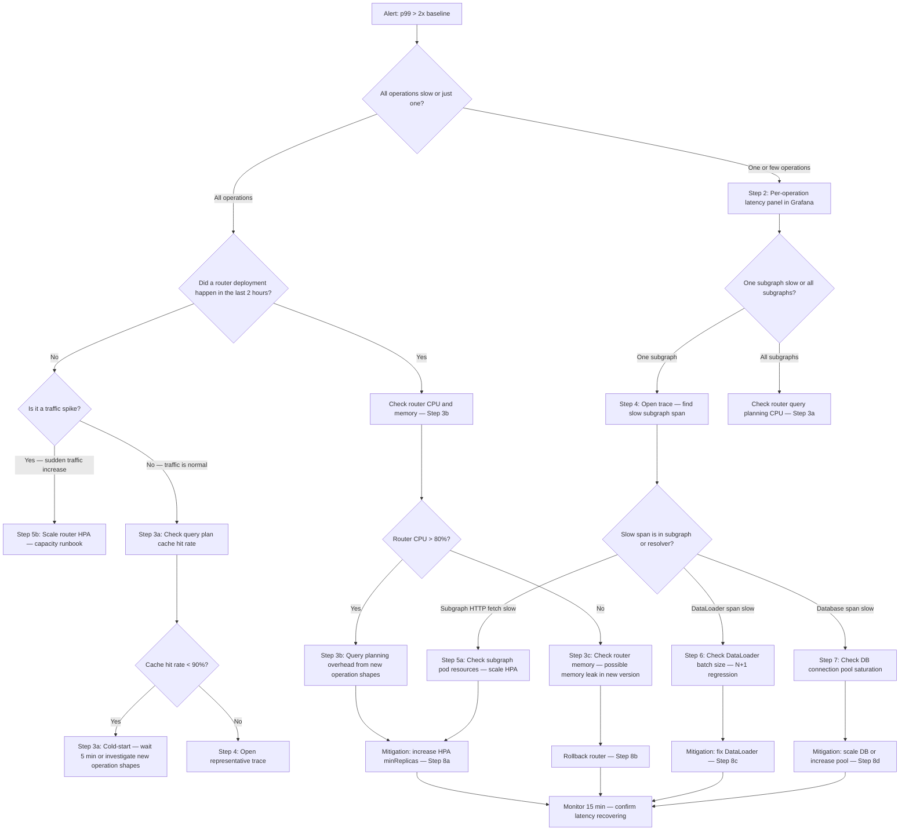

# 04 — Performance Degradation Runbook

> **Purpose**
> Step-by-step diagnosis and resolution procedure for GraphQL latency degradation. Covers alert interpretation, scope isolation (all operations vs one, all subgraphs vs one), deployment correlation, trace-based root cause analysis, DataLoader N+1 regression detection, database connection saturation diagnosis, and targeted mitigation by root cause. Written for on-call engineers responding to latency SLO burn rate alerts.

---

## Trigger Conditions

Execute this runbook when:

- PagerDuty alert fires: `GraphQLInteractiveLatencyCritical` or `GraphQLInteractiveLatencyHigh`
- p99 latency > 2x baseline for more than 5 minutes (observed in Grafana)
- User reports of slow page loads that correlate with GraphQL operation timing
- SLO burn rate > 6x for the interactive latency SLO (see `docs/14-observability/05-slos-and-alerting.md`)

**Detection PromQL (baseline comparison):**
```promql
# Alert fires when p99 is > 2x the 7-day median
histogram_quantile(0.99,
  sum by (le) (rate(apollo_router_graphql_request_duration_seconds_bucket[5m]))
)
>
2 * quantile_over_time(0.5,
  histogram_quantile(0.99,
    sum by (le) (rate(apollo_router_graphql_request_duration_seconds_bucket[5m]))
  )[7d:1h]
)
```

---

## Incident Setup

```bash
# Confirm the alert is real — check current p99
curl -s "https://prometheus.internal.example.com/api/v1/query" \
  --data-urlencode 'query=histogram_quantile(0.99, sum by (le) (rate(apollo_router_graphql_request_duration_seconds_bucket[5m]))) * 1000' \
  | jq '.data.result[0].value[1]'
# If > 1000ms (1 second) for interactive queries: incident is real

# Open Grafana: https://grafana.internal.example.com/d/graphql-platform
# Set time range: last 2 hours (to capture the start of the degradation)
# Enable deployment annotations (should be on by default)
```

---

## Diagnostic Flowchart



---

## Step 1: Identify Scope — All Operations or One?

**Use the per-operation latency panel in Grafana.** This is the most important first diagnostic step.

```promql
# p99 latency broken down by operation name — sorted by slowest
topk(10,
  histogram_quantile(0.99,
    sum by (le, operation_name) (
      rate(apollo_router_graphql_request_duration_seconds_bucket[5m])
    )
  )
) * 1000
# Units: milliseconds
# Look for: is the list dominated by one operation, or are all operations slow?
```

**Interpretation:**

| Pattern | Meaning | Go to |
|---------|---------|-------|
| One operation > 10x baseline | Operation-specific issue | Step 2 |
| All interactive operations > 2x baseline | Platform-wide issue | Step 3a |
| Only bulk/export operations slow | Expected — check SLO category | Verify SLO scope |
| Random mix of operations slow | Possible infrastructure issue | Step 3a |

---

## Step 2: Isolate to One Subgraph or Multiple?

If one operation is slow, determine which subgraph is responsible using subgraph latency breakdown:

```promql
# Per-subgraph latency for requests from the slow operation
# (requires operation_name to be forwarded to subgraph as x-operation-name header)
histogram_quantile(0.99,
  sum by (le, subgraph_name) (
    rate(apollo_router_subgraph_request_duration_seconds_bucket[5m])
  )
) * 1000
# Look for: which subgraph is at the right of the distribution
```

```bash
# Alternatively: use Grafana's subgraph latency breakdown panel
# Navigate to: GraphQL Platform > Subgraph Performance > p99 by Subgraph
# Set operation filter to the slow operation name
```

---

## Step 3a: Check Query Plan Cache Hit Rate

A cold query plan cache means the router is re-planning every incoming query, which is CPU-intensive and adds 20–200ms per request depending on operation complexity.

```promql
# Plan cache hit rate — should be > 90% at steady state
job:apollo_router_plan_cache_hit_ratio:5m

# Plan cache total entries (to confirm the cache is being populated)
apollo_router_cache_size{kind="query planner"}
```

**Normal pattern:** After a router restart or deployment, cache hit rate starts at 0% and climbs to > 90% within 3–5 minutes as operations are re-planned. If hit rate stays below 90% after 10 minutes, this indicates a problem:

- Clients are sending highly variable operations (dynamic query generation without operation names)
- The persisted query list is not configured, causing full planning on every request
- Cache eviction is too aggressive (check `queryPlannerConfig.cache.capacity` in router.yaml)

**Mitigation for cache cold-start:** Wait 5 minutes. If not recovering, check whether a new class of operations was introduced by a client deployment.

---

## Step 3b: Check Router CPU and Memory After Deployment

```promql
# Router CPU usage (query planning is CPU-bound)
rate(process_cpu_seconds_total{app="apollo-router"}[5m])

# Router memory per pod
process_resident_memory_bytes{app="apollo-router"}

# Number of router pods vs HPA target
kube_deployment_status_replicas_available{deployment="apollo-router"}
kube_horizontalpodautoscaler_status_desired_replicas{horizontalpodautoscaler="apollo-router"}
```

```bash
# Check if HPA is scaling — is it hitting maxReplicas?
kubectl get hpa apollo-router -n $NAMESPACE
# Look at: TARGETS column (current CPU % / target CPU %)
# If current >> target: router is CPU-saturated, needs more replicas

# Check router pod CPU via kubectl top
kubectl top pods -n $NAMESPACE -l app=apollo-router --sort-by=cpu
```

---

## Step 4: Open a Representative Trace in Tempo

Find a slow trace for the affected operation using trace exemplars from Prometheus:

```promql
# Trace exemplar query — returns trace IDs for p99+ requests
histogram_quantile(0.99,
  sum by (le, traceID) (
    rate(apollo_router_graphql_request_duration_seconds_bucket{
      operation_name="GetProductPage"
    }[5m])
  )
)
```

In Grafana, click on a data point in the latency panel and select "View exemplar" to jump directly to a trace in Tempo.

**What to look for in the trace:**

```
Trace structure for a federated query:
├── apollo-router: plan_query          ← query planning (should be < 10ms after cache warm)
├── apollo-router: execute_query       ← total execution time
│   ├── products-subgraph: fetch       ← subgraph HTTP fetch
│   │   ├── resolver: Product.price    ← individual resolver spans
│   │   └── dataloader: PriceLoader    ← DataLoader batch (look for batch_size label)
│   └── inventory-subgraph: fetch
│       └── resolver: Product.stock
```

**Slow span identification:**

| Slow Span | Root Cause | Step |
|-----------|-----------|------|
| `plan_query` > 50ms | Cache miss or complex query | Step 3a |
| `{subgraph}-fetch` > 500ms | Subgraph saturation or cold pods | Step 5a |
| `resolver: X` > 100ms per call | N+1 pattern (many resolver calls) | Step 6 |
| `dataloader: X` batch_size = 1 | DataLoader not batching — N+1 regression | Step 6 |
| `db: query` > 200ms | Database slowness | Step 7 |

---

## Step 5a: Diagnose Subgraph Saturation

If the trace shows the subgraph HTTP fetch is slow (not the resolver/DataLoader):

```bash
# Check subgraph pod count vs HPA limit
kubectl get hpa $SUBGRAPH_NAME -n $NAMESPACE
# If TARGETS shows CPU near maxReplicas limit: subgraph is CPU-saturated

# Check pod CPU and memory
kubectl top pods -n $NAMESPACE -l app=$SUBGRAPH_NAME --sort-by=cpu

# Check subgraph HTTP request queue (if using istio sidecar)
kubectl exec -n $NAMESPACE deployment/$SUBGRAPH_NAME -- \
  curl -s localhost:15090/stats | grep "pending_requests"
```

**Mitigation: Scale the subgraph HPA minimum replicas:**

```bash
# Immediate scaling — increase minReplicas directly
kubectl patch hpa $SUBGRAPH_NAME -n $NAMESPACE \
  --patch '{"spec": {"minReplicas": 10}}'
# (replace 10 with appropriate value based on traffic analysis)

# Verify new pods are coming up
kubectl get pods -n $NAMESPACE -l app=$SUBGRAPH_NAME -w
```

---

## Step 6: Check DataLoader Batch Size — N+1 Regression

A DataLoader N+1 regression occurs when a code change breaks the DataLoader batching mechanism, causing 1 database query per entity instead of 1 query for all entities.

```promql
# DataLoader batch size p5 — should be >> 1 at normal traffic
# p5 (not p50) catches cases where most batches are fine but some are broken
histogram_quantile(0.05,
  sum by (le, loader_name, subgraph_name) (
    rate(graphql_dataloader_batch_size_bucket[5m])
  )
)
```

**N+1 regression signature:** batch size p5 drops from a historical value (e.g., 20) to 1 or 2.

```promql
# Compare current batch size to 1-hour ago
histogram_quantile(0.05,
  sum by (le, loader_name) (rate(graphql_dataloader_batch_size_bucket[5m]))
)
< 0.3 *
histogram_quantile(0.05,
  sum by (le, loader_name) (rate(graphql_dataloader_batch_size_bucket[5m] offset 1h))
)
# If this returns any results: DataLoader batch size has dropped > 70% — N+1 regression
```

**Identifying the regression:**

```bash
# Find the subgraph deployment that broke DataLoader batching
# Check if the batch size drop coincides with a deployment
kubectl describe deployment $SUBGRAPH_NAME -n $NAMESPACE | grep "changed"

# Look at the code change that affected the DataLoader
# Common causes:
#   - DataLoader key function changed (now returns different key types — not matching)
#   - DataLoader batch function accidentally called outside the request context
#   - await inside a DataLoader batch function that breaks Promise.all batching
#   - Missing dataloader.clear() calls causing stale key conflicts
```

**Mitigation for DataLoader N+1 regression:**

1. Rollback the subgraph deployment immediately (using `helm rollback`).
2. Fix the DataLoader regression in the code.
3. Redeploy using the standard subgraph deployment runbook.

---

## Step 7: Check Database Connection Pool Saturation

A fully saturated connection pool causes queries to queue behind waiting connections, causing latency to multiply linearly with queue depth.

```promql
# Connection pool waiting gauge (custom metric from subgraph)
# This requires the subgraph to emit connection pool metrics (pg_stat_activity for PostgreSQL)
graphql_db_connection_pool_waiting{subgraph_name="products"}

# If this metric is not available, check via database directly:
```

```bash
# PostgreSQL: check waiting connections
kubectl exec -n $NAMESPACE deployment/$SUBGRAPH_NAME -- \
  psql $DATABASE_URL -c \
  "SELECT count(*) as waiting FROM pg_stat_activity WHERE wait_event_type = 'Lock';"

# PgBouncer: check pool saturation
kubectl exec -n $NAMESPACE deployment/pgbouncer -- \
  psql -p 5432 pgbouncer -c "SHOW POOLS;"
# Look at: cl_waiting column — waiting clients = pool saturation

# Check connection pool config in the subgraph
kubectl get configmap $SUBGRAPH_NAME-config -n $NAMESPACE -o yaml | grep -i pool
```

**Mitigation for connection pool saturation:**

```bash
# Option 1: Scale the database read replicas (for read-heavy workloads)
# (via Terraform — requires terraform plan/apply with new replica count)

# Option 2: Temporarily increase PgBouncer pool size
kubectl set env deployment/pgbouncer \
  -n $NAMESPACE \
  PGBOUNCER_MAX_CLIENT_CONN=500 \
  PGBOUNCER_DEFAULT_POOL_SIZE=50
# Note: This is a temporary measure — proper fix is in Terraform

# Option 3: Kill the most expensive queries that are holding connections
kubectl exec -n $NAMESPACE deployment/$SUBGRAPH_NAME -- \
  psql $DATABASE_URL -c \
  "SELECT pg_terminate_backend(pid) FROM pg_stat_activity
   WHERE duration > interval '30 seconds'
   AND state = 'active'
   AND query NOT LIKE '%pg_stat_activity%';"
```

---

## Step 8: Mitigation Summary by Root Cause

| Root Cause | PromQL Signature | Mitigation | ETA |
|-----------|-----------------|------------|-----|
| Router CPU saturation | `rate(process_cpu_seconds_total{app="apollo-router"}[5m]) > 0.8` | Increase router HPA minReplicas | 2–5 min |
| Router memory leak (new version) | `process_resident_memory_bytes{app="apollo-router"}` growing unbounded | Rollback router | 5 min |
| Query plan cache cold-start | `job:apollo_router_plan_cache_hit_ratio:5m < 0.5` | Wait 5 min; investigate variable operations | 5 min |
| Subgraph pod saturation | `kube_hpa_status_current_replicas >= kube_hpa_spec_max_replicas` | Scale subgraph HPA maxReplicas | 2–5 min |
| DataLoader N+1 regression | batch_size p5 dropped > 70% from baseline | Rollback subgraph | 5 min |
| DB connection pool saturation | `graphql_db_connection_pool_waiting > 0` sustained | Scale replicas or increase pool | 5–15 min |
| Expensive operation without limit | top operation complexity spike | Kill operation via deny-list | 5 min |

---

## Escalation Criteria

Page the subgraph team owner when:

```
[ ] Root cause is isolated to a specific subgraph (trace confirms subgraph fetch is slow)
[ ] DataLoader N+1 regression is confirmed in their subgraph
[ ] Database connection pool saturation is in their subgraph's database
[ ] The degradation began with their subgraph's last deployment
```

Page the engineering lead when:

```
[ ] Latency degradation has lasted > 30 minutes with no clear root cause
[ ] Error budget burn rate > 14.4x for > 10 minutes (SLO will be exhausted in < 2 days)
[ ] The issue is correlated with external dependency failure (payment gateway, catalog API)
[ ] Multiple subgraphs are simultaneously degraded (suggests infrastructure issue)
```

---

## Verification Checklist — Performance Incident Resolved

```
[ ] p99 latency returned to within 20% of pre-incident baseline
[ ] SLO burn rate < 3x for the last 15 minutes
[ ] DataLoader batch size metrics back to baseline values (if N+1 was the cause)
[ ] Router HPA has stabilized (not still scaling)
[ ] Database connection pool wait time is zero
[ ] No new PagerDuty alerts triggered in the last 15 minutes
[ ] Root cause documented in incident channel
[ ] Post-mortem scheduled if burn rate was > 14.4x for > 15 minutes
```

---

## References and Related Topics

- [14-observability/02-distributed-tracing.md](../14-observability/02-distributed-tracing.md) — How to read trace spans and use exemplars
- [14-observability/05-slos-and-alerting.md](../14-observability/05-slos-and-alerting.md) — SLO burn rate alerts that trigger this runbook
- [05-capacity-scaling-runbook.md](./05-capacity-scaling-runbook.md) — When degradation is caused by capacity limits
- [04-resolvers-and-execution/README.md](../04-resolvers-and-execution/README.md) — DataLoader patterns and N+1 prevention
- [06-performance-and-scaling/README.md](../06-performance-and-scaling/README.md) — Query planning optimization and caching
- [33-incident-management/02-on-call-procedures.md](../33-incident-management/02-on-call-procedures.md) — Escalation procedures
- [Apollo Router Metrics Reference](https://www.apollographql.com/docs/router/configuration/telemetry/metrics/) — Full list of emitted metrics
