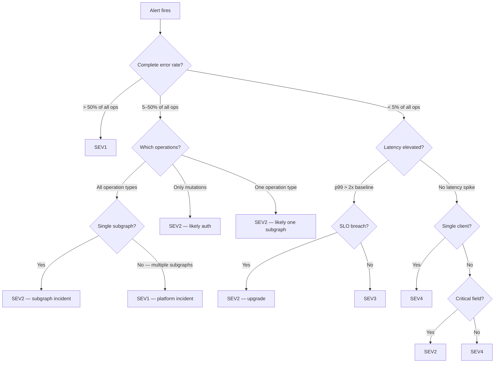

# 01 — GraphQL Incident Severity Classification

> **Purpose**
> This document defines the severity classification framework for GraphQL platform incidents. It provides concrete decision criteria for each severity level, a decision matrix for GraphQL-specific signals, rules for automatic SEV escalation based on SLO breach, and escalation matrices by severity. Written for on-call engineers, SREs, and incident commanders who must classify incidents quickly and consistently under pressure.

---

## Why Classification Matters

Severity classification determines response speed, communication protocols, and post-mortem requirements. Misclassifying an incident wastes responder time (over-classification) or delays resolution while customer impact grows (under-classification).

For GraphQL platforms, classification is harder than REST because:

1. A partial response failure (one subgraph down) looks identical to a complete failure at the HTTP layer — both return `HTTP 200`.
2. A latency regression may affect only a specific operation shape, not all traffic.
3. A schema composition failure blocks deployments but may not yet affect live traffic.
4. A DataLoader memory leak causes gradual degradation, not a step-function failure.

The classification framework must account for these properties.

---

## Severity Levels

### SEV1 — Complete API Unavailability

**Definition:** The GraphQL API is entirely unavailable or returning complete errors for all or nearly all operations.

**Criteria (any one sufficient):**
- Complete error rate > 50% across all operations for > 2 minutes
- Apollo Router process down (no `HTTP` responses on `/graphql`)
- All subgraphs returning errors simultaneously
- Error budget burn rate > 14.4x (budget exhausted in < 2 days)

**Business impact:** All clients — web, mobile, partner APIs — receive broken responses. Revenue impact begins within minutes for transactional systems.

**Example scenarios:**
- Router OOM kill loop — pods restart faster than they can warm up
- Router binary crash after a configuration change
- Network policy misconfiguration isolates router from all subgraphs
- Certificate expiry on the router ingress
- All subgraph service accounts expired simultaneously (auth misconfiguration)

**Response target:**
- Acknowledge: within 2 minutes
- Incident channel open: within 5 minutes
- Engineering lead notified: within 10 minutes
- Customer communication: within 20 minutes (if externally visible)
- Time-to-mitigation target: 30 minutes

---

### SEV2 — Partial Service Degradation

**Definition:** A meaningful portion of the GraphQL API is unavailable or degraded, but not all operations are affected.

**Criteria (any one sufficient):**
- Complete error rate > 5% for > 5 minutes
- One subgraph unavailable, affecting > 10% of all operations (operations that resolve fields from that subgraph)
- Authentication or authorization subsystem returning errors for > 5% of requests
- Mutation complete error rate > 1% for > 5 minutes
- Error budget burn rate > 6x (budget exhausted in < 5 days)

**Business impact:** A subset of features is broken. Users may see error states for specific pages, actions, or data types. Depends on which subgraph is affected.

**Example scenarios:**
- `orders` subgraph pod crash-looping — checkout and order history unavailable
- JWKS endpoint returning 503 — 100% of authenticated requests failing, but public operations continue
- `inventory` subgraph slow response — product pages loading without stock data
- Schema composition failure during deployment — no new schema version published, but existing version still serving

**Response target:**
- Acknowledge: within 5 minutes
- Incident channel open: within 10 minutes
- Subgraph team owner notified: within 15 minutes
- Time-to-mitigation target: 60 minutes

---

### SEV3 — Performance Degradation

**Definition:** The GraphQL API is responding correctly (no complete errors) but latency is significantly elevated.

**Criteria (any one sufficient):**
- p99 latency > 2x baseline for the affected operation category for > 10 minutes
- p95 latency > SLO threshold for > 15 minutes
- DataLoader batch size p5 drops below 2 for > 10 minutes (N+1 regression indicator)
- Error budget burn rate > 3x (budget draining — possible exhaustion in < 10 days)

**Business impact:** Degraded user experience. Pages load slowly. Interactive features feel broken but data is returned. No data loss.

**Example scenarios:**
- Unindexed database query in `products` subgraph after a schema change that added a new filter field
- N+1 regression — a code change removed DataLoader batching in `reviews` subgraph
- Query plan cache cold after a router deployment — 2-5 minutes of elevated latency
- High-complexity client query consuming disproportionate router CPU

**Response target:**
- Notify on-call: standard Slack alert (no page)
- Investigate: within 30 minutes
- Time-to-mitigation target: 4 hours (or next business day if no SLO breach)

---

### SEV4 — Cosmetic or Minor Issue

**Definition:** A narrow, low-impact issue affecting a small subset of users, non-critical fields, or a single client.

**Criteria:**
- Partial errors on non-critical fields (e.g., recommendation engine returning null)
- Single client affected (client bug, not platform bug)
- Validation errors from a specific client sending malformed queries
- Performance regression only in non-production environments

**Business impact:** Minimal. A small number of users see degraded features. No revenue impact, no data loss.

**Example scenarios:**
- `recommendedProducts` field returning null because recommendation service is in maintenance
- One mobile app version sending invalid operation names — validation errors
- Staging environment subgraph misconfigured — dev teams affected only
- Non-critical field permission check returning incorrect results for 0.01% of requests

**Response target:**
- File ticket in backlog
- No on-call required
- Resolve in next sprint

---

## Decision Matrix

Use this matrix to classify an incident based on the available GraphQL signals. Start at the top and work down.

```
┌─────────────────────────────────────────────────────────────────────────────┐
│                     GRAPHQL INCIDENT CLASSIFICATION MATRIX                  │
├──────────────────────────────────────┬──────────────────────────────────────┤
│           SIGNAL OBSERVED            │          CLASSIFICATION               │
├──────────────────────────────────────┼──────────────────────────────────────┤
│                                      │                                       │
│  All operations returning complete   │   → SEV1 immediately                 │
│  errors (data: null for >50% reqs)   │   Possible: router down, network     │
│                                      │   partition, all subgraphs failed     │
├──────────────────────────────────────┼──────────────────────────────────────┤
│                                      │                                       │
│  All operations returning complete   │   → SEV2 if <50% ops affected        │
│  errors for ONE operation type       │   Likely: auth system failure         │
│  (e.g., all mutations failing)       │   (mutations require auth)           │
│                                      │                                       │
├──────────────────────────────────────┼──────────────────────────────────────┤
│                                      │                                       │
│  Partial errors on a subset of       │   → SEV2 if >10% of ops affected     │
│  operations (subgraph_name present   │   → SEV4 if <10% of ops affected     │
│  in error path)                      │   Root cause: specific subgraph      │
│                                      │                                       │
├──────────────────────────────────────┼──────────────────────────────────────┤
│                                      │                                       │
│  Latency elevated (p99 > 2x)         │   → SEV3 (no complete errors)        │
│  No complete errors                  │   → Upgrade to SEV2 if SLO breach    │
│                                      │   confirmed                           │
│                                      │                                       │
├──────────────────────────────────────┼──────────────────────────────────────┤
│                                      │                                       │
│  Partial errors on non-critical      │   → SEV4                             │
│  fields OR single client affected    │   File ticket, no war room           │
│                                      │                                       │
├──────────────────────────────────────┼──────────────────────────────────────┤
│                                      │                                       │
│  Schema composition failure          │   → SEV2 if blocking deployments     │
│  (no live traffic impact yet)        │   → SEV3 if low urgency              │
│                                      │                                       │
└──────────────────────────────────────┴──────────────────────────────────────┘
```

### Decision Tree for Signal Disambiguation



---

## SLO Breach as Automatic SEV Trigger

SLO breach is an objective, metric-driven classification override. The following rules apply regardless of other signals:

| SLO Burn Rate | Automatic Minimum Severity |
|---------------|---------------------------|
| > 14.4x (1h window) | SEV1 — page immediately |
| > 6x (6h window) | SEV2 — page on-call |
| > 3x (1d window) | SEV3 — Slack notification |
| > 1x (3d window) | SEV4 — watch and investigate |

**Why automatic?** A burn rate of 14.4x means the 30-day error budget will be exhausted in 2 days at current consumption. This is a page-worthy event regardless of the error rate's absolute value — even if the current error rate is only 1.44% (14.4 × 0.1% budget).

**PromQL for burn rate:**
```promql
# Current 1-hour burn rate
job:graphql_error_budget_burn:1h

# Confirm with 5-minute window (prevents false positives)
job:graphql_error_budget_burn:5m
```

**Interaction with severity classification:**
- SLO breach can only *upgrade* severity, never downgrade it.
- A SEV4 ticket becomes SEV2 automatically if the error budget burn rate exceeds 6x during investigation.
- Alert rules in `docs/14-observability/05-slos-and-alerting.md` implement this logic in Prometheus.

---

## GraphQL-Specific Signal Reference

These signals are unique to GraphQL and must be checked before classifying an incident:

### Complete vs. Partial Error

```
Complete error:  { "data": null, "errors": [...] }
                 → The operation produced no data. Full failure.
                 → SEV1 or SEV2 depending on scope.

Partial error:   { "data": { "products": [...], "cart": null }, "errors": [...] }
                 → The operation produced some data. One field path failed.
                 → SEV2 if >10% of operations, SEV4 if cosmetic.
```

**How to detect in Prometheus:**
```promql
# Complete errors
apollo_router_graphql_error_total{error_type="complete"}

# Partial errors (field-level)
apollo_router_graphql_error_total{error_type="partial"}
```

### One Operation vs. All Operations

The scope of affected operations determines whether the incident is a subgraph issue (partial) or a platform issue (complete).

```promql
# Count of distinct operation names with non-zero error rates (5m window)
count(
  sum by (operation_name) (
    rate(apollo_router_graphql_error_total[5m])
  ) > 0
)
```

If this query returns 1–5 operation names, the blast radius is narrow (likely one subgraph). If it returns dozens or hundreds, the blast radius is broad (likely router or platform issue).

### One Subgraph vs. All Subgraphs

```promql
# Per-subgraph error rate
sum by (subgraph_name) (
  rate(apollo_router_subgraph_request_error_total[5m])
) > 0
```

If only one `subgraph_name` label appears, the incident is scoped to that subgraph. Page the subgraph team owner. If multiple subgraphs appear, escalate to platform team.

---

## Escalation Matrix by Severity

### SEV1 Escalation

```
T+0 min   Alert fires → PagerDuty pages primary on-call
T+2 min   Primary acknowledges OR auto-escalates to secondary
T+5 min   Secondary acknowledges OR escalates to engineering lead
T+10 min  Engineering lead joins — incident commander role
T+20 min  Customer success notified if external customer impact confirmed
T+30 min  VP Engineering notified if no mitigation in sight
T+60 min  External status page updated — even if no root cause yet

Key personnel:
  Primary on-call:        Receives first page
  Secondary on-call:      Backup if primary unavailable
  Engineering lead:       Incident commander for SEV1
  VP Engineering:         Informed if > 30 min unresolved
  Customer success lead:  Manages external communications
```

### SEV2 Escalation

```
T+0 min   Alert fires → PagerDuty pages primary on-call
T+5 min   Primary acknowledges
T+15 min  Subgraph team owner notified if subgraph identified
T+30 min  Engineering lead notified if no mitigation
T+60 min  SEV2 automatically escalates to SEV1 consideration
          (review burn rate — is budget still draining?)

Key personnel:
  Primary on-call:        Owns the incident
  Subgraph team owner:    Notified once subgraph identified
  Engineering lead:       Escalation target at T+30
```

### SEV3 Escalation

```
T+0 min   Slack alert fires in #graphql-incidents
T+30 min  On-call engineer investigates during business hours
T+4 hr    File ticket if no resolution identified
T+1 day   Engineering lead review if SLO budget consumed > 5%

No pages. No war room. No status page update.
Escalate to SEV2 if:
  - Error rate begins rising
  - SLO burn rate exceeds 6x
  - Latency affects > 10% of operations
```

### SEV4 Escalation

```
T+0 min   Engineer or monitoring system notices the issue
T+1 hr    Ticket filed in platform backlog
T+1 wk    Resolved in next sprint or at engineer discretion

No escalation. No on-call involvement unless engineer chooses.
Escalate to SEV3 if:
  - Issue affects more clients
  - Issue persists > 1 week without resolution
```

---

## Communication During an Incident

### Incident Channel Naming Convention

```
#inc-YYYYMMDD-{short-description}

Examples:
  #inc-20260516-router-oom
  #inc-20260516-orders-subgraph-timeout
  #inc-20260517-auth-outage
```

### Required Incident Channel Pins

Once an incident channel is open, immediately pin:
1. Incident severity and current status (one-liner, updated continuously)
2. Link to the Grafana SLO dashboard
3. Link to the relevant runbook
4. Names of incident commander and scribe

### Communication Frequency by Severity

| Severity | Internal Slack Update | Status Page Update | Customer Notification |
|----------|-----------------------|--------------------|-----------------------|
| SEV1 | Every 10 minutes | Every 15 minutes | As soon as confirmed external impact |
| SEV2 | Every 20 minutes | If external impact | At 30 minutes if unresolved |
| SEV3 | At start and resolution | No | No |
| SEV4 | Ticket only | No | No |

---

## Post-Incident Classification Review

After every SEV1 and SEV2 incident, review the classification accuracy:

- Was the initial severity correct?
- Did the incident get upgraded or downgraded mid-flight? Why?
- Was the escalation triggered at the right time?
- Did the affected operation scope match the initial assessment?

This review feeds into post-mortem action items for improving classification accuracy over time.

---

## Validation Checklist

```
[ ] Decision matrix accessible on-call wiki (not just this document)
[ ] All on-call engineers have read this document as part of on-call onboarding
[ ] PagerDuty escalation policy configured to match SEV1/SEV2 thresholds
[ ] Slack alerts include severity label for quick triage
[ ] PromQL queries for complete vs. partial error distinction are bookmarked
[ ] Burn rate thresholds in Prometheus match the automatic SEV triggers above
[ ] Subgraph team owner contact list is up to date (reviewed monthly)
[ ] Engineering lead on-call contact is in PagerDuty secondary escalation policy
```

---

## Related Topics

- [02-on-call-procedures.md](./02-on-call-procedures.md) — What to do in the first 5 minutes of an alert
- [03-incident-response-playbooks.md](./03-incident-response-playbooks.md) — Concrete playbooks by incident type
- [14-observability/05-slos-and-alerting.md](../14-observability/05-slos-and-alerting.md) — SLO definitions and burn rate alert rules
- [14-observability/03-metrics.md](../14-observability/03-metrics.md) — Full metric reference for incident diagnosis

## References

- [Google SRE Book — Handling Incidents](https://sre.google/sre-book/managing-incidents/)
- [PagerDuty Incident Response Guide](https://response.pagerduty.com/)
- [Apollo Router Error Handling](https://www.apollographql.com/docs/router/configuration/error-config/)
- [GraphQL Spec — Error Handling](https://spec.graphql.org/October2021/#sec-Errors)
