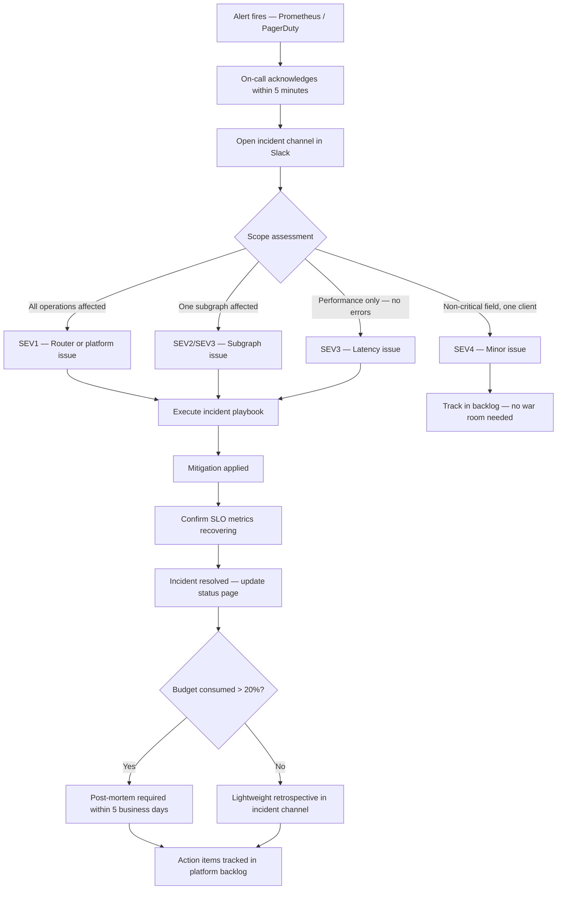

# Incident Management for GraphQL Platform Teams

> **Purpose**
> This section covers the full incident lifecycle for teams operating a federated GraphQL platform — from the moment an alert fires to the post-mortem action items that prevent recurrence. It addresses GraphQL-specific failure modes that standard incident frameworks do not account for: partial response failures, subgraph isolation, schema composition breakage, and DataLoader pathologies. Written for platform engineers, SREs, and engineering managers who own the on-call rotation and reliability posture.

---

## Why GraphQL Incident Management Is Different

Standard incident management frameworks assume that an outage is binary — the service is either up or down. GraphQL breaks this assumption in several ways:

**Partial failures are the default failure mode.** A federated GraphQL response can return `HTTP 200` with `data: { products: [...], cart: null }` and `errors: [{ message: "cart subgraph unavailable" }]`. Some clients received useful data; some received null. This is simultaneously a subgraph incident and a non-incident for other subgraph teams.

**A single endpoint conceals blast radius.** REST APIs fail per-route. GraphQL fails per-field, per-subgraph, or platform-wide — all through the same `POST /graphql` endpoint. Your incident scope detection process must be operation-aware, not URL-aware.

**Schema composition failures are build-time incidents.** A breaking schema change that passes local validation can fail at composition time and block all subgraph deployments — not just the offending team's deployment.

**The error signal is in the response body, not the status code.** An SRE who is only watching HTTP 5xx rates will miss 90% of GraphQL incidents. The `errors[]` array in the response body is the primary health signal.

---

## Section Map

```
33-incident-management/
├── README.md                        ← You are here — purpose and navigation
├── 01-incident-classification.md    ← Severity framework (SEV1–SEV4) and decision matrix
├── 02-on-call-procedures.md         ← First-response playbook and diagnostic sequence
├── 03-incident-response-playbooks.md ← Concrete playbooks for the 5 most common incidents
├── 04-post-mortem-process.md        ← Blameless post-mortem template, 5 Whys, action items
└── 05-chaos-engineering.md          ← Chaos experiment library and gameday procedure
```

---

## Incident Lifecycle Overview



---

## Quick Reference: Severity Levels

| Severity | Description | Example | Response Target |
|----------|-------------|---------|-----------------|
| SEV1 | Complete API unavailability | Router down, all operations returning errors | Page immediately, war room within 10 min |
| SEV2 | Partial service degradation | One subgraph down, >10% operations affected | Page, acknowledge within 5 min |
| SEV3 | Performance degradation | p99 > 2x baseline, no errors | Notify on-call, no page |
| SEV4 | Minor / cosmetic issue | Partial errors on non-critical fields, one client | File ticket, no on-call required |

---

## Quick Reference: GraphQL Error Types

Understanding which errors require incidents:

| Error Type | HTTP Status | `errors[]` Present | `data` Present | Severity Trigger |
|------------|-------------|-------------------|----------------|-----------------|
| Complete failure | 200 or 500 | Yes | null | SEV1 if all ops, SEV2 if one subgraph |
| Partial failure | 200 | Yes | Partial (some fields null) | SEV2 if >10% ops, SEV4 if cosmetic |
| Validation error | 200 | Yes | null | SEV4 — client error, not platform |
| Rate limit | 429 | Yes | null | SEV3 if sustained, SEV4 if isolated |
| Auth error | 401/403 | Yes | null | SEV2 if all users, SEV4 if one user |

---

## Key Metrics to Monitor During an Incident

These metrics, sourced from `docs/14-observability/03-metrics.md`, are the primary signals during incident response:

```promql
# Complete error rate across all operations (rising = SEV1 or SEV2 scope)
sum(rate(apollo_router_graphql_error_total{error_type="complete"}[5m]))
/ sum(rate(apollo_router_graphql_requests_total[5m]))

# Per-subgraph error rate (isolates SEV2 to one subgraph)
sum by (subgraph_name) (rate(apollo_router_subgraph_request_error_total[5m]))
/ sum by (subgraph_name) (rate(apollo_router_subgraph_requests_total[5m]))

# p99 latency by operation type
histogram_quantile(0.99,
  sum by (le, operation_name) (
    rate(apollo_router_graphql_request_duration_seconds_bucket[5m])
  )
)

# Error budget burn rate (is the incident consuming budget fast?)
job:graphql_error_budget_burn:1h
```

---

## On-Call Rotation Model

```
Primary on-call:    1-week rotation, paged for SEV1 and SEV2
Secondary on-call:  Escalation target if primary not available in 5 minutes
Subgraph team:      Notified when their subgraph is identified as root cause
Engineering lead:   Escalated for SEV1 incidents lasting > 30 minutes or
                    any incident with external customer impact
```

---

## Prerequisite Reading

Before going on-call for the GraphQL platform, engineers must be familiar with:

- [SLOs and Alerting](../14-observability/05-slos-and-alerting.md) — SLO definitions, burn rate model, alert thresholds
- [Metrics Reference](../14-observability/03-metrics.md) — What every metric means and how it is emitted
- [Distributed Tracing](../14-observability/02-distributed-tracing.md) — How to use trace exemplars during incident diagnosis
- [Production Runbooks](../32-production-runbooks/README.md) — Operational runbooks for common tasks

---

## Related Topics

- [14-observability/05-slos-and-alerting.md](../14-observability/05-slos-and-alerting.md) — SLO definitions and alerting rules that trigger incidents
- [32-production-runbooks/README.md](../32-production-runbooks/README.md) — Operational runbooks for routine tasks
- [05-chaos-engineering.md](./05-chaos-engineering.md) — Proactive testing of incident response
- [13-policy-as-code/README.md](../13-policy-as-code/README.md) — Automated gates that prevent many incident categories
