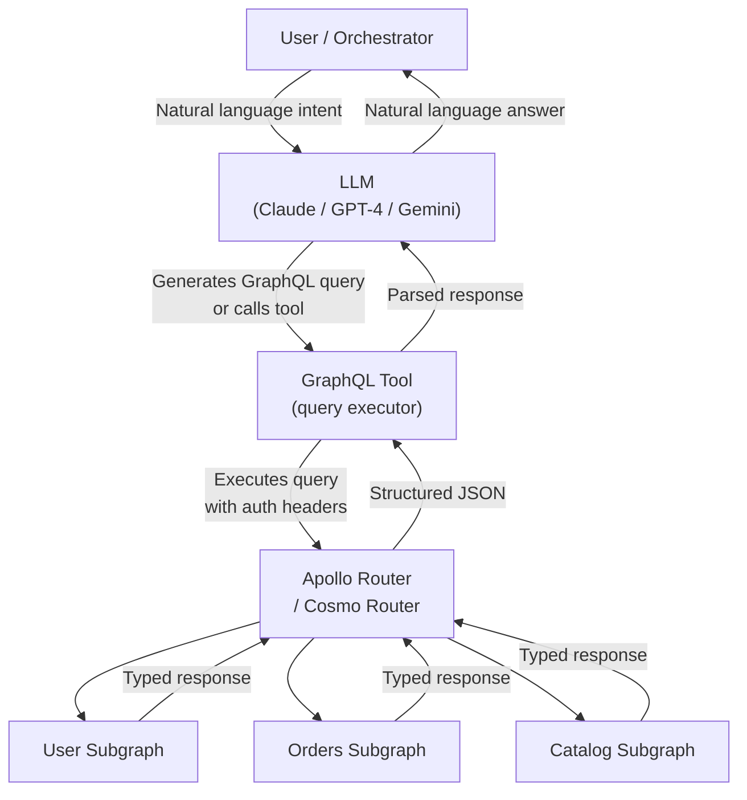

# 02 — AI and GraphQL Convergence

> **Purpose:** Document the emerging convergence between AI/ML systems and GraphQL APIs — from GraphQL as a universal retrieval interface for AI agents, to AI-assisted schema evolution, to production-ready natural language query generation. This is not speculation: these patterns are in production at organizations running large language models against live GraphQL APIs today.

---

## Why AI and GraphQL Are Converging

The confluence is structural, not accidental. AI agents — whether LLM-driven assistants, retrieval-augmented generation (RAG) pipelines, or autonomous task agents — share three requirements that GraphQL is uniquely positioned to satisfy:

1. **Typed, self-describing interfaces.** AI agents need to understand what data is available and what shape it takes, without reading external documentation. GraphQL's introspection system provides a machine-readable schema that an LLM can consume programmatically.

2. **Relationship traversal.** AI agents often need to follow relationships: "get me the orders for this user, and for each order get the product details and the shipping status." REST APIs require the agent to chain multiple requests and join the results. GraphQL's nested selection sets express this as a single typed query.

3. **Field-level precision.** LLMs generating queries need to be able to request exactly the fields they need, reducing token overhead in responses. GraphQL's client-driven field selection is a natural fit for token-budget-aware retrieval.

The result: enterprise teams are running AI agents on top of GraphQL supergraphs as the primary data retrieval layer — and this is changing how schemas are designed, how field descriptions are written, and how persisted query strategies work.

---

## GraphQL as Universal Interface for AI Agents

### The Architecture Pattern



In this architecture, GraphQL serves as the **universal data retrieval tool** in the agent's tool registry. The LLM is given the schema (or a relevant subset of it) in its system prompt, and the agent produces GraphQL queries as its tool invocations.

### Why This Works Better Than REST for Agents

| Concern | REST for Agents | GraphQL for Agents |
|---------|----------------|-------------------|
| Discovery | Agent must memorize endpoint paths or read OpenAPI docs | Agent reads schema introspection — self-describing |
| Relationship traversal | Multiple sequential requests with manual joining | Single nested query — natural for LLM to express |
| Response verbosity | Fixed endpoint response shape — tokens wasted on unused fields | Agent requests only needed fields — token-efficient |
| Type guidance | Informal typing in OpenAPI, often incomplete | Strict types guide the LLM toward valid queries |
| Error feedback | HTTP 400/422 with varied error formats | Structured GraphQL validation errors with field-level detail |
| Schema versioning | Agent must track API versions | Schema is additive — agent queries work across evolution |

### Tool Definition Pattern

When integrating GraphQL with an LLM tool-use system (Claude tool use, OpenAI function calling, LangChain tools), the tool definition looks like:

```python
GRAPHQL_TOOL = {
    "name": "query_graph",
    "description": """
        Execute a GraphQL query against the company data graph.
        Returns structured data for users, orders, products, and catalog.
        
        Schema overview:
        - User: id, name, email, orders { ... }, preferences { ... }
        - Order: id, status, total, lineItems { product { ... } }
        - Product: id, name, description, price, inventory { available }
        
        Always request only the fields you need. Use fragments for 
        repeated selections. Include an operationName for observability.
    """,
    "parameters": {
        "type": "object",
        "properties": {
            "query": {
                "type": "string",
                "description": "The GraphQL query or mutation document"
            },
            "variables": {
                "type": "object",
                "description": "Variables referenced in the query"
            },
            "operationName": {
                "type": "string",
                "description": "Name of the operation being executed"
            }
        },
        "required": ["query", "operationName"]
    }
}
```

The critical element is the `description` field — this is the schema context the LLM uses to generate valid queries. It is, effectively, a compressed schema document.

---

## LLM-Native API Design: Field Descriptions as AI Context

### The Shift in Importance

Field descriptions in GraphQL have always been a best practice. In the AI-integration era, they are load-bearing infrastructure. Every field description is now simultaneously:

1. A human-readable documentation string shown in GraphQL IDEs (GraphiQL, Apollo Studio)
2. A fragment of the LLM context that guides query generation
3. A candidate for injection into AI system prompts for tool selection

A schema without descriptions was previously a DX problem. It is now an AI integration blocker.

### Before and After: Description Quality

**Minimal descriptions (pre-AI era):**

```graphql
type Order {
  """Order"""
  id: ID!
  
  """Status"""
  status: OrderStatus!
  
  """Total"""
  total: Float!
  
  """Items"""
  lineItems: [LineItem!]!
}
```

**LLM-native descriptions (AI-first schema design):**

```graphql
type Order {
  """
  Unique identifier for this order. Use this to retrieve order details,
  track shipments, or process refunds. Format: UUID v4.
  """
  id: ID!
  
  """
  Current fulfillment status of the order. 
  PENDING: payment captured, not yet fulfilled.
  PROCESSING: warehouse has started picking.
  SHIPPED: in transit — use trackingUrl for live updates.
  DELIVERED: confirmed delivery.
  CANCELLED: order was cancelled — see cancellationReason.
  REFUNDED: refund issued — see refundAmount.
  """
  status: OrderStatus!
  
  """
  Total order value in cents (USD). Divide by 100 for display.
  Includes item prices, shipping, and applicable taxes.
  Does not include refunded amounts — use refundAmount for that.
  """
  totalCents: Int!
  
  """
  Individual line items in this order. Each item has a product reference,
  quantity ordered, unit price at time of purchase, and fulfillment status.
  Query lineItems when you need to show order contents or calculate
  per-item details.
  """
  lineItems: [LineItem!]!
  
  """
  Carrier tracking URL. Only present when status is SHIPPED or DELIVERED.
  Returns null for PENDING, PROCESSING, CANCELLED, and REFUNDED orders.
  """
  trackingUrl: String
}
```

The second version is more verbose, but it provides the LLM with enough context to:
- Know when each field is populated vs null
- Understand units and formats (cents vs dollars)
- Determine which fields are relevant to a given query intent
- Avoid requesting `trackingUrl` when the order is not shipped

### Schema as AI Context: The System Prompt Injection Pattern

The most effective pattern for giving an LLM schema awareness is **selective schema injection** into the system prompt. Instead of injecting the entire schema (too many tokens), inject the relevant subset based on the query intent:

```python
import anthropic
from graphql import build_schema, print_schema

def get_relevant_schema_fragment(schema_sdl: str, intent: str) -> str:
    """
    Use a smaller, faster LLM to identify which types are relevant
    to the user's query intent, then extract those types from the schema.
    """
    # This is itself an LLM call — a routing/classification step
    # In production, this can be replaced with embedding-based retrieval
    schema = build_schema(schema_sdl)
    
    # Simple approach: return types mentioned in the intent
    # Production approach: embed type descriptions and retrieve by similarity
    relevant_types = identify_relevant_types(schema, intent)
    return extract_type_definitions(schema, relevant_types)

def build_graphql_agent_prompt(schema_fragment: str) -> str:
    return f"""You are a data retrieval assistant with access to a GraphQL API.

The relevant schema for your current task:

```graphql
{schema_fragment}
```

When querying data:
1. Always include an operationName in your query
2. Use variables instead of inline values
3. Request only the fields needed to answer the user's question
4. If a field description says a field may be null in certain states,
   check the parent field's state before expecting it to be populated
"""

client = anthropic.Anthropic()

def query_with_agent(user_intent: str, full_schema_sdl: str):
    schema_fragment = get_relevant_schema_fragment(full_schema_sdl, user_intent)
    system_prompt = build_graphql_agent_prompt(schema_fragment)
    
    response = client.messages.create(
        model="claude-opus-4-5",
        max_tokens=2048,
        system=system_prompt,
        tools=[GRAPHQL_TOOL],
        messages=[{"role": "user", "content": user_intent}]
    )
    
    return response
```

### Field Description Style Guide for AI-Native Schemas

Adopt these conventions to make field descriptions maximally useful as AI context:

| Principle | Bad | Good |
|-----------|-----|------|
| **State conditions** | "User's avatar" | "User's profile avatar URL. Null if the user has not uploaded a photo." |
| **Units** | "Amount" | "Transaction amount in minor currency units (cents). Divide by 100 for USD display." |
| **Relationships** | "The user" | "The user who placed this order. Always present — orders without users cannot be created." |
| **When to use** | "Tracking number" | "Carrier tracking number. Only present when status is SHIPPED or DELIVERED. Use with trackingUrl for live status." |
| **Enum values** | "Status" | "Order status. Values: PENDING (not yet processed), PROCESSING (in fulfillment), SHIPPED (in transit), DELIVERED, CANCELLED, REFUNDED" |

---

## AI-Generated GraphQL Clients

### LLMs Writing Queries at Runtime

LLMs can generate GraphQL queries at runtime based on user intent. This is already happening in production at companies running AI-powered search, customer support automation, and internal data assistants. The implications for your GraphQL infrastructure are significant.

### Implications for Persisted Query Strategies

Standard Automatic Persisted Queries (APQ) work by hashing a known query document and caching it at the router layer. APQ assumes a finite, enumerable set of queries from known clients.

AI-generated queries break this assumption: each user intent produces a potentially unique query document. The APQ cache hit rate approaches zero for pure AI-generated queries.

**Strategies for AI-generated query handling:**

```
Strategy 1: Separate endpoint / route
  - Route AI-agent traffic to a dedicated /ai/graphql endpoint
  - Disable APQ for this endpoint (or accept zero cache hits)
  - Apply higher query complexity limits to contain scope
  - Rate-limit by agent identity, not by IP

Strategy 2: Query template + variable substitution
  - Pre-generate a library of "query templates" covering common intents
  - LLM selects a template + fills variables instead of generating free-form queries
  - APQ works because templates are finite and enumerable
  - Tradeoff: reduces flexibility, requires template maintenance

Strategy 3: Persisted query by intent hash
  - Cache queries by (user_intent_embedding, schema_version) hash
  - For similar intents, reuse the previously generated query
  - Requires embedding infrastructure and cache invalidation strategy
  - Useful for high-traffic AI assistants with repetitive query patterns
```

### Schema Stability as an Agent Requirement

REST API consumers can often tolerate undocumented breaking changes because they learn the actual behavior through trial and error. AI agents cannot — they reason from schema descriptions, and a field that changes semantics (or disappears) without a deprecation period causes silent query failures.

This creates new pressure for **strict schema governance** when AI agents are first-class consumers:

- **Zero undocumented breaking changes.** If a field changes semantics, the description must be updated, and ideally a new field created with the old field deprecated.
- **Longer deprecation windows.** AI agent codebases have slower update cycles than frontend clients. A 30-day deprecation window (typical for human teams) may be insufficient for AI agents to be updated and redeployed.
- **Semantic versioning signals in descriptions.** Adding `(deprecated since v3.2, use X instead)` to field descriptions gives LLMs the information they need to generate correct queries even during deprecation periods.

---

## Vector Databases as First-Class GraphQL Subgraphs

### The Integration Pattern

RAG architectures combine vector similarity search (for semantic retrieval) with structured data (for context enrichment). A common pattern: search for relevant documents by embedding similarity, then retrieve structured metadata about those documents from a relational system.

GraphQL federation makes this natural: the vector database is a subgraph that contributes a `search` field, and the relational database is a subgraph that owns the `Document` entity with all its metadata. The router composes them:

```graphql
# Vector subgraph schema
type Query {
  """
  Semantic similarity search across all indexed documents.
  Returns documents ranked by cosine similarity to the query embedding.
  Use for: finding relevant content, similar items, knowledge base lookup.
  """
  semanticSearch(
    """Natural language query — will be embedded server-side"""
    query: String!
    """Maximum results to return. Default: 10, max: 100"""
    limit: Int = 10
    """Minimum similarity threshold (0.0–1.0). Default: 0.7"""
    threshold: Float = 0.7
    """Filter by content type"""
    contentType: ContentType
  ): [SearchResult!]!
}

type SearchResult {
  """Similarity score between 0.0 and 1.0"""
  score: Float!
  """The matched document — extends to Document entity in catalog subgraph"""
  document: Document!
}

type Document @key(fields: "id") {
  id: ID!
  """Excerpt of the matched passage, highlighted"""
  excerpt: String!
}

# Catalog subgraph schema — extends Document entity
type Document @key(fields: "id") {
  id: ID!
  title: String!
  author: User!
  createdAt: DateTime!
  contentType: ContentType!
  tags: [String!]!
  url: String!
}
```

A client (or AI agent) can now issue:

```graphql
query RAGRetrieval($userQuery: String!) {
  semanticSearch(query: $userQuery, limit: 5, threshold: 0.75) {
    score
    document {
      id
      excerpt
      title
      author { name }
      tags
      url
    }
  }
}
```

This single federated query handles both the vector similarity search and the structured metadata retrieval in one round trip.

### Production Considerations for Vector Subgraphs

- **Embedding latency is not resolver latency.** Embedding a user query against a production embedding model (OpenAI, Cohere, or a self-hosted model) adds 50–200ms to the resolver. Use `@defer` to isolate this if the query also contains fast fields.
- **Batch embedding requests.** If multiple queries hit the semantic search resolver in parallel (e.g., in a multi-agent pipeline), batch the embedding calls. DataLoader-style batching applies here.
- **Cache embeddings for repeated queries.** User queries in production have high repetition. A Redis cache keyed by (normalized query, model version) can reduce embedding costs by 40–60% in typical workloads.
- **Schema the similarity score.** Always return the similarity score as a field. AI agents and downstream systems need to know confidence — filtering results below a threshold in the resolver silently removes information that the caller might need.

---

## AI-Assisted Schema Evolution

### Detecting Semantic Breaking Changes

Standard schema breaking change detection catches structural changes: removed fields, changed types, required arguments added. It does not catch semantic changes: a field that previously returned prices in dollars and now returns prices in cents, or a status field whose enum values changed meaning.

LLMs can assist with semantic change detection by analyzing field descriptions across schema versions:

```python
def detect_semantic_changes(
    old_schema_sdl: str,
    new_schema_sdl: str,
) -> list[SemanticChange]:
    """
    Use an LLM to detect semantic changes between schema versions
    by comparing field descriptions, enum values, and type semantics.
    """
    prompt = f"""
    Compare these two GraphQL schema versions and identify any semantic 
    changes — changes in meaning or behavior even when the structure is 
    identical.
    
    OLD SCHEMA:
    {old_schema_sdl}
    
    NEW SCHEMA:
    {new_schema_sdl}
    
    Look for:
    1. Field descriptions that changed meaning (units, formats, states)
    2. Enum values added or removed (even if type is same)
    3. Nullability behavior described in comments that changed
    4. Relationship semantics that changed
    5. Fields where behavior changed in some states
    
    For each change, output:
    - field: Schema coordinate (e.g., Order.totalCents)
    - changeType: SEMANTIC_BREAKING | SEMANTIC_ENHANCEMENT | CLARIFICATION
    - summary: One sentence description of the change
    - clientImpact: How this affects existing clients
    """
    
    # This is a batch processing use case — use Claude's batch API
    # for large schema diffs to reduce cost
    client = anthropic.Anthropic()
    response = client.messages.create(
        model="claude-sonnet-4-6",
        max_tokens=4096,
        messages=[{"role": "user", "content": prompt}]
    )
    
    return parse_semantic_changes(response.content)
```

### AI-Suggested Safe Refactors

When a schema needs restructuring (renaming a field, splitting a type, merging two types), an LLM can suggest the migration path and generate the deprecation directives:

```graphql
# Before: monolithic Order type
type Order {
  shippingAddressLine1: String
  shippingAddressLine2: String
  shippingCity: String
  shippingState: String
  shippingZip: String
  billingAddressLine1: String
  # ...
}
```

```graphql
# LLM-suggested safe refactor: extract Address type
# Step 1: Add new fields (non-breaking)
type Order {
  # Keep old fields, mark deprecated
  shippingAddressLine1: String @deprecated(reason: "Use shippingAddress.line1")
  shippingAddressLine2: String @deprecated(reason: "Use shippingAddress.line2")
  shippingCity: String @deprecated(reason: "Use shippingAddress.city")
  shippingState: String @deprecated(reason: "Use shippingAddress.state")
  shippingZip: String @deprecated(reason: "Use shippingAddress.zip")
  
  # New structured fields
  shippingAddress: Address
  billingAddress: Address
}

type Address {
  line1: String!
  line2: String
  city: String!
  state: String!
  zip: String!
  country: String!
}
```

The LLM provides the migration sequence, the deprecation messages, and can validate that the refactored schema composes correctly with dependent subgraphs.

---

## Natural Language to GraphQL (NL2GraphQL)

### Production-Ready Approaches

NL2GraphQL — generating GraphQL queries from natural language — has moved from research papers to production systems. There are three viable approaches with different tradeoff profiles:

#### Approach 1: Direct Schema Injection + LLM Generation

Inject the schema (or a subset) into the LLM context, and ask it to generate the query directly.

**Suitable for:** Internal tooling, low-volume use cases, schemas under ~200 types.

**Limitations:** Large schemas exceed context windows; no query validation before execution; generated queries may be syntactically correct but semantically wrong.

```python
def nl_to_graphql_direct(
    user_query: str,
    schema_sdl: str,
    examples: list[dict] = None,
) -> str:
    """Direct schema injection approach."""
    few_shot = ""
    if examples:
        few_shot = "\n\nExamples:\n" + "\n".join([
            f"User: {e['user']}\nQuery:\n```graphql\n{e['query']}\n```"
            for e in examples
        ])
    
    prompt = f"""Generate a GraphQL query for this request: "{user_query}"

Schema:
```graphql
{schema_sdl}
```
{few_shot}

Rules:
- Include an operationName
- Use variables for all user-provided values
- Only request fields that are relevant to the question
- Validate that all requested fields exist in the schema

Output only the GraphQL query document, no explanation."""
    
    client = anthropic.Anthropic()
    response = client.messages.create(
        model="claude-sonnet-4-6",
        max_tokens=1024,
        messages=[{"role": "user", "content": prompt}]
    )
    return response.content[0].text
```

#### Approach 2: Embedding-Based Type Retrieval + LLM Generation

Embed all type descriptions, retrieve relevant types by similarity to the user query, inject only the relevant schema subset, then generate the query.

**Suitable for:** Large schemas (500+ types), production deployments, high query variety.

**How it works:**
1. At schema publication time, embed all type and field descriptions → store in vector database
2. At query time, embed the user's natural language query
3. Retrieve the top-N relevant types by cosine similarity
4. Inject only those types into the LLM prompt
5. Generate the GraphQL query

This reduces prompt size by 60–80% for large schemas while maintaining high query accuracy.

#### Approach 3: Query Template Library + Slot Filling

Pre-generate a library of parameterized query templates for your schema. The LLM classifies the user intent, selects a template, and fills in the variable slots.

**Suitable for:** Narrow-domain applications (e.g., a customer support assistant that only needs order lookup), high-volume production use cases where reliability is critical.

**Advantage:** Generated queries are always valid (templates are pre-validated). APQ works because templates are finite. No schema injection in the prompt — only intent classification.

**Limitation:** Requires template maintenance as the schema evolves. Not suitable for exploratory or open-ended queries.

### Query Validation Before Execution

Always validate LLM-generated queries before execution, regardless of approach:

```python
from graphql import build_schema, parse, validate

def validate_generated_query(query_str: str, schema_sdl: str) -> list[str]:
    """Validate a generated GraphQL query against the schema."""
    schema = build_schema(schema_sdl)
    try:
        document = parse(query_str)
    except Exception as e:
        return [f"Parse error: {e}"]
    
    errors = validate(schema, document)
    return [str(e) for e in errors]

def nl_to_graphql_with_validation(
    user_query: str,
    schema_sdl: str,
    max_retries: int = 2,
) -> tuple[str, list[str]]:
    """Generate and validate, with retry on validation failure."""
    for attempt in range(max_retries + 1):
        query = nl_to_graphql_direct(user_query, schema_sdl)
        errors = validate_generated_query(query, schema_sdl)
        
        if not errors:
            return query, []
        
        if attempt < max_retries:
            # Feed validation errors back to the LLM
            user_query = f"""
            Previous query had errors: {errors}
            
            Fix the query and try again for: "{user_query}"
            """
    
    return query, errors
```

---

## Production Checklist: AI + GraphQL Integration

Before deploying AI agent integration against your GraphQL API:

- [ ] **Schema descriptions audited** — every type and field has a meaningful description usable as AI context
- [ ] **Separate routing for AI traffic** — AI agent queries are identifiable and routable (by header, JWT claim, or endpoint path)
- [ ] **Query complexity limits for AI traffic** — LLM-generated queries can be broader than human-authored queries; apply stricter complexity limits for agent traffic
- [ ] **Operation naming enforced** — AI agents must supply an `operationName` for observability; reject anonymous operations from agent endpoints
- [ ] **Query validation before execution** — validate generated queries against schema before sending to the router
- [ ] **Schema stability commitment** — establish a formal deprecation policy that accounts for AI agent update cycles (longer windows than frontend clients)
- [ ] **Monitoring for AI-generated queries** — track LLM-generated operation names separately in your APM; watch for runaway queries or unexpected access patterns
- [ ] **Rate limiting per agent identity** — rate limit by agent identity (JWT sub claim), not by IP; agents can make high volumes of queries rapidly

---

## Related Sections

- [21-ai-native-graphql](../21-ai-native-graphql/) — current production AI integration patterns (complementary to this forward-looking document)
- [22-rag-and-vector-search](../22-rag-and-vector-search/) — vector database integration in detail
- [05-security](../05-security/) — security considerations for AI agent access to GraphQL APIs
- [06-performance-and-scaling](../06-performance-and-scaling/) — query complexity limiting for AI-generated queries
- [09-schema-governance](../09-schema-governance/) — governance for schemas with AI first-class consumers
- [38-glossary/01-graphql-terms.md](../38-glossary/01-graphql-terms.md) — terminology definitions
