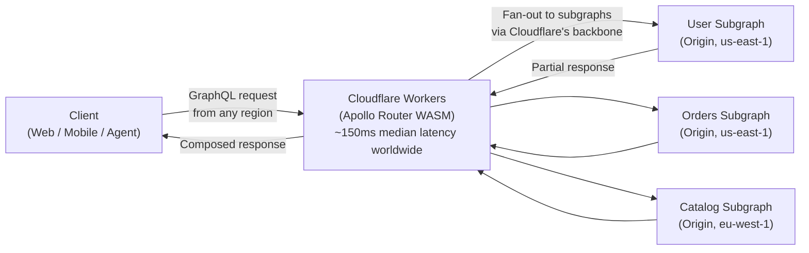
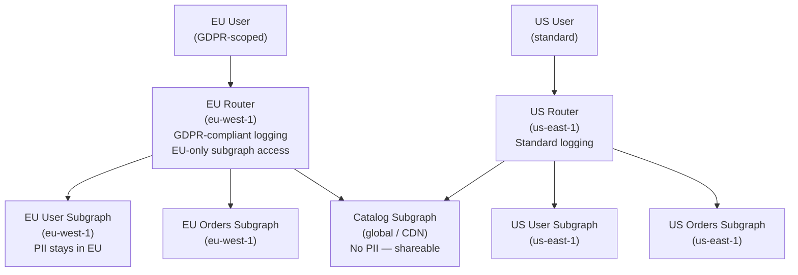
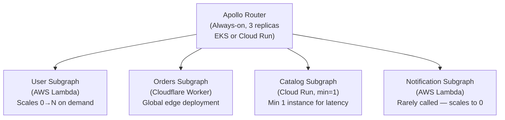
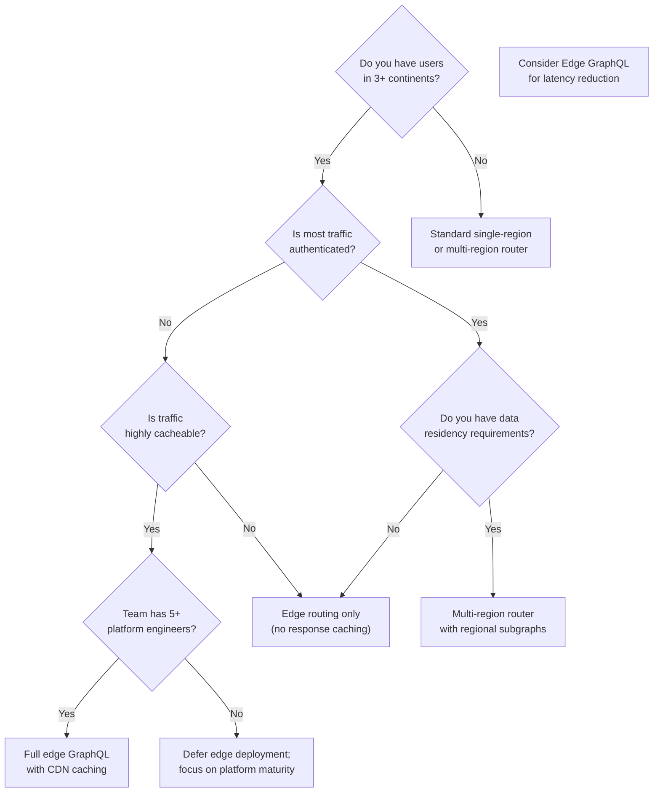

# 03 — Edge and Serverless GraphQL

> **Purpose:** Document the emerging patterns for deploying GraphQL at the edge and in serverless environments — Apollo Router on Cloudflare Workers, per-region query planning, cold start mitigation, and the cost model of serverless subgraphs. This section separates what is production-viable today from what is early-adopter territory, and provides guidance on when edge GraphQL adds value versus complexity.

---

## What "Edge GraphQL" Means

"Edge" in this context refers to compute that runs in geographically distributed locations close to end users — Cloudflare Workers, Fastly Compute, AWS Lambda@Edge, Vercel Edge Functions, and similar runtimes. Unlike origin servers in a single region, edge compute runs in 100–300 points of presence globally.

"Serverless GraphQL" refers to deploying GraphQL execution in environments where the infrastructure scales to zero (no always-on servers), including AWS Lambda, Google Cloud Run, Azure Functions, Vercel Functions, and edge runtimes.

These two categories overlap significantly — most edge runtimes are also serverless. The distinction matters for the specific challenges: edge runtimes have additional constraints (limited Node.js compatibility, restricted I/O, WebAssembly-only in some cases) while serverless in general has the cold start problem.

---

## Apollo Router on Cloudflare Workers

### Architecture Overview

Apollo Router is written in Rust, which compiles to WebAssembly. This makes it a candidate for deployment on Cloudflare Workers, which executes WebAssembly natively. The model:



The value proposition: clients in Singapore, London, and São Paulo all reach a Router instance within 20–50ms instead of crossing an ocean to reach an origin router in us-east-1. The subgraph fan-out travels over Cloudflare's private backbone (faster than public internet), partially offsetting the longer origin RTT.

### WebAssembly Compilation Constraints

Running Apollo Router as WASM imposes constraints you must understand before committing to this architecture:

**What works:**
- Query planning and validation (pure computation — ideal for WASM)
- Request routing and fan-out
- Header manipulation and authentication forwarding
- Response composition and merging
- Schema introspection serving

**What does not work in WASM Workers:**
- **Native plugins.** Apollo Router's native plugin system (Rust crates compiled into the binary) cannot run in WASM Workers. Custom behavior must use the Rhai scripting interface or coprocessors.
- **Coprocessor calls to private networks.** Cloudflare Workers cannot reach VPC-private coprocessors. Coprocessors must be publicly accessible (with mTLS) or replaced by Rhai scripts.
- **Arbitrary file system access.** WASM Workers have no filesystem. Configuration must be embedded at deploy time or fetched from KV/R2.
- **Extended CPU time.** Cloudflare Workers have a 50ms CPU time limit (Workers Unbound: 30 seconds). Complex query plans that take more than 50ms of CPU time will timeout.

### Per-Request Query Planning at the Edge

Query planning is the process by which the Router determines which subgraphs to query and in what order for a given operation. It is computationally intensive for complex federated queries.

In the standard Router deployment, the query plan is computed once per unique operation and cached in-memory. At the edge, this in-memory cache does not persist across requests — each Cloudflare Worker instance is ephemeral.

**Mitigation strategies:**

1. **Query plan cache in Cloudflare KV.** Serialize computed query plans to Cloudflare KV (key-value store) with the operation hash as the key. Workers check KV before computing a new plan. KV reads add ~5–15ms latency but are far cheaper than recomputing a plan.

2. **Persisted queries for agent traffic.** Pre-registered queries have known, pre-computable plans. For AI agent traffic or controlled client traffic, register operations at deploy time and store plans in KV during the registration step.

3. **Schema distribution via KV.** The supergraph schema must be accessible at startup. Store it in Cloudflare KV, not as a config file. Use Apollo Uplink (GraphOS) or a custom schema registry webhook to push schema updates to KV when composition succeeds.

```typescript
// Cloudflare Worker entry point for Apollo Router (illustrative)
import { ApolloRouter } from '@apollo/router-cloudflare'; // hypothetical SDK

export default {
  async fetch(request: Request, env: Env): Promise<Response> {
    // Load supergraph schema from KV (cached in Worker memory for the instance lifetime)
    const schema = await env.SCHEMA_KV.get('supergraph-schema', 'text');
    
    const router = new ApolloRouter({
      schema,
      queryPlanCache: {
        // Check KV for cached plan before computing
        get: async (hash: string) => env.QUERY_PLAN_KV.get(hash, 'json'),
        set: async (hash: string, plan: object) =>
          env.QUERY_PLAN_KV.put(hash, JSON.stringify(plan), {
            expirationTtl: 3600, // 1 hour
          }),
      },
    });
    
    return router.handle(request);
  },
};
```

---

## Per-Region Query Planning for Data Residency

### The Data Residency Problem

Enterprises operating in the EU, healthcare verticals, and financial services must ensure that certain data (PII, financial records, health information) is never processed outside a specific geographic boundary. GDPR Article 46, HIPAA, and SOX all create data residency obligations that are difficult to satisfy with a single-region router.

A federated supergraph with a single router in us-east-1 may violate GDPR if:
- EU user PII flows through the us-east-1 router
- The router logs or caches query responses containing PII
- Subgraph fan-out carries PII fields across regional boundaries

### The Multi-Region Router Architecture



Implementation requirements:
- **Separate supergraph compositions per region.** The EU composition includes EU-region subgraphs. The US composition includes US-region subgraphs. Both include the shared catalog subgraph.
- **DNS-based routing.** Route EU users to the EU router via GeoDNS or Anycast.
- **Schema variant per region.** Apollo GraphOS supports graph variants — maintain a `eu-production` and `us-production` variant with separate composition results.
- **Field-level access control in EU subgraphs.** EU subgraphs apply GDPR-compliant field masking at the resolver level (not at the router level — the router should not see PII at all for audit simplicity).

### Query Planning with Regional Awareness

When a query spans both PII (regional) and non-PII (global) data, the router must plan the execution to respect regional boundaries. The recommended pattern:

- **PII fields live exclusively in regional subgraphs.** The catalog subgraph (global) never contains user PII.
- **Entity resolution respects regional boundaries.** If the EU router needs to resolve a `User` entity, it resolves it against the EU User subgraph — never the US User subgraph.
- **The `@inaccessible` directive hides PII fields from the wrong regional variant.** Fields that should not be queryable in the EU variant are marked `@inaccessible` in that variant's composition.

---

## Edge Caching for GraphQL Responses

### The APQ + GET Pattern at CDN Layer

Standard GraphQL uses HTTP POST, which CDNs will not cache. The Automatic Persisted Query (APQ) protocol enables GET-based caching:

1. Client hashes the query document: `sha256("query { products { id name } }")`
2. Client sends a GET request with the hash: `GET /graphql?extensions={"persistedQuery":{"version":1,"sha256Hash":"abc123"}}`
3. On cache miss: CDN passes to origin; origin responds with result and `Cache-Control: max-age=300`
4. CDN caches the response; subsequent identical requests served from CDN in ~2ms

**Configuration at Cloudflare:**

```
# Cloudflare Page Rule for GraphQL GET caching
URL: api.example.com/graphql*
Settings:
  Cache Level: Cache Everything
  Edge Cache TTL: 5 minutes
  Browser Cache TTL: 30 seconds
  
# Only cache GET requests — POST always passes through
Worker route: if (request.method === 'POST') { return fetch(request); }
```

**Vary headers for authentication:**

Authenticated GraphQL responses must vary by user. A blanket `Cache-Control: public` without vary headers causes user A to receive user B's cached data. The correct approach:

```
# For public data (catalog, product listings)
Cache-Control: public, max-age=300, s-maxage=3600
Surrogate-Control: max-age=3600

# For user-specific data — do NOT cache at CDN
Cache-Control: private, no-store

# For semi-public data (vary by role, not by user)
Vary: Authorization
Cache-Control: public, max-age=60
```

In practice, most GraphQL queries mix public and private data, making CDN response caching safe only for pure public queries (product catalog, content, pricing). Authenticated queries with user-specific selections should not be CDN-cached at the response level — APQ still benefits them by reducing query document transmission overhead.

### Caching Strategies Summary

| Data Type | CDN Response Cache | APQ | Router Cache | Notes |
|-----------|-------------------|-----|--------------|-------|
| Product catalog | Yes (long TTL) | Yes | Yes | No PII — safe for public caching |
| Pricing | Yes (short TTL) | Yes | Yes | Price changes invalidate aggressively |
| Search results | Partial (vary by query) | Yes | Yes | Cache by query hash |
| User profile | No | Yes | No | Private data — never CDN-cache |
| Order history | No | Yes | No | Private data |
| Recommendations | No | Yes | No | Personalized — not shareable |

---

## Cold Start Mitigation for Serverless GraphQL

### The Cold Start Problem

Serverless functions incur a "cold start" penalty when a new instance is initialized: the runtime loads, your code initializes, and external dependencies (database connections, JWKS keys, DataLoader instances) are fetched. For AWS Lambda, cold starts range from 200ms (optimized Node.js) to 3+ seconds (Java with full JVM warmup). For Cloudflare Workers, the cold start is 0–5ms (V8 isolate — already warm).

For GraphQL specifically, cold starts are amplified by:

1. **Schema loading** — building the `GraphQLSchema` object from SDL is computationally expensive (~50–200ms for large schemas)
2. **JWKS fetch** — fetching the JSON Web Key Set from your identity provider for JWT validation adds 100–500ms network latency
3. **DataLoader instantiation** — DataLoaders are typically created per-request, but their backing data source connections may need initialization
4. **Schema registry connection** — some implementations fetch the current schema from a registry on startup

### Schema Loading Optimization

```typescript
// Anti-pattern: rebuild schema on every cold start from SDL file
export const handler = async (event: APIGatewayEvent) => {
  const sdl = fs.readFileSync('./schema.graphql', 'utf8'); // disk I/O
  const schema = buildSchema(sdl); // CPU-intensive
  const server = new ApolloServer({ schema });
  // ...
};

// Better: build schema at deploy time, bundle the built schema object
// Use webpack/esbuild to bundle a pre-built schema

// Best (Lambda): initialize outside the handler — reused across warm invocations
import { schema } from './schema'; // pre-built GraphQLSchema object

let server: ApolloServer | null = null;

function getServer(): ApolloServer {
  if (!server) {
    server = new ApolloServer({
      schema,
      // other config
    });
  }
  return server;
}

export const handler = async (event: APIGatewayEvent) => {
  const s = getServer();
  return s.handleRequest(event);
};
```

### JWKS Fetch Optimization

JWT validation requires the signing public key from your identity provider's JWKS endpoint. Fetching this on every cold start is slow and adds an external dependency to your cold start path.

```typescript
import jwksRsa from 'jwks-rsa';

// Initialize JWKS client outside handler — cached across warm invocations
const jwksClient = jwksRsa({
  jwksUri: 'https://your-idp.auth0.com/.well-known/jwks.json',
  cache: true,               // in-memory cache
  cacheMaxEntries: 5,        // cache up to 5 keys (key rotation)
  cacheMaxAge: 10 * 60000,   // cache for 10 minutes
  rateLimit: true,           // rate limit JWKS fetches
});

// Pre-warm the JWKS cache during cold start initialization
// This converts an on-demand fetch (adds to P99 latency) to an
// eager fetch (adds to cold start, but cold starts are expected to be slow)
async function initializeJwks() {
  try {
    await jwksClient.getSigningKeys();
  } catch (e) {
    console.warn('JWKS pre-warm failed — will fetch on first request', e);
  }
}

// Call during module initialization, outside handler
initializeJwks();
```

### DataLoader Per-Request Initialization

DataLoader instances are always per-request (they cache within a single request cycle). The initialization cost is low, but the backing data source connection should be initialized once and reused:

```typescript
import { Pool } from 'pg';

// Database pool initialized once per Lambda instance
// Lambda reuses this across multiple warm invocations
let pool: Pool | null = null;

function getPool(): Pool {
  if (!pool) {
    pool = new Pool({
      host: process.env.DB_HOST,
      database: process.env.DB_NAME,
      max: 2, // Lambda: keep pool small — each instance has its own pool
      idleTimeoutMillis: 30000,
      connectionTimeoutMillis: 5000,
    });
  }
  return pool;
}

// DataLoader factory — called per-request
function createDataLoaders(pool: Pool) {
  return {
    users: new DataLoader(async (ids: readonly string[]) => {
      const result = await pool.query(
        'SELECT * FROM users WHERE id = ANY($1)',
        [ids]
      );
      // Map results back to the original ID order
      return ids.map(id => result.rows.find(r => r.id === id) || null);
    }),
  };
}

export const handler = async (event: APIGatewayEvent) => {
  const p = getPool();
  const dataSources = createDataLoaders(p);
  // Use dataSources in resolvers via context
};
```

### Lambda Provisioned Concurrency

For GraphQL endpoints with strict latency SLOs (P99 < 200ms), Lambda Provisioned Concurrency eliminates cold starts by pre-warming a specified number of instances:

```yaml
# serverless.yml or SAM template
Resources:
  GraphQLFunction:
    Type: AWS::Lambda::Function
    Properties:
      FunctionName: graphql-api
      
  GraphQLFunctionProvisionedConcurrency:
    Type: AWS::Lambda::Alias
    Properties:
      FunctionName: !Ref GraphQLFunction
      Name: production
      ProvisionedConcurrencyConfig:
        ProvisionedConcurrentExecutions: 10  # Always 10 warm instances
```

Cost note: Provisioned Concurrency is charged per GB-hour even when idle. At 10 instances × 512MB × 24 hours = ~$3.60/day at standard Lambda pricing. For moderate traffic, this is often cheaper than the alternative (always-on EC2 instance), but the math changes above ~200 RPS.

---

## Deno Deploy and Bun as Subgraph Runtimes

### Performance Characteristics

| Runtime | Cold Start | Throughput (req/s) | Memory Footprint | Node.js Compatibility |
|---------|-----------|-------------------|-----------------|----------------------|
| **Node.js (Lambda)** | 200–800ms | ~3,000 | 50–200MB | Native |
| **Deno Deploy** | 0–30ms | ~5,000 | 20–50MB | Partial (no `require`) |
| **Bun (Lambda)** | 50–300ms | ~8,000 | 30–80MB | High (most packages work) |
| **Cloudflare Workers** | 0–5ms | ~10,000+ | 128MB hard limit | Limited (WASM-based) |

Bun's performance advantage for GraphQL subgraphs comes from its faster HTTP server and native TypeScript execution (no transpilation step). For CPU-bound resolver work (schema parsing, response serialization), Bun is consistently 2–3x faster than Node.js in benchmarks.

Deno Deploy's advantage is startup time — V8 isolates start in milliseconds. The tradeoff: Deno's Node.js compatibility layer does not support all npm packages. graphql-js, Apollo Server 4, and graphql-yoga all run on Deno. Prisma and most popular database clients require polyfills or alternative clients.

### Serverless Subgraph Pattern

The "serverless subgraph" pattern deploys each GraphQL subgraph as a serverless function (AWS Lambda, Cloudflare Worker, or similar) with auto-scaling to zero during idle periods:



Note: the router itself should NOT be serverless. The router maintains query plan caches, WebSocket connections for subscriptions, and in-flight request state. A serverless router resets this state on every cold start, causing cache misses and subscription disconnects. Run the router as an always-on deployment (3+ replicas minimum in production).

### Fan-Out Cost Model

The serverless subgraph pattern has a counter-intuitive cost structure. A federated query that fans out to 4 subgraphs invokes 4 Lambda functions (or 4 Worker requests):

```
User query → Router → 4 parallel subgraph invocations
Cost per request = sum(cost of each subgraph invocation)

Example (AWS Lambda pricing, us-east-1, 2025):
- 128MB, 100ms average duration = $0.0000000021 per invocation
- 4 subgraphs per request × $0.0000000021 = $0.0000000084 per query
- At 1,000 RPS × 86,400 seconds = 86.4M queries/day
- Daily cost = 86.4M × 4 × $0.0000000021 = $0.73/day

Compare with always-on:
- 3 t4g.medium instances (2 vCPU, 4GB) = $0.068/day each = $0.204/day total
```

At 1,000 RPS, serverless is 3.5x more expensive than always-on EC2 instances. The crossover point where serverless becomes cheaper depends on traffic patterns:

- **Serverless wins**: traffic is highly variable (peak 100x baseline), idle periods are long, cold starts are acceptable
- **Always-on wins**: traffic is sustained and relatively flat, latency SLOs are strict (P99 < 100ms), requests are long-running

---

## When Edge GraphQL Makes Sense

### Use Edge GraphQL When

1. **Global user base with strict latency requirements.** If you have significant traffic from multiple continents and P50 < 100ms is a business requirement, edge deployment can move median latency from 300ms (cross-ocean) to 20–50ms (local edge).

2. **High read traffic on cacheable public data.** Product catalogs, content APIs, and public search are good candidates. APQ + GET + CDN caching can serve 90%+ of requests from cache.

3. **Data residency compliance.** If you need query execution to happen within a specific geographic boundary (GDPR, data localization), edge routing + regional subgraphs is the architectural solution.

4. **DDoS protection closer to users.** Edge runtimes benefit from the CDN provider's DDoS mitigation (Cloudflare's Magic Transit, Fastly's DDoS protection) before traffic reaches origin.

### Do NOT Use Edge GraphQL When

1. **Your queries are all authenticated and personalized.** Authenticated responses cannot be CDN-cached. The latency benefit from edge query planning (~10–20ms saved) does not justify the added complexity and cost.

2. **Your schema changes frequently.** Edge deployments with embedded schemas (compiled into WASM) require a redeployment on every schema change. If your schema changes daily, edge deployment creates operational overhead.

3. **Your resolvers need private network access.** If resolvers need to reach databases in a VPC that are not accessible from the edge network, you gain no benefit from edge query planning — the fan-out still crosses the same network boundary.

4. **You have complex coprocessor logic.** If your router relies heavily on coprocessors for authentication, rate limiting, or request transformation, those coprocessors cannot run at the edge (or require significant re-architecture to do so).

5. **Your team is small or early-stage.** Edge GraphQL deployment adds significant operational complexity (WASM builds, KV-backed caches, regional composition). Teams with fewer than 5 platform engineers should defer this until the platform is mature.

---

## Decision Framework



---

## Related Sections

- [08-supergraph-architecture](../08-supergraph-architecture/) — Apollo Router configuration and query planning
- [15-kubernetes-deployment](../15-kubernetes-deployment/) — always-on router deployment for comparison
- [17-caching-strategies](../17-caching-strategies/) — APQ and CDN caching in depth
- [06-performance-and-scaling](../06-performance-and-scaling/) — cold start, query complexity, and performance optimization
- [38-glossary/03-infrastructure-terms.md](../38-glossary/03-infrastructure-terms.md) — APQ, CDN, cold start definitions
