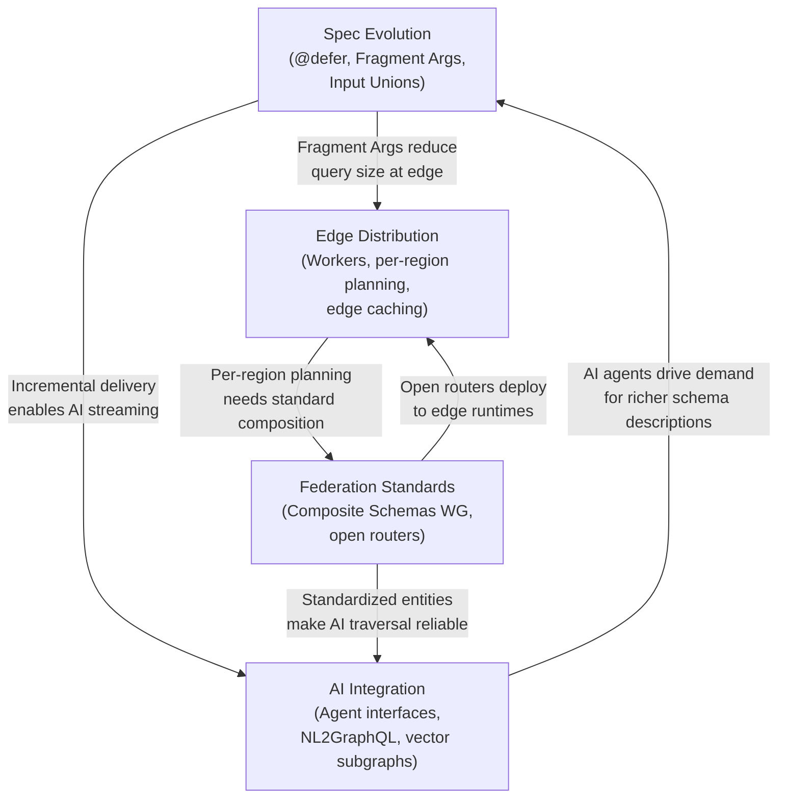

# 36 — Future Trends in GraphQL

> **Purpose:** Track the emerging directions in GraphQL specification evolution, ecosystem convergence, and infrastructure adoption over the next 2–5 years. This folder synthesizes RFC activity from the GraphQL Working Group, community signals from npm download trends and GitHub activity, and early-adopter engineering posts to give a grounded, opinionated view of where GraphQL is heading — and what it means for teams building on it today.

---

## Why Read This Folder

Teams making architectural decisions today are committing to infrastructure that will outlast the next major release cycle. Understanding where the GraphQL specification and ecosystem are going prevents you from building on patterns that will become obsolete, and helps you position your platform to benefit from upcoming features without a full rewrite.

This folder is not speculation. Each section is anchored to active Working Group RFCs, implementation progress in production routers and clients, and adoption signals from large engineering organizations. Where something is genuinely uncertain, it is labeled as such.

---

## What This Folder Covers

| File | What You Will Learn | Estimated Time |
|------|---------------------|----------------|
| [01-graphql-spec-evolution.md](./01-graphql-spec-evolution.md) | Active RFCs and their implementation status: @defer/@stream, Fragment Arguments, Input Unions, Composite Schemas, Client-Controlled Nullability, Schema Coordinates | 35–45 min |
| [02-ai-and-graphql-convergence.md](./02-ai-and-graphql-convergence.md) | GraphQL as the universal interface for AI agents, LLM-native API design, NL2GraphQL, vector subgraphs, AI-assisted schema evolution | 35–45 min |
| [03-edge-and-serverless-graphql.md](./03-edge-and-serverless-graphql.md) | Apollo Router on Cloudflare Workers, per-region query planning, cold start mitigation, serverless subgraph patterns, edge caching strategies | 35–45 min |
| [04-open-federation-standards.md](./04-open-federation-standards.md) | GraphQL Composite Schemas WG, competitive landscape (Apollo vs Hive vs Cosmo vs Grafbase), vendor lock-in risk, schema registry interoperability | 30–40 min |

Total estimated reading time: **~2.5 hours**

---

## The Four Vectors of Change

GraphQL's evolution is being driven by four distinct forces that interact in non-obvious ways:

### 1. Specification Maturation

The GraphQL Working Group (WG) has been operating for years with more RFC activity in 2023–2025 than in any prior period. Features like `@defer` and `@stream` have been in draft for five years and are finally crossing into stable specification territory. This matters because it creates implementation obligations for router and server maintainers — once something is in the spec, major implementations converge within 12–18 months.

### 2. AI Integration Pressure

The rise of LLM-based agents is creating demand for GraphQL as a structured retrieval interface. AI agents need typed, self-describing APIs with relationship traversal — which is precisely what GraphQL provides. This is pushing schema design toward richer field descriptions (which double as AI context) and driving new tooling for natural language query generation.

### 3. Infrastructure Distribution

Cloudflare Workers, Fastly Compute, Deno Deploy, and similar edge runtimes are maturing to the point where running a query planner at the edge is feasible. This creates a new class of architecture where GraphQL query execution is distributed globally, with data residency enforced at the infrastructure level.

### 4. Federation Standardization

Apollo Federation pioneered the supergraph model, but it remained a proprietary specification until the GraphQL Composite Schemas Working Group began formalizing it. The competition between Apollo, WunderGraph Cosmo, Hive, and Grafbase is accelerating feature development while simultaneously driving commoditization of the router layer. This is good for platform teams — but requires careful vendor lock-in risk assessment today.

---

## How These Trends Interact

The trends are mutually reinforcing. Specification features enable edge deployment patterns; federation standardization enables AI agent traversal; AI adoption pressure accelerates specification work. Teams that understand all four vectors can make better long-term infrastructure choices.

---

## Time Horizon Signals

| Trend | Current State (2025) | 1–2 Year Horizon | 3–5 Year Horizon |
|-------|---------------------|-------------------|------------------|
| @defer / @stream | Merged to spec draft; Apollo Router, graphql-yoga implemented | Standard client library support; React Suspense integration | Default pattern for slow-field isolation |
| Fragment Arguments | RFC stage 3; implementations in progress | Available in major servers | Standard practice for parameterized fragments |
| Input Unions | Multiple competing proposals; no consensus yet | Single frontrunner proposal likely | In stable spec |
| Composite Schemas WG | Active; first deliverables published | Router vendors align on subset | Full standard ratified |
| NL2GraphQL | Research-grade to production-grade tools emerging | Embedded in schema registries | Standard feature of GraphQL IDEs |
| Edge GraphQL | Early adopters (Cloudflare, Fastly deployments) | Production pattern for latency-sensitive use cases | Standard deployment option in router docs |
| Open Federation | Multiple open-source routers competitive with Apollo | Feature parity across major routers | True router interoperability |

---

## Prerequisites

This folder assumes familiarity with:

- [01-graphql-fundamentals](../01-graphql-fundamentals/) — type system, operations, SDL
- [07-federation](../07-federation/) — supergraph architecture, subgraphs, entities
- [08-supergraph-architecture](../08-supergraph-architecture/) — Apollo Router, composition, query planning

You do not need to have implemented any of these patterns. This is a forward-looking reference, not a how-to guide.

---

## Related Sections

- [21-ai-native-graphql](../21-ai-native-graphql/) — current production patterns for AI integration (today, not future)
- [22-rag-and-vector-search](../22-rag-and-vector-search/) — vector database integration with GraphQL today
- [19-platform-engineering](../19-platform-engineering/) — platform maturity model that shapes how you adopt future features
- [35-governance-models](../35-governance-models/) — governance structures that scale as federation standardizes
- [38-glossary](../38-glossary/) — definitions of all terms used across this documentation
