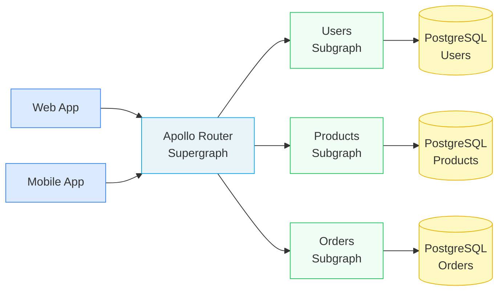
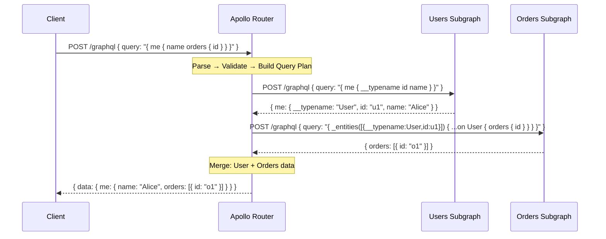
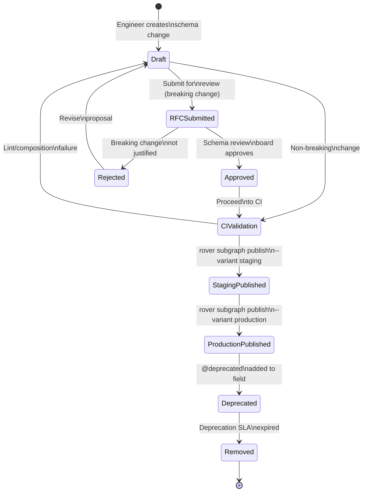
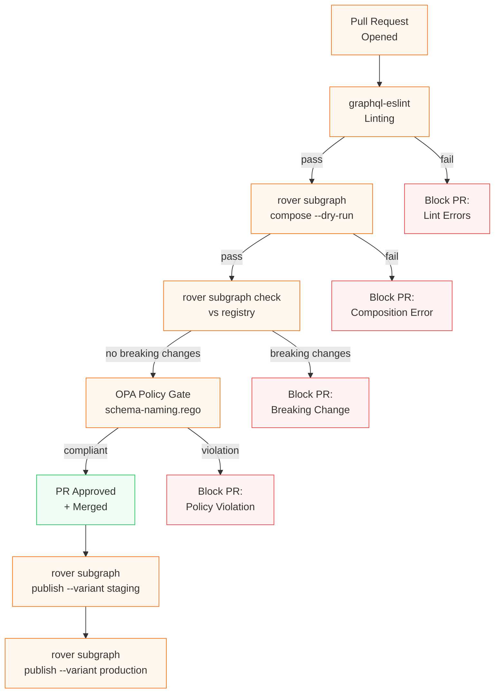

# Mermaid Diagram Style Guide

> Consistent diagram conventions across the Enterprise GraphQL Engineering Handbook. Follow this guide so every diagram in the repo has a shared visual language.

---

## When to Use Each Diagram Type

| Use Case | Diagram Type | Syntax |
|---|---|---|
| Architecture / component map | Flowchart LR | `flowchart LR` |
| Request / response flows | Sequence diagram | `sequenceDiagram` |
| State machines / lifecycles | State diagram | `stateDiagram-v2` |
| Decision trees | Flowchart TD | `flowchart TD` |
| CI/CD pipelines | Flowchart TD | `flowchart TD` |
| Entity relationships | Entity Relationship | `erDiagram` |
| Dependency graphs | Flowchart LR | `flowchart LR` |

**Default direction:** Left-to-right (`LR`) for architecture. Top-down (`TD`) for processes and decision trees.

---

## Node Shape Conventions

| Shape | Syntax | Use for |
|---|---|---|
| Rectangle | `[Service Name]` | Services, components, repositories |
| Rounded rectangle | `(Step Name)` | Process steps, actions |
| Diamond | `{Decision?}` | Decision points in flowcharts |
| Circle | `((Start/End))` | Start and end nodes |
| Cylinder | `[(Database)]` | Databases, storage |
| Parallelogram | `[/Input/]` | User input or external data |
| Asymmetric | `>External System]` | External systems, third-party APIs |
| Subroutine | `[[Subgraph]]` | Subprocesses, subgraphs (reused components) |

---

## Color Conventions (classDef)

Apply these class definitions consistently. Add the `classDef` block at the top of every flowchart.

```
classDef clientNode fill:#dbeafe,stroke:#3B82F6,color:#1e3a8a
classDef routerNode fill:#e8f4f8,stroke:#0ea5e9,color:#0c4a6e
classDef subgraphNode fill:#f0fdf4,stroke:#22c55e,color:#14532d
classDef dbNode fill:#fef9c3,stroke:#eab308,color:#713f12
classDef registryNode fill:#fdf4ff,stroke:#a855f7,color:#581c87
classDef ciNode fill:#fff7ed,stroke:#f97316,color:#7c2d12
classDef obsNode fill:#fdf2f8,stroke:#ec4899,color:#831843
classDef externalNode fill:#f3f4f6,stroke:#6b7280,color:#374151
```

Usage in a diagram:
```
flowchart LR
    classDef clientNode fill:#dbeafe,stroke:#3B82F6
    classDef routerNode fill:#e8f4f8,stroke:#0ea5e9
    classDef subgraphNode fill:#f0fdf4,stroke:#22c55e

    C[Web App]:::clientNode --> R[Apollo Router]:::routerNode
    R --> SGA[Users Subgraph]:::subgraphNode
    R --> SGB[Orders Subgraph]:::subgraphNode
```

---

## Example 1: Federation Architecture (flowchart LR)



---

## Example 2: Query Execution Sequence (sequenceDiagram)



---

## Example 3: Schema Lifecycle State Machine (stateDiagram-v2)



---

## Example 4: CI/CD Pipeline (flowchart TD)



---

## Common Mermaid Syntax Pitfalls

| Pitfall | Problem | Fix |
|---|---|---|
| Parentheses in node labels | `[Node (detail)]` breaks parsing | Use `[Node — detail]` or escape with quotes |
| Colons in labels | `[Service: Users]` breaks | Use `[Service — Users]` |
| Special chars in sequence participants | `participant DB as PostgreSQL(Users)` | `participant DB as PostgreSQL Users` |
| Long labels without line breaks | Diagram becomes unreadable | Use `\n` for line breaks: `[Apollo\nRouter]` |
| Duplicate node IDs | Two nodes with same ID merge | Use unique IDs: `SGA`, `SGB`, not `S`, `S` |
| Arrow type inconsistency | Mixing `-->` and `==>` inconsistently | Stick to `-->` for standard, `==>` only for emphasis |
| Subgraph naming collision | `subgraph` keyword conflicts with "subgraph" in GraphQL | Use `subgraph ClusterName["Display Label"]` |

---

## Testing Your Diagrams

Before committing, verify your Mermaid syntax renders correctly:

1. **Online:** Paste the diagram block (without the surrounding fences) at [mermaid.live](https://mermaid.live)
2. **VS Code:** Install the "Mermaid Preview" extension — `Ctrl+Shift+P` → "Preview Mermaid"
3. **GitHub:** GitHub renders Mermaid in markdown natively — check the file preview after push

A diagram that doesn't render is worse than no diagram. Always validate before merging.

---

## Diagram Catalogue

All key diagrams across the repository are indexed in [docs/diagrams/README.md](../diagrams/README.md).

When you add a significant new diagram, add it to the catalogue with: diagram name, file path, type, and a one-sentence description.
